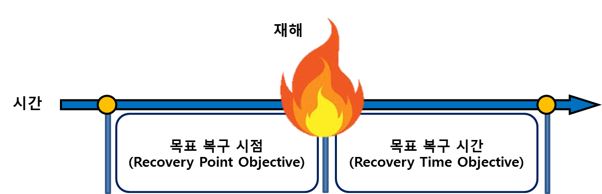

# DR
* DR, Disaster Recovery

* RPO (Recovery Point Objective)
    * 복구 시점 목표(RPO)는 수용 가능한 데이터 손실량을 측정한 값이다.
    * 예를 드면, 어떤 재해가 12 AM에 발생하고 RPO가 1시간이라면 시스템은 
    11 AM 이전에 시스템에 있던 모든 데이터를 복구해야 한다.
* RTO (Recovery Time Objective)
    * 복구 시간 목표(RTO)는 운영 수준 계약(OLA)에서 정의한 바와 같이 중단 후 
    비즈니스 프로세스를 서비스 수준으로 복원하기까지 걸리는 시간을 의미한다.
    * 예를 들면, 어떤 재해가 12 AM에 발생하고 RTO가 8시간이라면 재해 복구(DR) 프로세스는 
    비즈니스 프로세스를 8 PM까지 허용 가능한 서비스 수준으로 복원해야 한다.
    
## 재해 복구 전략
1. 백업 및 복원
    1) 준비 단계
        * 현재 시스템을 백업한다.
    2) 재해 발생 시
        * 인프라를 준비한다.
        * 백업으로부터 시스템을 복원한다.

2. 파일럿 라이트
    * 준비 단계에서 미리 데이터를 복제 또는 미러링한 인프라를 준비하고, 평상 시에는 동작시키지 않는다.
    * 재해가 발생하면, 동작하게 되고 복제된 리소스 쪽으로 트래픽을 조정한다.

3. Stand by
    * Warn Standby Solution
    * 언제라도 트래픽 일부를 처리할 수 있다.
    * 준비 단계에서 기존 규모보다 작은 규모로 실행되고 있다.
    * 재하가 발생하면, 부하를 처리할 수 있도록 신속하게 규모를 확장한다.
    
4. Active-Active
    * 비용이 많이 든다.
    * On-premise 시스템과 동시에 완벽하게 작동하는 시스템을 실행한다.
    * 언제라도 모든 Production 트래픽을 처리할 수 있다.
