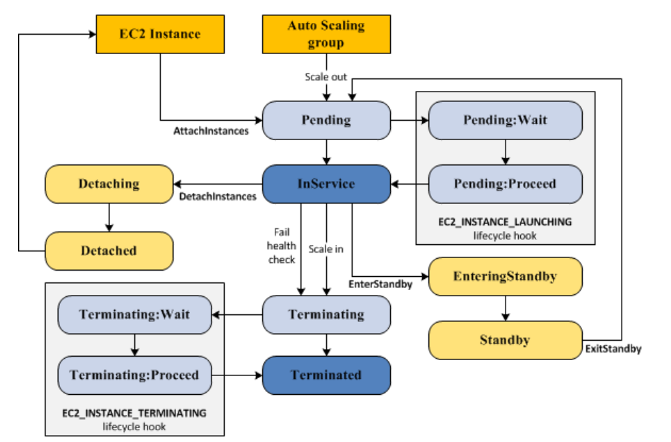

# Auto Scaling


## Life Cycle

1. Scale Out
    * Auto Scaling 그룹이 EC2 인스턴스를 시작하고 그룹에 연결하도록 지시한다. 과정은 다음과 같다.
    * Launch Template를 통해 각 인스턴스 구성 -> 이러한 Instance는 ```Pending```상태가 된다.
    * EC2 인스턴스의 Health Check가 통과되면, Auto Scaling Group에 연결되고 ```InService``` 상태가 된다.
2. In Service
    * ```InService``` 상태 중인 인스턴스는 다른 이벤트가 발생하기 전까지 상태를 유지한다.
    * Scale In 이벤트 발생
    * 대기 모드 시작 및 종료
    * 인스턴스 분리
    * Health Check 실패
3. Scale In
    * Auto Scaling Group에서 EC2 인스턴스를 분리하고 종료하도록 지시
    * 인스턴스는 ```Terminated``` 상태로 들어가기 때문에 다시 시작할 수 없다.
</br>

## Instance Control
### Attaching
* 하나 이상의 EC2 인스턴스를 기존 Auto Scaling Group에 연결할 수 있다.

### Detaching
* Auto Scaling Group에서 인스턴스를 제거할 수 있으며, 이후에는 독립적으로 Instance를 관리할 수 있다.

### Standby
* 문제가 있거나 업데이트가 필요한 인스턴스의 경우, ```Standby``` 상태에서 해결하거나 변경한 다음에 다시 서비스할 수 있다.
* ```Standby``` 상태의 인스턴스는 계속 Auto Scaling Group에서 관리하지만, 다시 시작할 때까지 애플리케이션이 활성화되지 않는다.
</br>

## Scale Control


</br>

## Lifecycle Hook
* 인스턴스가 시작되거나 종료될 때 사용자 지정 작업을 수행할 수 있도록 Auto Scaling 그룹에 수명 주기 후크를 추가할 수 있습니다.
* Hook 종류
    * ```autoscaling:EC2_INSTANCE_LAUNCHING ```: Pending 상태에서 Hook 추가
    * ```autoscaling:EC2_INSTANCE_TERMINATING```: Terminating 상태에서 Hook 추가

* 사용되는 예시
    1) 예기치 않은 장애가 발생할 경우, 시작을 포기하도록 시작 수명주기 후크를 구성.

### Lifecycle Hook 과정
1. Scale Out Evnet가 발생 -> 인스턴스 구성
2. Lifecycle Hook은 인스턴스를 ```Pending:Wait``` 상태로 만든 다음 지정 작업 수행
   * ```complte-lifecycle-action``` CLI 명령어 또는 ```CompleteLifecycleAction``` 작업을 사용하여 Lifecycle 작업을 완료하거나 제한 시간이 끝날 때까지 인스턴스는 대기 상태로 유지된다(Default: 1 hour)
3. 작업 또는 대기 시간이 종료되면, ```Pending:Proceed``` 상태로 Auto Scaling Group이 시작 프로세스를 계속한다(Health Check 후 Attach)
4. 
</br>
</br>