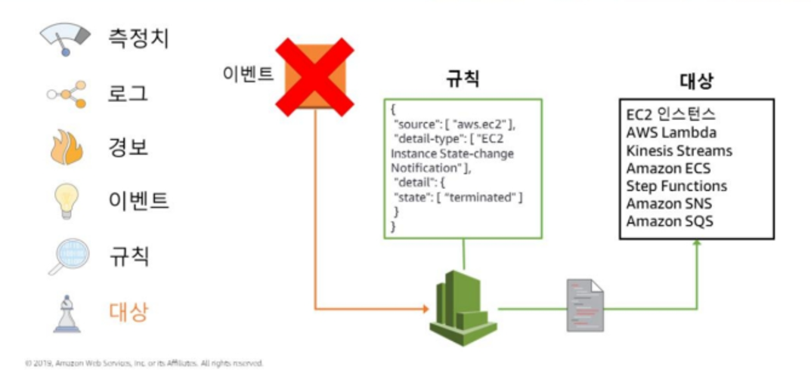
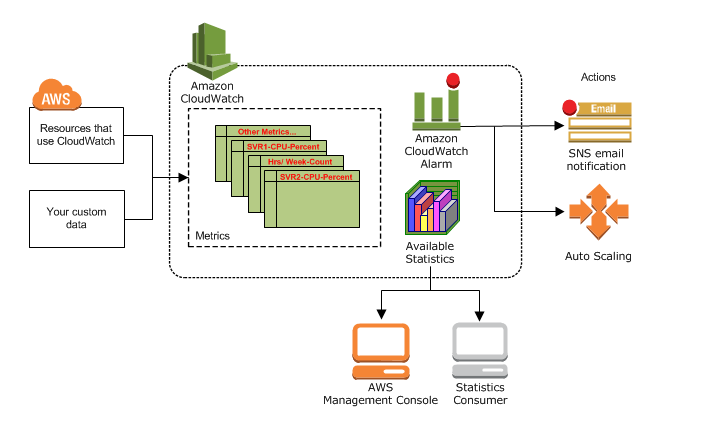

# CloudWatch
* 애플리케이션 및 인프라 모니터링 서비스
* 로그, 지표 및 이벤트 양식으로 모니터링 및 운영 데이터를 수집하고, 자동화된 대시보드를 사용하여 시각화한다.
* Metric은 CLI를 이용하는 것이 좋다.
</br>


## Monitoring List
### 지표 (Metric)
* 시스템 성능에 대한 데이터, 많은 AWS 서비스에 대해 무료 지표를 기본적으로 제공한다.
* 지표 데이터는 15개월 동안 보관된다.
1. __내장된 지표__
    * AWS 서비스에서 기본 지표를 수집할 수 있다.
2. __사용자 지정 지표__
    * 자체 애플리케이션으로부터 사용자 지정 지표를 수집하여 운영 성능을 모니터링하고 문제를 해결하고 추세를 파악할 수 있다.
3. __컨테이너 지표 및 로그__
    * Container Insights를 활용하면 큐레이트된 지표 및 컨테이너 에코시스템 로그를 간단히 수집하고 집계할 수 있다.
4. __Lambda 지표 및 로그__
    * CloudWatch Lambda Insights를 활용하면 AWS Lambda 함수에서 큐레이트된 지표 및 로그를 간단히 수집하고 집계할 수 있다.
</br>

### 로그 (Log)
* AWS 서비스로부터 로그 파일을 모니터링, 저장 및 액세스할 수 있다.
1. __Vended Log__
    * 고객을 대신하여 AWS 서비스가 기본적으로 게시하는 로그
    * 현재 지원되는 유형은 Amazon VPC Flow Log, Amazon Route 53 Log
2. __AWS Service Log__
    * AWS 서비스에서 게시하는 로그
    * Amazon API Gateway, AWS Lambda, AWS CloudTrail 등
3. __사용자 지정 Log__
    * 고객 자체 애플리케이션 및 온프레미스 리소스의 로그
    * AWS Systems Manager를 사용하여 CloudWatch Agent를 설치하거나 PutLogData API 작업을 사용하여 손쉽게 로그를 게시
</br>
</br>


## Alarm & Event

* 지표랑 로그에 정보들이 저장 -> 특정 상태 변화, 유지 시 경보 발생 -> 규칙을 통해 이벤트를 대상으로 라우팅 -> 대상은 해당 이벤트를 실행


### 경보 (Alarm)
* 지정한 기간에 단일 지표를 감시하고 시간에 따른 임계값 대비 지표 값을 기준으로 지정된 작업을 하나 이상 수행.
* 경보는 특정 상태가 되었다고 바로 작업을 수행하지 않고, 상태가 변경되고 지정된 기간 동안 변경된 상태가 유지되어야 한다.
</br>

### 이벤트 (Event)
* AWS 리소스의 상태 변경시 이벤트 작동
* 규칙(Rule)
    * Event와 일치하는 것을 찾아서 대상에게 라우팅한다.
    * 여러 개의 대상에게로 라우팅할 수 있으며, 모두 병렬 처리된다.
* 대상(Target)
    * 이벤트를 처리하는 대상을 의미한다.
</br>
</br>


## CloudWatch 개념
* 요약 : 
</br>

### __Namespace__
* 네임스페이스
* CloudWatch에서 Metric의 컨테이너이다. __서로 다른 네임스페이스의 Metric은 서로 격리되어 있으므로__ 서로 다른 애플리케이션의 Metric이 실수로 동일한 통계로 집계되지 않는다.
* 기본 네임스페이스는 없다.
* AWS 네임스페이스 Naming 룰은  ```AWS/<service>``` (ex> EC2: ```AWS/EC2```)
</br>

### __Metrics__
* CloudWatch의 기본 개념.
* Metric은 Name, Namespace 및 0개 이상의 Dimensions으로 고유하게 정의된다.
* Metric은 모니터링할 변수로, Data point는 시간 경과에 따른 해당 변수의 값으로 생각하면 된다.
* 데이터는 15개월까지 보관되며, 이후에는 삭제된다.
* __Time Stamp__
    * 각 Metric Data point는 Time Stamp와 연결되어야 한다.
    * Time Stamp를 제공하지 않으면, CloudWatch는 Data point가 수신된 시간을 기반으로 타임스탬프를 생성
    * Time Stamp는 ```dataTime``` 객체로 전체 날짜에 시, 분, 초를 더한 결과다(ex> 2016-10-31T23:59:59Z)
    * CloudWatch의 모든 통계 시간 및 경보는 __Coordinated Universal Time(UTC)__ 현재 시간을 기반으로 확인된다.
</br>

### __Dimensions__
* Dimension은 ```name/value``` 이다. 최대 10개의 Dimension을 Metric에 할당할 수 있다.
* Dimension은 Metric에 대한 특정 속성이라고 생각하면 될 거 같다(name: 속성 이름 / value: 속성 값)
* 해당 Dimension을 통해 Filtering 할 수 있다. 그렇기 때문에 아래와 같이 동일한 Namespace에 동일한 이름의 Metric이 존재하더라도 검색할 수 있다.
    ```
    Dimensions: Server=Prod, Domain=Frankfurt, Unit: Count, Timestamp: 2016-10-31T12:30:00Z, Value: 105
    Dimensions: Server=Beta, Domain=Frankfurt, Unit: Count, Timestamp: 2016-10-31T12:31:00Z, Value: 115
    Dimensions: Server=Prod, Domain=Rio,       Unit: Count, Timestamp: 2016-10-31T12:32:00Z, Value: 95
    Dimensions: Server=Beta, Domain=Rio,       Unit: Count, Timestamp: 2016-10-31T12:33:00Z, Value: 97
    ```
</br>


### __Resolution__
* 기본적으로 표준 Resolution은 1분 단위로 데이터를 저장한다.
* High Resolution은 1초 단위로 데이터를 저장한다.
</br>

### __Statistics__


</br>

### __Percentiles__

</br>

### __Alarms__

</br>
</br>


## CloudWatch 모니터링 방법

* Cloud Watch는 기본적으로 지표 리포지토리(Metric Repository)이다.
* AWS Service 및 사용자 지정 지표를 리포지토리에 저장하고 사용자는 해당 지표를 기반으로 통계를 검색한다.
</br>

### Metric
1. AWS Service Metric
    * AWS Serice 확인
    * https://docs.aws.amazon.com/AmazonCloudWatch/latest/monitoring/aws-services-cloudwatch-metrics.html
    * 
2. Custom Metric 생성
    * https://blog.leedoing.com/70
    * https://aws.amazon.com/ko/blogs/korea/amazon-cloudwatch-custom-metrics/
    * 기본적으로 Consol 에서는 생성이 불가
    1) EC2 등 리소스에 자격 증명 부여
    2) AWS CLI를 이용하여 생성
       * ```$ aws cloudwatch put-metric-data --metric-name PageViewCount --namespace "MyService" --value 2 --timestamp 2016-01-15T12:00:00.000Z```
</br>

### Log
1. AWS Service Log
    * 
2. 사용자 지정 Log 생성
    * 
</br>

### Dashborad
* 원하는 지표(Metric)나 로그(Log)들을 정리하여 볼 수 있다. 즉, 나만의 대시보드를 만들 수 있다.
    * 
</br>

### Alarm
3. Alarm 생성
    * 
4. Event 생성
    * 

</br>
</br>


## Cost (비용)


</br>
</br>


# VPC Flow Log

</br>
</br>


# CloudTrail

</br>
</br>