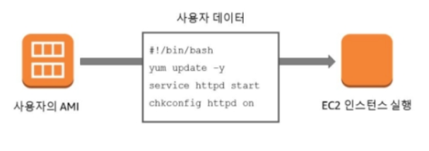
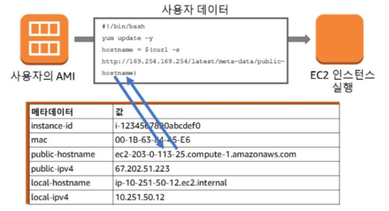
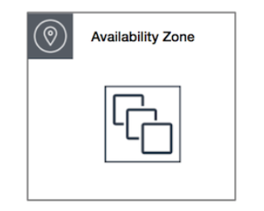
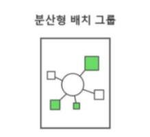
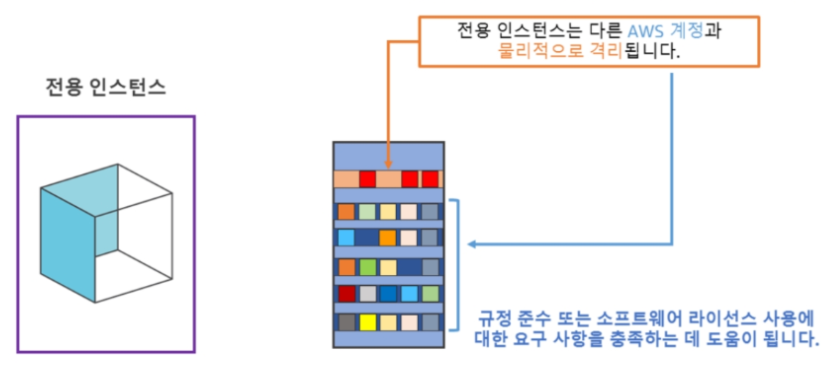

# EC2
* Elastic Computing Cloud
* AWS에서 제공하는 크기 조정이 가능한 컴퓨팅 서비스
* 400Gbps Ethernet Networking


## Instance Types
* 인스턴스 유형은 CPU, Memory, Storage, Networking 용량의 다양한 조합으로 구성된다.
* 애플리케이션에 따라 적합한 리소스 조합을 선택할 수 있는 유연성을 제공한다.

### __유형__
1. __범용(기본)__ - __균형 있는__ 컴퓨팅, 메모리 및 네트워킹 리소스를 제공. 다양한 워크로드에 사용할 수 있다 (T-Series)
2. __컴퓨팅 최적화__ - 고성능 프로세서를 황용하는 컴퓨팅 집약적인 애플리케이션에 적합. 배치 처리 워크로드, 미디어 트랜스코딩, 고성능 웹서버, HPC(고성능 컴퓨팅), 과학적 모델링, 전용 게임 서버 및 광고 서버 엔진, 기계 학습 추론 등 (C-Series)
3. __가속화된 컴퓨팅__ - 하드웨어 액셀러레이터 또는 코프로세서를 사용하여 부동 소수점 수 계산이나 그래픽 처리, 데이터 패턴 일치 등의 고성능 GPU 기반 인스턴스 (P-Series)
4. __스토리지 최적화__ - 메우 큰 데이터 세트에 대해 많은 순차적 읽기 및 쓰기 액세스를 요구하는 워크로드. 수만 단위의 IOPS를 지원


### __Resource 선정 방법__
* tpmC -> ECU로 변환
* Cloud는 종량 과금제이기 때문에, 기존 On-premise 만큼의 tpmC 값이 필요하지 않다.
* http://itworkroom.blogspot.com/p/blog-page_7.html


## AMI
* Amazon Machine Image
* AMI에는 다음이 포함된다.
    1) __Root Volume Template__: 일반적으로 OS 및 OS에 설치된 모든 구성 요소(애플리케이션, 라이브러리, 유틸리티 등)
    2) __시작 권한__
    3) __Block Device Maaping__: 연결할 볼륨을 지정한다.
* AMI 구축 방법
    1) 사전 구축: AWS에서 미리 생성해 놓은 AMI
    2) 자체 생성: 직접 AMI를 생성할 수 있다.
    3) Marketplace: 다른 사람들이 만든 AMI를 구입
    4) 커뮤티니 AMI: 비공식 커뮤니티로 AWS가 점검하지 않으며 사용자가 그 사용에 따른 위험을 부담하게 된다.

### __AMI 저장__
* AMI는 S3에 저장된다.
* 


## User Data & Meta Data
## 1. User Data

* __Instance User Data__
* 인스턴스를 Running할 때, 한 번 실행하는 Shell script.
* 네트워크 액세스가 가능하기 전에 Root 또는 관리자 권한으로 실행된다.


## 2. Meta Data

* Instance 속성 정보.
* Instance의 Public IP, Host Name, MAC Address 등의 정보를 저장하고 있다.
* http://192.168.0.1/latest/meta-dta/[특정 데이터]를 이용하여 정보를 가져올 수 있다.
    * ```TOKEN=`curl -X PUT "http://169.254.169.254/latest/api/token" -H "X-aws-ec2-metadata-token-ttl-seconds: 21600"` && curl -H "X-aws-ec2-metadata-token: $TOKEN" -v http://169.254.169.254/latest/meta-data/```
    * Instance Meta Data Configuration: https://docs.aws.amazon.com/ko_kr/AWSEC2/latest/UserGuide/configuring-instance-metadata-service.html
    * How to search Meta Data: https://docs.aws.amazon.com/ko_kr/AWSEC2/latest/UserGuide/instancedata-data-retrieval.html
* __Tag 형태로 Metat Data를 지정할 수 있다. 지정을 해야 관리하기 편하기 때문에 사용하는 것이 권장사항이다.__
    * Instance 생성할 때, 태그 추가


## 3. Cloud-init
* https://cloudinit.readthedocs.io/en/latest/index.html
* 클라우드 인스턴스 초기화를 위한 업계 표준 다중 배포 방법
* Cloud-init은 부팅하는 동안 실행중인 클라우드를 식별하고, 클라우드에서 제공된 Meta data를 읽고 그에 따라 시스템을 초기화한다. 


## Architecture
1. __클러스터 배치 그룹__
    
    * 하나의 데이터 센터 안에 물리적으로 가깝게 인스턴스 생성
    * 짧은 지연 시간과 가장 높은 초당 패킷 네트워크 성능을 제공
2. __분산형 배치 그룹__
    
    * 의도적으로 다른 하드웨어에 배치되는 인스턴스 그룹
    * 인스턴스가 비노 하드웨어를 공유할 경우 발생할 수 있는 동시 장애의 위험을 줄여준다.
    * 여러 가용영역을 포괄할 수 있으며, 그룹별로 가용 영역 당 최대 7개의 인스턴스 가능
    * 서로 분리되어야 하는 소수의 크리티컬 인스턴스


## 종료 방식: stop vs terminate
* stop: 인스턴스를 중지하면 바로 종료된다.
* terminate: 인스턴스를 중지해도 종료되지 않는다. 중지 후에 종료해야 된다.


## Pricing
* EC2 사용량은 초 단위로 청구되며 __최소 청구 시간은 60초이다__.
* __Running__ 중에만 과금이 발생. Stop 상태에서는 과금이 되지 않는다.

### __Instance 구매 방법__
1. __On-Demand Instance__
    * 시간당 비용 지불. 장기 약정이나 선결제 금액은 필요 없다.
    * 사용하는 경우
        1) 처음으로 개발 또는 시험 중인 애플리케이션
        2) 단기의 갑작스럽거나 예측할 수 없는 워크로드가 있으며, 중단되어서는 안 되는 애플리케이션
2. __스팟 인스턴스__
    * 입찰하여 사용, 온디맨드보다 최대 90% 저렴한 금액으로 구입 가능.
    * 스팟 인스턴스 용량의 장기적인 공급 수요 추세에 따라 점진적으로 조정된다. 시장 가격이 변동하여 고객의 최대 입찰가를 초과하는 경우, 컴퓨팅 리소스를 잃게 된다(바로 꺼짐). __대신 옵션으로 Spot block을 1~6시간 동안은 지속할 수 있는 스팟 인스턴스를 시작하도록 설정 가능하다.__
    * 사용하는 경우
        1) 시작 및 종료 시간이 자유로운 애플리케이션
        2) __대량의 서버 용량 추가로 긴급히 컴퓨팅 파워가 필요한 경우__
        3) CI/CD, 테스트 및 개발 워크 등
3. __예약 인스턴스(Reserved Instance) & Saving Plans__
    * 1년 또는 3년 기간의 일정 사용량 약정(시간당 요금을 기준으로 측정)을 조건으로 EC2 및 Fargate 사용량에 대해 저렴한 요금을 제공
    * 옵션
        1) __스탠다드 RI__: EC2 Saving Plans, Region 내의 특정 인스턴스 패밀리에 적용되며 가장 큰 하린 혜택 제공(최대 72%)
        2) __컨버터블 RI__: Computing Saving Plans, RI의 인스턴스 패밀리, OS 등의 속성 변경이 가능 (최대 66%)
        3) __예정된 IR__: 예약한 시간 범위 내에서 인스턴스를 시작.
    * 사용하는 경우
        1) ㅂㅈㄷ
4. __전용 인스턴스__
    
    * Single Tenant 하드웨어에서 실행.
    * 다른 사람들이랑 하드웨어를 같이 쓰지 않는다(물리적으로 격리)
    * 
5. __전용 호스트__
    * 고객 전용의 특정 EC2 인스턴스 용량을 갖춘 특정 물리적 서버.
    * 사용하는 Software가 Hardware를 타는 경우
    
    | 옵션 | 설명 |
    |------|-----|
    | 전용 인스턴스 | 비 특정 하드웨어에서 실행 |
    | 전용 호스트 | 고객이 선택한 특정 하드웨어에서 실행되어 고객이 보다 세밀하게 제어할 수 있다. |


### __비용 최적화__
* __최적화에 사용되는 서비스__
    * __AWS Saving Plans__ : 
    * __Amazon EC2 Spot__ : 
    * __AWS Compute Optimizer__ : 
    * __Cost Exploerer__ : 
    * __Auto Scaling__ : 


### Reference
* Amazon Web Service Docs