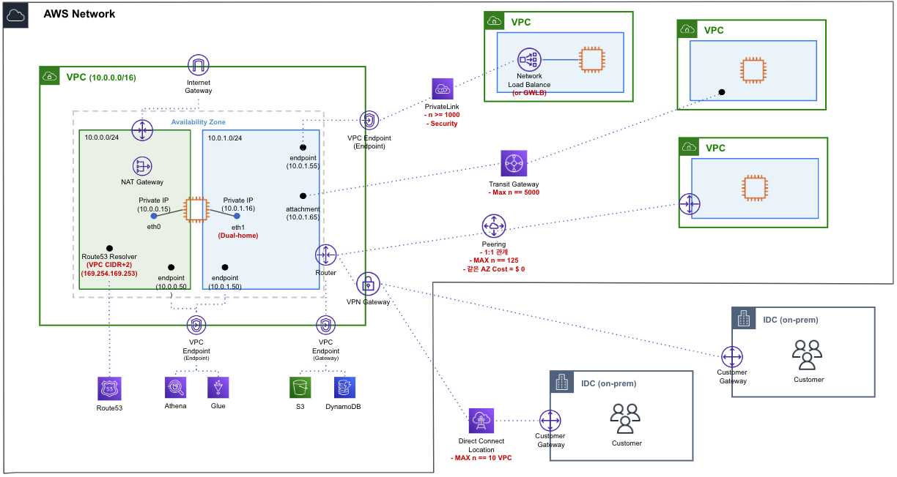

# Network


---
## Network Performance and Optimization

* Bandwidth : 초당 전송 가능한 비트
* Latency : 첫 패킷이 두 지점간의 통신하는데 걸리는 시간
* Jitter : Variation in inter-packet delays. 패킷 간의 지연 시간
* Throughput(bps) : 초당 전송한 비트. 전송한 패킷량, Latency, Packet loss 등이 있기 때문에 Bandwidth와 동일하게 나오지 않는다!
* PPS : Packet Per Second, 네트워크 장비의 초당 패킷 처리량. 컴퓨팅 리소스 파워, Throughput도 영향을 준다(여기서 Packet은 Frame 단위를 의미하여 최소 84 byte 크기를 처리할 수 있다)
    - PPS가 있는 이유는 네트워크 장비는 실질적으로 비트가 아닌 패킷 단위로 처리하며, 패킷당 처리할 수 있는 비트 기준으로만으로 Throughput(처리량)을 판단하면 매 순간 보내는 패킷의 실제 비트 수에 따라 처리 성능이 다르게 보일 수 있기 때문이다.
    - PPS 계산법 (84 bit 기준으로 계산 시)
        ```
        1 Packet == 최소 84 byte == 최소 672 bit 
        1 packet/sec == 672 bit/sec
        1 pps == 672 bps
        1/672 pps == 1 bps
        1.488 pps == 1 Kbps
        1488 pps == 1 Mbps
        ``` 
        1) 처리할 수 있는 Packet 크기를 측정 (최대 패킷: MTU)
        2) Second 나누기
        3) 1 bps 에 대한 pps 값을 구한다!
        4) PPS = 1 / Packet_Size * 처리 능력(속도 등)
* MTU : Maximum Transmission Unit. 보낼 수 있는 가장 큰 패킷
    - 일반적으로 인터넷은 MTU : 1500 bytes 이다.
    - Jumbo Frames : 1500 bytes 보다 큰 프레임
        1) 한번 보낼때 크게 보낼 수 있으므로 적은 패킷량으로 통신 가능
        2) Throughput 증가
        3) AWS 서비스를 사용하는 것들은 Jumbo Frame 지원 (VPN과 같이 인터넷으로 가는 서비스는 불가능)
    - Check 방법 : ```$ sudo ip link chow eth0```
    > MTU 이상의 크기를 가진 패킷을 전송하게 되면, 패킷을 MTU 이하의 조각으로 분할하는 것을 단편화패킷을 나눠 보내도록 되돌려 보낸다(단편화). 이를 재조합하기 위해서는 CPU/Memory가 사용되기 때문에 Overhead가 발생

</br>


### 패킷 전송 과정
1) 네트워크 장비는 처리할 수 있는 최대 패킷 크기가 정해져 있다. => (MTU)
    > 대상 장비의 MTU보다 패킷이 크면 패킷 단편화(Packet Fragmentation) 발생.
2) 그리고 각 장비는 통신을 위해 Encapsulation, Decapsulation 등 패킷을 처리한다. => (PPS)
3) 이때 패킷의 크기는 통신마다 다르기 때문에 Bit 수가 다를 수 있다. => (Throughput)
    > 기본적으로 패킷의 비트 수가 일정하면 BPS와 PPS의 그래프는 거의 비슷한 곡선을 가지게 된다.

    > BPS > PPS 인 경우, 데이터가 큰 파일 다운로드 또는 업로드 등이 행해졌다는 의미로 볼 수 있다. 패킷 최대 사이즈로(MTU) 보내게 되면 패킷 수에 비해 비트 사이즈가 커지기 때문에 BPS와 PPS의 그래프가 서로 달라진다. 

    > BPS < PPS 인 경우, 데이터가 작은 GET 요청이나 pingcheck 패킷 등이  전송되었다는 의미로 볼 수 있다. 많은 요청에 대한 응답으로 많은 패킷을 전송하지만 실질적인 데이터는 작기 때문에 BPS와 PPS의 그래프가 서로 달라진다.

</br>

### Optimization
- Over 1M PPS(1초당 1 백만개 이상의 패킷을 전송)를 의미. 
- High Network Bandwidth and Throughput, Low Laytency
- High I/O performance and Low CPU Utilization
1. Network Device(HW) level
    1) (기능) Using Jumbo Frame at network device.
    2) (기능) Network I/O Credit Type 선택
    3) (전용선) EBS Optimized Instance : EBS is not a physical drive but Network drive. EBS와의 통신으로 전용 네트워크를 사용함을써 다른 네트워크와 경쟁하지 않음
    4) (거리) 배치 그룹 : EC2 인스턴스끼리 서로 가까운 곳에 둠으로써 네트워크 홉 수 등을 줄임
2. Virtualization level
    * Enhanded Networking
        1) SR-IOV with PCI passthrough : 향상된 Physical NIC(Server)Virtualization(Hypervisor) 방법
            
            - SR-IOV : Single Root I/O virtualization. 개별 서버의 I/O 자원(물리적 네트워크 인터페이스 카드)을 여러 가상 네트워크 인터페이스로 나누어 각 가상 머신에게 할당해 주는 기술.
            - PCI Passthrough : Peripheral Component Interconnect. 물리저 하드웨어 장치를 직접 VM에 연결하는 기술. 여기서는 네트워크 인터페이스를 연결하는 인터페이스를 의미한다고 생각하면 된다.
            - SR-IOV 어댑터를 통해 물리적 PCIe(PF: Physical Function)를 여러 개의 가상화 PCIe(VF: Virtual Function)로 분할 할 수 있다.
                > Virtualization Layer(Hypervisor)을 거쳐 통신을 처리하는 것이 아닌 PCI Passthrough을 통해 가상화 네트워크 인터페이스 분배(SR-IOV)할 수 있는 물리적 네트워크 장비와 직접 연결되어 통신을 처리한다. 이를 통해 기존 Hypervisor를 통한 패킷 프로세싱 Overhead를 줄여 Latency를 줄인다.
            - VM은 기본적으로 통신을 하기 위해 가상화 레이어를 거쳐 물리적 통신을 하게 되는데 이 과정을 간소화시켜준다.
            - 사용 방법은 다음과 같다(드라이버 확인 방법 : ```ethtool -i eth0```)
                - Intel ixgbevf : 10 Gbps
                - Elastic Network Adatpter(ENA) : 100 Gbps / P4d는 400 Gbps
        2) AWS EFA (Elastic Fabric Adapter) : 고성능 처리에 사용. HPC 및 ML
            - OS Bypass를 통해 SW가 HW에 직접적으로 연결
        > AWS EFA 기능은 SR-IOV와 달리 하나의 물리적 인터페이스가 하나의 서버와 연결되며, 가상화 멀티 테넌시 기능을 위한 것은 아니다.
3. Operating system level
    * Enhanded Networking
        1) DPDK (Intel Data Plane Development Kit) library 사용 : Kernel Library로, 원래는 Kernel이 중간에서 네트워크 관련 코드/요청에 대한 Translation이 이루어지지만, 해당 라이브러리를 통해 Translation 없이 다이렉트로 네트워크 장비에 요청함으로써 Overhead를 줄여 OS 내부 패킷 처리 향상시킨다.
            
            - Kernel bypass
            - Packet Processing 제어
            - 작은 CPU Overhead
4. Software level (Others)
   1) 보안 프로토콜(HTTPS, SSH 등) 미사용 : 보안 프로토콜을 사용하면 패킷을 한번 더 감싸기 때문에 Latency가 발생
</br>

### 정리
- Physical level (네트워크 장비, 연결선, 거리)
    - 네트워크 장비의 자체 성능 : Jumbo Frame, Throughput, Bandwidth, Latency
    - 연결선 : 연결선 종류, 전용선
    - 물리적인 거리
- Virtual level
    - SR-IOV with PCI : 패킷 처리 속도 향상 ("Physical <-> Virtual"에 대한 Overhead)
- OS level
    - DPDK : 패킷 처리 속도 향상 ("OS <-> Physical/Virtual"에 대한 Overhead)
- Software level
</br>

### Bandwidth limits
1. AWS Network Service Internal (with region)
    - VPC : No limits
    - Internet Gateway : No limits
    - VPC Peering : No limits
2. AWS Network Service External
    - VPN (per Tunnel) : 1.25 Gbps
    - DX : 1 Gbps / 10 Gbps / 100 Gbps (포트를 여러개 둠으로써 1 ~ 300 Gbps 선택 가능)
3. Instance
    - NAT Gateway : 3 ~ 45 Gbps 
    - EC2 : 기본적으로 인스턴스 타입마다 제공되는 Bandwidth가 다름. 다른 리전이거나 Internet Gateway를 통과하거나 DX를 통과하는 경우, 32 vCPU 이상 사용하는 EC2 기준으로 제공된 인스턴스 타입 Bandwidth의 50% 까지만 사용 가능. 32 vCPU 미만인 경우 5 Gbps.
        1) One flow limit with Intel 82599 VF interface : 5 Gbps
        2) One flow limit With ENA not in placement : 5 Gbps 
        3) One flow limit with ENA in placement : 10 Gbps
</br>

### Delay가 발생하는 이유
* Hardware
    - Network Device 성능 이슈
    - 라우팅 문제
* Software
    - 패킷 처리 과정에서 추가되는 처리 요소(Overhead):  HTTPS, SSH 등 암호화/복호화 등
</br>
</br>


---
---
## Service

- Region    
    - VPC
    - IGW
    - Egress-IGW
    - NAT GW
    - NAT Instance 
    - Endpoint (Gateway, Interface)
    - PrivateLink
    - VPC Peering
    - Site-to-Stie VPN
    - Transit Gateway
- Global
    - Direct Connect
    - Direct Connect Gateway
    - Route53
    - Global Accelerator
    - CloudFront
- Management
    - 
    - Network Manager
    - 
</br>

### VPC Network
* VPC
    - 5개의 IPv4 CIDR Block + 1 IPv6 CIDR Block을 가질 수 있음
    - RFC 1918에 의해 같은 대역대만 추가 가능 (172.16.0.0/24를 가지고 있으면 172.16.0.0/12 범위 내에서 만 추가할 수 있다)
    - RFC 1918에서 정의한 CIDR 범위를 넘기면 안됨 (10.0.0.0/8, 172.16.0.0/12, 196.168.0.0/16)
* Subnet
    - 0~255 = 256개
    - 10.0.0.0 : 네트워크 ID
    - 10.0.0.1 : 라우터, 게이트웨이 주소
    - 10.0.0.2 : DNS 주소 (실질적으로는 VPC CIDR + 2를 가리키고 있다)
    - 10.0.0.3 : 차후 사용을 위해 AWS에서 예약
    - 10.0.0.255 : Broadcast Subnet 설정시 선택하는 AZ는 해당 서브넷에 해당하는 리소스는 해당 데이터 센터에 생성하라는 의미이다. 
    > 기본적으로 VPC는 Overlay 네트워크로 VM 간의 통신에 사용된다. 그런즉, VPC에서 가리켜지는 네트워크 외에 물리적 또는 다른 네트워크 영역들이 존재한다. Underlay Network는 제공해주는 업체만 알고 있다.

    > "VPC CIDR + 2"는 특정 AZ에 있는 것처럼 보일뿐, 내부적으로 가용성이 적용되어 있는 DNS 서비스로 추측된다. 예시로 "VPC CIDR + 2"가 Underlay Network에 존재하는 DNS 서비스를 가리키는 Overlay 네트워크의 LB(진입점) 생각하면 이해하기 쉬운거 같다. 그렇기 때문에 "VPC CIDR + 2"가 해당하는 AZ가 장애가 발생하더라도 Route53 Resolver는 정상적으로 동작하게 된다.  
* IPv6
    - 128 bit = 8 block * 16 bit / 16진수 사용
    - Public IP만 사용 가능!
    - Amazon DNS에서 제공하지 않음
    - NAT Gateway는 지원 / NAT Instance는 지원 X
* DHCP Option Set
    - 기본 DHCP Option Set은 수정이 불가!!!!!!! (모든 DHCP Option Set이 수정 불가)
    - Domain name server, Domain name, NetBIOS 타입 등의 설정을 정의
    - DHCP Option Set 변경 후, Refresh가 되어야 한다. 보통 몇시간 후에 자동 Refresh 되나 수동으로도 가능 (명령어 : $ sudo dhclient -r eth0)
    - Route53 Hostzone을 사용하기 위해서는 enableDnsSupport & enableDnsHostname 모두 활성화 필요
* DNS Resolver Server
    - (VPC Base + 2)'s IP
    - 169.254.169.253 : DNS Resolver Server IP의 가상 IP (Link-Local)
    - 해당 DNS Resolver Server는 Route53으로 쿼리를 보낸다.
    - 오직 VPC내에서만 접근 가능.
    > Route53은 RDS 등의 AWS 서비스에 대해 활성화된 AZ의 리소스에 대해 자동으로 IP Refresh 한다
* InternetGateway
* Egress-only Internet gateway
    - 송신만 가능
    - IPv6 트래픽만 처리
* NAT Gateway
    - IPv4/IPv6 모두 지원
    - Public Subnet에만 생성 가능
    - Security Group을 가지고 있지 않는다. 오직 NACL로만 가능
* NAT Instance
* Load Balancer : 
    - Application : 7 Layer. HTTP / HTTPS
    - Network : 4 Layer. TCP / UDP
    - Gateway : 3 Layer. IP
* ENI
    - MAC Address를 가지고 있다.
    - Dual-home : 하나의 서버에 네트워크가 다른 ENI를 붙인다.
    - Cross-account : 여기서 말하는 다른 계정은 AWS에서 관리하고 있는 ENI를 의미한다.
* EIP
    - 기본적으로 Public IP는 변경이 된다. 이를 해결하기 위해 EIP를 사용한다
    - BYOIP : Bring Your own IP. 기존에 쓰고 있던 IP들을 가지고 올 수 있다! 대신 차단도니 IP와 같은 이상한 이력이 있으면 안된다. 이를 위해 우리는 ROA(Root Origin Authorization)
* Security Group
* Network ACL
</br>

### Routing

* 기본적으로 VPC에 연결된 Gateway끼리는 서로 통신이 불가하다. 즉, Gateway -> Gateway 바로 통신이 불가! 
    > VPC attachment는 단순 VPC와의 연결 설정을 의미하며 라우팅 설정도 VPC 내부가 Source인 트래픽에 대한 것이기 때문에 Gateway끼리는 통신이 당연히 불가능하다. 다른 의견으로는 Gateway 자체가 다른 네트워크로 가는 것이기 때문에 분리시켜 놓는 것이 안정적일 수도 있기 때문으로 보인다.
</br>
</br>


---
---
### Internal Network
* VPC Endpoint
    - Gateway Type : S3 / DynamoDB
    - Interface Type : 그 외 서비스
    - 같은 Region 서비스만 접근 가능!
    - DNS 활성화 (VPC내의 Route 53에만 자동으로 적용됨 / 비활성화도 가능)
        1) Region
        2) AZ
        3) Private Service DNS
* PrivateLink (Endpoint Service) : VPC를 비공개로 연결하는 서비스
    - Only TCP
    - 단, NLB, GWLB에만 연결할 수 있다.
    - 수천개의 연결이 가능하며, 높은 보안성을 가지고 있다.
* VPC Peering
    - VPC <---> VPC 간의 1:1 관계이고, 전이적 관계를 지원한지 않음
    - VPC 피어링 연결을 통한 모든 데이터 전송은 무료이며, AZ를 가로지르는 VPC 피어링 연결을 통한 모든 데이터 전송은 계속 리전 내 표준 데이터 전송 요금이 청구된다.
    - 최대 125개의 피어링 연결이 가능
* Transit Gateway :
    - 주의 사항
        - 활성화한 AZ에서만 통신이 가능해 진다 (ex> Attachment를 A-zone 생성 시, A-zone에서만 통신이 가능)
    - Architecture
        1) Flat Network : 모든 네트워트가 하나의 Routing Domain 안에서 모두 통신이 가능한 형태 (Full Connectivity)
        2) Segmented Network : 각각의 VPC는 서로 통신하지 못하며, On-premise와만 통신.
        3) Centralized egress to internet with NAT gateway 
        4) Centralized traffic inspection : 어플라이언스 장비쪽으로 트래픽이 모두 거쳐가도록 통신
        5) Centralized interface endpoint
    - Attachment
        1) One or more VPCs
        2) Another TGW (peering connection)
        3) VPN
            - TGW와 VPN은 같은 계정에 만들어져야 한다.
            - Global Accelerator(Edge Location) 기능 사용 가능! (TGW와 함께 사용하는 경우에만)
        4) Connect Attachement(SD-WAN/third-party network device) : nbvh
            - Attachment Mechanism
            * Underlying transport mechanism : 네트워크에 붙이는 방식 (기본)
            * Generic Routing Encapsulation Tunnel (GRE Tunnel) : Appliance 장비 네트워크 인터페이스에 GRE 터널링을 만들어 직접 연결하는 방식
                1) Connect attachment (연결) / Connect Peer (연결 내부 터널링)
                2) BGP만 가능
                3) 최대 5 Gbps per GRE Tennel(Connect Peer), Connect 당 최대 4개의 Peer 생성 가능. 즉, 한 개의 Connect 당 최대 20 Gbps bandwidth를 가짐 (4 peer * 5 Gbps) 
        5) Direct Connect
            - 최대 6개의 Transit Gateway 연결 가능
            - 최대 10개의 VGW 연결 가능
    - Multicast support 
        - 오직 생성할 때만 가능
        - UDP 통신
        - IPv4 and IPv6 모두 지원
        - EC2 with Nitro 등 멀티캐스트 그룹에 가입/해제 가능 (AWS CLI & SDK 사용하여)
        - 도메인 지정
            - 정적 소스 도메인 지원
            - IGMPv2 지원 : Internet Group Management Protocol. 동적 소스 도메인 지원 프로토콜
    - VPN ECMP support (Tunneling)
        
        - ECMP 동작 가능. VPN의 Aggregation Throughput을 최대로 사용할 수 있다.
        - On-prem 장비의 각 VPN 터널 설정은 동일한 BGP 속성을 보내야 함. 
        - 이때 비대칭 라우팅이 발생할 수 있다!! ---> 이를 위해 고객 게이트웨이의 가상 터널 인터페이스에서 비대칭 라우팅이 활성화
            - ECMP와 상관없없이 Active/Active 형태로 쓰고 싶다면 그림과 같은(192.168.128.0/25. 즉, 대역을 서로 다르게 사용할때 가능) 추가 설정이 필요하다.
    - MTU
    - AZ consideratioin
        1) AZ affinity : 기본적으로 트래픽을 보낸 ENI의 AZ로 트래픽을 송신하는 것을 유지하려 한다(선호).
        2) Appliance Mode : 5-tuple Hash Algorithm 사용하여, 전달할 때 위치한 트래픽의 AZ로 다시 돌아온다. 기본적으로는 AZ affinity에 의해 트래픽을 보낸 ENI의 AZ로 오지만 이렇게 되는 경우, Asymmetric Routing이 발생할 수 있다!!
    - TGW Peering
        - Peering은 Static Routing만 가능(BGP 차단)
        - Cross-Region 가능
        - AWS에 의해 암호화 통신(Encryption)
        - Peering 하는 TGW 끼리는 서로 다른 ASN 사용하는 것이 좋다 (가능하면! 그게 아니어도 BGP를 지원하지 않기 때문에 정상 동작함)
        - 50 Gbps 지원
    - TGW Sharing
    - Routing Domain
    - TGW vs Peering
        |     | VPC Peering | Transit Gateway |
        |-----|-------------|-----------------|
        | Architecture | One-One connection - Full Mesh | Hub and Spoke with multiple attachment | 
        | Hybrid Connectivity | Not supported | Supported hybrid connectivity via VPN and DX|
        | Complexity | simple ---> complex (VPC Count) | simple |
        | Scale | 125 peering | 5000 attachemnts |
        | Latency | Lowest | Additional Hop |
        | Bandwidth | No limit | 50 Gbps / attachment |
        | Ref Security Group | Supported | Not Supported |
        | Subnet Connectivity | All subnet across AZs | Only subnet within the same AZ attached TGW |
        | Transitive Routing e.g IGW access  | Not supported | Supported |
        | TCO | Lowest | Per attachemnt cost |

</br>


---
### External Network
* CGW (Customer Gateway)
* VGW (Virtual Gateway)
    - VPC : Site-to-Stie VPN == 1 : N 관계
    - 외부 네트워크 통신용 게이트웨이
    - Routing 
        
        - 해당 장비에 대해서 모든 Routing이 BGP에 의해 설정
        - VPC 통신, 전용선, VPN의 Hub 역할도 가능
    - 서로 다른 ASN에 대해서만 가능 (EBGP 특성). 기본적으로 VPC 측 ASN과 동일한 ASN을 가진 경우, VPN 연결 자체가 불가능
* VPN (IPSec VPN 지원)
    - 서비스
        1) Site-to-Site VPN : VPN Service
        2) Client VPN : Router/Switch가 아닌 Client에 직접 붙게하는 서비스
    - NAT-Traversal
        - Customer VPN 장비가 NAT 뒤에 있는 경우 NAT에서 해당 통신에 대한 다르게 처리가 필요하다. 이때 사용되는 기술
        - 기본적으로 UDP:500을 통해서 VPN 정보를 공유하는데, NAT 뒤에 있는 경우, UDP:4500 포트를 사용해 IPsec 패킷을 캡슐화하여 트래픽을 처리한다.
    - Tunnel 비대칭 라우팅 (Active/Active) : On-prem 장비에서 비대칭 라우팅을 지원하지 않는 경우, 해당 부분에 대한 설정이 필요 (CIDR 분리, MED를 통해 한쪽으로만 통신, Active/Passive로 변경)
    - DPD(Dead peer detection) : 해당 VPN Connection이 죽었는지 확인하는 방식
        - R-U-THERE message check (Idle timeout, 체크 횟수 등)
        - DPD 지원 여부 확인 필요!
* Direct Connect
    - Direct Connection (전용선)
        
        - 보안 : IPSec VPN 지원 가능. MACsec도 지원하나 생성 시에 설정 가능
            1) MACsec 보안(IEEE 802.1AE) : Layer 2 보안 (On-prem 장비 switch or router가 지원해야함 / ref : https://aws.amazon.com/ko/blogs/networking-and-content-delivery/adding-macsec-security-to-aws-direct-connect-connections/)
            1) IPsec VPN : Layer 3 보안 (Site-to-Site VPN 통신 연결 시, Public VIF, Transit VIF 지원)
            - MACSec은 DX Location <---> On-prem 간의 암호화
            - IPSec은 AWS <---> Public VIF / DX Location, AWS <---> On-prem 간의 암호화
        - Connection Type
            1) Hosted : Connection을 여러 고객이 공유하는 방식으로 VLAN을 통해 트래픽을 분리
                - Connection : VIF == 1 : 1 관계 (이미 제공업체에서 Connection을 VLAN으로 분리를 했기 때문에)
                - VIF 구성시, 제공업체에서 설정되어 있는 VLAN ID를 받아서 구성
            2) Dedicated : 전용적으로 사용하는 Connection
                - LOA-CFA 문서를 작성해서 전달해야 한다!
                - Connection : VIF == 1 : N 관계 (N <= 4개)
                - VIF 구성시, VLAN을 원하는 범위에서 설정 가능할 것을 보임(왜? It's mine)
        - VIF : Connection을 VLAN으로 분리시킨 가상 인터페이스
            1) Public : 인터넷 통한 AWS 서비스
                - 1000 prefix
                - not support Jumbo MTU > 인터넷이다! 1500 MTU 최대
                - IPSec VPN 지원
                - 라우팅 우선순위 (Public ASN)
                    - LOCAL_PREF & AS_PATH
                - 라우팅 우선순위 (Private ASN)
                    - Longest Match (x.x.x.0/25 and x.x.x.128/25 & x.x.x.x/24)
                - BGP Community 설정 가능 (7224:9100,8100 - 로걸 리전, 7224:9200,8200 - 대륙, 7224:9300,태그없음 - 전체) / Ingress : 9000 , Egress : 8000
                    > Public ASN에 Longest Match가 없는 이유는 "당연히 공인 IP는 대역이 아니라 몇개 가지고 있는거겠지?!"
            2) Priavte : VGW or DXGW
                - 100 prefix 
                - Jumbo MTU 9001
                - 라우팅 우선 순위
                    - longest match
                    - BGP Community 설정 가능 (7224:7100 - low preference, 7224:7200 - medium preference, 7224:7300 - high preference)
                    - AS_PATH
            3) Transit : TGW via DXGW
                - 100 prefix
                - Jumbo MTU 8500
                - IPSec VPN 지원
                - 라우팅 우선 순위
                    - longest match
                    - BGP Community 설정 가능 (7224:7100 - low preference, 7224:7200 - medium preference, 7224:7300 - high preference)
                    - AS_PATH
        - LAG (Link Aggregation Group) : 링크 집계 그룹. 여러 개의 링크(Connection)를 하나의 논리적 연결로 취급.
            - LACP 사용 (Link Aggregation Control Protocol)
            - 장애 조치 동작
            - 최대 Dedicated Connection 4개 연결 가능 (Hosted는 안됨)
            - Bandwidth 증가 (최대 200 Gbps까지)
        - Resiliency (복원력)
            1) Maximum : 2 DX Location & 2 Connetion (4 Conn)
            2) High : 2 DX Location & 1 Connetion (2 Conn)
            3) Development and Test : 1 DX Location & 2 Connection (2 Conn)
    - DX Gateway (DXGW)
        - VIF : 다른 네트워크 == N : M 관계
        - 전용선용 게이트웨이
        - 여러 지역 통신을 위한 역활!!
        - 연결 제한
        - SiteLink : On-prem끼리 하나의 DXGW를 통해서 서로 통신하게 할 수 있음! (오직 DX Connection끼리 통신할 수 있음)
    > 고찰 : DX Location Router는 DX Connetion끼리의 통신이나 Inter VLAN을 지원하지 않는다. DX Gateway도 마찬가지다. 이유는 Direct Connect 서비스 자체가 라우팅을 위한 목적이 아닌 연결에 목적을 두고 있기 때문이다!!! 하지만 SiteLink를 쓰면 Inter VLAN 통신이 가능해진다.
    - Active / Passive (이중화)
        
        - 이중화를 위하여 여러 VIF를 Gateway에 연결시키는 경우, 기본적으로 Gateway들은 동일한 정보를 전달받기 때문에 "Customer Data Center Gateway"의 설정에 따라 Active/Passive가 결정된다.
        - 설정값
            1) 로컬 기본 설정 BGP 커뮤니티
            2) AS_PATH 속성값
    - Ative / Active (이중화)
        - ECMP 지원
    - 요구사항
        1) 802.1 Q VLAN 지원
        2) Duplex 지원
        3) BGP 지원 : Port 179
            - Health Check 메커니즘을 가지고 있다.
        4) BFD 지원 - Connection (옵션) : Port 
            - Bidirectional Forwarding Detection
            - 네트워크 장애를 감지하기 위한 Hello 메커니즘을 가진 프로토콜. 
            - 장애조치 시간을 1초 이내로 줄일 수 있다! (기본적으로 90초가 걸린다)
* AWS Cloud WAN (Wide-Area Network)
    - 통합화된 글로벌 네트워크 관리/구룩 서비스
    - Global Network : Core Networks + Transit Gateway Network
        - Core Network : Edge, Policy
    - 구성 요소
        - Core Network Edge : Region Edge Location (지역)
        - Core Network Policy : 
        - Network Segment : 네트워크 분리 단위
        - Attachment Policy : 
        - Peering
</br>
</br>


---
## Management & Goverment
* IPAM : IP Management
    - Account / Organization Level까지 사용가능
    - Global / Region / Environment(개발/운영) / VPC Levle까지 사용가능 
    - 관리자 계정이 모든 계정을 관리
    - Tier
        - Free : 공용 IP 관리만 가능
        - Advanced : 사설 IP 관리도 가능
* VPC Flow Logs
    - 로그 설정 가능 리소스 : VPC, Subnet
    - 저장 장소 : S3 / CloudWatch Logs / Kinesis Firehose + OpenSearch
* VPC Traffic Mirroring
    - ENI로 들어오는 트래픽을 설정한 대상(ENI or NLT or GWLB)에게로 트래픽을 전달
    - VXLAN 프로토콜을 사용하여 트래픽을 전달
    - ENI / NLB / GWLB
    > VPC Flow Logs vs VPC Traffic Mirroring : Flow Logs는 네트워크 흐름만 확인하는 용도이고, Traffic Mirroring은 잠재적인 네트워크 & 보안을 위해 분석하기 위한 용도 (Log Depth가 서로 다름)
* VPC Reachability Analyzer
    - Region내 통신 분석
    - Source ---> Destination 통신 가능 여부 확인
    - hop-by-hop에 대한 세부 정보 확인 (Hop 정보(라우팅 등) 보안 정책 등)
    - 자동실행 설정 가능
    - 테스트 및 트러블슈팅
    - 대상 목록
        - Instance
        - ENI
        - IGW
        - TGW
        - TGW Attachment
        - VPC Endpoint
        - VPC Peering
        - VGW
* AWS Network Manager Route Analyzer
    - 글로벌 통신 라우팅 분석
    - TWG 라우팅 변경 확인 및 알람 가능
* Network Access Analyzer
    - 입력한 Source Resource ---> Destination Resource 경로에 대하여 네트워크 & 보안 거버넌스 분석 (Resource를 인터넷으로 지정하면 인터넷으로 나갈 수 있는 모든 경로를 체크한다)
    - Resource를 확인되지 않은 네트워크 경로를 발견하기 위한 용도
    > VPC Reachability Analyzer vs Network Access Analyzer : RA는 특정 대상에 대한 것이고, NAA는 전체 리소스에 대한 것이다. 그렇기 때문에 네트워크 & 보안 거버넌스 분석을 위해서는 NAA를 위한 용도
* Tool
    - Wireshark / tcpdump : Packet Capture
    - traceroute : Check routing hop
    - telnet : Check for TCP/UDP traffic
    - nslookup : Resolve the hostnames
    - ping : Check for ICPM traffic
    - netstat : Connection (Port)
</br>
</br>


---
## Others
* Route53 : DNS
    - Route53은 RDS의 AWS 서비스에 대해 활성화된 AZ의 리소스에 대해 자동으로 IP Refresh 한다.
    - Route53 Hostzone을 사용하기 위해서는 enableDnsSupport & enableDnsHostname  모두 활성화 필요
    - Health Check
        1) 총 256개의 Child Health Check가 가능
        2) Route53은 VPC 외부에서 Health Check를 하며, VPC 내부에서 Check하기 위해서는 CloudWatch Alarm을 통해 설정해야 한다.
    - DNSSEC
        - DNS 데이터 무결성을 확보하기 위해 사용
        - Public Hosted Zone에서만 사용
        - 암호화 인증에 필요한 KSK, ZSK가 필요
            - ZSK : 실제 데이터를 서명하는데 사용
            - KSK : ZSK를 서명하는데 사용
        - 키는 us-east-1 리전에 비대칭 KMS키를 사용하여 KSK or ZSK를 생성하여 사용
    - Route53 Resolver DNS Firewall
        - Black List & White List
        - Fail 설정 방법
            1) Fail-open : Firewall이 비정상일 시, Route53 쿼리에 대하여 정상 동작 (Allow)
            2) Fail-close : Firewall이 비정상일 시, Route53 쿼리에 대하여 차단 (Block)
    - Logging
        1) DNS Query Logging : Public Hosted Zone에서 발생한 쿼리에 대한 로그
        2) Resolver Query Logging : Private Hosted Zone. VPC 내에서 만들어지는 모든 쿼리에 대한 로그
    - Shuffle sharding (셔플 샤딩)
        - 서로 다른 고객의 샤딩(워커의 묶음)을 섞어서 배치함으로써, 한 고객이 서비스가 공격/장애 등으로 해당 워커들에 장애가 발생하더라도, 다른 워커들에게 영향을 미치지 않는다. 그리고 같은 워커를 공유하고 있던 다른 고객의 서비스 입장에서도 다른 워커에서 정상적으로 동작 중이기 때문에 정상적으로 서비스가 가능하다.
        - https://aws.amazon.com/ko/builders-library/workload-isolation-using-shuffle-sharding/
    - Anycast Striping
        - DNS 서비스를 여러 지역에 있는 Edge Location에서 처리하도록 Anycast로 설정한다. 이에 따라 네트워크 지연을 최소화하며, 장애가 발생하더라도 가장 가까운 위치의 Edge Location으로 전환됨으로써 신뢰성과 가용성을 높일 수 있다.
* CloudFront : CDN 서비스
    - Edge Location, Regional Edge Cache
* Global Accelator : 
    - 2 Anycast IP 사용. 가장 가까운 Edge Loaction으로 이동.
    - Public IP를 기본적으로 가지고 있다. 그렇기 때문에 서버는 InternetGateway가 필요없으나 인터넷 통신이 흐르고 있다는 의미에서 InternetGateway를 추가한다.
    - 대상
        1) Application Load Balancer
        2) Network Load Balancer
        3) AWS Elastic IP Address
    > 둘다 AWS Shield for DDoS를 통해 보호

    > non-HTTP 서비스에 더 잘 어울림(Live). 캐싱이 되지 않음
* CloudFormation
    - CahgneSets : 변경에 대한 확인이 필요한 경우
    - StackSets : 여러 Region/계정에 배포
* Service Catalog
* Config : 리소스 변경에 대한 추적 및 규칙 준수 감시
    - 원하는 규칙을 만드려면 AWS Lambda를 사용해야 한다.
* AWS Workspaces : VDI 서비스
* AWS Appstream networking
* AWS WaveLength : 5G Edge Network
    - ML, AR,VR, Real-time Gaming
</br>
</br>


---
## Security 
보안은 크게 Preventive, Detective 두가지로 나뉜다. 
- Preventive service
- Detective service
</br>

### Preventive service
* Security Groups : Instance
* Network ACL : Subnet
* Network Firewall : Layer 3-7 - AWS Network Appliance
    - Stateful Firewall : TCP connection의 상태를 보고 판단하는 방화벽
    - Stateless Firewall : 
    - 특징
        - Stateless/ACL L3 rule
        - Statefule/L4 rule
        - IPS-IDS/L7 rule
        - FQDN Filtering
        - Protocol detection
        - Large IP block/allow list
        > Deep packet inspection : 즉 packet의 Header / Payload 등 정보를 확인할 수 있다!
    - 구성 요소
        - Firewall
        - Firewall policy : Firewall 정책. 각 특성에 해당하는 정책 Rule을 하나의 그룹으로 묶고(Rule Group), 원하는 Rule Group들을 선택하여 하나의 Policy 생성
        - Rule Group : Stateless 또는 Stateful 규칙들의 모음
    - Log : S3 / CloudWatch Logs / Kinesis Firehose
* Gateway Load Balancer : 3rd-party - Network Appliance 사용을 위한 LB
    - Layer 3 동작 (Network Layer)
    - GENEVE 프로토콜을 통한 캡슐화 (UDP port 6081)
    - 모든 IP와 모든 포트에 대하여 허용 (즉, SG 지원 X)
    - Public DNS를 지원 X
    - Only IPv4 지원
    - MTU size of 8500 byte
* Shield : DDoS 방어
    - Stardard
        - 기본적으로 Standard는 모든 AWS에 무료로 지원
    - Advance
        - $3000 per moneth per organization
        - AWS SRT팀에 Support를 받을 수 있다.
        - 
* WAF : Web Application Firewall / Layer 7 방화벽
    - AWS CloudFront
    - AWS API Gateway
    - AWS Application Load Balancer
    - AWS AppSync GraphQL API
    - AWS Cognito user pool
    - AWS App Runner service
    - AWS Verified Access instance
    - 보안 규칙
        - Whitelist
        - Blacklist
        - SQL Injectioin
        - XSS
        - HTTP Flood
        - Scanner & Probe
        - IP Reputation Lists
        - Bad Bot
    - 
    - WCU 
* Firewall Management : AWS 보안 서비스 관리. 여러 계정에 대하여 동일한 거버넌스를 세우기 위해 사용
    - 서비스
        - WAF
        - Shield Advanced
        - Security Group
        - Network Firewall
        - Resolver DNS Firewall
        - 3rd-party solution (Marketplace)
    - 미리 활성화가 필요한 서비스 : Organization, Config, Resource Access Manager(RAM)

* AWS ACM : 공용 인증서 관리
    - Amazon Trust Service에 의해서 인증받고 있음
    - 서비스 : CloudFront, ELB, API Gateway, ElasticBeanstalk
    - CloudFront만 us-east-1
    > 인증서 자동 업데이트 필요!
* AWS Private CA : 내부용 인증서 관리
* DNSSEC validation : DNS 인증서 관리
* AWS Inspector : 평가 대상(EC2 Instance, ECS Container, AMI, S3)을 계속 모니터링하면서 애플리케이션의 보안 및 규정 준수 요구사항을 평가
    - OS 취약점
    - 소프트웨어 취약점
    - 네트워크 취약점
* AWS GuardDuty
    - 로그 분석
    - 악성 및 비정상 활동 탐지
    - 보안 경고 생성 및 대응 조치 권고
</br>

### Detective service
* CloudWatch
    - CloudWatch Logs + 로그 지표 필터 + EventBridge + 
* CloudTrail
    - 90일치가 저장
    - CloudWatch or S3
* VPC Flow logs : VPC 플로우 로그 기록
    - VPC / Subnet 구분 가능
* Route53 resolver query logs : VPC 내 Route 53 resolver 로그를 기록
* GuardDuty : 로그를 분석하여 잠재적 악의 활동을 탐지
    - VPC Flow logs
    - CLoudTrail Event Logs
    - DNS Query Logs
    - EventBrdige + SNS == Alarm
* Traffic Mirroring : 트래픽을 다른 ENI로 전달

---
## Information 
- DPD(Dead peer detection) : 해당 VPN Connection이 죽었는지 확인하는 방식
- BFD (Bidirectional Forwarding Detection) : 네트워크 장애를 감지하기 위한 Hello 메커니즘을 가진 프로토콜
- MACSec (Layer2)
    - Mac Security is an IEEE 802.1 Layer 2 standard that provides data confidentiality, data integrity, and data origin authenticity
    - MACSec provides Layer2 security for Dedicated connection.
    - MACSec is available for certain Direct Connect partners only. Currently its not supported by all Direct connect partners.
    - MACSec uses pre-shared key which is generated using Connection Key Name(CKN) and Connectivity Assocation Key(CAK)
    - Make sure that you have a device on your end of the connection that supports MACSec
    - When you configure you connection, you can specify one of the following values for MACSec - should_encrypt, must_encyrpt, no_encrypt
- BGP Community : 
    - Inbound routing : on-prem -> AWS
    - Outbound routing : AWS -> on-prem
- Attack
    * DNSSEC
    - DNS exfiltration
    - DNS Poisoning (Spoofing) : 중간 DNS 서버를 해킹하여 Client에게 해킹 사이트 DNS 정보를 전달함. 이로써 Client는 해킹 사이트에 방문하게 된다.
    * WAF
    - Cross-site Scripting (XSS) : 해킹을 위한 코드를 삽입해서 잘못된 링크 또는 동작을 하게 하는 공격
    * Shield
    - DDoS : 큰 규모의 트래픽을 요청함으로써 서버에 CPU, Memory에 부담을 주어 서버 중지 등을 발생시키는 공격
        - SYN Flood attack : 많은 TCP SYN을 감당이 안될 정도로 전송하고, ACK 트래픽을 보내지 않는 공격
        - UDP Flood attck : 많은 UDP 요청을 전송하는 공격
        - UDP Reflection attack : 
        - DNS Flood attack : 
        - Slow Loris attack : Layer 7. 


### Layer
* Layer 7
    - Application Protocol : HTTP / FTP / SSH /
    - Security Protocol : HTTPS(HTTP) / FTPS(FTP) / SFTP(SSH) / 
    - Routing Protocol : ARP / DHCP / BGP / LLDP
* Layer 6
    - SSL / IMAP, MPEG, Encryption / Compression
* Layer 5
    - Sockets,WinSock
* Layer 4 
    - TCP / UDP
    - Security Potocol : TLS
* Layer 3 
    - IP Address
    - Security Protocol : IPsec VPN
    - Routing Protocol : ARP / DHCP / BGP / LLDP / ICMP
* Layer 2
    - MAC Address
    - Security Protocol : MACsec
* Layer 1
    - Coax, Fiber, Wireless, Hubs, Repeaters

### Troubleshooting
1. Layer 1 issue (Physical)
    1) Connection 확인
    2) 포트 정상인지 확인
    3) 라우터 정상인지 확인
    4) Tx/Rx option signal 확인 (CW)
    5) 데이터 센터와 연락
    6) CW 지표 확인 - error count
    7) AWS Support 연락
2. Layer 2 issue (DataLink)
    1) VALN ID 확인
    2) Router MAC address in ARP Table
    3) ARP Table Clearing
    4) VLAN trunc 활성화
    5) AWS Support 연락
3. Layer 3/4 issue (Network/Transport)
    1) IP Address 확인
    2) BGP ASN 확인
    3) Encryption Auth key 정상 확인
    4) Routing Table 제한 갯수 확인
    5) Firewall TCP 179 Port(BGP)
    5) BGP Logs 확인
</br>
</br>


---
---
## 시험 정리

## 키워드 공부
### 네트워크 고성능 처리
-  EBS Optimized Instance
-  배치 그룹
- AWS EFS (Elastic Fabric Adapter) : 소프트웨어가 직접 HW


### TGW 라우팅 분석
    - 글로벌 통신 라우팅 분석
    - TWG 라우팅 변경 확인 및 알람 가능


### 인증서
- EC2에는 ACM의 인증서를 적용할 방법이 없다. Nitro Enclave에 연결된 EC2 인스턴스 가능
- ACM 인증서 생성 : CloudFront / ALB


### 트래픽 증가
- TGW <---> Site-to-Site VPN ECMP 구성


### VPN ECMP support (Tunneling)
- TGW - Site-to-Site VPN만 지원
- VGW - Site-to-Site VPN은 미지원
- 각 VPN 터널은 동일한 BGP를 보내게 되는데, 이때 비대칭 라우팅이 발생할 수 있다!! ---> 이를 위해 고객 게이트웨이의 가상 터널 인터페이스에서 비대칭 라우팅이 활성화
- ECMP가 없고 Active/Active 형태로 쓰고 싶다면, Prefix 수정, AS_PATH, MED 설정


### 암호화 / SSL / TLS
- Client <---> Backend 암호화 유지 : NLB / TCP / Backend에서 인증서 처리 (ACM 사용 불가)
- IPSec : Site-to-Site VPN 
    - VGW - Site-to-Site VPN -CGW
    - Private VIF는 실질적으로 IPSec VPN이 아니다! NONONO
    - VGW - Site-to-Site VPN - Public VIF(DX Connect) - CGW
    - TGW - Site-to-Site VPN - Public VIF(DX Connect) - CGW
    - TGW - Site-to-Site VPN - DXGW - Transit VIF(DX Connect) - CGW
- MACSec : 
    - 새로운 Connection / LAG 생성 필요
    - 연결 키 (CAK)와 연결 키 이름(CKN)을 연결


### 리소스 규정 준수 / 기록
- AWS Config + SSM Automation Runbook


### 알람
- CloudWatch 지표 + 알람 --> EvnetBridge --> Lambda
- CloudWatch Logs + 지표 필터 + Lambda
- VPC Reachability + SNS + Lambda
- GuardDuty + Lambda


### DDoS
- AWS Shield


### Traffic 검사
- 여러 가용 영역에 대한 간혈적 연결 문제 : 비대칭 라우팅 문제

- 트래픽 미러링(Traffic Mirroring) : 
    - ENI로 들어오는 트래픽을 설정한 대상(ENI or NLT or GWLB)에게로 트래픽을 전달
    - VXLAN 프로토콜을 사용하여 트래픽을 전달
    - ENI / NLB / GWLB
- GWLB
- WAF : 
    - AWS CloudFront
    - AWS API Gateway
    - AWS Application Load Balancer
    - AWS AppSync GraphQL API
    - AWS Cognito user pool
    - AWS App Runner service
    - AWS Verified Access instance


### 비대칭 라우팅
- GWLB는 자동으로 고정세션이 설정되어 있어 비대칭 라우팅을 해소할 수 있다.
- TGW Appliance mode 활성화
- 그 외 설정에 대해서는 라우팅 시, BGP 설정을 통해 비대칭 라우팅을 막아야 한다.


### 온프레미스 네트워크가 승인된 IP에 대한 액세스를 제한하는 경우에도 사용
- Private NAT Gateway
    - VGW / TWG 로 연결되어 있어야 한다.
    - 고유 IP 존재ㅈ


### 전세계 빠르게 전달
- AWS 서비스 : Global Accelerator / CloudFront / Route53
    - TCP : GA / HTTP : CF
    - IP 주소 : GA
    - 캐싱/보안 : CF
- Global Accelerator vs CloudFront
    - TCP, IP 기반 : Global Accelerator
    - HTTP/HTTPS, 캐싱/보안 : CloudFront
- Global Accelerator vs Route53
    - Application 속도 최적화
    - 좀더 빠르고, 가용성이 높은거는 GA라는 얘기네
    - 사용자 경험을 최적화하는 데 사용


### 중앙 공유 서비스
- PrivateLink : Only TCP / NLB, GWLB 연결 가능


### IPv6
- Egress-Only Internget Gateway : IPv6 아웃바운드 트래픽만 허용하고 싶을때 사용
- VPC : IPv4/IPv6 모두 지원. 기존 VPC에 IPv6 CIDR을 추가 필요 (새로 생성 필요 X)
- TGW : IPv4/IPv6 모두 지원
- Site-To-Site VPN : IPv4, IPv6 모두 지원 불가. VPN에서 IPv4 또는 IPv6 중에 하나를 선택해야 한다!
    - VGW <---> VPN 자체로는 IPv6 지원 불가
    - TGW <---> VPN 에 대해서만 IPv6 지원 가능
- DX Transit VIF : 피어링에 IPv6 추가 가능. 그 외의 설정에 대해서는 전부 새로 생성해야 한다


### Log
- 보통 로그는 다음에서 설정 가능. S3 / CloudWatch Logs / Kinesis Firehose + OpenSearch
- ALB : S3 (액세스 로그 / 연결 로그)
- CloudTrail : S3 / CloudWatch
- VGW / CGW : Log가 남지 않는다. VPC Flow Logs


### 네트워크 서비스 비교
- Peering : 125 VPC (같은 AZ 기준으로 비용이 저렴)
- PrivateLink : N >= 1000 VPC
- TGW : 5000 VPC
- DXGW : 100 VGW


### BGP 개수
- VPC : 100
- TGW : 5000
- DX : 100


### 라우팅 테이블 개수
- VPC : 50 ~ 100
- TGW : 10000 ~ 20000
- DX : 100


### 모니터링
- VPC Flow Logs
    - VPC, Subnet
    - S3 / CloudWatch Logs / Kinesis Firehose + OpenSearch
    - IP만 검색 가능
    - pkt-srcaddr는 NAT 적용 전의 원래 주소, srcaddr는 NAT 적용 후의 주소를 나타냄
- VPC Traffic Mirroring : 패킷 분석
- Reachability Analyzer : 특정 대상 : Web server
    - Instance
    - ENI
    - IGW
    - TGW
    - TGW Attachment
    - VPC Endpoint
    - VPC Peering
    - VGW
- Network Access Analyzer : 특정 자원 : EC2 instance
- Network Manager Route Analyzer :  TGW 라우팅 변경에 따른 알람


### 보안
* Security Groups : Instance
* Network ACL : Subnet
* Network Firewall : Layer 3-7 - AWS Network Appliance
    - Stateful Firewall : TCP connection의 상태를 보고 판단하는 방화벽
    - Stateless Firewall : 
    - 특징
        - Stateless/ACL L3 rule
        - Statefule/L4 rule
        - IPS-IDS/L7 rule
        - FQDN Filtering
        - Protocol detection
        - Large IP block/allow list
        > Deep packet inspection : 즉 packet의 Header / Payload 등 정보를 확인할 수 있다!
    - 구성 요소
        - Firewall
        - Firewall policy : Firewall 정책. 각 특성에 해당하는 정책 Rule을 하나의 그룹으로 묶고(Rule Group), 원하는 Rule Group들을 선택하여 하나의 Policy 생성
        - Rule Group : Stateless 또는 Stateful 규칙들의 모음
    - Log : S3 / CloudWatch Logs / Kinesis Firehose
* Gateway Load Balancer : 3rd-party - Network Appliance 사용을 위한 LB
    - Layer 3 동작 (Network Layer)
    - GENEVE 프로토콜을 통한 캡슐화 (UDP port 6081)
    - 모든 IP와 모든 포트에 대하여 허용 (즉, SG 지원 X)
    - Public DNS를 지원 X
    - Only IPv4 지원
    - MTU size of 8500 byte
* Shield : DDoS 방어
    - Stardard
        - 기본적으로 Standard는 모든 AWS에 무료로 지원
    - Advance
        - $3000 per moneth per organization
        - AWS SRT팀에 Support를 받을 수 있다.
        - 
* WAF : Web Application Firewall / Layer 7 방화벽
    - AWS CloudFront
    - AWS API Gateway
    - AWS Application Load Balancer
    - AWS AppSync GraphQL API
    - AWS Cognito user pool
    - AWS App Runner service
    - AWS Verified Access instance
    - 보안 규칙
        - Whitelist
        - Blacklist
        - SQL Injectioin
        - XSS
        - HTTP Flood
        - Scanner & Probe
        - IP Reputation Lists
        - Bad Bot
    - 
    - WCU 
* Firewall Management : AWS 보안 서비스 관리. 여러 계정에 대하여 동일한 거버넌스를 세우기 위해 사용
    - 서비스
        - WAF
        - Shield Advanced
        - Security Group
        - Network Firewall
        - Resolver DNS Firewall
        - 3rd-party solution (Marketplace)
    - 미리 활성화가 필요한 서비스 : Organization, Config, Resource Access Manager(RAM)

* AWS ACM : 공용 인증서 관리
    - Amazon Trust Service에 의해서 인증받고 있음
    - 서비스 : CloudFront, ELB, API Gateway, ElasticBeanstalk
    - CloudFront만 us-east-1
    > 인증서 자동 업데이트 필요!
* AWS Private CA : 내부용 인증서 관리
* DNSSEC validation : DNS 인증서 관리
* AWS Inspector : 평가 대상(EC2 Instance, ECS Container, AMI, S3)을 계속 모니터링하면서 "애플리케이션"의 보안 및 규정 준수 요구사항을 평가
    - OS 취약점
    - 소프트웨어 취약점
    - 네트워크 취약점
* AWS GuardDuty
    - 로그 분석
    - 악성 및 비정상 활동 탐지
    - 보안 경고 생성 및 대응 조치 권고


### Bandwidth limits
1. AWS Network Service Internal (with region)
    - VPC : No limits
    - Internet Gateway : No limits
    - VPC Peering : No limits
2. AWS Network Service External
    - VPN (per Tunnel) : 1.25 Gbps
    - DX : 1 Gbps / 10 Gbps / 100 Gbps (포트를 여러개 둠으로써 1 ~ 300 Gbps 선택 가능)
3. Instance
    - NAT Gateway : 3 ~ 45 Gbps 
    - EC2 : 기본적으로 인스턴스 타입마다 제공되는 Bandwidth가 다름. 다른 리전이거나 Internet Gateway를 통과하거나 DX를 통과하는 경우, 32 vCPU 이상 사용하는 EC2 기준으로 제공된 인스턴스 타입 Bandwidth의 50% 까지만 사용 가능. 32 vCPU 미만인 경우 5 Gbps.
        1) One flow limit with Intel 82599 VF interface : 5 Gbps
        2) One flow limit With ENA not in placement : 5 Gbps 
        3) One flow limit with ENA in placement : 10 Gbps


---
## 네트워크 서비스

### VPC
- NAT Gateway는 Log 설정이 없다
- Egress-Only Internget Gateway : IPv6 아웃바운드 트래픽만 허용하고 싶을때 사용
- BYOIP Pool은 Cloud-init을 통해서만 연결 가능..


### Peering
- 동일한 AZ인 경우 Peering은 무료로 제공된다
- 그렇기 때문에 VPC 통신 중에 가장 저렴하다!!!


### NAT
- NAT Instance IPv6 지원 X

### NAT Gateway
- 액세스 로그 설정은 없다!!!! 아무 설정이 없어, 그냥 가는 거야
- Security Group을 가지고 있지 않는다. 오직 NACL로만 가능
- IPv4/IPv6 모두 지원
- Public Subnet에만 생성 가능
- 350s Idle-timeout이 있으므로, 인스턴스에서 350초 미만의 값으로 TCP keepalive를 활성화


### Private NAT Gateway
- 온프레미스 네트워크가 승인된 IP에 대한 액세스를 제한하는 경우에도 사용
- VGW / TWG 로 연결되어 있어야 한다.
- 고유 IP 존재


### 로드밸런서 (LB)
- 경로(Path), 호스트 기반 라우팅 : ALB
- 사용자 IP 유지 : ALB - X-Forward-For / NLB - Client IP 보존
- 

### NLB


### ALB
* 보안 정책 : 
    - TLS : 일반적인 네트워크 암호화 통신
    - FIPS : 미국 연방 정부의 정보 처리 시스템을 위한 보안 표준
    - FS Security Policy (순방향 보안 정책) : 세션 키 보안

### GWLB
- 고정 세션을 기본적으로 제공한다!
- GENEVE 캡슐화 사용
- GWLB의 Security Group(SG)는 없다.


### TGW
- Network Manager를 사용하여 TGW에서 발생하는 이벤트를 CloudWatch로 전달 가능!!!
- Connect Attachment 
    - SD-WAN 연결
    - GRE & BGP (Onlye BGP만 가능!! Static 불가능!)
    - 
- Multicast : TCP가 아닌 UDP 통신
    - 정적 소스 도메인 지원
    - IGMPv2 지원 : Internet Group Management Protocol. 동적 소스 도메인 지원 프로토콜

- Accelerator VPN
    - 생성 시에만 설정 가능!!
    - TGW Attachment 타입에 대해서만 적용 가능


### DX
- Connection은 생성후 포트 속도 변경 불가능 X. 그 외 모든 설정은 전부 새로 생성
- SLA 99.9%를 위해서는 2개의 DX Location 사용 필요
- VIF
    - Prefix 개수 : Public 1000 / Private 100 / Transit : 100
- LAG
    - VIF 신규 생성 필요
    - 

### DXGW
- Private VIF와 Transit VIF는 동일한 DXGW에 같이 연결할 수 없다.


### VPC Endpoint
- VPC 엔드포인트 통합시, Private DNS 비활성화 필요
- Route53 Private Hosted Zone 생성 필요


### Route53
- 상태 확인
    - Private Zone : EC2 StatusCheckFailed 지표의 상태를 확인하는 CloudWatch 지표를 설정하고 지표에 경보를 추가한 다음 경보 상태를 모니터링하는 상태 확인을 구성합
    - 상태 확인이 없는 기록은 항상 건강한 것으로 간주
    - Endpoint 상태 체크 : Public IP 사용하는 경우 사용 가능
    - CloudWatch : Private IP인 경우, CloudWatch 지표 및 경보 추가 필요

- 정책
    - 지리적 : 해당 위치에 있는 곳을 찾아감 (각 지역마다 특정 서비스를 제공할때 사용)
    - 지연시간 : 낮은 지연시간을 제공하는 위치로 찾아감
- Logging
    1) DNS Query Logging : Public Hosted Zone에서 발생한 쿼리에 대한 로그
    2) Resolver Query Logging : Private Hosted Zone. VPC 내에서 만들어지는 모든 쿼리에 대한 로그
    3) CloudWatch - Public Hosted zone : AWS/Route53 - DNSQueries(쿼리수) / DNSSEC InternalFailure(1)
- 규칙
    - 전달 규칙 : 특정 도메인에 대해서는 특정 IP로 쿼리를 전달한다
    - 시스템 규칙 : 특정 도메인에 대해서는 시스템 Route53을 사용한다


### Global Accelerator
- 기본적으로 클라이언트 IP를 보존하므로, 인터넷에 대한 모든 IP를 Open, 아닌 경우 GA의 Endpoint 적용
- Target : ALB / NLB / EC2 Instance / EIP
- 


### CloudFront
- 통신 순서 : (CloudFront Function) - Edge Location - (Lambda@Edge) - Origin


### EC2
- EC2에 대한 인증서는 ACM을 통해 생성 불가
- 시작 템플릿에서 BYOIP 선택 불가능


==========================================================================
틀린 문제!

# 85번 문제
- old -> new 프로토콜로 마이그레이션 중, 가동중지 시간 없이 프로토콜을 사용하는지 확인하는 방법은?
    - VPC Flow Logs + Athena 조합
    - AWS Inspector + Network Reachability