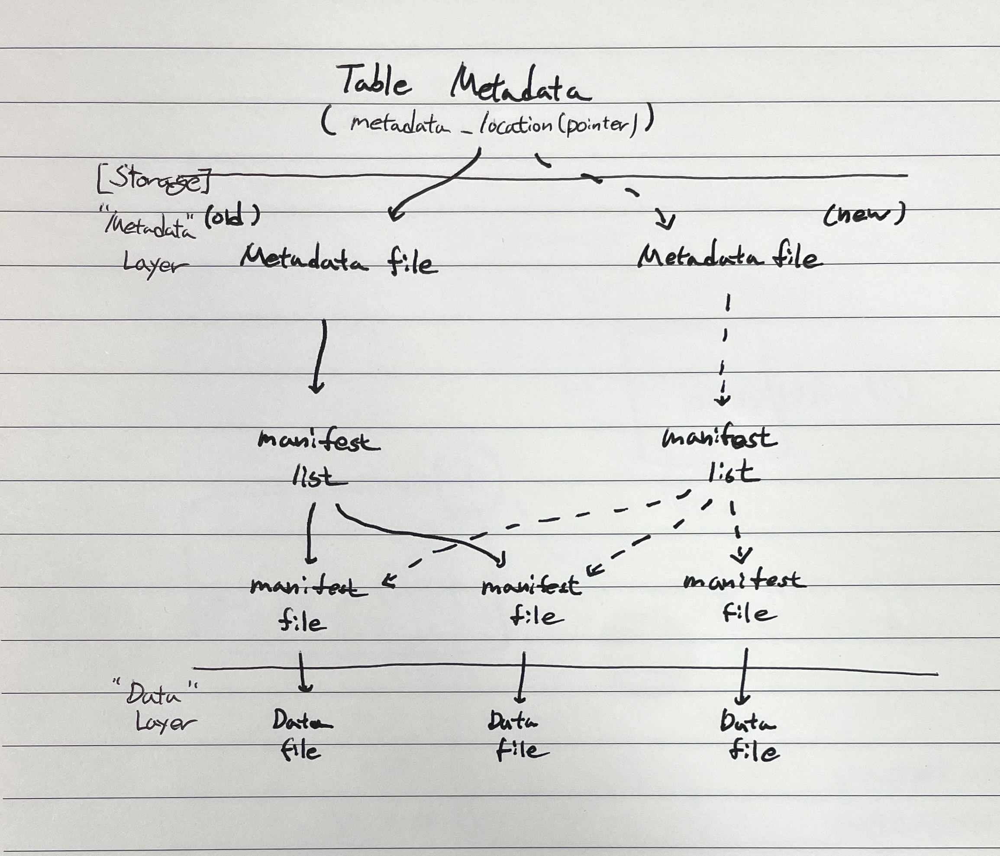

# Athena

* 동시 Query 수 == 20개 (Burst 80개)

## Monitoring
* DPUAllocated - 쿼리를 실행하기 위해 용량 예약에 프로비저닝된 총 데이터 처리 단위(DPU) 수입니다.

* DPUConsumed - 예약에서 특정 시간에 RUNNING 상태의 쿼리가 소비하는 DPU 수입니다. 작업 그룹이 용량 예약과 연결되어 있고 예약과 연결된 모든 작업 그룹을 포함하는 경우에만 생성되는 지표입니다.

* DPUCount - 쿼리가 소비하는 최대 DPU 수로, 쿼리가 완료될 때 정확히 한 번 게시됩니다.

* EngineExecutionTime - 쿼리를 실행하는 데 걸린 시간(밀리초)입니다.

* ProcessedBytes - DML 쿼리당 Athena가 스캔한 바이트 수입니다.

* QueryPlanningTime - Athena가 쿼리 처리 흐름을 계획하는 데 걸린 시간(밀리초)입니다.

* QueryQueueTime - 쿼리가 리소스를 기다리면서 쿼리 대기열에 있던 시간(밀리초)입니다.

* ServicePreProcessingTime - Athena가 쿼리 엔진에 쿼리를 제출하기 전에 쿼리를 사전 처리하는 데 걸린 시간(밀리초)입니다.

* ServiceProcessingTime - 쿼리 엔진이 쿼리 실행을 완료한 후 Athena가 쿼리 결과를 처리하는 데 걸린 시간(밀리초)입니다.

* TotalExecutionTime - Athena가 DDL 또는 DML 쿼리를 실행하는 데 걸린 시간(밀리초)입니다.

---
# Glue

## 기본 동작
1. Database, Table 생성/수정/삭제
    - Glue DataCatalog에 메타데이터 저장
    - 메타데이터에는 Schema(Colume, Index, Partition), Storage Location, Table Format(Apache Hadoop, Apache Iceberg), File Format(CSV, TEXT, Parquet)  등이 저장
    - 필요 권한
        - "glue:CreateTable"
        - "glue:DeleteTable"
        "glue:UpdateTable"
2. Data 추가/확인
    - 지정한 Storage Location에 접근하여 데이터 저장 및 확인 가능
    - Insert Query 문을 통해서도 넣을 수 있다. 
3. Data 삭제/수정
    - 기본적으로 불가능
    - Glue Job 또는 ETL 작업을 통해 변경 가능

---

## Table Type
Table에도 transaction table과 non-transaction table 2가지가 있다.
* transaction table : 데이터 수정/삭제가 가능한 테이블
* non-transaction table : 데이터 수정/삭제가 불가능한 테이블

### Iceberg Table

오픈소스 형태의 테이블 포맷 방식
* 특징
    - Merge-On-Read 형태로 파일 관리
    - 데이터 파일이 저장되는 'data' 폴더와 트랜잭션 로그 등의 메타데이터를 저장하는 'metadata' 폴더가 있다.
    - 'metadata' 안에는 'manifest' 파일이 있고, 트랜잭션 로그를 사용하여 데이터의 변경 내역 정보가 저장되어 있다.
    - 
* 주의사항 : 실제 파일(Object)가 삭제되지 않는다.

* Data Access Flow
    1. "Data Catalog - Table Metadata"에 저장되어 있는 metadata pointer(metadata_location)가 가리키는 "Metadata file"에 접근
    2. "Metadata file"은 실제 데이터 위치를 가지고 있는 "menifest file"을 관리하는 "menifest list"에 접근
    3. "menifest list"를 통해 여러 "menifest file"에 접근
    4. "menifest file"이 가리키는 위치로 가서 "data file"들을 가지고 옴
* Delet Workflow
    1. Glue:GetTable API를 실행하여 테이블의 스키마와 table properties를 가져옵니다. table properties에는 현재 버전의 metadata file을 가리키는 metadata location(S3)을 포함하고 있습니다.
    2. S3:GetObject API를 실행하여 metadata와 manifest를 가져옵니다.
    3. manifest를 참조하여 삭제할 데이터 필터링에 필요한 data/delete files를 식별합니다.
    4. S3:GetObject API를 실행하여 필요한 data/delete files를 읽고, 삭제할 row를 가져오기 위해 필터링을 진행합니다.
    5. S3:PutObject API를 실행하여 삭제되어야 할 row에 대한 position delete files를 작성합니다.
    6. S3:PutObject API를 실행하여 새로운 delete files에 대한 새로운 manifest를 작성하고, 새로운 manifest를 가리키는 새로운 metadata file을 작성합니다.
    7. Glue:UpdateTable API를 실행하여 테이블의 metadata_location이 새로운 metadata file을 가리키도록 업데이트합니다.

