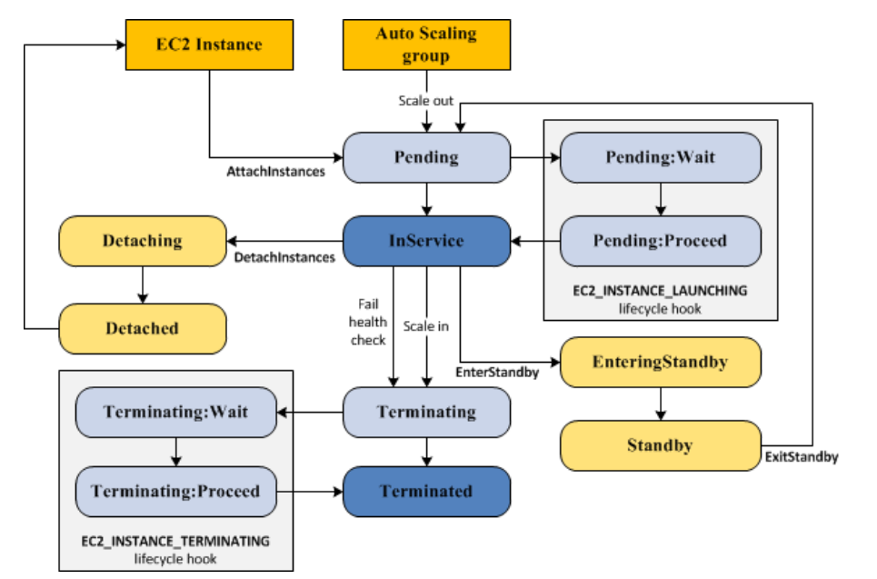

# Auto Scaling
* 설정에 따라 자동으로 EC2의 수량을 조절하는 서비스
* Auto Scaling은 활성화된 Availabililty Zone에 대해 균등하게 분산한다 (__Availability Zone rebalancing__)
</br>
</br>

## Life Cycle

1. Scale Out
    * Auto Scaling 그룹이 EC2 인스턴스를 시작하고 그룹에 연결하도록 지시한다. 과정은 다음과 같다.
    * Instance는 ```Pending```상태로 시작되며, Launch Template를 통해 각 인스턴스 구성
    * 초기 EC2 인스턴스 Health Check("Running")가 통과되면, Auto Scaling Group에 연결되고 ```InService``` 상태가 된다. 이때 ELB가 연결된 경우, ELB도 Health Check를 하기 때문에 Unhealty로 판단할 수 있다. 그렇기 때문에 Grace Period를 설정하여 "InService" 상태가 된 후에 체크하도록 해야 한다.
2. In Service
    * ```InService``` 상태 중인 인스턴스는 다른 이벤트가 발생하기 전까지 상태를 유지한다.
    * Scale In 이벤트 발생
    * 대기 모드 시작 및 종료
    * 인스턴스 분리
    * Health Check 실패
3. Scale In
    * Auto Scaling Group에서 EC2 인스턴스를 분리하고 종료하도록 지시
    * 인스턴스는 ```Terminated``` 상태로 들어가기 때문에 다시 시작할 수 없다.
</br>


## Instance Control
### Attaching
* 하나 이상의 EC2 인스턴스를 기존 Auto Scaling Group에 연결할 수 있다.

### Detaching
* Auto Scaling Group에서 인스턴스를 제거할 수 있으며, 이후에는 독립적으로 Instance를 관리할 수 있다.

### Standby
* 문제가 있거나 업데이트가 필요한 인스턴스의 경우, ```Standby``` 상태에서 해결하거나 변경한 다음에 다시 서비스할 수 있다.
* ```Standby``` 상태의 인스턴스는 계속 Auto Scaling Group에서 관리하지만, 다시 시작할 때까지 애플리케이션이 활성화되지 않는다.
</br>

## Scale Control
## Manual Scaling
* Console을 이용하여 Attach/Dettach
</br>

## Dynamic Scaling
* Auto Scling이 특정 CloudWatch 지표를 추적하도록 지시하고 연결된 CloudWatch 경보가 ALARM일 때 취해야 할 조치를 정의한다.
</br>

### 용량 선택 방법
1. 인스턴스 단위
    * Auto Scaling Group의 최대 용량 및 최소 용량을 초과하거나 미만으로 인스턴스를 조정할 수 없다. 정책에서 갯수가 설정이 되어있더라도 자동으로 중지된다.
2. 인스턴스 가중치
    * Auto Scaling Group의 최대 용량 및 최소 용량과 상관없이 가중치를 비교하여 할당. 할당 정책을 고수하는 방법이다.
</br>

### Policy Type
* Warm-up Time : 새로 시작된 인스턴스가 지정된 워밍업 시간이 만료될 때까지 인스턴스는 Auto Scaling Group의 집계된 지표에 계산되지 않는다. 이를 통해 리소스 사용량에 영향을 주지 않도록 하여 필요한 것보다 더 많은 인스턴스를 추가하지 않는다.
* Cold Time : 다음 Scaling 활동이 시작되기 전에 휴지 기간이 완료될 때까지 기다린다. 이를 통해 추가적인 Scaling 작업이 반복되지 않게 도움을 준다.
1. Target tracking scaling
    * 특정 Metric에 대한 값을 기반으로 Group의 Scaling 작업을 한다.
    * 기본에서 제공하는 Metric 말고도 사용자가 원하는 Metric으로 구성하여 설정할 수 있다.
    * Metric이 시간이 지남에 따라 어떻게 변하는지 학습하고 해당 정보를 사용하여 Scaling 최적화 알고리즘을 사용
    * Warm-up Time을 통해 확장 제어
    * ex> 자동으로 Scaling
2. Step Scaling
    * 경보 위반의 크기에 따라 달라지는 Scaling 작업.
    * Metric에 대한 Multiple Threshold 지정
    * Warm-up Time을 통해 확장 제어
    * ex> 임계값 A - CPU 사용률이 40%에서 50% 사이일 때 인스턴스 1개 추가 / 임계값 B - CPU 사용률이 50%에서 70% 사이일 때 2개의 인스턴스 추가
3. Simple scaling
    * Metric에 대한 Single Threshold 지정
    * Cold Time을 사용하여 Scaling 속도를 제어
    * ex> CPU 사용률이 40%에서 50% 사이일 때 인스턴스 1개 추가
> Metric의 지표를 활용하는 경우 Target tracking 정책, 이외에는 Step Scaling 정책을 권장한다.

> 필요한 경우 여러 개의 정책을 적용할 수 있다. 하지만 충돌 현상이 생길 수 있으므로 주의하는 것이 좋다. ref: https://docs.aws.amazon.com/autoscaling/ec2/userguide/as-scale-based-on-demand.html
</br>
</br>

## Lifecycle Hook
* 인스턴스가 시작되거나 종료될 때 사용자 지정 작업을 수행할 수 있도록 Auto Scaling 그룹에 수명 주기 후크를 추가할 수 있습니다.
* Hook 종류
    * ```autoscaling:EC2_INSTANCE_LAUNCHING ```: Pending 상태에서 Hook 추가
    * ```autoscaling:EC2_INSTANCE_TERMINATING```: Terminating 상태에서 Hook 추가

* 사용되는 예시
    1) 예기치 않은 장애가 발생할 경우, 시작을 포기하도록 시작 수명주기 후크를 구성.
    2) 예기치 않은 장애가 발생할 경우, 종료 시 로그를 s3에 저장하도록 후크를 구성.
</br>

### Lifecycle Hook 과정
1. Scale Out Evnet가 발생 -> 인스턴스 구성(Launch Template에 의해)
2. Lifecycle Hook은 인스턴스를 ```Pending:Wait``` 상태로 만든 다음 지정 작업 수행(Lambda 등)
   * ```complte-lifecycle-action``` CLI 명령어 또는 ```CompleteLifecycleAction``` 작업을 사용하여 Lifecycle 작업을 완료하거나 제한 시간이 끝날 때까지 인스턴스는 대기 상태로 유지된다(Default: 1 hour)
3. 작업 또는 대기 시간이 종료되면, ```Pending:Proceed``` 상태가 되어 Auto Scaling Group이 시작 프로세스를 계속한다(EC2 Health Check 후 Attach)
4. 인스턴스가 ```InService``` 상태에 들어가고 Health Check 유예기간이 끝나면, Auto Scaling이 인스턴스를 Health Check 한다.
5. Scale In Event 발생 -> Load Balancer에서 등록 취소
6. Lifecycle Hook은 인스턴스를 ```Terminating:Wait``` 상태로 만든 다음 지정 작업 수행
7. 작업 또는 대기 시간이 종료되면, ```Terminating:Proceed``` 상태로 전환되며 인스턴스가 종료된다.
> 작업이 완료되면 complete-lifecycle-action 명령어를 꼭 사용하자. 그래야 대기 시간이 없다!!!
</br>

### Lifecycle Hook 사용되는 경우
* 해당 Lifecycle에 Lambda 등을 실행하게 할 경우
* 기본적으로 ```User Data```를 사용하는 경우, Pending에 대한 Hook을 사용할 필요가 없어 보인다.
1. Pending Lifecycle Hook
    * Lambda를 이용하여 애플리케이션의 동작 또는 Traffic 수신이 정상적인지 확인하여, 실패할 때 알람 보내기 (미리 테스트하겠지만 중간에 오류가 발생할 수도 있으니 테스트해보는 것도 나쁘지 않은 거 같다)
2. Terminating Lifecycle Hook
    * 인스턴스가 종료되기 전에 Amazon EventBridge를 사용하여 알림을 보낸다.
    * 인스턴스가 대기 상태에 있는 동안 AWS Lambda 또는 다른 인스턴스에 연결하여 인스턴스가 완전히 종료되기 전에 로그 또는 데이터를 다운로드한다.
* 알람으로는 EventBride(권장) or SNS/SQS 사용
* https://brunch.co.kr/@alden/65
</br>
</br>


## Termination Policy
* Scale In Event 발생 시, 종료되는 인스턴스 제어하는 정책
* Scale In Event에 대한 보호도 가능하다. 보호를 활성화하면 그 이후에 시작된 모든 새 인스턴스에 활성화가 된다.
* 정책 종류
    1) __Default__: 인스턴스가 가장 많은 가용 영역을 확인 후, 축소로부터 보호되지 않는 인스턴스를 선택
    2) __OldestInstance__: Group에서 가장 오래된 인스턴스 종료
    3) __NewestInstance__: Group에서 가장 최신 인스턴스 종료
    4) __OldestLaunchConfiguration__: 가장 오래된 시작 구성이 있는 인스턴스 종료
    5) __ClosestToNextInstanceHour__: 다음 청구 시간에 가장 가까운 인스턴스를 종료합니다. 이 정책은 시간당 요금이 부과되는 인스턴스의 사용을 극대화하는 데 도움이 된다.
    6) __OldestLaunchTemplate__: 가장 오래된 시작 템플릿이 있는 인스턴스를 종료. 그룹을 업데이트하고 이전 구성에서 인스턴스를 단계적으로 제거할 때 유용
    7) __AllocationStrategy__: 
        * Spot 할당 전략이 lowest-price인 경우, 각 인스턴스 유형 풀에서 가장 저렴한 N개의 스팟 인스터스로 점진적으로 재조정한다.
        * Spot 할당 전략이 capacity-optimized인 경우, 각 풀에서 가격을 확인하지 않고 최적의 용량 볼륨을 찾아 인스턴스를 선택한다.
        * https://medium.com/cloudzone/aws-autoscaling-group-spot-capacity-optimised-allocation-strategy-df666345498
</br>
</br>


## Capacity Rebalancing
* 스팟 인스턴스의 가용성에 영향을 미치는 변경 사항을 모니터링하고 자동으로 응답하도록 Auto Scaling을 구성할 수 있다.
* Rebalancing은 실행 중인 인스턴스가 EC2에 의해 중단되기 전에 새 스팟 인스턴스로 플릿을 사전에 확장하여 워크로드 가용성을 유지하는데 도움을 준다.
* 작동 방식
    1) EC2 Capacity Rebalancing 알림을 인식
    2) 중단될 스팟 인스턴스를 사전에 중단 위험이 높지 않은 새로운 스팟 인스턴스로 재조정한다.
</br>
</br>

## Instance Refresh
* 한 번에 몇 개의 인스턴스를 수동으로 교체하는 대신 Instance refresh를 사용하여 Auto Scaling Group의 인스턴스를 업데이트할 수 있다.
* 작동 방식
    1) 먼저 새 AMI 또는 User Data Script를 지정하는 새 Launch Template를 생성한다.
    2) 최소 정상 상태 비율, 인스턴스 워밍업 및 체크포인트를 구성하여 Instance Refresh 진행
    3) Auto Scaling은 Rolling 교체를 시작. 서비스를 중단한 인스턴스 집합을 가져와 종료하고 원하는 새 구성으로 인스턴스를 시작한다.
    4) 그런 다음 워밍업 및 인스턴스 Health Check가 완료되면 다른 인스턴스로 교체한다.
    5) Group의 특정 비율이 교체된 후 체크포인트에 도달하고, 체크포인트가 있을 때마다 Auto Scaling은 인스턴스 교체를 일시적으로 중지하고 알림을 보내고 지정된 시간 동안 기다린다.
</br>
</br>


## Scheduled Scaling
* Scaling을 예약할 수 있으며, 하루만 확장되거나 반복되는 일정에 따라 확장되는 작업을 예약할 수 있다.
* cron 형식
</br>
</br>

## Warm Pool
* Warm Pool은 미리 인스턴스를 프로비저닝하여 Scale out 시 바로 서비스할 수 있게 해준다.
* Warm Pool을 사용할 시 인스턴스를 ```Running```과 ```Stopped``` 상태로 유지할 수 있는데, ```Stopped``` 상태로 유지하는 것이 비용을 최소화하는 방법이다. 해당 상태인 경우 인스턴스 비용을 제외한 볼륨과 EIP 등의 비용만 지불하면 된다.
> 하지만 필요하지 않을 때는 비용이 발생하므로 부팅시간!!!으로 인해 애플리케이션이 크게 영향을 받지 않는다면 사용할 필요가 없다!!!

