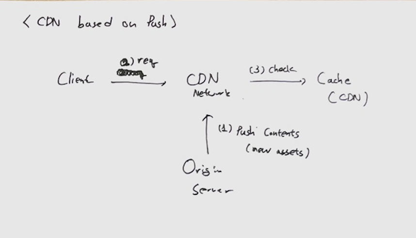
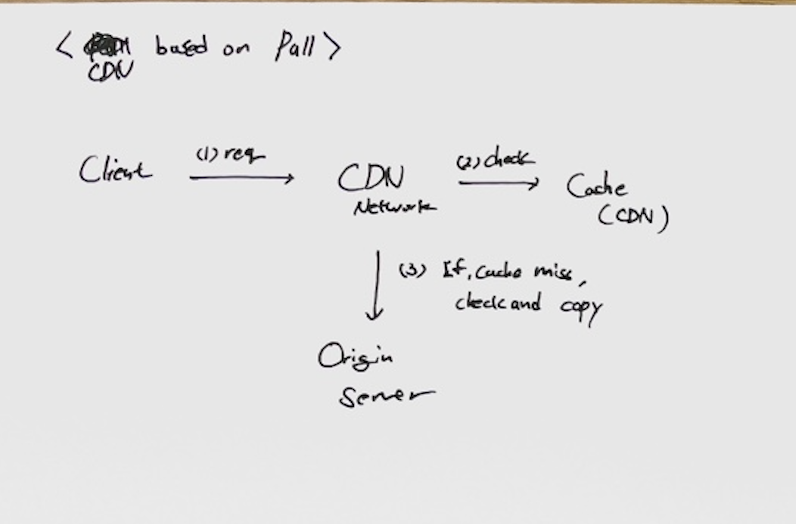
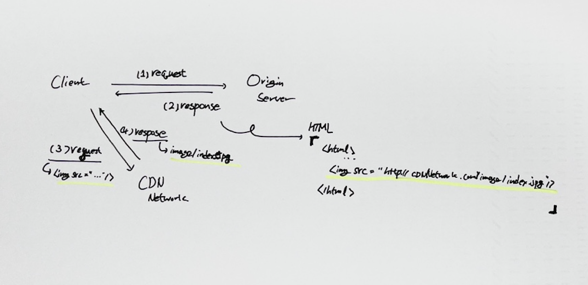
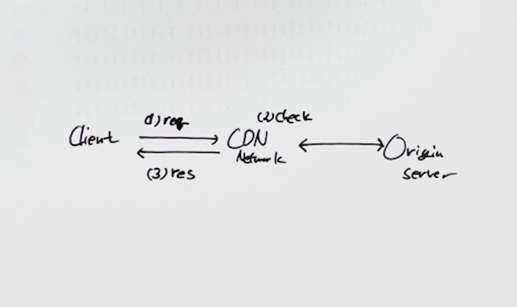

# CloudFront
CDN(Content Delivery Network) 서비스로 콘텐츠를 사용자에게 더 빨리 배포하도록 지원할 수 있다.
* 구축 시 생각해야 될 내용들
1) 접근 방법
    * CloudFront로 통합
    * Origin Server와 CDN 분리
2) 보안
    * Protocol
    * 액세스 제어
3) 캐싱
    * 정책 및 설정
    * 주기 (배포 시 유의)
4) Keep-Alive
5) 로그
</br>

### 용어 정리
* PoP(Point-of-Presence) : Edge Location 이라고도 하며, 여러 지역에 위치한 CDN 서버이다.

</br>
</br>


---
## CDN Caching 방식
* reference : https://www.mohitkhare.com/blog/guide-to-cdn/
1. __CDN based on Push (Static Caching)__
    
    * Origin Server에서 CDN으로 캐싱할 데이터를 자동/수동으로 미리 전송해 두고(Push) 링크한다. 이렇게 되면 특별한 경우가 아닌 이상 항상 콘텐츠가 Caching되어 있다(Cache Hit)
    1) Origin Server에서 캐싱할 데이터를 CDN 캐시에 미리 적재한다.
    2) Client가 CDN에 요청을 보낸다.
    3) CDN은 캐시에서 데이터에서 확인한다.
2. __CDN based on Pull (Dynamic Caching)__
    
    * Origin Server에 콘텐츠들이 있고, 먼저 CDN이 캐싱 데이터를 확인 후 없다면(Cache Miss) Origin Server로부터 다운로드 받아(Cache Fill) 데이터를 
    1) Client가 CDN에 요청을 보낸다.
    2) CDN은 캐시에서 데이터를 확인한다.
    3) 캐싱된 데이터가 없다면 Origin Server에서 데이터를 확인한다. 그 이후 데이터를 CDN Cache에 저장 후 Client에게 보낸다
</br>
</br>


---
## CDN Architecture
End Point에 따라 아키텍처는 크게 2가지 방안이 있다. (참고: https://blog.leedoing.com/35)
* 기본 동작 : URL 기반으로 콘텐츠를 Origin 서버로부터 캐싱한다 (ex> /hello/index.html)
> 1번은 요즘 추세는 아닌거 같다.
1. Origin Server와 CDN으로 2개 가주가는 방법
    
    * 콘텐츠에 CDN URL 표시
    * 보통 용량이 큰 특정 정적 콘텐츠 들고 가게 하기 위해서 사용하며, 코드 상에서 등록한 내용들만 CDN에서 캐싱
        ```html
        <script crossorigin src="<cdn_url>"></script>
        ```
    * 장점 :
        * 구성이 쉽다. 
    * 단점 :
        * End Point가 두 군데이기 때문에 보안 및 액세스 제어에 대해서 양쪽을 신경써야 한다.
        * 코드 상 정적 콘텐츠 위치를 CDN 위치로 지정해야 한다. CDN에 장애가 발생하면 대응 수단은 코드를 수정하여 재배포해야 한다(CDN 복구가 늦어지거나, 안되는 경우)

2. CDN으로 통합 
    
    * CDN이 가장 앞단으로, URL에 따라 해당하는 Origin Server에게 전달
    * 장점 :
        * 관리 포인트가 한 군데이기 때문에, 배포, 보안, 통신 장애 포인트 관리 등 관리하기에 편하다. 
        * 코드를 수정할 필요가 없다. CDN에 장애 발생 시 DNS를 수정하여 대응할 수 있다(CDN 복구가 늦어지거나, 안되는 경우)
    * 단점 :
        * CDN 기능이 좋아야 하며, 설정이 복잡하다 / 동적 콘텐츠에 대한 동작도 CloudFront를 거치기 때문에 세션, 연결 등에 대한 트래픽도 관리해야 한다.
        * 비용이 많이 든다.
</br>
</br>


---
## 보안
크게 액세스 제어, HTTPS, 암호화 관련하여 설정할 수 있다.
* 액세스를 제어할 수 있는 방법으로는 다음과 같다.
    1) CDN에 대한 액세스 제한
    2) Origin에 대한 액세스 제한
* HTTPS 관련 설정으로는 SSL 인증서 및 보안 정책이 있다.
* 암호화
</br>

### CDN에 대한 액세스 제어
1. 서명된 URL 사용
    * 개별 파일에 대한 액세스 제한
    * 쿠키를 지원하지 않는 클라이언트의 경우 사용
    * 개발자가 추가로 코드를 작성해야 됨
2. 서명된 쿠키 사용
    * 파일 여러 개에 대한 액세스 권한 제한
    * 현재의 URL을 변경하고 싶지 않은 경우 사용
    * 개발자가 추가로 코드를 작성해야 됨
3. AWS WAF acl 통한 제한
4. 지리적 기준에 대한 제한
> 보통 3, 4번 사용
</br>

### Origin에 대한 액세스 제어
1. 사용자 지정 헤더 사용
    * CloudFront에 의해 추가된 사용자 지정 헤더가 포함된 경우에만 요청에 응답하도록 오리진을 구성하여 사용자가 CloudFront를 우회하는 것과 오리진으로 직접 콘텐츠에 액세스하는 것을 방지
    * 개발자가 추가로 코드를 작성해야 됨
2. AWS S3, MediaStore
</br>

### HTTPS 및 암호화
* CloudFront --> Origin HTTPS 통신
* User --> CloudFront HTTPS 통신
* Field Level 암호화를 통해 민감한 데이터 보호
</br>
</br>


---
## Log
CloudFront에서 객체에 대한 각 요청의 정보를 로깅하고 이 로그 파일을 Amazon S3 버킷에 저장할 수 있다.
* 배포 설정에서, 활성화/비활성화 할 수 있다.
</br>
</br>


---
## 구축
1. Distribution Config 설정 (CloudFront --> Origin 설정)
    * Origin 도메인, 추가할 Origin URL 경로 : ```{protocol}://{origin_domain}/{add_url}}```
    * Origin 이름
    * 사용자 정의 헤더 추가 (추가할 수 없는 사용자 지정 헤더)
        * CloudFront 요청 식별
        * CORS 활성화
        * 콘텐츠에 대한 액세스 제어 (Application에서 제어하는 것은 최대한 X, 트래픽으로 제어)
    * Origin Shield 사용 여부 : CloudFront와 Origin 간에 캐싱 사용 여부
    * 연결 시도 / 연결 제한 시간 / 응답 제한 시간 / 연결 유지 제한 시간 : CloudFront --> Origin 간의 통신 제어
    * 프로토콜 / HTTP 포트 / HTTPS 포트 : CloudFront --> Origin 간의 통신 프로토콜
2. Caching 정책 설정
    * Cache 정책 : 캐시 적중에 대한 정책
    * Origin Request 정책 : 캐시 누락이 있을 때, CloudFront에서 Origin으로 보내는 정책
    * 응답 정책 : 최종 사용자에게 응답 보낼 때 정책
3. Caching Default 동작 설정 (User --> CloudFront 설정)
    * 경로 패턴
    * View 설정 : 최종 사용자가 통신할 때 허용할 프로토콜 설정
        * 프로토콜 / HTTP Method / Access Control
    * Caching 정책 설정
    * 자동 객체 압축 사용 여부 : 엄청 큰 의미는 모르겠다. 올릴 때 보통 압축을 해두니 말이다...!
    * Mirosoft Smooth Streaming 사용 여부
    * 필드 레벨 암호화 : Application에서 이미 암호화해야 하지 않았을까?
4. 함수 연결
    * 트리거 설정
5. 설정
    * CloudFront 사용할 지역 지정 (요금 설정)
    * AWS WAF ACL 설정
    * 대체 도메인 지정
    * SSL 인증서
    * 보안 정책
    * 기본 루트 객체 지정
    * 로깅
6. Origin 그룹 : Target 이중화가 가능한 경우
7. 동작 : URL마다 캐싱 정책을 다르게 가져가야 되는 경우 
8. 사용자 지정 오류 페이지
    * Origin에서 제공하는 오류 페이지가 아닌, CloudFront에서 전달할 오류 페이지를 지정할 수 있다.
    > 어느 지점에서 오류가 발생했는지 헷갈리게 하지 않을까?
9.  지리적 제한 : 국가에 대한 액세스 제한
10. 무효화 : 제거할 캐싱 URL 입력
</br>
</br>


---
## Deploy
1. Contents를 오리진 서버에 배포
2. 캐싱 처리
3. Distribution Config 업데이트
4. 
</br>
</br>


---
### Troubleshooting
* 동적 IP으로 인한 방화벽 (동적)
    * 일반적으로 범위로 적용
* 콘텐츠에 대한 권한
    * CORS
    * CDN 파일 액세스 권한
* Origin에 배포 후, Edge에서의 캐싱 만료 및 다시 다운로드하도록 해야 됨
</br>


1. 동적 데이터는? : https://medium.com/wizpace/aws-cloudfront%EB%A5%BC-%EC%82%AC%EC%9A%A9%ED%95%98%EC%97%AC-%EB%8F%99%EC%A0%81-%EC%BB%A8%ED%85%90%EC%B8%A0-%EC%A0%84%EC%86%A1%ED%95%98%EA%B8%B0-dynamic-content-delivery-c249da4b269b
https://blog.leedoing.com/35
2. 테스트 코드 작성 : https://nyyang.tistory.com/70
3. 배포 방법
4. WAF : https://techblog.woowahan.com/2699/
5. Directory Scan
6. 캐싱 적중률
