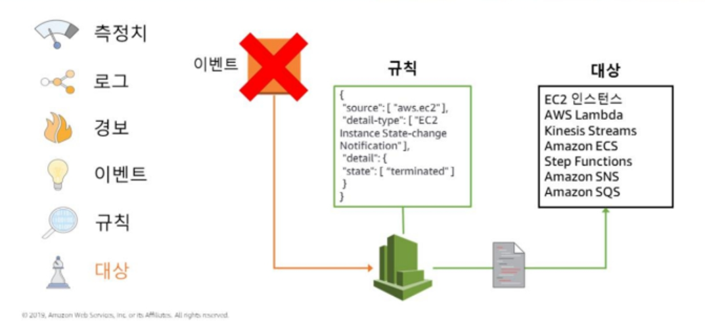
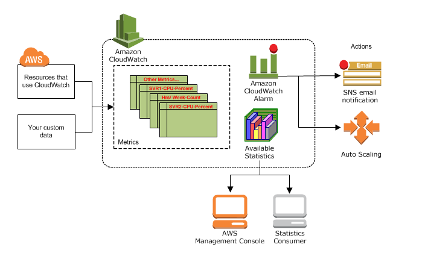

# CloudWatch
* 애플리케이션 및 인프라 모니터링 서비스
* 로그, 지표 및 이벤트 양식으로 모니터링 및 운영 데이터를 수집하고, 자동화된 대시보드를 사용하여 시각화한다.
* Metric은 CLI를 이용하는 것이 좋다.
</br>


## Monitoring List
### 지표 (Metric)
* 시스템 성능에 대한 데이터, 많은 AWS 서비스에 대해 무료 지표를 기본적으로 제공한다.
* 지표 데이터는 15개월 동안 보관된다.
1. __내장된 지표__
    * AWS 서비스에서 기본 지표를 수집할 수 있다.
2. __사용자 지정 지표__
    * 자체 애플리케이션으로부터 사용자 지정 지표를 수집하여 운영 성능을 모니터링하고 문제를 해결하고 추세를 파악할 수 있다.
3. __컨테이너 지표 및 로그__
    * Container Insights를 활용하면 큐레이트된 지표 및 컨테이너 에코시스템 로그를 간단히 수집하고 집계할 수 있다.
4. __Lambda 지표 및 로그__
    * CloudWatch Lambda Insights를 활용하면 AWS Lambda 함수에서 큐레이트된 지표 및 로그를 간단히 수집하고 집계할 수 있다.
</br>

### 로그 (Log)
* AWS 서비스로부터 로그 파일을 모니터링, 저장 및 액세스할 수 있다.
1. __Vended Log__
    * 고객을 대신하여 AWS 서비스가 기본적으로 게시하는 로그
    * 현재 지원되는 유형은 Amazon VPC Flow Log, Amazon Route 53 Log
2. __AWS Service Log__
    * AWS 서비스에서 게시하는 로그
    * Amazon API Gateway, AWS Lambda, AWS CloudTrail 등
3. __사용자 지정 Log__
    * 고객 자체 애플리케이션 및 온프레미스 리소스의 로그
    * AWS Systems Manager를 사용하여 CloudWatch Agent를 설치하거나 PutLogData API 작업을 사용하여 손쉽게 로그를 게시
</br>
</br>


## Alarm & Event

* 지표랑 로그에 정보들이 저장 -> 특정 상태 변화, 유지 시 경보 발생 -> 규칙을 통해 이벤트를 대상으로 라우팅 -> 대상은 해당 이벤트를 실행


### 경보 (Alarm)
* 지정한 기간에 단일 지표를 감시하고 시간에 따른 임계값 대비 지표 값을 기준으로 지정된 작업을 하나 이상 수행.
* 경보는 특정 상태가 되었다고 바로 작업을 수행하지 않고, 상태가 변경되고 지정된 기간 동안 변경된 상태가 유지되어야 한다.
</br>

### 이벤트 (Event)
* AWS 리소스의 상태 변경시 이벤트 작동
* 규칙(Rule)
    * Event와 일치하는 것을 찾아서 대상에게 라우팅한다.
    * 여러 개의 대상에게로 라우팅할 수 있으며, 모두 병렬 처리된다.
* 대상(Target)
    * 이벤트를 처리하는 대상을 의미한다.
</br>
</br>


## CloudWatch 개념

### __Namespace__
* 네임스페이스
* CloudWatch에서 Metric의 컨테이너이다. __서로 다른 네임스페이스의 Metric은 서로 격리되어 있으므로__ 서로 다른 애플리케이션의 Metric이 실수로 동일한 통계로 집계되지 않는다.
* 기본 네임스페이스는 없다.
* AWS 네임스페이스 Naming 룰은  ```AWS/<service>``` (ex> EC2: ```AWS/EC2```)
</br>

### __Metrics__
* CloudWatch의 기본 개념.
* Metric은 Name, Namespace 및 0개 이상의 Dimensions으로 고유하게 정의된다.
* Metric은 모니터링할 변수로, Data point는 시간 경과에 따른 해당 변수의 값으로 생각하면 된다.
* 데이터는 15개월까지 보관되며, 이후에는 삭제된다.
* __Time Stamp__
    * 각 Metric Data point는 Time Stamp와 연결되어야 한다.
    * Time Stamp를 제공하지 않으면, CloudWatch는 Data point가 수신된 시간을 기반으로 타임스탬프를 생성
    * Time Stamp는 ```dataTime``` 객체로 전체 날짜에 시, 분, 초를 더한 결과다(ex> 2016-10-31T23:59:59Z)
    * CloudWatch의 모든 통계 시간 및 경보는 __Coordinated Universal Time(UTC)__ 현재 시간을 기반으로 확인된다.
</br>

### __Dimensions__
* Dimension은 ```name/value``` 이다. 최대 10개의 Dimension을 Metric에 할당할 수 있다.
* Dimension은 Metric에 대한 특정 속성이라고 생각하면 될 거 같다(name: 속성 이름 / value: 속성 값)
* 해당 Dimension을 통해 Filtering 할 수 있다. 그렇기 때문에 아래와 같이 동일한 Namespace에 동일한 이름의 Metric이 존재하더라도 검색할 수 있다.
    ```
    Dimensions: Server=Prod, Domain=Frankfurt, Unit: Count, Timestamp: 2016-10-31T12:30:00Z, Value: 105
    Dimensions: Server=Beta, Domain=Frankfurt, Unit: Count, Timestamp: 2016-10-31T12:31:00Z, Value: 115
    Dimensions: Server=Prod, Domain=Rio,       Unit: Count, Timestamp: 2016-10-31T12:32:00Z, Value: 95
    Dimensions: Server=Beta, Domain=Rio,       Unit: Count, Timestamp: 2016-10-31T12:33:00Z, Value: 97
    ```
</br>


### __Resolution__
* 기본적으로 표준 Resolution은 1분 단위로 데이터를 저장한다.
* High Resolution은 1초 단위로 데이터를 저장한다.
</br>

### __Statistics__
* Statistics(통계)는 지정된 기간 동안의 Metric 데이터의 집계이다.
* 집계는 지정한 기간 내에 Namespace, Metic Name, Dimesion 및 Data Point 측정 단위를 사용하여 수행된다.
* 각 Statistics(통계)에는 ```Bytes, Seconds, Count, Percent``` 측정 단위가 있다. 
</br>

### __Percentiles__
* 백분위 수는 데이터 집합 값의 상대적 위치를 나타낸다.
* https://docs.aws.amazon.com/AmazonCloudWatch/latest/monitoring/cloudwatch_concepts.html#Percentiles
</br>

### __Alarms__
* 알람을 사용하여 자동으로 사용자를 대신하여 작업을 시작할 수 있다.
* Trigger 이다.
</br>
</br>


## CloudWatch

* Cloud Watch는 기본적으로 지표 리포지토리(Metric Repository)이다.
* AWS Service 및 사용자 지정 지표를 리포지토리에 저장하고 사용자는 해당 지표를 기반으로 통계를 검색한다.
</br>

### Metric
1. AWS Service Metric
    * AWS Service 확인
    * https://docs.aws.amazon.com/AmazonCloudWatch/latest/monitoring/aws-services-cloudwatch-metrics.html
    * 
2. Custom Metric 생성
    * https://blog.leedoing.com/70
    * https://aws.amazon.com/ko/blogs/korea/amazon-cloudwatch-custom-metrics/
    * 기본적으로 Consol 에서는 생성이 불가
    1) EC2 등 리소스에 자격 증명 부여
    2) AWS CLI를 이용하여 생성
       * ```$ aws cloudwatch put-metric-data --metric-name PageViewCount --namespace "MyService" --value 2 --timestamp 2016-01-15T12:00:00.000Z```
</br>

### Dashborad
* 원하는 지표(Metric)나 로그(Log)들을 정리하여 볼 수 있다. 즉, 나만의 대시보드를 만들 수 있다.
</br>

### Alarm
* 설정한 임계값을 벗어날 때, 알람을 보내준다.
</br>
</br>


## CloudWatch Logs
* EC2 instance, Route 53 등에서 로그 파일을 모니터링, 저장 및 액세스 할 수 있는 서비스.
</br>

### __Log events__
* 로그 이벤트는 모니터링 중인 애플리케이션 또는 리소스에 의해 기록된 일부 활동에 대한 레코드(Log Data라고 생각하면 된다).
</br>

### __Log streams__
* 로그 스트림은 모니터링 중인 애플리케이션 인스턴스나 리소스에서 나온 이벤트의 시퀀스를 표시하는 데 주로 사용.
> 순서를 표시해야 되기 때문에 사용되야 한다. 순차적으로 저장되면 상관없을 지도.. 공부해봐야 알 거 같다.
</br>

### __Log groups__
* 동일한 보존 기간, 모니터링 및 액세스 제어 설정을 공유하는 로그 스트림 그룹을 정의한다.
* 각 로그 스트림은 하나의 로그 그룹에 속해야 하며, 하나의 로그 그룹에서 포함할 수 있는 로그 스트림의 수에는 제한이 없다.
* 예를 들면, 여러 대 호스트의 각 Apache 액세스 로그에 대한 로그 스트림들은 ```MyWebsite.com/Apache/access_log```라는 하나의 로그 그룹으로 묶일 수 있다.
</br>

### __Metric filters__
* 지표 필터를 사용하여 수집된 이벤트에서 지표 관찰값을 추출하고 이를 CloudWatch 지표의 데이터 요소로 변환할 수 있다.
* 지표 필터는 로그 그룹에 할당이 되고, 로그 그룹에 할당된 모든 필터들은 로그 스트림에 적용된다.
</br>

### __Retention settings__
* 보존 기간 설정은 CloudWatch Logs에서 로그 이벤트를 보관하는 기간을 설정하는데 사용된다.
* 기간이 만료된 로그 이벤트는 자동으로 삭제된다.
* 지표 필터와 마찬가지로 보존 기간 설정 역시 로그 그룹에 할당이 되며, 로그 그룹에 할당된 보존 기간은 로그 스트림에 적용된다.
</br>
</br>


## EventBridge
* 기존 AWS 클라우드워치 이벤트 API위에 구축된 서버리스 이벤트 버스입니다.
</br>
</br>


## CloudWatch 사용방법
* 규칙은 다음과 같이 사용하면 될거 같다.
* 평상 시 운영 => 지표 확인 : Metric + Dashboard 활용
* 지표 확인 중 Critical/Warning 상태가 되는 경우 => Slack에 알람 전송 : Metric + SNS + Lambda
* 특정 상황에 대한 알람 => Slack으로 알람 전송 : EventBridge + Lambda
* 대처 상황 => 알람에 대해 원인 파악 후 대처 진행 : 보고, Lambda 등등
* 알람에 대한 기계학습 시키기 (CloudWatch Anomaly detection)
* 참조: https://techblog.woowahan.com/2669/
</br>

## Metric 확인 방법
1. Console 확인
2. Query 사용
    ```
    SELECT FUNCTION(metricName)
    FROM namespace | SCHEMA(...)
    [ WHERE labelKey OPERATOR labelValue [AND ... ] ]
    [ GROUP BY labelKey [ , ... ] ]
    [ ORDER BY FUNCTION() [ DESC | ASC ] ]
    [ LIMIT number ]

    SELECT AVG(CPUUtilization)
        FROM 'AWS/RDS'
        WHERE DBInstanceIdentifier=''
        ORDER BY AVG() DESC
    ```
    * 
    * https://docs.aws.amazon.com/AmazonCloudWatch/latest/monitoring/cloudwatch-metrics-insights-querylanguage.html

## Custom Metric 사용
1. 필요한 Resource에 대한 Custom Metric 생성
    * CLI, SDK 등 이용
    * Metric Name, Namespace, Dimension, Value, Timestamp 등 정의
    * Example : https://aws.amazon.com/ko/blogs/korea/amazon-cloudwatch-custom-metrics/
2. Dashboard 생성
    1) Widget : 원하는 지표/로그 형태 선택
    2) 원하는 지표 선택
</br>

## Alarm 사용
1. 원하는 지표 선택
2. 해당 지표에 대한 Alarm 조건 설정
3. Alarm 발생 시, 원하는 Action 설정
4. 알람을 받을 SNS 선택
</br>

## 사용자 지정 EventBridge 사용
1. EventBus 생성
    * 각 Event 특성에 따라 Event들을 분리시킨다.
2. Lambda 생성
    * Rule에 적용될 코드 작성
3. Rule 생성
    * 특정 Event에 대해 특정 Lambda 적용
</br>


## CloudWatch Logs 사용
1. Log Group 생성
    * Group 별 분리를 위함
2. 필요한 Resource에서 Log 생성 및 전송
    * CloudWatch Logs Agent 설치
    * Config 파일 수정 (/etc/awslogs.conf)
    * https://docs.aws.amazon.com/ko_kr/AmazonCloudWatch/latest/logs/AgentReference.html
3. CloudWatch Logs Agent 실행
    ```
    $ sudo systemctl enable awslogsd.service
    $ sudo service awslogsd start
    ```
</br>
</br>

---
## CloudWatch Logs Agent
### SSM을 통하여 CloudWath Agent 활성화
1. 필요 IAM 구성
    * Server : ```CloudWatchAgentServerPolicy```, ```AmazonSSMManagedInstanceCore``` (SSM)
    * User : SSM 사용을 위한 IAM 권한  #```CloudWatchAgentAdminPolicy```, 
2. CloudWatch Agent 설치
    * SSM Document : AWS-ConfigureAWSPackage (https://docs.aws.amazon.com/AmazonCloudWatch/latest/monitoring/download-CloudWatch-Agent-on-EC2-Instance-SSM-first.html)
3. Config JSON 파일 구성
4. CloudWatch Agent를 실행할 User 생성
5. 자격 증명 설정
6. 


## 구성 파일
```json

{
    "agent": {
        "region": "ap-northeast-2",
        "run_as_user": "root"
    },
    "logs": {
        "logs_collected": {
            "files": {
                "collect_list": [
                    {
                        "file_path": "/var/log/messages",
                        "log_group_name": "/cloudwatch/logs/linux/var/log/messages",
                        "log_stream_name": "{instance_id}",
                        "retention_in_days": 731,
                        "timezone": "local",
                    },
                    {
                        "file_path": "/var/log/boot.log",
                        "log_group_name": "/cloudwatch/logs/linux/var/log/boot",
                        "log_stream_name": "{instance_id}",
                        "retention_in_days": 731
                    },
                    {
                        "file_path": "/var/log/secure",
                        "log_group_name": "/cloudwatch/logs/linux/var/log/secure",
                        "log_stream_name": "{instance_id}",
                        "retention_in_days": 731
                    },
                    {
                        "file_path": "/var/log/maillog",
                        "log_group_name": "/cloudwatch/logs/linux/var/log/mail",
                        "log_stream_name": "{instance_id}",
                        "retention_in_days": 731
                    },
                    {
                        "file_path": "/var/log/cron",
                        "log_group_name": "/cloudwatch/logs/linux/var/log/cron",
                        "log_stream_name": "{instance_id}",
                        "retention_in_days": 731
                    }
                ]
            },
            "windows_events": {
                "collect_list": [
                    {
                        "event_format": "xml",
                        "event_name": "System",
                        "event_levels": [
                            "INFORMATION",
                            "WARNING",
                            "ERROR",
                            "CRITICAL"
                        ],
                        "log_group_name": "/cloudwatch/logs/windows/eventLog/system",
                        "log_stream_name": "{instance_id}",
                        "retention_in_days": 731
                    },
                    {
                        "event_format": "xml",
                        "event_name": "Application",
                        "event_levels": [
                            "INFORMATION",
                            "ERROR"
                        ],
                        "log_group_name": "/cloudwatch/logs/windows/eventLog/application",
                        "log_stream_name": "{instance_id}",
                        "retention_in_days": 731
                    }
                    //,
                    // {
                    //     "event_name": "CustomizedName",
                    //     "event_levels": [
                    //         "INFORMATION",
                    //         "ERROR"
                    //     ],
                    //     "log_group_name": "CustomizedLogGroup",
                    //     "log_stream_name": "CustomizedLogStream"
                    // }
                ]
            }
        }
    }
    //,
	// "metrics": {
    //  "namespace" : 
	// 	"metrics_collected": {
	// 		"collectd": {
	// 			"metrics_aggregation_interval": 60
	// 		},
	// 		"statsd": {
	// 			"metrics_aggregation_interval": 60,
	// 			"metrics_collection_interval": 60,
	// 			"service_address": ":8125"
	// 		}
	// 	}
	// }
}
```


---
## Cost (비용)

</br>
</br>


# VPC Flow Log
AWS VPC 흐름 로그 기록
</br>
</br>


# CloudTrail
AWS API 호출 로그 기록
</br>
</br>


---


Application을 위한 모니터링 
- Collectd : 
- StatsD : 
    * https://aws.amazon.com/ko/blogs/devops/new-how-to-better-monitor-your-custom-application-metrics-using-amazon-cloudwatch-agent/