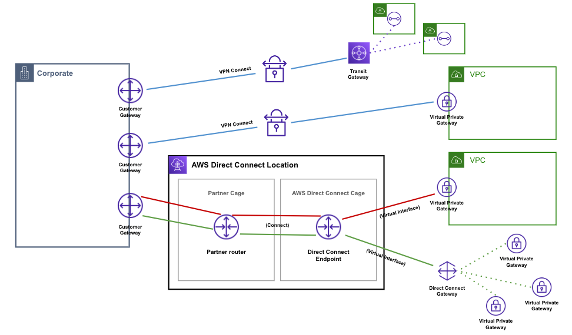

# Direct Connect
AWS와 On-premise 간의 전용 네트워크를 제공하는 서비스.

* 연결 아키텍처 참조 : https://docs.aws.amazon.com/whitepapers/latest/hybrid-connectivity/connectivity-models.html
 

## 구성 요소

* Connect : AWS와 기업 사이에 전용선
    - 물리적인 전용선에 대한 Object (물리적인 단일 광섬유라고 생각하면 된다)
        > 제공 업체와 협의를 통해 진행    
* Virtual Interface : Connect를 AWS 자원에 연결하기 위한 네트워크 인터페이스
    - AWS 측의 연결 정보 설정이라고 생각하면 된다.
    - VLAN / BGP ASN 확인 필요
    1) Priavate VIF : VPC 측에 연결할 수 있는 VIF
    2) Public VIF : AWS Public 리소스에 연결할 수 있는 VIF
        - Your router peer ip : 고객 게이트웨이 디바이스 
        - Amazon router peer IP : DX Location Router IP
        - Prefixes you want to advertise : On-premise 네트워크 CIDR
    3) Transit VIF : Transit Gateway에 연결할 수 있는 VIF
    > KINX 등 제공 업체에게 설정한 VLAN, BGP 전달
* Direct Connect Gateway : VIF와 Gateway(VGW, TGW)를 연결하기 위한 게이트웨이
    - 기본적으로 Virtual Interface는 하나의 Gateway에만 연결 가능하다. 그렇기 때문에 여러개의 Gateway와 연결하기 위해서는 DXGW를 사용해야 한다.
 

## Connection 과정
1. Customer Gateway 생성
2. Connect 생성
    - Partner 를 통해 전용선을 회사와 AWS 상에서 연격
3. Transit Gateway / Virtual Private Gateway 생성
4. Direct Connect gateway 생성
    - 여러 개의 VPC를 연결하려면 만든다.
    - 하나의 VPC만 연결하려면 만들 필요가 없다. 바로 VGW에 붙이면 되기 때문에
5. Virtual Interface 생성
    - 연결할 Connect와 사용할 Gateway를 선택한다.
 

## 고려 사항
- 포트 속도가 1Gbps를 초과하는 연결의 경우 포트 자동 협상을 비활성화해야 합니다. 그러나 연결을 제공하는 AWS Direct Connect 엔드포인트에 따라 1Gbps 연결에 대해 자동 협상을 활성화하거나 비활성화해야 할 수도 있습니다. 가상 인터페이스가 계속 작동 중지된 경우 계층 2(데이터 링크) 문제 해결을 참조하십시오 .

- DX는 North-South 네트워크에 대해서만 동작한다. East-West에 대해서는 라우팅하지 않는다!

- DX Connect 당 50개의 VIF를 생성하여 최대 50개의 VPC에 연결 가능
- DXGW 당 최대 10개 VGW 연결 가능
- 