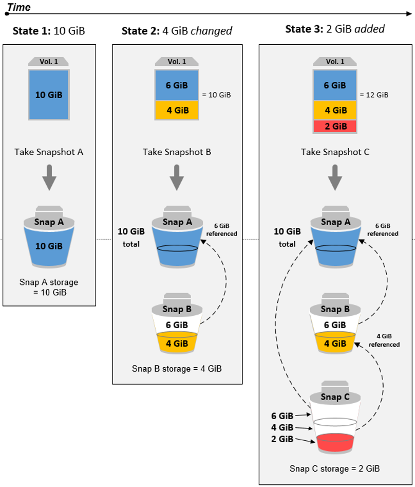
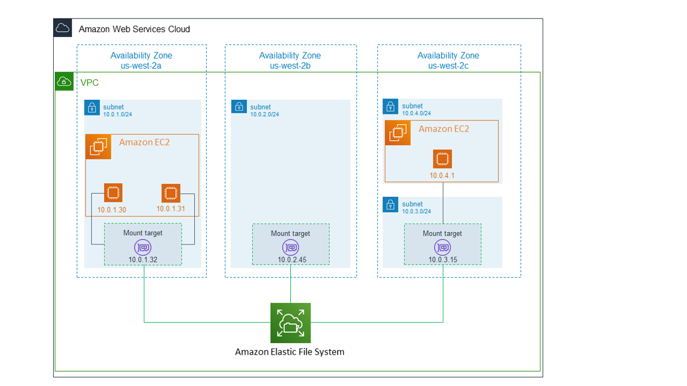

# EBS
Amazon EC2 Instance를 위한 안정적이고 분리 가능한 블록 수준 스토리지.

* EBS는 한 번에 하나의 인스턴스에만 열결할 수 있어야 하며, 동일한 가용영역에 있어야 한다.
* 빠르게 액세스해야 하고 장기적인 지속성이 필요한 데이터에는 Amazon EBS를 권장한다.
</br>


## __Volume Type__
1. SSD - IOPS
    1) 범용 SSD(__gp2__ 및 __gp3__)
        - 대부분의 워크로드에 사용
        - 1GB 당 3IOPS로 계산되므로 300 IOPS가 필요하려면 Size를 100GB로 늘려야 한다.
    2) 프로비저닝된 IOPS SSD(__io1__ 및 __io2__)
        - 대규모 데이터베이스 워크로드에 사용
        - Size와 IOPS를 설정할 수 있다.
2. HDD - MB/s
    1) 처리량 최적화 HDD(__st1__)
        - 자주 액세스하고 처리량 집약적인 워크로드에 사용
        - 빅데이터, 스트리밍, 로그 처리 등
    2) 콜드 HDD(__sc1__)
        - 자주 액세스하지 않는 워크로드에 사용
        - 최저 비용의 HDD 볼륨으로 비용이 최대한 낮아야 하는 시나리오에 사용
</br>


## Amazon EBS 최적화 인스턴스 (EBS Optimization)
* EBS 전용 네트워크 선을(전용 대역폭을 사용) 사용함으로써 다른 서비스들의 네트워크와 경합하지 않게 된다.
* 해당 기능은 EBS에서 지원하는 것이 아닌 전용 인스턴스의 유형을 선택해야 한다.
* Amazon EBS I/O를 위한 추가 전용 용량을 제공한다.
</br>


## __Snapshot__ (Backup)

* 특정 시점을 스냅샷 찍어 S3에 저장할 수 있다.
* 이를 통해 백업으로 사용되며, 요금은 저장된 데이터의 양을 기준으로 지불한다.
* 리전 간에 스냅샷을 복사하여 지리적 확장할 수 있다.
* __스냅샷의 작동 방식은 증분식(incremental backups)이다.__ 그렇기 때문에 해당 스냅샷은 가장 최근에 변경된 장치의 블록만 저장한다. 삭제하려면 전체를 삭제해야 한다.

> AWS EBS의 스냅샷 같은 경우는 내부적으로 기존 증분데이터를 저장하고 있는 거라고 생각하면 된다. 

> 예시로 snapshot_1(6 GiB), snapshot_2(6 GiB + 4 GiB)라고 가정했을때, snapshot_1은 '6 GiB 백업 데이터 블록'을 참조하고 있고 snapshot_2는 '6 GiB 데이터 블록'과 '4 GiB 데이터 블록'을 각각 참조하고 있기 때문에 snapshot_1을 삭제하더라도 snapshot_2는 사용가능하다. 
</br>


## __암호화__
* 암호화 작업은 AWS KMS를 사용한다.
    - 저장 중인 데이터(data at rest) : EBS 내부에 있는 데이터를 암호화 한다.
    - 전송 중인 데이터(data in transit) : EC2 Instance에서 EBS Storage로 전송 중인 데이터의 암호화
    - 스냅샷 암호화(Snapshot) :
        - 암호화된 볼륨의 스냅샷은 자동으로 암호화
        - 암호화된 스냅샷에서 생성한 볼륨은 자동으로 암호화
* EBS는 업계 표준 AES-256 알고리즘을 사용하여 데이터 키로 볼륨을 암호화한다. __데이터 키는 암호화된 데이터와 함께 디스크에 저장된다.__
    1) KMS를 이용하여 데이터 키를 암호화함
    2) 암호화된 데이터 키는 볼륨과 함께 EBS에 저장
    3) 볼륨이 EC2 인스턴스에 연결될 때, Amazon EBS는 AWS KMS를 호출하여 저장된 암호화된 데이터 키를 복호화
    4) 복호화된 데이터 키는 하이퍼바이저 메모리에 저장되어 볼륨에 대한 모든 I/O 작업을 암호화하는 데 사용
        > 즉, 인스턴스를 Start하면 KMS를 가지고와서 데이터 키를 복호화하고, 복호화한 데이터 키(실제 암호화 키)를 메모리에 저장한다!
* 작동 방식
    1) KMS 키를 지정하여 AWS KMS에 GenerateDataKeyWithoutPlaintext 요청을 보낸다
    2) AWS KMS는 새 데이터 키를 생성하고 볼륨 암호화를 위해 선택한 KMS 키로 암호화하고 암호화된 데이터 키를 Amazon EBS로 전송하여 볼륨 메타데이터와 함께 저장한다
    3) 암호화된 볼륨을 인스턴스에 연결하면 Amazon EC2가 데이터 키를 해독할 수 있도록 AWS KMS에 CreateGrant 요청을 보낸다
    4) 그리고나서 EC2가 Decrypt 요청을 보내면, AWS KMS는 암호화된 데이터 키를 해독하고 Amazon EC2로 보낸다
    5) Amazon EC2는 하이퍼바이저 메모리의 일반 텍스트 데이터 키를 사용하여 볼륨에 대한 디스크 I/O를 암호화한다. 일반 텍스트 데이터 키는 볼륨이 인스턴스에 연결되어 있는 한 메모리에 유지된다
</br>
</br>


---
# EFS
* 공유 네트워크 파일 스토리지 (NAS: Network Attached Storage)
* Linux 워크로드, NFSv4.0 및 NFSv4.1 파일 시스템
* 해당 파일 시스템 프로토콜을 제공하는 EC2 AMI를 선택해야 되거나, 일부 AMI의 경우 NFS Client를 설치해야 한다.
</br>

## EFS Class
1. 표준 스토리지 클래스
    * 다중 AZ 복원력과 최고 수준의 내구성 및 가용성을 제공하는 EFS Standard 및 EFS Standard–Infrequent Access(Standard–IA).
    * AWS 리전 기준
2. One Zone 스토리지 클래스
    * EFS One Zone 및 EFS One Zone–Infrequent Access(EFS One Zone–IA)는 고객이 단일 AZ에 데이터를 저장하도록 선택하여 추가 비용 절감을 선택할 수 있도록 한다.
    * Availability Zone 기준
</br>
</br>


## EFS Performance
1. Throughput Mode (Throughput 관련)
    * 24시간 뒤에 변경 가능
    * 버스트(Bursting): 파일 시스템 크기가 커짐에 따라 확장
    * 탄력적 처리량(Elastic) : 처리량 성능을 자동으로 늘리거나 줄임
    * 프로비저닝된(Provisioned): 즉시 프로비저닝된 처리량을 제공받는다(비용이 비쌈!!!!)
2. Performance Mode (IOPS 관련)
    * 변경 불가능
    * 범용 모드(General Purpose): 최대 35,000 IOPS를 지원하고 작업당 지연 시간이 가장 짧으며 파일 시스템에 권장되는 성능 모드. 범용 웹 서비스 환경, 콘텐츠 관리 시스템, 홈 디렉토리 및 일반 파일 서비스와 같이 지연 시간에 민감한 사용 사례
    * 최대 I/O 성능 모드(Max I/O): 높은 수준의 집계 처리량 및 초당 작업에 사용(고도로 병렬화된 워크로드). 빅 데이터 분석, 미디어 처리 및 게놈 분석과 같은 고도의 병렬화된 애플리케이션 및 워크로드
        > 최대 I/O는 IOPS가 높지만 내부적으로 병렬처리로 구성되어 있다. 그렇기때문에 기본적으로 높은 Latency를 가진다! 그렇기 때문에 병렬처리가 필요할 정도의 워크로드(분석 등)에만 사용되어야 한다!
* 계산: https://docs.aws.amazon.com/efs/latest/ug/performance.html#throughput-modes
</br>
</br>


## EFS Work

1. Amazon EFS를 사용하여 파일 시스템 생성
2. 마운트를 위한 VPC Endpoint 생성
3. Amazon EC2 인스턴스에 파일 시스템을 탑재한 다음 파일 시스템에서 데이터를 읽고 쓸 수 있다.
    * NFSv4.0, NFSv4.1 프로토콜을 통해 통신
    * 통신 시 ```amazon-efs-utils``` 도구 사용
4. NFS를 지원하지 않는 AMI의 경우, NFS Client를 설치해야 한다.
</br>
</br>


## EFS Security
* Amazon EFS는 전송 데이터 암호화와 저장 데이터 암호화라는 두 가지 형식의 파일 시스템 암호화를 지원한다.
    - EFS 파일 시스템을 생성할 때 저장 데이터 암호화를 활성화할 수 있다.
    - EFS 파일 시스템을 마운트할 때 전송 중인 데이터의 암호화를 활성화할 수 있다.
* 암호화 과정
    1) 파일 데이터는 파일 시스템을 생성할 때 지정한 CMK를 사용하여 저장 시 암호화된다.
    2) 파일 이름, 디렉터리 이름 및 디렉터리 콘텐츠인 메타데이터는 EFS에서 관리하는 키로 암호화된다.
</br>
</br>


## Network Access Control
* Interface Endpoint를 이용하여 EFS와 Instance의 Private Connection을 설정
* Reference: https://docs.aws.amazon.com/efs/latest/ug/efs-vpc-endpoints.html
</br>
</br>


## Backup
* AWS Backup은 EFS 파일 시스템의 증분식 백업을 수행한다.
* https://docs.aws.amazon.com/ko_kr/efs/latest/ug/awsbackup.html
</br>
</br>


## Amazon FSx
* Winodws 워크로드, NTFS 파일 시스템
</br>
</br>


---
## Performacne
- Block Storage는 보통 데이터를 읽을 때, "블록" 단위로 읽는다.
    1. 기본 원리
        - 블록 단위 읽기: 블록 스토리지는 데이터를 일정한 크기의 블록(일반적으로 512B, 4KB 등)으로 나눈다. 기본적으로 하나의 I/O 작업은 한 번에 한 블록씩 데이터를 읽거나 씁니다.
        - 세그먼트 단위 읽기: 순차 접근(Sequential Access)처럼 큰 데이터를 다룰 때, 스토리지는 성능을 최적화하기 위해 여러 블록을 한꺼번에 읽는 프리페칭을 수행한다. 이 과정에서 연속된 블록을 그룹화한 세그먼트를 읽는 방식이 사용됩니다.
    2. 세그먼트로 읽는 상황
        - 파일 시스템 최적화: 파일 시스템이 순차적으로 데이터를 읽을 것이라고 예측하면, 한 번의 I/O로 여러 블록을 읽도록 요청
        - 스토리지 드라이버 또는 캐시 시스템: 스토리지 디바이스(예: SSD, RAID 시스템)에서 자체적으로 세그먼트 단위로 데이터를 읽어 캐싱하거나 미리 로드(prefetch)합니다.
        - 워크로드 기반 접근: 대량 데이터 처리 워크로드(예: 로그 분석, 미디어 스트리밍)는 세그먼트 단위로 읽는 데 적합합니다.
    3. 세그먼트와 블록의 차이
        - 블록: 물리적 또는 논리적 디스크에서 가장 작은 데이터 저장 단위입니다. 일반적으로 파일 시스템에서 정해진 크기의 단위를 말하며, 이 단위로 데이터를 읽고 씁니다.
       - 세그먼트: 연속된 블록들의 집합으로, 주로 성능 최적화를 위해 묶음 단위로 처리됩니다. 예를 들어, RAID 0 설정에서는 여러 디스크에 걸쳐 있는 블록을 세그먼트 단위로 읽을 수 있습니다.


* 파일 시스템 액세스 방법
    - 기본적으로 실제 데이터 Block은 랜덤 위치에 저장됨
    - 
    - 기본적으로 실제 데이터의 Block에 대한 물리적 위치는 기본적으로 랜덤이고, 해당 내용은 파일 시스템 기준으로 바라봤을 때이다.
    - 랜덤 액세스 : 해당 파일 내에서 숫자 5, 7, 9를 찾는다
    - 순차 액세스 : 해당 파일 전체를 읽는다
* IOPS
    - 초당 디스크에 IN/OUT 작업을 수행할 수 있는 횟수
    - 랜덤 액세스가 많은 작업에 유리
        - 데이터베이스, 다중 사용자 작업
* Throughput
    * 같은 IOPS를 가지더라고 Block Size의 크기에 따라 초당 작업할 수 있는 크기는 달라진다. 그리고 해당 작업을 전달하는 과정에서 손실도 발생할 것이기 때문에 IOPS와 Throughput은 서로 다르다.
    * Throughput in MiB/s = IOPS performance × I/O size in KiB (내 추측 : - Latency )
    - 순차 액세스가 많은 작업에 유리
        - 백업, 로그처리, 스트리밍
</br>
</br>


---
## Cost
* 비용

</br>
</br>


---
## EBS vs EFS vs S3
* Block vs File vs Object
* EBS
    * 가용 영역 기준
    * 하나의 인스턴스에 붙을 수 있다.
* EFS
    * 가용 영역 기준
    * 여러 개의 인스턴스에 붙을 수 있다.
* S3
    * 리전 기준
    * 여러 개의 인스턴스와 연동할 수 있다.
