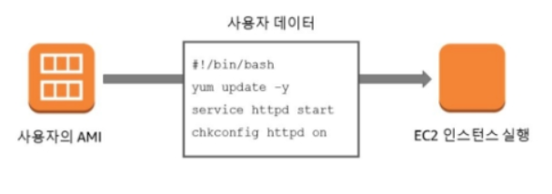
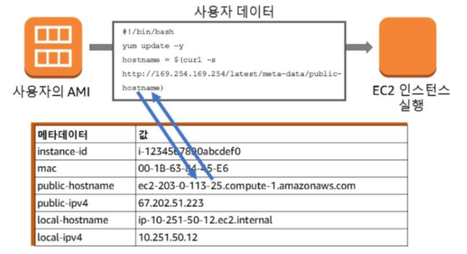
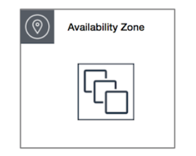
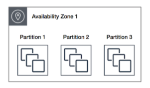
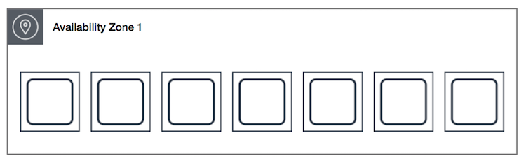
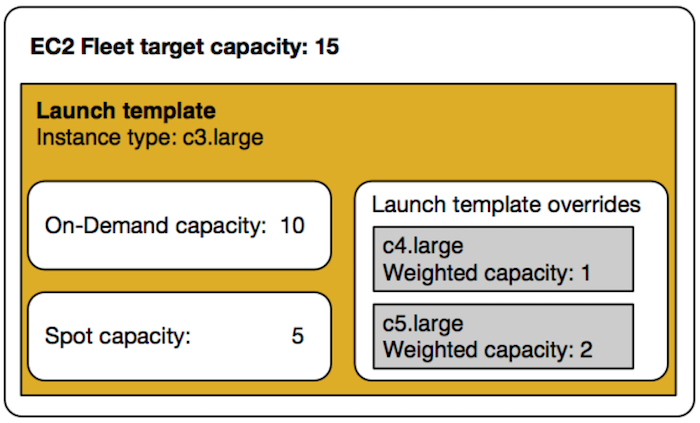
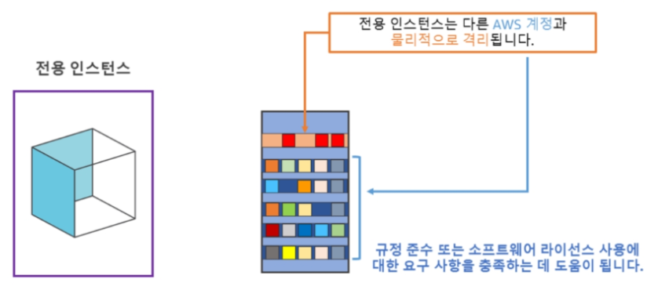

# EC2
* Elastic Computing Cloud
* AWS에서 제공하는 크기 조정이 가능한 컴퓨팅 서비스
* 400Gbps Ethernet Networking
</br>

---
## Instance Types
* 인스턴스 유형은 CPU, Memory, Storage, Networking 용량의 다양한 조합으로 구성된다.
* 애플리케이션에 따라 적합한 리소스 조합을 선택할 수 있는 유연성을 제공한다.
</br>

### __유형__
1. __범용(기본)__ - __균형 있는__ 컴퓨팅, 메모리 및 네트워킹 리소스를 제공. 다양한 워크로드에 사용할 수 있다 (T-Series)
2. __컴퓨팅 최적화__ - 고성능 프로세서를 황용하는 컴퓨팅 집약적인 애플리케이션에 적합. 배치 처리 워크로드, 미디어 트랜스코딩, 고성능 웹서버, HPC(고성능 컴퓨팅), 과학적 모델링, 전용 게임 서버 및 광고 서버 엔진, 기계 학습 추론 등 (C-Series)
3. __가속화된 컴퓨팅__ - 하드웨어 액셀러레이터 또는 코프로세서를 사용하여 부동 소수점 수 계산이나 그래픽 처리, 데이터 패턴 일치 등의 고성능 GPU 기반 인스턴스 (P-Series)
4. __스토리지 최적화__ - 메우 큰 데이터 세트에 대해 많은 순차적 읽기 및 쓰기 액세스를 요구하는 워크로드. 수만 단위의 IOPS를 지원
</br>

### __Resource 선정 방법__
* tpmC -> ECU로 변환
* Cloud는 종량 과금제이기 때문에, 기존 On-premise 만큼의 tpmC 값이 필요하지 않다.
* http://itworkroom.blogspot.com/p/blog-page_7.html
</br>
</br>

---
## Network Interface
Instance가 네트워크 통신을 할 수 있게 도와주는 디바이스이다. Network interface는 다음과 같은 특성을 가지고 있다.
* 실행 중 상태(핫 연결), 중지 상태(웜 연결) 또는 시작 중 상태(콜드 연결)의 인터페이스에 네트워크 인터페이스를 연결할 수 있다.
* 기본 네트워크 인터페이스는 분리할 수 없다.
* 동일한 가용 영역과 VPC에 있지만 서로 다른 서브넷에 있는 경우 네트워크 인터페이스를 한 인스턴스에서 다른 인스턴스로 이동할 수 있다.
* 동일한 서브넷에서 2개 이상의 네트워크 인터페이스를 인스턴스에 연결하면 비대칭 라우팅과 같은 네트워킹 문제가 발생할 수 있습니다. 가능한 한 기본 네트워크 인터페이스에서 보조 프라이빗 IPv4 주소를 대신 사용하는 것이 좋다!!
> Amazon에서 제공하는 이미지가 아니면 OS 상의 설정이 자동으로 되지 않을 수 도 있어 수동 설정이 필요할 수 있다.
</br>

### Scenario
1. Public과 Private Traffic 모두 처리가 필요한 경우
    * 각 Traffic을 서로 다른 네트워크 인터페이스로 처리
    * eth0 == Primary network interface, Public Subnet
    * eth1 == Secondary network interface, Private Subnet
2. 네트워크 및 보안 어플라이언스 사용
    * 1번과 비슷한 상황이다. 서로 다른
    * 


---
## AMI
* Amazon Machine Image
* AMI에는 다음이 포함된다.
    1) __Root Volume Template__: 일반적으로 OS 및 OS에 설치된 모든 구성 요소(애플리케이션, 라이브러리, 유틸리티 등)
    2) __시작 권한__
    3) __Block Device Maaping__: 연결할 볼륨을 지정한다.
* AMI 구축 방법
    1) 사전 구축: AWS에서 미리 생성해 놓은 AMI
    2) 자체 생성: 직접 AMI를 생성할 수 있다.
    3) Marketplace: 다른 사람들이 만든 AMI를 구입
    4) 커뮤티니 AMI: 비공식 커뮤니티로 AWS가 점검하지 않으며 사용자가 그 사용에 따른 위험을 부담하게 된다.

### __AMI 저장__
* AMI는 Amazon S3에 저장된다.
</br>
</br>


---
## User Data & Meta Data
## 1. User Data

* __Instance User Data__
* 인스턴스를 Running할 때, 한 번 실행하는 Shell script.
* 네트워크 액세스가 가능하기 전에 Root 또는 관리자 권한으로 실행된다.
</br>

## 2. Meta Data

* Instance 속성 정보.
* Instance의 Public IP, Host Name, MAC Address 등의 정보를 저장하고 있다.
* http://192.168.0.1/latest/meta-dta/[특정 데이터]를 이용하여 정보를 가져올 수 있다.
    * ```TOKEN=`curl -X PUT "http://169.254.169.254/latest/api/token" -H "X-aws-ec2-metadata-token-ttl-seconds: 21600"` && curl -H "X-aws-ec2-metadata-token: $TOKEN" -v http://169.254.169.254/latest/meta-data/```
    * Instance Meta Data Configuration: https://docs.aws.amazon.com/ko_kr/AWSEC2/latest/UserGuide/configuring-instance-metadata-service.html
    * How to search Meta Data: https://docs.aws.amazon.com/ko_kr/AWSEC2/latest/UserGuide/instancedata-data-retrieval.html
* __Tag 형태로 Metat Data를 지정할 수 있다. 지정을 해야 관리하기 편하기 때문에 사용하는 것이 권장사항이다.__
    * Instance 생성할 때, 태그 추가
</br>

## 3. Cloud-init
* https://cloudinit.readthedocs.io/en/latest/index.html
* 클라우드 인스턴스 초기화를 위한 업계 표준 다중 배포 방법
* Cloud-init은 부팅하는 동안 실행중인 클라우드를 식별하고, 클라우드에서 제공된 Meta data를 읽고 그에 따라 시스템을 초기화한다.
</br>
</br>


## 배치 그룹 (Placement Group)
1. __클러스터 배치 그룹 (Cluster Placement Group)__
    
    * 하나의 데이터 센터 안에 물리적으로 가깝게 인스턴스 생성
    * 짧은 지연 시간과 가장 높은 초당 패킷 네트워크 성능을 제공
2. __파티션 배치 그룹 (Partition Placement Group)__
    
    * EC2는 각 그룹을 파티션이라고 하는 논리 세그먼트로 나눈다.
    * 각 파티션은 동일한 랙을 공유하지 않아서, 하드웨어 장애의 영향을 격리시킬 수 있다.
    * 가용 영역당 파티션을 최대 7개까지 가질 수 있다. 인스턴스 숫자는 계정 제한의 적용을 받는다.
3. __분산형 배치 그룹 (Spread Placement Group)__
    
    * 의도적으로 다른 하드웨어에 배치되는 인스턴스 그룹
    * 인스턴스가 하드웨어를 공유할 경우 발생할 수 있는 동시 장애의 위험을 줄여준다.
    * 여러 가용 영역을 포괄할 수 있으며, 그룹별로 가용 영역 당 최대 7개의 인스턴스 가능
    * 서로 분리되어야 하는 소수의 크리티컬 인스턴스
</br>
</br>


## EC2 Fleet

* EC2 Fleet에는 Instance Fleet을 시작하기 위한 구성 정보가 있다.
* EC2 Fleet은 On-demand 및 Spot Insatnce로 구성된 Group이다.
* 작업 과정
    1) On-demand 및 Spot의 용량 목표 및 시간당 지불하려는 최대 금액 정의
    2) 기본으로 설정한 인스턴스 유형으로 
    3) 플릿은 요청에 포함된 구성을 기반으로 스팟 용량 풀을 선택하여 스팟 인스턴스를 가지고온다.
    4) 
</br>


## Spot Instance
* Spot Instance에 대한 개념
    * 스팟 용량 풀: 인스턴스 유형(예: m5.large)과 가용 영역이 동일한 미사용 EC2 인스턴스의 집합.
    * 스팟 가격: 스팟 인스턴스의 시간당 현재 가격
    * 스팟 인스턴스 요청: 요청 시 지불하고자하는 시간당 최고 가격(입찰가)를 제공한다. 입찰가를 지불하지 않는 경우, 기본 입찰가는 온디맨드 가격이다. 요청에 대한 시간당 입찰가가 스팟 가격을 초과할 경우, 요청이 이행된다.
    * 인스턴스 리밸런싱 권고: 스팟 인스턴스의 중단 위험이 높아지고 있음을 알리고, 새로운 스팟 인스턴스로 사전에 리밸런싱할 수 있게 해준다.
    * 스팟 인스턴스 중단: 용량이 더 이상 제공되지 않거나, 스팟 가격이 요청의 최고가를 초과하는 경우 종료.
    * 스팟 플릿: 스팟 인스턴스 모음
    * 스팟 플릿 유형:
        1) Load balancing workloads: 모든 AZ에서 동일한 사이즈의 인스턴스 사용. 웹 서비스
        2) Flexible workloads: 모든 AZ에서 모든 사이즈의 인스턴스 사용. 배치 및 CI/CD 작업
        3) Big data workloads: 단일 AZ에서 모든 사이즈의 인스턴스 사용. MapReduce 작업

### 할당 전략
1. __lowest-price__
    * Spot Instance는 최저 가격의 Spot capacity pool에서 제공
    * 짧은 시간 동안 실행될 경우의 워크로드
2. __capacity-optimized__
    * 시작하는 인스턴스의 수에 대한 용량이 최적화된 Spot capacity pool에서 제공. 즉, 실시간 용량 데이터를 기준으로 가장 가용성이 높은 pool에서 제공
    * 중단 비용이 높은 워크로드를 실행하는 경우 사용. 즉, 중단이 최대한 없어야 할 워크로드
</br>
</br>


## 종료 방식: stop vs terminate
* stop: 인스턴스를 중지하면 바로 종료된다.
* terminate: 인스턴스를 중지해도 종료되지 않는다. 중지 후에 종료해야 된다.
</br>
</br>


## Pricing
* EC2 사용량은 초 단위로 청구되며 __최소 청구 시간은 60초이다__.
* __Running__ 중에만 과금이 발생. Stop 상태에서는 과금이 되지 않는다.

### __Instance 구매 방법__
1. __On-Demand Instance__
    * 시간당 비용 지불. 장기 약정이나 선결제 금액은 필요 없다.
    * 사용하는 경우
        1) 처음으로 개발 또는 시험 중인 애플리케이션
        2) 단기의 갑작스럽거나 예측할 수 없는 워크로드가 있으며, 중단되어서는 안 되는 애플리케이션
2. __스팟 인스턴스__
    * 입찰하여 사용, 온디맨드보다 최대 90% 저렴한 금액으로 구입 가능.
    * 스팟 인스턴스 용량의 장기적인 공급 수요 추세에 따라 점진적으로 조정된다. 시장 가격이 변동하여 고객의 최대 입찰가를 초과하는 경우, 컴퓨팅 리소스를 잃게 된다(바로 꺼짐). __대신 옵션으로 Spot block을 1~6시간 동안은 지속할 수 있는 스팟 인스턴스를 시작하도록 설정 가능하다.__
    * 사용하는 경우
        1) 시작 및 종료 시간이 자유로운 애플리케이션
        2) __대량의 서버 용량 추가로 긴급히 컴퓨팅 파워가 필요한 경우__
        3) CI/CD, 테스트 및 개발 워크 등
3. __예약 인스턴스(Reserved Instance)__
    * 1년 또는 3년 기간에 대해 약정을 걸고, 특정 인스턴스 패밀리, 테넌시 등 대해 할인된 요금을 받는다.
    * 옵션
        1) __스탠다드 RI__: EC2 Saving Plans, Region 내의 특정 인스턴스 패밀리에 적용되며 가장 큰 하린 혜택 제공(최대 72%)
        2) __컨버터블 RI__: Computing Saving Plans, RI의 인스턴스 패밀리, OS 등의 속성 변경이 가능 (최대 66%)
        3) __예정된 IR__: 예약한 시간 범위 내에서 인스턴스를 시작.
4. __Saving Plans__ 
    * 1년 또는 3년 기간의 일정 사용량 약정(시간당 요금을 기준으로 측정)을 조건으로 EC2 및 Fargate 사용량에 대해 저렴한 요금을 제공
5. __전용 인스턴스__
    
    * Single Tenant 하드웨어에서 실행.
    * 다른 사람들이랑 하드웨어를 같이 쓰지 않는다(물리적으로 격리)
6. __전용 호스트__
    * 고객 전용의 특정 EC2 인스턴스 용량을 갖춘 특정 물리적 서버.
    * 사용하는 Software가 Hardware를 타는 경우
    
    | 옵션 | 설명 |
    |------|-----|
    | 전용 인스턴스 | 비 특정 하드웨어에서 실행 |
    | 전용 호스트 | 고객이 선택한 특정 하드웨어에서 실행되어 고객이 보다 세밀하게 제어할 수 있다. |


### __비용 최적화__
* __최적화에 사용되는 서비스__
    * __AWS Saving Plans__
    * __Amazon EC2 Spot__ : AutoSCaling, 순간적으로 Resource가 필요한 경우 등에는 Spot Instance 사용
    * __Auto Scaling__ : Auto Scaling을 이용해 평상시는 필요한만큼만 작동하도록 구성
    * __EC2 Instance Discovery__ : 워크로드를 시작하기 전에 컴퓨팅 환경의 규모를 조정
    * __AWS Compute Optimizer__ : AWS 리소스의 구성 및 사용률 지표를 분석하는 서비스.
    * __AWS Cost Exploerer__ : 비용 탐색기를 이용하여 활용도가 낮은 리소스를 제거한다.
</br>


### Reference
* Amazon Web Service Docs