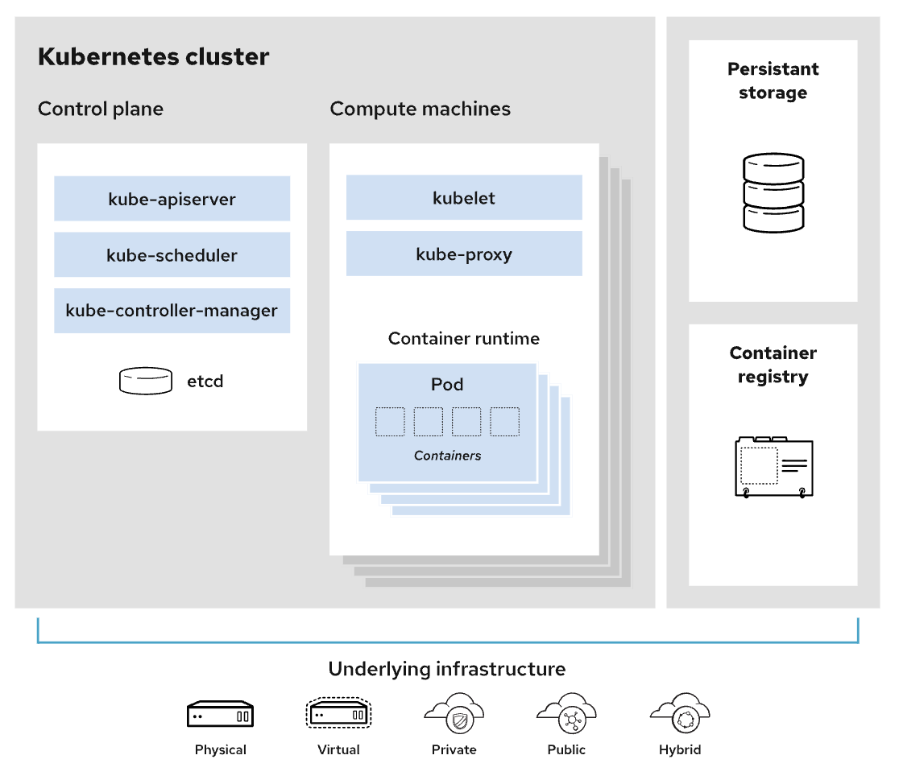

# EKS
* Amazon Elastic Kubernetes Service
* Kubernetes는 컨테이너화된 Application의 배포, 확장, 관리를 자동화하기 위한 오픈 소스 시스템이다.
* 컨트롤 플레인은 2개 이상의 API 서버 인스턴스와 AWS 리전 내 3개의 가용 영역에서 실행되는 3개의 etcd 인스턴스로 구성

### 개념
* Node
    - 쿠버네티스 클러스터를 구성하는 최소 단위로, 최소 1개 이상의 컴퓨팅 노드가 필요
* Pod
    - Application이 동작하는 컨테이너
    - Pod는 Cluster에 의해 관리되어지며, 설정에 따라 해당하는 Node에 추가된다 
* 

---
## EKS 구성 요소

k8s는 구성 요소는 크게 Control plane(Master Node), Compute machines(Woker Node), Persistant storage, Container로 구성된다.

## Control plane (Master Node)
클러스터를 제어하는 쿠버네티스 구성 요소와 클러스터의 상태 및 구성에 관한 데이터를 가지고 있다.
* kubectl
    - 쿠버네티스 클러스터에 명령을 내리는 역할
    - Kubernetes에 명령을 내리기 위한 Binary
    - Command Line Interface (CLI)
* kube-apiserver
    - API Server
    - 외부 및 내부 요청(API)을 처리하는 통로
    - Etcd와 유일하게 통신
* kube-conroller-manager
    - Controller Manager
    - 여러 개의 컨트롤러 기능이 하나로 통합되어 있디
    - 계정 및 API 액세스 토큰 생성을 위한 컨트롤러
    - 스케줄러를 참고하여 Pod에 명령 수행을 위한 컨트롤러
* kube-scheduler
    - Scheduler
    - CPU, Memory 등 리소스 상태를 확인하여 적절한 컴퓨팅 Node를 예약
* etcd
    - 구성 요소의 상태 값을 모두 저장

 

## Compute macnin (Worker Node)
Application Pod들이 동작하는 Node 
* kubelet
  - Controller Plane과 통신하는 역할
  - Controller Plane에서 요청하면 Kubelet에서 노드 작업을 수행한다.
* kube-proxy
    - 쿠버네티스 네트워킹 서비스를 용이하게 하기 위한 네트워크 프록시
    - 운영 체제의 패킷 필터링 계층에 의존하거나 트래픽 자체를 전달하여 클러스터 내부 또는 외부의 네트워크 통신을 처리
* Container Runtime Engine
    - 컨테이너 실행을 위해 각 Computing Node에는 런타임 엔진이 있다 (ex> Docker)

---
## Networking
https://kimkoungho.github.io/devops/kubernates_architecture/
https://www.redhat.com/ko/topics/containers/kubernetes-architecture

