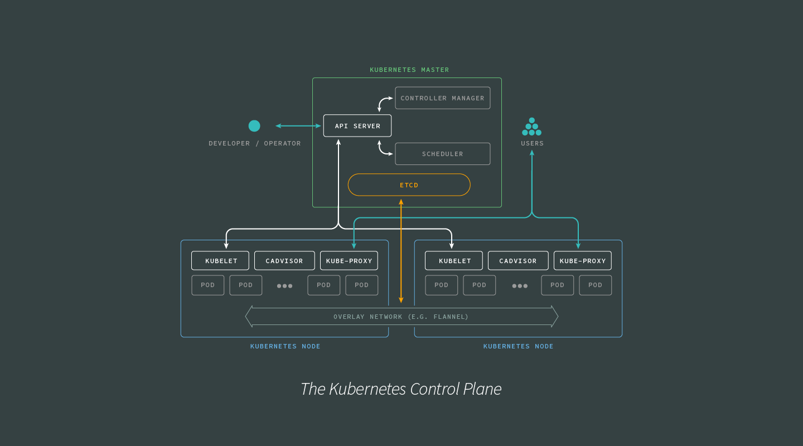
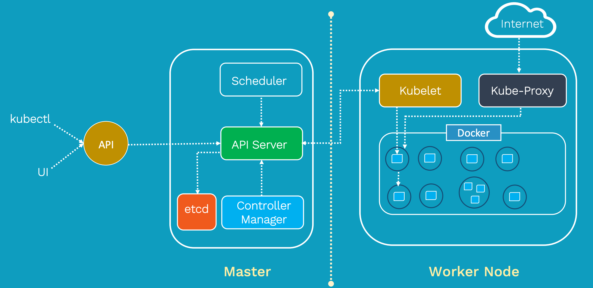

# EKS
* Amazon Elastic Kubernetes Service
* Kubernetes는 컨테이너화된 Application의 배포, 확장, 관리를 자동화하기 위한 오픈 소스 시스템이다.
* 컨트롤 플레인은 2개 이상의 API 서버 인스턴스와 AWS 리전 내 3개의 가용 영역에서 실행되는 3개의 etcd 인스턴스로 구성

### 개념
* State Check
    - Kubernetes는 원하는 상태(desired state)를 선언(declarative)하면 현재 상태(current state)와 비교하여 원하는 상태를 유지하려한다.
    - 상태를 유지하기 위해 Kubernetes는 계속해서 상태를 관찰한다(Observing)
    > k8s는 상태를 선연하다보니 명령어도 run이 아닌 create를 사용한다
* Object
    - k8s는 상태를 관리하기 위해 대상을 Object로 정의한다.
    - Pod Object : Pod 정보 - Container/CNI/CSI
    - Service : 서비스 네트워크에 관련된 정보 - Load balancer
    - ReplicaSet : Pod를 여러개 복제하여 관리하기 위한 정보 - 복제 개수/Selector label/Pod Template
    - Volume Object : 볼륨 정보 - 호스트 디렉토리/EBS 볼륨 등
* Node
    - 쿠버네티스 클러스터를 구성하는 최소 단위로, 최소 1개 이상의 컴퓨팅 노드가 필요
* Pod
    - Application이 동작하는 컨테이너
    - Pod는 Cluster에 의해 관리되어지며, 설정에 따라 해당하는 Node에 추가된다 
> 원하는 상태에 대하여 명세서(yaml file)를 작성한다. 명세서에는 Object에 대한 정보들이 정의되어 있고 이를 Label로 관리

---
## EKS 구성 요소

k8s는 구성 요소는 크게 Control plane(Master Node), Compute machines(Woker Node), Persistant storage, Container로 구성된다.

### Architecutre

 

 

## Control plane (Master Node)
클러스터를 제어하는 쿠버네티스 구성 요소와 클러스터의 상태 및 구성에 관한 데이터를 가지고 있다.
* etcd만이 Stateful Modeul이면 나머지는 Stateless Module이다(Statefule은 이전 트랜잭션에 따라 현재 트랜잭션이 영향을 받는 Application을 의미한다.
1. kubectl
    - 쿠버네티스 클러스터에 명령을 내리는 역할
    - Kubernetes에 명령을 내리기 위한 Binary
    - Command Line Interface (CLI)
2. kube-apiserver
    - API Server
    - 외부 및 내부 요청(API)을 처리하는 통로
    - 인증, 권한 부여, 액세스 제어 등 제공
    - Etcd와 유일하게 통신
3. etcd
    - SSOT (Single Source of Truth) 역할을 하는 CoreOS의 Opensource 분산 키-값 데이터베이스
    - 구성 요소의 상태 값을 모두 저장
        - ReplicaSet Object
        - Pod Object
4. kube-conroller-manager
    - Controller Manager, Cluster 기능을 수행
    - 거의 모든 Object의 샅래를 관리
    - Pod들을 관리하고, 스케줄러를 참고하여 Auto Scaling, Rolling Update 등을 수행하기 위해 kubelet에 전달
    - 
    - 여러 개의 컨트롤러 기능이 하나로 통합되어 있다
        1) 계정 및 API 액세스 토큰 생성을 위한 컨트롤러
        2) Deployment Controller
            * ReplicaSet을 생성
        3) ReplicaSet Controller
            * ReplicaSet 감시하고, 정의된 Label Selector 조건 체크 
            * 체크한 내용에 따라 필요시 Scheduler 쪽에 Pod 생성 요청
5. kube-scheduler
    - Scheduler
    - CPU, Memory 등 리소스 상태를 확인하여 Pod를 적절한 컴퓨팅 Node를 예약
 

## Compute machine (Worker Node)
Application Pod들이 동작하는 Node 
* kubelet
    * Controller Plane과 통신을 하는 Agent로 모든 Worker Node에 존재
    - Controller Plane에서 요청하면 Kubelet에서 노드에 대한 작업을 수행
    - CSI(Storage Interface), CNI(Network Interface) 관리
* kube-proxy                           
    - 쿠버네티스 네트워킹 서비스를 용이하게 하기 위한 네트워크 프록시
    - Pod의 외부 통신을 위한 프로시
    - 운영 체제의 패킷 필터링 계층에 의존하거나 트래픽 자체를 전달하여 클러스터 내부 또는 외부의 네트워크 통신을 처리
* Container Runtime Engine
    - 컨테이너 실행을 위해 각 Computing Node에는 런타임 엔진이 있다 (ex> Docker)

## Pod
* Namespace & Label
    - 하나의 Cluster 안에 여러 개의 Application이 등록되기 때문에 Namespace를 사용하여 논리적으로 구분한다.
    - 더 세부적인 설정은 Label을 통해서 관리할 수 있다. 

## ETC
Kubernetes를 잘 활용하기 위해 필요한 기술들은 다음과 같다.
* Registry
* Helm
* Prometheus
* Grafana

---
## Networking
https://kimkoungho.github.io/devops/kubernates_architecture/
https://www.redhat.com/ko/topics/containers/kubernetes-architecture
https://kimkoungho.github.io/devops/kubernates_architecture/
https://subicura.com/2019/05/19/kubernetes-basic-1.html

## Loging
Fluentd 사용

---
## Management

## Deploy
* Deployment : 무중단 배포를 위해 사용
* StatefulSets : 
* DaemonSet : 로그나 모니터링 등 모든 노드에 설치가 필요한 경우
* CronJob : 배치 작업

