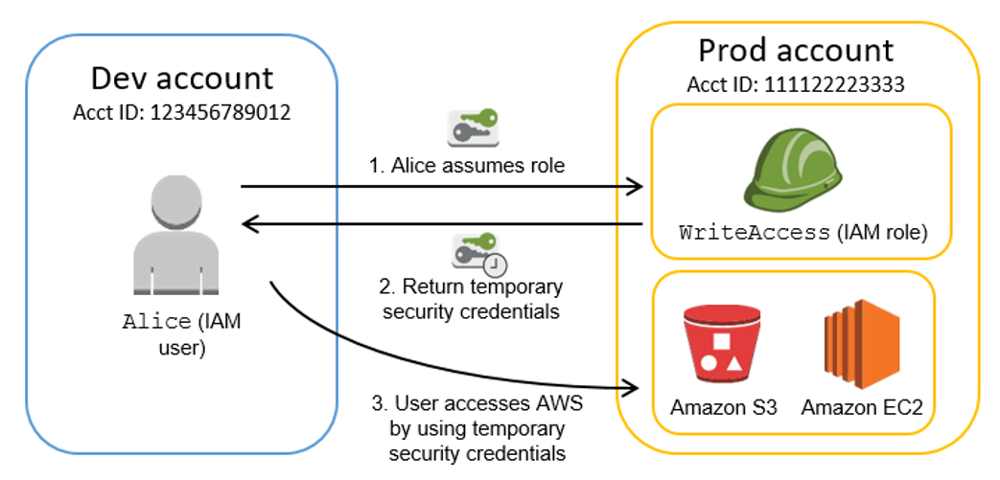

# AWS IAM
* Amazon Identity and Access Management
* Global Service
* AWS 자격 증명 관리 시스템으로 AWS Resource에 대한 액세스를 제어할 수 있게 해주는 서비스이다.
* 기능
    1) User 생성
    2) 사용자 개별 보안 자격 증명 할당
    3) AWS 서비스 및 리소스에 대한 액세스를 제공할 수 있도록 임시 보안 자격 증명 할당


## AWS Account Root User
* 해당 계정은 모든 AWS 서비스 및 리소스에 대한 전체 액세스 권한을 갖는다. 즉, 제한을 받지 않는다.
* 계정 생성 시, 이메일 및 암호가 해당 계정에 해당한다. 또는 계정 ID 12자리도 이에 해당한다.
* 직접 사용하는 것은 권장 사항이 아니기 때문에 유저를 만들어서 사용하는 것이 좋다.


## IAM 보안 주체
* 보안 주체란 AWS Resource에 대해 작업을 수행할 수 있는 Entity이다.

### __1. Users__
* 별도의 AWSS 계정이 아니라 계정 내 사용자이다.
* 각 사용자는 고유의 암호를 가진다
    * __AWS ACCESS KEY ID__
    * __AWS SECRET ACCESS KEY__

* __User 생성__
    1) User name 입력
    2) AWS 액세스 유형 선택
        * __Programming 방식 액세스__: AWS API, CLI, SDK 및 기타 개발 도구에 대해 액세스 키 ID, Secret 액세스 키를 활성화
        * __AWS Management Console 액세스__: Console을 통해 로그인 할 수 있도록 허용하는 비밀번호를 활성화. 
        * 2가지 방식 모두 액세스하게 설정
        * 콘솔 비밀번호를 설정하고, 비밀번호 재설정 필요는 체크해제

### __2. Groups__
* IAM User들의 집합
* Group에 권한을 주게되면, 해당 Group에 User들은 해당 권한을 부여받게 된다.
* 한 번에 여러 사용자에게 정책을 연결하는 방법이다.
* 

### __3. Federated Users__
* 자격 증명 공급자(IdP)가 제공한 자격 증명을 사용하여 로그인한다.
* AWS는 해당 IdP에 역할과 연결된 임시 자격 증명을 제공한다.

### __4. Role__
* 역할을 사용하면 다른 계정 또는 리소스에 액세스하기 위한 권한 집합을 정의할 수 있다.
* 역할을 이용하여 외부 인증 사용자 또는 타사에게 액세스를 제공할 수 있다.

__1. 역할을 생성 시, 두개의 정책을 지정한다.__
    1) __신뢰 정책__: 누가 역할을 맡도록 허용되는지 지정 (Entity)
        * AWS 서비스
        * 다른 AWS 계정 or IAM User
        * 웹 ID
        * SAML
    2) __액세스 정책__: Entity가 사용하도록 허용된 리소스 및 작업을 정의 (Policy 부여)

__2. 역할 위임__
    * 역할은 Console, CLI, AssumeRole API 호출, AWS Security Token Service(AWS STS)를 사용하여 위임할 수 있다.
    * AssumeRole 작업은 액세스 키 ID, Access 액세스 키 및 보안 토큰으로 구성된 임시 자격 증명 세트를 반환한다. 그리고 교차 계정 액세스 또는 자격 증명 연동에 사용된다.
    * AWS Security Token Service(AWS STS)는 Credential이 없고, 사용자에게 제한적인 임시 권한을 제공하는 웹 서비스이다. 자격 증명을 받을 때 안에 해당 정책이 이미 들어있다.

__3. STS 자격 증명 브로커 프로세스__
    * 

__4. SAML (Security Assertion Markup Language)__
    * 

</br>
</br>


## Access Type
1. Access Key
    * 
    * 
2. Password
    * base-64로 인코딩된 PGP 공개 키 사용
    * PGP 공개 키 생성 방법은 https://docs.github.com/en/authentication/managing-commit-signature-verification/generating-a-new-gpg-key 참조
</br>
</br>


## Policies
```
{
  "Version": "2012-10-17",
  "Statement": [
    {
      "Sid": "FirstStatement",
      "Effect": "Allow",
      "Action": ["iam:ChangePassword"],
      "Resource": "*"
    },
    {
      "Sid": "SecondStatement",
      "Effect": "Allow",
      "Action": "s3:ListAllMyBuckets",
      "Resource": "*"
    },
    {
      "Sid": "ThirdStatement",
      "Effect": "Allow",
      "Action": [
        "s3:List*",
        "s3:Get*"
      ],
      "Resource": [
        "arn:aws:s3:::confidential-data",
        "arn:aws:s3:::confidential-data/*"
      ],
      "Condition": {"Bool": {"aws:MultiFactorAuthPresent": "true"}}
    }
  ]
}

## Principal 사용
{
  "Version": "2012-10-17",
  "Statement": [{
    "Sid": "1",
    "Effect": "Allow",
    "Principal": {"AWS": ["arn:aws:iam::ACCOUNT-ID-WITHOUT-HYPHENS:root"]},
    "Action": "s3:*",
    "Resource": [
      "arn:aws:s3:::mybucket",
      "arn:aws:s3:::mybucket/*"
    ]
  }]
}
```
* (__"Principal"__ 이) __"Resource"__를 대상으로 __"Action"__ 을 수행하도록  __"Effect"__ 한다.
* ```Version``` : 해당 정책 언어에 대한 Version을 의미 (현재는 ```2012-10-17```).
* ```Statement``` : 정책의 요소들을 컨테이너화한다(그룹화). 정책에는 1개 이상의 Statement를 추가할 수 있다.
* ```Sid``` : ```Statement```를 구분하는 ID
* ```Effect``` : ```Action``` 정책을 허용할지 거부할지 정한다.
* ```Principal``` : __리소스 기반 정책을 생성하는 경우에만 액세스에 대한 계정, 사용자, 역할 등을 설정해야한다.__ 사용자 또는 역할에 연결할 IAM 권한 정책을 생성하는 경우 이 요소를 포함할 수 없다. 다른 계정에서 접속할 때나 서비스에 권한 부여시에 사용된다.
* ```Action``` : 정책 작업 목록
    * Access Level
        1) 목록(List)
        2) 읽기(Read)
        3) 쓰기(Write)
        4) 권한 관리(Manage Permission
* ```NotAction``` : 해당 Action은 제외 (Action과 같이 사용 불가)
* ```Resource``` : __IAM 권한 정책을 생성하는 경우 작업을 적용할 리소스 목록을 지정.__ 리소스 기반 정책을 생성하는 경우에는 선택사항이다.
* ```Condition``` : 정책이 권한을 부여하는 조건을 지정
* 요약: 대상(Principal)에게 해당 요소(Resource)에 대해 특정 행동(Action)을 조건(Condition)에 따라 허가/불허(Effect)한다
> "Princinpal"은 리소스 기반에서, 보안 주체를 지정한다.
</br>


### Policy Type
1. __AWS 관리형 정책__
    * AWS에서 생성 및 관리하는 독립적인 정책.
2. __고객 관리형 정책__
    * 사용자 자신의 AWS 계정에서 관리하는 독립적인 정책.
3. __인라인 정책__
    * 단일 사용자, 그룹, 역할에 직접 추가하는 정책.
    * 정책과 자격 증명이 1:1 관계를 유지할 때 사용.
</br>
</br>


## STS & Assume Role

* __Assume Role__: STS로 부터 역할에 대한 임시 보안 자격 증명을 얻기 위해서는 해당 역할에 대해 AssumeRole 권한이 있어야 한다.
* __STS (AWS Security Token Service)__: 임시 보안 자격 증명을 생성해준다.
* __자격 증명 위임 과정__
    1) 사용자, 리소스 등이 AssumeRole 권한을 통해 STS에게 임시 보안 자격 증명을 요청
    2) STS에서 해당 사용자에게 임시 보안 자격 증명을 반환
    3) 사용자는 임시 보안 자격 증명을 통해 리소스에 접근
* Example
    ```
    {
    	"Version": "2012-10-17",
    	"Statement": [
    		{
    			"Effect": "Allow",
    			"Action": "sts:AssumeRole",
    			"Resource": "arn:aws:iam::Trusted_Account_ID:role/CVAppAssumeRole"
    		}
    	]
    }
    # => Rescoure에게 역할 권한 위임을 할 수 있는 정책을 허용한다.

    #########################################################
    
    {
      "Version": "2012-10-17",
      "Statement": [
        {
          "Effect": "Allow",
          "Principal": {
            "Service": [
              "ec2.amazonaws.com",
              "rds.amazonaws.com"
            ]
          },
          "Action": "sts:AssumeRole"
        }
      ]
    }
    # => Principal에게 역할 권한 위임할 수 있다. 리소스 기반에서 사용된다.
    ```
    * "arn:aws:iam::Trusted_Account_ID:role/CVAppAssumeRole"의 실제 예시는 다음과 같다(```arn:aws:iam::123456789022:role/dev-role```)
</br>
</br>


## IAM 생성 과정
1. STS Policy 생성 (Resource 기반 또는 특수한 경우에만 해당)
   * 누가(Principal or Resource) 해당 Role을 사용하도록 허락할지 정한다.
2. Policy 생성
   * 해당 Role이 사용할 수 있는 권한을 정한다.
3. Role 생성
   * STS 및 Policy 적용한다.
</br>
</br>


## IAM 및 AWS STS 할당량
* https://docs.aws.amazon.com/ko_kr/IAM/latest/UserGuide/reference_iam-quotas.html
* 기본 할당량이 있으며, 할당량 증가를 요청할 수 있다.
* 
| 리소스                                 | 기본 할당량 | 최대 할당량 |
| -------------------------------------- | ----------- | ----------- |
| 역할 신뢰 정책 길이                    | 2048자      | 4096자      |
| AWS 계정 내 고객 관리형 정책           | 1500        | 5000        |
| AWS 계정 내 그룹                       | 300         | 500         |
| AWS 계정 내 역할                       | 1000        | 5000        |
| IAM 역할에 연결된 관리형 정책          | 10          | 20          |
| IAM 사용자에 연결된 관리형 정책        | 10          | 20          |
| AWS 계정 내 인스턴스 프로파일          | 1000        | 5000        |
| 하나의 AWS 계정에 저장되는 서버 인증서 | 20          | 1000        |

## Cost (비용)
* 추가 비용 없이 사용할 수 있다.
</br>
</br>
</br>


# AWS CloudTrail
* AWS IAM 및 AWS STS API에 대한 모든 인증된 API 요청을 기록한다.
</br>
</br>
</br>


# AWS Organizations
* AWS 리소스가 늘어나고 확장됨에 따라 환경을 중앙 집중식으로 관리하고 규제하는 서비스
* 기능
    1) 새 AWS 계정 생성 및 리소스 할당
    2) 계정 그룹화 및 정책 적용
    3) 계정에 대핸 단일 결제 방법 사용


## Cost (비용)
* 추가 비용 없이 사용할 수 있다.


## IAM

### KMS에 대한 권한
* __kms:CreateGrant__
* __kms:Decrypt__
* __kms:DescribeKey__
* __kms:GenerateDataKeyWithoutPlainText__
* __kms:ReEncrypt__