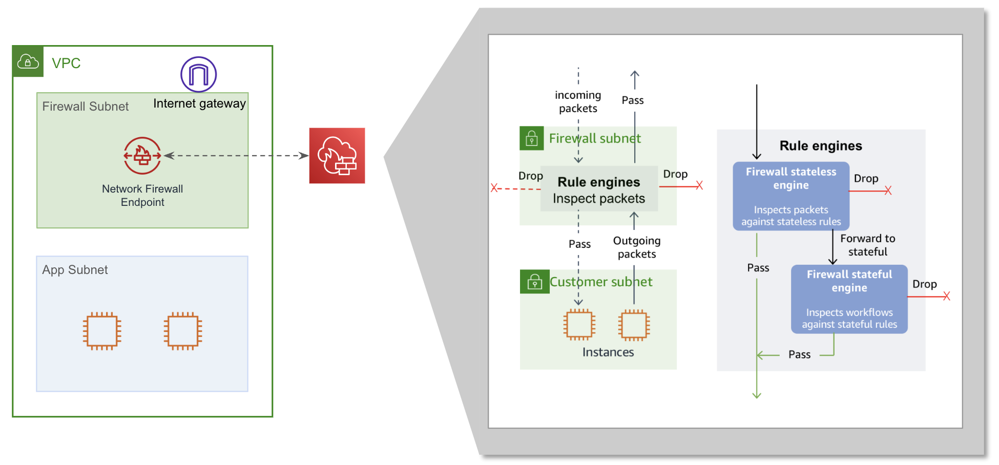

# Network Firewall
VPC 경계를 기준으로 Network Traffic을 Filterfing을 하는 서비스로 상태 저장도 가능하며 
* 주의 사항
    - Firewall Endpoint와 동일한 Subnet에서 실행되는 Application은 보호할 수 없다!! 독점적인 Firewall Subnet이 필요
    - Rule, Policy는 갯수 제약이 있으므로 확인 필요
    - Stateless 규칙이 먼저 적용되며, 그 후에 Stateful 규칙이 적용되므로 순서 확인 필요

---
## 구성요소
* VPC : Firewall이 보호를 제공하는 VPC
* Subnet : Firewall Endpoint에 사용될 서브넷. 각 가용 영역에 대해 최대 하나의 서브넷만 지정가능
	> 다른 서브넷의 라우팅은 해당 Endpoint로만 가도록 설정해야 되기 때문에, 같은 서브넷에 있는 Application은 필터링 적용이 안될 수 있다.
* Firewall Policy : Firewall과 연결된 방화벽 정책 (방화벽에 대한 보호 동작 및 모니터링을 제공)
    - Rule Group으로 정책들을 묶고, Rule Group을 Policy 적용한다.
* Routing : 모든 통신이 Firewall Endpoint로 통신하도록 라우팅
	- IGW/VGW Edge association
	- TGW Appliance Mode
* Logging : Firewall의 Stateful rule engine에 의해 로그가 제공 (로그 유형과 위치 등 지정)
* 그 외 옵션
	- TLS Inspection
	- 암호화 옵션


---
## Firewall Policy
구성 요소는 다음과 같다.
* Policy : Policy 정책
    ```
    # Policy
        * policy_variables
        * Stateless policy
            - Default : Stateless default actions
            - Others : Stateless rule groups
        * Stateful policy
            - Default : Stateful default actions
            - Others : Stateful rule groups
        * Stream exception policy (Set stateful engine options)


    ## Default (PaloAlto 기준)
        * Stateless policy
            - Default : aws:forward_to_sfe
            - Others : aws:forward_to_sfe
        * Stateful policy
            - Default : Stateful default actions
            - Others : Stateful rule groups
        * Stream exception policy (Set stateful engine options)
    ```
    - Stream exception policy : Network 연결이 midstream에서 끊어질 때 정책 설정 (외부 요인 등으로 인해)
    - Stateless rule groups : 상태 비저장 규칙 그룹. 우선 순위가 존재
    - Stateless default actions : 상태 비저장 기본 동작. Stateless rule group과 일치하지 않는 패킷을 처리하는 방법 설정. 기본적으로 다른 프로토콜의 패킷을 Drop 한다.
    - Stateful default actions : 상태 저장 기본 동작. Stateful rule group과 일치하지 않는 패킷을 처리하는 방법 설정.
    - Stateful rule groups : 상태 저장 규칙 그룹. 우선 순위 존재
    - Stateful engine options : 상태 저장 엔진 옵션 지정
* Customer-managed key (Optional) : Network Firewall 리소스에 대하여 암호화
* Policy variables (Optional) : Default value of Suricata HOME_NET. If your firewall is deployed using a centralized deployment model, you might want to override HOME_NET with the CIDRs of your home network. Otherwise, Network Firewall uses the CIDR of your inspection VPC.
* TLS inspection configuration (Optional) : TLS 검사 구성. Stateful rule에 따라 검사 시에 SSL/TLS 트래픽의 암호화 해독 및 재암호화를 활성화하는 설정
    > 단 추가 비용이 발생한다!!!
</br>


### Stateless action
* Fragmented packets
    - UDP 패킷에 대해 어떻게 처리할지 결정할 수 있다
* Evaluation order
    - 우선순위에 의해서 결정 / 이 값은 고유해야 하며 양의 정수 /
* Action
    - Pass : 모든 검사를 중단하고 패킷이 이동하도록 허용
    - Drop : 모든 검사를 중단하고 패킷을 차단
    - Forward to stateful rules : 상태 비저장 검사를 중단하고, 상태 저장 규칙 엔진으로 전달
    - 사용자 지정 작업 가능 (언제 사용하는거지??)
* Match rule
    - Protocol : ALL / TCP / UDP / 그 외 등등
    - Source IP
    - Source port range
    - Destination IP
    - Destination port range
    - Optional TCP flags 


### Stateful action
Suricata(Opensource) Stateful rule 엔진 6.0.9(23.11.05 현재 기준)을 지원한다. 그렇기 때문에 일부 기능을 제외하고 호환되어 사용되어 진다.

GRE(일반 라우팅 캡슐화)와 같은 터널링 프로토콜에 대한 내부 패킷 검사를 지원한다. 터널링된 트래픽을 차단하려는 경우 터널 계층 자체 또는 내부 패킷에 대한 규칙을 작성해야 한다.

* Rule type
    1) Standard rules : Protocol / Source IP / SourcePort / Destination IP / Destination Port
    2) Suricata compatible strings: 
    3) Domain list : Domain (HTTP/HTTPS Protocol 사용)
* Evaluation order
    - Top Level : StatefulRuleOptions 이라는 Rule을 기본적으로 최상위 우선 순위로 가지고 있다!!!
    - Strict order : 정의된 순서대로 결정
    - Action order : Suricata에서 정의한 Action 우선순위에 의해 결정
        > 동일한 조건인 경우 Pass > Drop > Reject > Alert 순으로 처리. 모든 Action을 확인해야 되므로 계속되는 평가가 필요!!
* Standard rules and Suricata compatible strings acion
    - Pass : 모든 검사를 중단하고 패킷이 이동하도록 허용
    - Drop
        - Drop all : 모든 검사를 중단하고 패킷을 차단
        - Drop established : 연결이 된 패킷에 대해서 차단(즉, 연결이 안되면 굳이 차단을 하지 않는다는 의미)
    - Reject : 모든 검사를 중단하고 패킷을 차단. 그리고 Reset Packet 전달
    - Alert : 모든 
        - Alert all : 모든 패킷에 대한 메시지를 기록
        - Alert established : 연걸이 된 패킷에 대해서 메시지를 기록
* Domain list
    - Allow : 모든 검사를 중단하고, 도메인 이름 목록에 지정된 프로토콜과 일치하는 모든 트래픽에 대하여 허용
    - Deny : 모든 검사를 중단하고, 도메인 이름 목록에 지정된 프로토콜과 일치하는 트래픽에 대하여 거부
</br>

### Stream exception policy
- Drop : 기본 값. 종료를 실패하면 후속 트래픽을 삭제한다.
- Continue : (잘모르겠습니다...???)
- Reject : 종료를 실패하면 후속 트래픽을 삭제한다. 그리고 Client 측에서 바로 알 수 있도록 Reject Packet을 보낸다.
</br>
</br>


---
## Logging
Firewall의 Stateful rule engine에 의해 로그가 제공 (로그 유형과 위치 등 지정)
> 상태 저장 규칙 엔진을 통과하는 네트워크 트래픽에 대한 흐름 로깅을 활성화할 수 있다. 그렇기 때문에 상태 비저장 규칙 작업 및 상태 비저장 기본 작업을 통해 상태 저장 엔진에 트래픽을 전달해야 상태 비저장 규칙에 대한 로그를 확인할 수 있다!
* 로그 유형
    1. Flow Log : 표준 네트워크 트래픽 흐름 로그
        - 특정 표준 상태 비저장 규칙 그룹에 대한 네트워크 흐름을 캡처????
    2. Alert Log : 경고를 보내는 작업이 있는 상태 저장 규칙과 일치하는 트래픽을 보고
        - 경고를 보내는 작업 : Drop, Alert, Reject
* 로깅 대상
    1. S3
    2. CloudWatch Logs
    3. Kinesis Data Firehose
* IAM 권한
    - 로깅 대상에 따른 IAM 권한이 필요

### CloudTrail 통합
* Network Firewall에서 활동이 발생하면 이벤트를 CloudTrail에 기록할 수 있다. 추적을 생성해야 한다!!! (많은 기록이 남으므로 비용이? 계산이 필요할거 같다)

---
## 방화벽 동작 

1. Firewall Endpoint로 트래픽 진입 (Incoming / Outcoming 트래픽)
2. Firewall Policy에 따라 필터링 작업
    1) Stateless rule에 대하여 필터링. 규칙 우선순위에 따라 규칙 그룹을 평가
    2) Stateless rule에 해당하는 조건이 없는 경우, Default stateless rule에 의해서 트래픽이 처리
    3) Stateful rule에 대한 필터링. 규칙 우선순위에 따라 규칙 그룹을 평가
    4) Stateful rule에 해당하는 조건이 없는 경우, Default stateless rule에 의해서 트래픽이 처리


* 경고 기능이 있는데 로깅을 구성해야 한다.
* Firewall Endpoint와 동일한 Subnet에서 실행되는 Application은 보호할 수 없다!! 독점적인 Firewall Subnet이 필요
* Stateless 규칙이 먼저 적용되며, 그 후에 Stateful 규칙이 적용되므로 순서 확인 필요

</br>
</br>

---

## 구축 과정
1. Create Rule Group
    - 관리형 그룹 지정
	1) Test 1:
		- Stateless rule group : incomming
		- Stateful rule group : incomming
	2) Test 2:
2. Create Firewall Policy

		- Stateless default action :
		- Stateful default action :
3. 		- 
4. Create Network Firewall
2.
3.
4.
5.

##
네트워크 방화벽은 방화벽 끝점당 최대 100Gbps의 네트워크 트래픽을 지원합니다.
더 많은 트래픽 대역폭이 필요한 경우 리소스를 서브넷으로 분할하고 각 서브넷에 네트워크 방화벽 방화벽을 생성할 수 있습니다.


* 알아둬야할 사항
	* 정책 및 구성 요소 변경 시
	- Firewall Policy 변경 적용 및 구성 요소 변경 시, 일부 위치에만 먼저 적용이 될 수 있어 잠시 동안 불일치가 발생할 수 있다 (몇 초 내에 적용됨)
	- Stateful rule에 대한 변경 사항은 새로운 트래픽 흐름에만 적용되고, Stateless rule을 포함한 기타 방화벽 변경 사항은 모든 네트워크 패킷에 적용된다.


### Test Architecture
* Network VPC
- Public Subnet 2개	
- Private Subnet 2개

* Application VPC
- Private Subnet 2개


---
## TLS Inspection
TLS 검사 구성. Stateful rule에 따라 검사 시에 SSL/TLS 트래픽의 암호화 해독 및 재암호화를 활성화하는 설정
* SSL/TLS 인증서
* TLS 검사 범위 지정
* 인증서 해지 상태


---
## 보안 어플라이언스 고려 사항
### 비대칭 Routing에 대한 고려 사항
보통 보안 어플라이언스는 상태저장을 하는데, 송수신할 때 Proxy, Gateway, Routing 등으로 인해 변화되는 IP 대처를 못하는 경우가 많이 발생하다!!

Gateway는 여러 가용 영역에 Endpoint를 두고 있다. 그렇기 때문에 통신과정에서 1번 가용 영역으로 트래픽을 전달해도 2번 가용 영역의 Endpoint로부터 트래픽을 전달받을 수 있다. 이 때 보안 어플라이언스는 IP가 달라짐으로써 인식을 못하여 트래픽을 버리는 경우가 생긴다.

* Edge Association
    - Internet Gateway/Virtual Pirvate Gateway에서 Subnet으로 들어올 때, 특정 ENI로 보낼 수 있게 설정할 수 있다.
    - Gateway용 Routing Table이 별도로 필요하다.
* TGW Applicance Mode
    - TGW가 연결되어 있는 VPC내 Source/Target Server는 자기 자신과 같은 가용 영역에 있는 Attachment로 트래픽을 전달한다. 그러다보니 Source가 1번 가용 영역, Target이 2번 가용 영역인 경우, Source가 1번으로 트래픽을 전달해도 2번 가용 영역의 Attachment로부터 응답을 받게 된다 (1az Source ---> 1az Attach ---> 1az Attch ---> 2az Destination)
    - https://docs.aws.amazon.com/prescriptive-guidance/latest/inline-traffic-inspection-third-party-appliances/transit-gateway-asymmetric-routing.html


### Rule 고려 사항
* Stateless Rule
    - 규칙에서 불필요한 TCP Flag 검사를 제거한다. TCP Flag 검사하 필요한 경우, 변경 사항이 올바른지 확인이 필요하다(ex> 3-way handshake)
    - 비대칭 정책에 대한 규칙 확인 및 추가/삭제 필요
* Stateful Rule
    - Action order를 적용하는 경우, 프로토콜은 대상이 아니므로 상위, 하위 중 어떤 프로토콜을 먼저 체크해야될지 정해야 한다(Check flow rule keyword)
    - 
네트워크 방화벽은 방화벽 기능에 부정적인 영향을 미칠 수 있는 규칙에 대해 상태 비저장 규칙 그룹을 분석할 수 있습니다. 예를 들어, 네트워크 방화벽은 트래픽을 비대칭적으로 라우팅하는 규칙을 식별할 수 있으며, 이는 트래픽을 적절하게 처리하는 서비스의 기능에 영향을 줄 수 있습니다. 분석 중에 서비스는 분석 결과 목록에 식별된 규칙을 포함합니다


## Quotas
| Resource | Default quota per account per Region | Max |
|---|---|----|
| Maximum number of firewalls | 5 |  |
| Maximum number of firewall policies | 20 | |
| Maximum number of stateful rule groups | 50 | |
| Maximum number of stateless rule groups || |
| Maximum number of TLS inspection configurations | 20 | |
| Maximum number of ACM certificates per TLS inspection configuration |	10 |  |