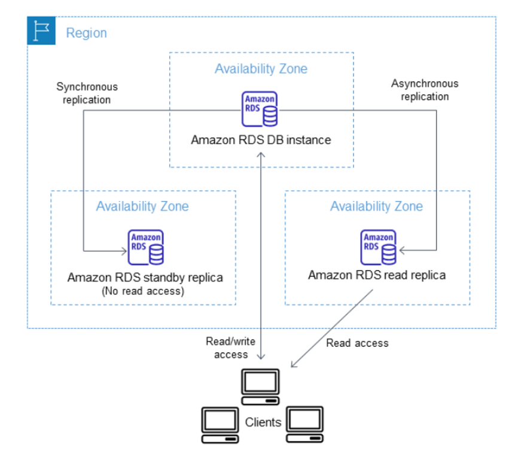
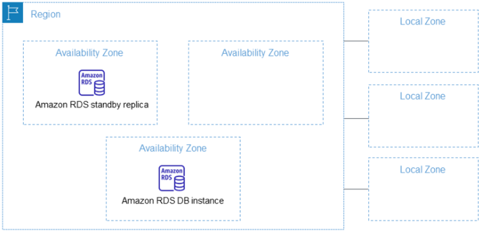
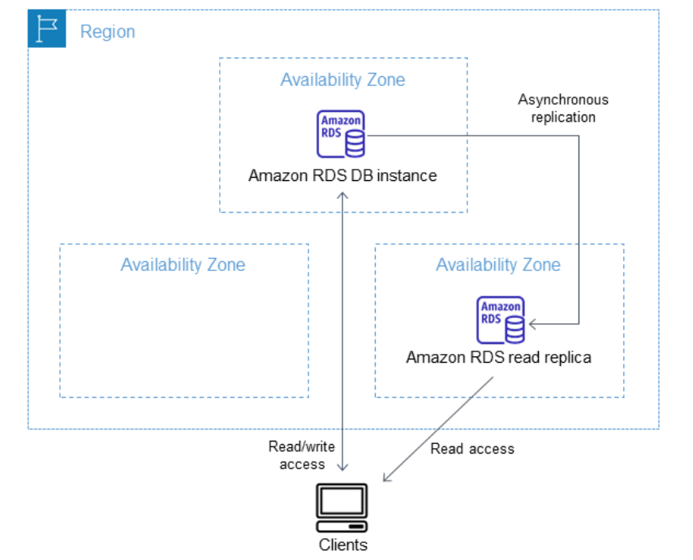
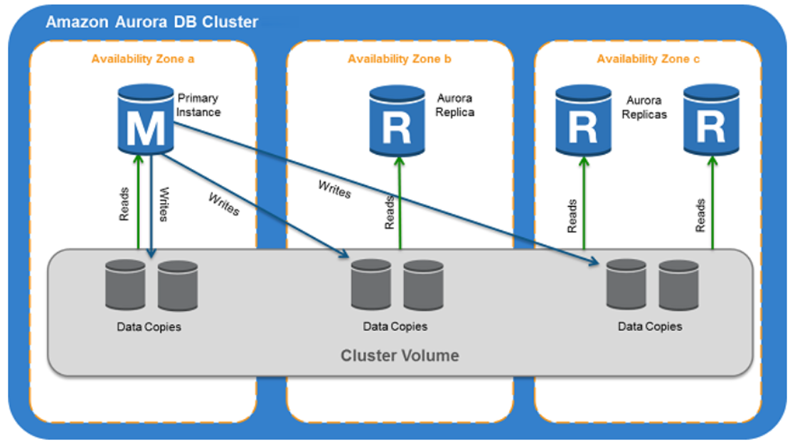
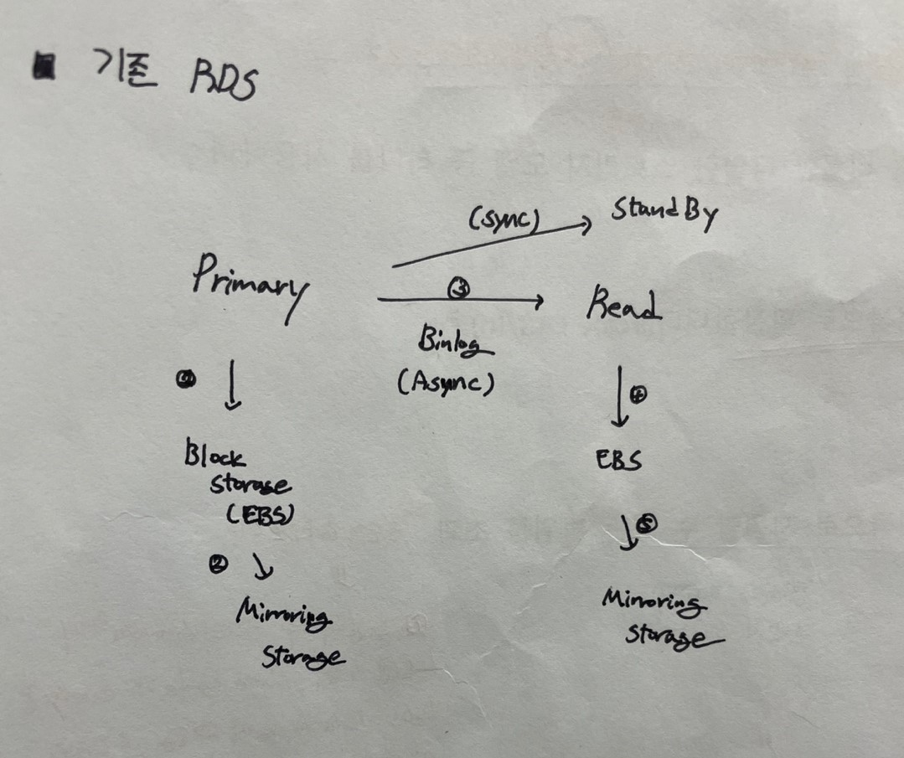
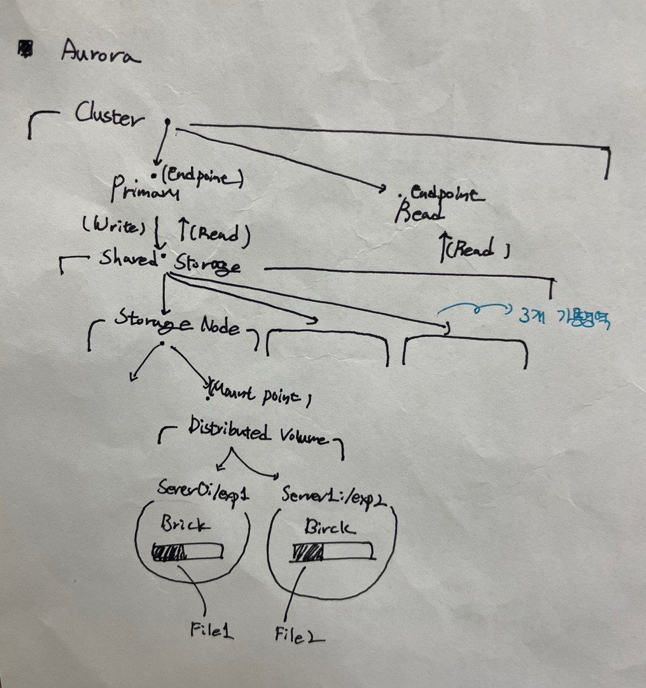

# Amazon RDS
* 관계형 데이터베이스 서비스
* DB 인스턴스를 기준으로 시간을 동기화하는데 NTP를 사용
</br>


## DB Instance Class
* EC2
</br>


## DB Instance Storage
* EBS
</br>


## Processor
* 워크로드에 맞게 CPU와 Thread 수를 제어할 수 있다.
* 단 Oracle DB의 인스턴스만 제어할 수 있다.
* https://docs.aws.amazon.com/AmazonRDS/latest/UserGuide/Concepts.DBInstanceClass.html
</br>

## RDS DB Instance 수정
* RDS DB Instacne 구성 설정을 변경할 수 있다.
* 수정 사항은 즉시 적용도 가능하고, 관리 기간을 연기할 수 있다. 일부 목록은 재부팅해야 된다.
* 변경 가능 목록
1. 스토리지 추가
    * 중단 X
    * 늘릴 수 있으나, 줄일 수는 없다
    * 최적화하는데 몇시간이 걸릴 수 있다
2. DB 인스턴스 클래스 변경
3. 다중 AZ 배포
4. 읽기 전용 복제본
    * 단일 AZ인 경우, DB 스냅샷 생성시 잠시 I/O가 중단된다
    * 
</br>
</br>


## High Availability 

</br>

### 다중 AZ 배포 (Multi-AZ)

* 다중 AZ 배포에서 Amazon RDS는 다른 가용 영역에 __동기식 대기 복제본을__ 자동으로 프로비저닝하고 유지 관리한다.
* __Standby replica__ 라고도 한다.
* 해당 기능은 읽기 전용 시나리오를 위한 확장 솔루션이 아니다. 그렇기 때문에 읽기 트래픽을 처리하기 위해 대기 복제본을 사용할 수 없다.
* 동기식이기 때문에 백업 시, 해당 DB를 백업 중 지연 시간 급증을 최소화한다.
* 재해 복구 시, 자동으로 Standby replica로 전환한다.
</br>

### 읽기 전용 복제본 (Read Replicas)

* DB 엔진의 기본 제공 복제 기능을 사용하여 원본 DB 인스턴스에서 읽기 전용 복제본이라는 특수한 유형의 DB 인스턴스를 생성.
* 원본 DB와 읽기 전용 복제본 간에 __미리 쓰기 로그(WAL)__ 데이터를 전송하는 특수 연결이 생성되며, DB 인스턴스에 대한 업데이트는 읽기 전용 복제본에 비동기식으로 복사된다.
    * PostgreSQL은 복제 처리를 위해 단일 프로세스를 사용
* 재해 복구 솔루션으로 읽기 전용 복제본을 독립 실행형 인스턴스로 승격할 수 있다.
</br>
</br>


## Backup
* DB 인스턴스 백업 기간 동안 DB 인스턴스의 자동 백업을 생성하고 저장한다.
* RDS는 DB 인스턴스의 스토리지 볼륨 스냅샷을 생성한다.
* __장기간 백업하려면 스냅샷을 Amazon S3으로 내보내는 것이 좋다!__
    * 해당 작업을 수행하기 위해서는 아래와 같은 정책 허용이 필요
    ```
    s3:PutObject*
    s3:GetObject*
    s3:ListBucket
    s3:DeleteObject*
    s3:GetBucketLocation
    ```
* 
</br>
</br>


## Parameter Group
* DB 인스턴스와 파라미터 그룹을 연결하여 DB 엔진 구성을 관리한다.
* 각 엔진마다 파라미터가 다르기 때문에 맞춰서 설정해 줘야 한다.
* https://registry.terraform.io/providers/hashicorp/aws/latest/docs/resources/db_parameter_group
</br>
</br>


## Log
* 기본적으로 DB의 Log 파일은 콘솔에서 확인이 가능하다.
* CloudWatch에서 로그를 확인하려면 __"로그 내보내기"__ 에서 게시할 로그 유형을 선택하고, 파라미터 그룹에서 값을 설정해야 한다.
    * https://gonigoni.kr/posts/logging-rds/
> 파라미터 그룹에서 설정하지 않으면, 내보내기를 하더라도 로그는 보이지 않는다.
</br>
</br>


## Aurora DB Cluster

* Amazon Aurora DB Cluster는 하나 이상의 DB Instance와 해당 DB Instance의 데이터를 관리하는 Cluster Volumn으로 구성된다.


## RDS DB vs Aurora DB
* Cluster 구성시 서로 다른 방식으로 구성하게 된다.

### RDS DB

* RDS DB들은 EBS에 Data Write/Read를 한다. 그렇기 때문에 Read DB(Replication)는 Binlog에 대한 Write 동작을 추가적으로 해야되기 때문에 Only Read 이지만 실질적으로 Write 동작을 하게된다.
* Data 이중화를 위해 EBS는 Mirroring Storage(EBS)에 Data르 복제하게 된다.
</br>

### Aurora DB

* Aurora DB들은 Shared Storage를 통해 Data Write/Read를 한다. 그렇기 때문에 Read DB(Replication)가 Write 동작을 추가적으로 하지 않아도 된다.
* 또한 Shared Storage를 통해 3개의 가용 영역에 6개의 복제본을 만들어 가용성이 좋지만 그만큼 비용이 더 지불해야 한다.
* Shared Storage 구성은 다음과 같다.
    * __Shared Storage__ : Storage Node 관리
    * __Storage Node__ : Node는 Distributed Volume 이중화를 위한 Cluster => Distributed Volume이 2대
    * __Distributed Volume__ : 분산 저장을 위한 Storage(Server)에 대한 관리 Cluster => File 1은 exp1에 File 2는 exp2에 저장

</br>
</br>