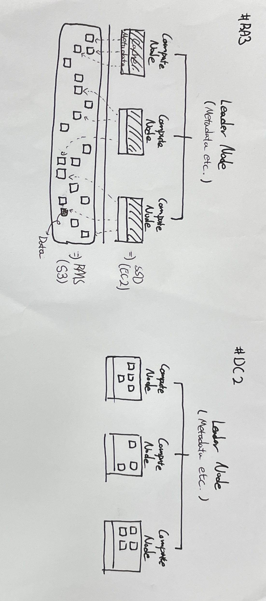

# AWS Redshift
* AWS 관리형 데이터 하우스 서비스


## 고려 사항
- OLTP / OLAP
- Connection Count
- Idle Time
- SSL
- 병렬 처리 (Concurrency)
- 잠금 (Locking)


### 이슈 사항
1. "유지 관리 기간"
    - 설정되어 있는 시간에 AWS 측에서 업데이트가 있는 경우 강제로 업데이트가 진행되며, 실행중인 쿼리가 강제 종료된다.
    - 유지관리에 대해 45일 연장이 가능하지만, 45일 뒤에는 추가 연장이 불가하다.
</br>


---
## Architecture

* Leader Node : Client와 Compute Node 중간에서 모든 통신을 관리한다(SQL 병렬 처리 및 ML 최적화 조정)
    - 클러스터 메타데이터: 테이블, 스키마, 분산 스타일, 사용자 및 권한과 같은 데이터베이스 객체에 대한 정보
    - 시스템 설정 및 구성: 클러스터 설정 및 구성에 대한 정보 (예를 들어, 파라미터 그룹 설정 등)
    - 쿼리 실행 계획 및 이력: 실행된 쿼리의 이력, 실행 계획, 성능 통계 및 모니터링 정보
    - 워크로드 관리 정보: 클러스터에서 실행 중인 워크로드와 관련된 정보가 저장 (예를 들어, 사용자 및 그룹의 리소스 사용량, 우선 순위 등이 여기에 해당)
    > 단일 노드 구성 시, Leader Node와 Compute Node 기능이 하나의 Node에서 공유된다. 
* Compute Node : Leader Node로 부터 받은 실행 내용을 받아 처리한다(SQL 연산 처리)
    - 테이블 데이터: 클러스터에 로드된 모든 테이블의 실제 데이터가 Compute 노드에 저장되며, 이 데이터는 컬럼 기반으로 저장되며, 각 컬럼에 대한 압축 및 분산 저장이 적용
    - 정렬 키 및 분배 키: 테이블의 정렬 및 분배 키 정보가 Compute 노드에 저장
    - 쿼리 실행 결과 및 임시 데이터: 쿼리 실행 중 생성되는 임시 결과 및 작업에 사용되는 임시 데이터가 Compute 노드에 저장 (예를 들어, 정렬 작업이나 조인 작업 중에 생성되는 임시 파일 등)
    - 레코드 잠금 및 트랜잭션 정보: 트랜잭션 처리를 위한 레코드 잠금 및 관련 정보가 Compute 노드에 저장됩니다
    > 다중 노드 구성 시, Leader Node가 추가되며 비용은 지불되지 않는다.
* Node Slice : 각 Compute Node의 메모리 및 디스크 공간을 할당 받고, 분산키(Distribution key)에 따라 데이터가 분할된다.
    - 분산 스타일 : 기본적으로 Colume을 기반으로 테이블 분산
        1) AUTO : 테이블 데이터의 크기를 기반으로 최적의 배포 스타일을 할당 (작을 때: ALL / 클 때: KEY or EVEN)
        2) EVEN : 라운드 로빈에 의해 분산 (JOIN을 안하는 경우 적합)
        3) KEY : Colume 값에 의해 분산
        4) ALL : 전체 테이블의 복사본이 모든 노드로 분산 => 보통 작은 테이블에 한해서만 사용
        > "같은 노드에 데이터가 있어야 하는 JOIN 사용", "모든 노드에 테이블 분산" 등 상황에 따라 데이터 재분산이 일어나기도 한다!
* RAM (Redshift Managed Storage)
    - Noe 유형에 따라 다르다!
    - RA3 Type인 경우, 데이터는 S3에 저장되며, S3는 Object Storage이기 때문에 속도 저하가 올 수 있으므로 고속 볼륨 스토리지(SSD)에 데이터를 Caching (SSD = Local Cache + Temporary Storage 로 추측)
    - DC2 Type인 경우, 각 Compute Node에 있는 볼륨 스토리지(SSD)에 데이터를 저장
* 동작 과정
    1) Client로 부터 Query를 받는다.
    2) Qeuery을 결과를 얻는데 필요한 단계를 실행시키기 위해 메타데이터 정보(테이블 분산 정보 등)를 분석하여 실행 계획을 작성
    3) 실행 계획에 따라 코드를 컴파일하여 각 Compute Noe에 배포하고, 데이터 구간을 각 Compute Node에 할당 (병렬 처리)
    4) 할당받은 데이터를 처리한 후, 최종 집계를 위해 중간 결과를 Leader Node에게 전달
    5) Leader Node는 각 Compute Node에게서 전달받은 결과를 가지고 최종 집계 진행
    6) Client에게 결과 전달
</br>


### Node Type
* Single Node 인 경우, 하나의 Node가 Leader Node/Computing Node 모든 역할을 수행한다.
* Multi Node 인 경우, 설정한 Node 갯수만큼 Computing Node를 가지게 되고, 추가적으로 Leader Node가 추가된다(Number of Node + 1 Leader Node(Provided by AWS)). 추가된 Laeder Node에 대해서는 비용을 받지 않는다!
1. RA3 (최신 버전 : SSD + RAM(S3)를 스토리지로 사용)
    - Node의 SSD는 캐싱 데이터가 저장되며, 실제 데이터는 RAM에 저장하고 있다. 캐싱하고 있으나 실제 데이터가 S3에 올라가 있으므로 DC2보다 성능적으로 느릴 수 있다.
    - S3를 사용하다보니 S3를 스토리지로 사용하고 있는 Redshift나 S3에 대한 Datashare 기능이 존재 및 백업 복구가 가능
2. DC2 (레거시 버전 : SSD 볼륨 스토리지 사용)
    - Node의 SSD에 모든 데이터를 저장하고 있다. RA3 처럼 공유 스토리지를 사용하고 있지 않기 때문에 확장성이 다소 떨어진다.
</br>


### Resize
- 탄력적 크기 조정 (Node 개수 변경)
    1) 스냅샷 생성
    2) 새 클러스터를 생성하지 않고, Node만 추가/삭제
    3) 메타데이터 마이그레이션 (일부 쿼리 중지 발생)
    4) 백그라운드에서 분산 스타일에 맞춰 재배포 진행
        > 일부 쿼리 중지 O, Read/Write

- 탄력적 크기 조정(Node Type 변경)
    1) 스냅샷 생성
    2) 새 클러스터 프로비저닝
    3) 데이터를 백그라운드에서 분산 스타일에 맞춰 재배포 진행
    4) 작업 완료 후, 새 클러스터로 엔드포인트 변경. 기존 클러스터는 종료
        > 원본 클러스터 중지 X, Only Read

- 클래식 크기 조정 (Node 개수만 변경 / Node Type 변경)
    1) 스냅샷 생성
    2) 새 클러스터 프로비저닝
    3) 원본 클러스터 재시작(중지 발생)
    4) 데이터를 백그라운드에서 분산 스타일에 맞춰 재배포 진행
        > 원본 클러스터 중지 O, Read/Write(RA3) or Only Read(DC2)

> 탄력적 크기 조정(Node Type 변경)은 어떻게 동작하는지 모르겠다.. 그냥 최대한 안쓰는 방식으로
 
1) Snapshot 생성
2) New Cluster 생성
3) 일시 중지
4) L


</br>
</br>


---
## Network
* Enhanced VPC : 기본은 Public으로 접근하게 되는데, 해당 옵션을 활성화하면 VPC 네트워크를 통해 접근할 수 있다.

</br>
</br>


---
## 가용성 & FailOver
### Cluster 재배치
- 클러스터의 노드들을 다른 가용 영역으로 옮긴다.
* 유의 사항
    - RA3 Type만 가능
    - 평균 15분
</br>

### Multi AZ
- 2개의 가용 영역에 노드들을 배치하고, 하나의 가용 영역에서 장애 발생 시 다른 가용 영역로 옮기게 된다.
* 제약 사항
    - 가용 영역당 Node 개수는 최소 2개이다. 즉, 최소 4개의 Node가 생성된다.
    - Multi AZ를 하기 위해서는 최소 3개의 가용 영역이 필요하다.

</br>
</br>


---
## 동시성 확장 (Concurrency scaling)
- Query 처리에 대한 동시성 확장이 가능
 


---
## Performance
* Lock : Table 단위 Lock 사용 (일반적으로는 Row 단위 Lock 사용)
AccessExclusiveLock: 이 잠금은 특정 테이블에 대한 읽기 및 쓰기 액세스 권한을 독점적으로 보유하는 것을 의미합니다. 다른 세션에서 동시에 해당 테이블을 수정하거나 읽을 수 없습니다.

RowShareLock: 이 잠금은 특정 행(로우)에 대한 읽기 액세스를 다른 트랜잭션과 공유하는 것을 허용합니다. 다른 세션은 동시에 동일한 행을 읽을 수 있지만 쓰기 작업은 허용되지 않습니다.

RowExclusiveLock: 이 잠금은 특정 행에 대한 독점적인 읽기 및 쓰기 액세스를 보유합니다. 다른 세션에서는 동시에 해당 행을 수정할 수 없습니다.

ShareUpdateExclusiveLock: 이 잠금은 특정 테이블에 대한 읽기 액세스를 다른 세션과 공유하면서 특정 행을 업데이트하기 위한 독점적인 권한을 보유합니다.

ShareLock: 이 잠금은 특정 테이블에 대한 읽기 액세스를 다른 세션과 공유하는 것을 허용합니다. 다른 세션은 동시에 동일한 테이블을 읽을 수 있지만 쓰기 작업은 허용되지 않습니다.
* 


---
## 구축 방법
* 
1. q
2. w
3. e
4. r


## 
1. 동시접속 사용자수가 15개가 임계치
이 부분은 WLM과 연계하여 말씀 드려야 되는데요,
Redshift 에서는  전체 사용자 정의 대기열(슈퍼 유저 대기열 제외)의 최대 동시성 레벨이 최대 50개입니다.
즉 MAX 50개 의 동시 Query가 수행 가능하며 15개는 WLM에서 default로 관리되는 부분입니다.
이 경우 15개 이상의 Query가 수행되면 대기하게 됩니다.
숫자를 늘여서 동시 Query 숫자가 많아질 경우 전체적으로 느려질수 있습니다.

[참고 URL]
https://docs.aws.amazon.com/ko_kr/redshift/latest/dg/c_workload_mngmt_classification.html

2. 동시성 확장 (Concurrency Scaling)을 사용하면 사실상 무제한의 동시 사용자 및 동시 쿼리를 일관되게 빠른 쿼리 성능
1.에서 Query가 많이 수행되고 있으면 Resource가 부족하게 되어 Query가 전체적으로 느리게 수행될수 있는데 이때 Node를 자동으로 확장(Concurrency Scaling)하여 수행속도를 향상시킬수 있습니다.
Workload Management Configuration에서 설정후 사용가능하며 비용이 추가로 발생할 수 있습니다.
24시간마다 1시간 누적이 되어 최대 30시간(?) 까지 무료로 사용이 가능할것으로로 인지하고 있습니다.

[참고 URL]
https://aws.amazon.com/ko/blogs/korea/new-concurrency-scaling-for-amazon-redshift-peak-performance-at-all-times/

실전에서는 1,2를 잘 조정하여 성능 & 비용측면에서 접근해야 합니다.


### 참조
* https://blog.kyobodts.co.kr/2022/06/09/aws-redshift%eb%9e%80/


---
# Redshift Serveless
* 제약 사항
    1) 최소 3개의 가용 영역(AZ) 사용 필요
    2) 


### 이슈 사항
1. Storage가 Seoul Region/Account에 포함되어 있는 서비스인지 여부
2. 진입점에 보안적 이슈 사항
    - 진입접 (접속 방법 / 권한 등)
    - 감사 로그 기록 방법
3. 레퍼런스 참고
4. 최대 쿼리 실행 시간 제한 : 최대 1일 (86,399s)


---
---


## Study

* 다크 데이터 : 숨겨져 있는 데이터들 또는 관리되지 않는 데이터들을 관리 및 활용할 수 있어야 된다.
* 통합이 필요, Hadoop 등을 사용하게 되면 해당 언어를 배워야 하지만 SQL 문으로 관리할 수 있다.
* Data Lake + Warehouse = Data Lake House Architecture


## Data Modeling
* Star
* Snowflake
* Highly Denormalized


* 인덱스가 없고, Table 분산 스타일, 데이터 압축, Sork Key 등으로 처리한다.

구조
* 데이터를 넣을 때는 Schema-on-write(RDB) 형태를 가진다
* 데이터를 읽을 때 Schema-on-read(원하는 Schema 형태에 집어넣는)방식 지원


Best Choose
* 성능은 효율적인 I/O에 가장 큰 영향을 받는다.
* 모든 Column은 필요한 만큼 지정
    * 국가코드에 BIGINT 사용 금지
* 적절한 데이터 타입 사용
    * 날짜 값에 CHAR 타입 대신 TIMESTAMP 혹은 DATE 사용
    * 
* UTF-8 Multibiyte character 지원을 위해 VARCHAR 데이터 타입 사용
* SUPER 데이터 타입
    * 비정형 데이터의 경우 방법은 여러가지이다.
    * Read할 때 JSON에 넣는 방법(But 너무 느려서 최악!!!)
    * 넣을 때 SUPER 데이터로 놓는다.

고려 사항
* Sort Keys : 어떤 식으로 저장하고 부를지
* Compression : 어떤 식으로 저장하고 부를지
* Distribution Style : 데이터를 어떤 식으로 분산시킬지
    * 어떤 식으로 저장할지를 정해야 한다. 이유는 다른 Compute Node는 10초에 끝났는데, 다른 C.N.에서는 1시간 걸리면 총 걸리는 시간은 1시간이 된다.
    * Auto : 자동
    * Even : Round-Robin
    * ALL : 모든 Compute Node에 저장이 되어, 각 테이블에 Join이 되는 경우 사용 (모두 복사되므로 잘 사용해야 될듯 데이터는 많이 안증가하면서 Join이 필요한 경우에만)
    * Key : 같은 Key를 가진 가진 쪽에 저장. (100 개중 90개 정도가 해당 그룹을 사용한다에 사용 / Zone map)
* Workload Management : 어떤식으로 쿼리를 분산 시킬지
* Table Maintenance : 디스크 조각 모음


* Materialized Views (MView)
    * 미리 데이터를 저장하고 Reflash하는 방식


## Data loading / unloading
loading : 외부에서 -> Redshift로 데이터가 이동
* copy 명령어 사용 (가이드)
* Best Practices
    * 각 테이블 당 하나의 COPY 명령어
    * COPY를 사용할 수 없는 경우, multi-row insert 사용

* 부하가 낮은 시점에 백그라운드에서 자동으로 vacuum 및 analyze 사용
    * 하지만 기다리는 시점까지 안된다는 의미로 현실적으로 힘드므로 워크로드 내에서 직접 vacuum 실행후 저장
* PK, FK, Unique, constraints는 Redshift 외부에서 작업 후, DB에 저장
* DELETE 대신 TRUNCATE 사용 고려


unloading : Redshift에서 -> 외부로 데이터가 이동
* unload 명령어 사용


## Query 처리
* EXPLAIN 명령어를 통해 실행 계획 가능(Redshift에서 제공 가능)
* Query Plan 중에 Cost를 보고 어느정도 사용하는지 볼 수 있다(참고정도만)
    * Cost는 Relative Cost이므로 Query 안에서만 이므로 상대적인 것이기 때문에 실제로 그만큼 시간이 걸리는 것이 아니다...
* DS_DIST_NOTE : 각 노드 안에서만 동작하므로 네트워크 비용이 안든다. 즉, 다른 노드의 데이터를 가져와서 사용할 필요가 없다.


## 

```

# Error Message Check
select * from SYS_LOAD_ERROR_DETAIL;


# Delete 한 후에 테이블에서 바로 삭제가 되는 것이 아닌 쇼프트 삭제(	estimated_visible_rows)가 진행된다. vacuum delete 명령을 통해 실제 테이블 공간을 삭제를 해야 한다.
# Delete, Update, Sort 등
select "table", size, tbl_rows, estimated_visible_rows
from SVV_TABLE_INFO
where "table" = 'orders';

delete orders where o_orderdate between '1997-01-01' and '1998-01-01';

vacuum delete only orders;
vacuum sort only orders;
vacuum recluster orders;
vacuum recluster orders boost;


# 프로시저 호출, Redshift 구조는 ELT 구조가 가능하다
SELECT count(*) FROM "dev"."public"."lineitem"; --303008217
call lineitem_incremental();


# MView 사용하여 특정 쿼리에 대해 정보를 저장하며 주기적인 업데이트 가능 (AUTO REFRESH 옵션은 YES로 )
# 기본 테이블이 업데이트 될때 기준으로 Refresh
CREATE MATERIALIZED VIEW supplier_shipmode_agg
AUTO REFRESH YES AS
select l_suppkey, l_shipmode, datepart(year, L_SHIPDATE) l_shipyear,
  SUM(L_QUANTITY)	TOTAL_QTY,
  SUM(L_DISCOUNT) TOTAL_DISCOUNT,
  SUM(L_TAX) TOTAL_TAX,
  SUM(L_EXTENDEDPRICE) TOTAL_EXTENDEDPRICE  
from LINEITEM
group by 1,2,3;


## EXPLAIN을 통해 DRY Run 가능
explain
select n_name, s_name, l_shipmode, SUM(L_QUANTITY) Total_Qty
from lineitem
join supplier on l_suppkey = s_suppkey
join nation on s_nationkey = n_nationkey
where datepart(year, L_SHIPDATE) > 1997
group by 1,2,3
order by 3 desc
limit 1000;

# 사용자 함수의 경우 SQL 또는 Python 사용 가능
create function f_sql_greater (float, float)
  returns float
stable
as $$
  select case when $1 > $2 then $1
    else $2
  end
$$ language sql;  

select f_sql_greater (l_extendedprice, l_discount) from lineitem limit 10

create function f_py_greater (a float, b float)
  returns float
stable
as $$
  if a > b:
    return a
  return b
$$ language plpythonu;

select f_py_greater (l_extendedprice, l_discount) from lineitem limit 10


$$

```

* Spectrum : read only 

Logging
* Audit Logging
* Sevice Logging : CloudTrail

Migration


## Glue
1. Glue -> Database -> DB 생성
2. Glue -> Crawlers 생성 -> Crawlers Run -> Dastabse Tables에 Catalog Table이 생성 됨
3. 


## 운영
* 

* 스냅샷 복원 시간은 10분ㅂ내외로
* resizing
* RA3의 경우, 2단계 과정 거친다
    * stage1
        * 클러스터 메타데이터를 마이그레이션 하는 과정
    * stage2
        *용
* DA2
    * 생성 후, 복제


* Redshift Workload Management(WLM)
    * 사용자를 기준으로 분리
    * 쿼리의 우선 순위를 설정 가능
    * 쿼리 모니터링 Rule 설정 가능


* 시스템
SYS_QUERY_HISTORY
SYS_QUERY_DETAIL
SYS_EXTERNAL_QUERY_DETAIL
SYS_LOAD_HISTORY
SYS_LOAD_ERROR_DETAIL
SYS_UNLOAD_HISTORY
SYS_SERVERLESS_USAGE


