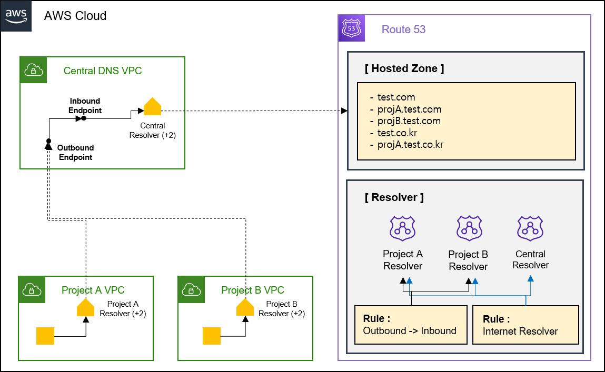

# Route 53
* Domain Name System 서비스
</br>

## Route53 기능
1. __Domain 등록__
    * 도메인을 구입 후, Route53에 도메인을 등록시킨다.
    * 등록이 끝나면, AWS는 도메인 등옥 대행자에게 사용자의 정보를 전송한다.
    * 등록 대행자는 사용자 정보를 도메인의 등록 기관으로 전송. 등록 기관은 .com과 같은 하나 이상의 최상위 도메인의 도메인 등록을 판매하는 회사이다.
    * 등록 기관은 자체 데이터베이스에 사용자의 도메인에 관한 정보를 저장하고 일부 정보는 퍼블릭 WHOIS 데이터베이스에도 저장한다.
2. __Traffic Routing__
    * 인터넷 트래픽을 도메인의 리소스로 라우팅
3. __Health Check__
    * Region 간의 Load Balancing을 하지 않는 이상, 잘 사용되지 않을 거 같다.
</br>


## Domain 등록 개념
* __Domain name__
    * 사용자가 웹 사이트 또는 웹 애플리케이션에 액세스하기 위해 웹 브라우저의 주소 표시줄에 입력하는 이름.
    * example.com과 같은 이름.
* __Domain registrar__
    * 도메인 등록 대행자.
    * 국제 인터넷 주소 관리기구(ICANN)가 인증한 특정 최상위 도메인(TLD) 등록을 처리하는 회사로, 리지스트리의 데이터베이스에 등록 데이터를 등록한다.
    * 예를 들어 Amazon Registrar, Inc.는 .com, .net, .org 도메인의 등록 대해자이다. Amazon의 등록 대행 협력사인 Gandi는 .apartments, .boutique, .camera 등 수백 가지 TLD의 도메인 등록 대해자이다.
* __Domain registry__
    * 도메인 레지스트리.
    * 특정 최상위 도메인을 가지고 도메인을 판매할 권리를 소유한 회사로, 등록된 도메인의 데이터베이스를 유지 관리하는 기관.
    * 등록된 도메인이 인터넷 상에서 접속될 수 있도록 최상위 도메인(TLD)의 도메인 네임 서버(DNS)를 운용하고 있다.
* __Domain reseller__
    * 도메인 대리점.
    * Registrar를 경유하여 도메인 등록 업무를 대행하는 업자로 Route 53이 해당한다.
    * 리셀러는 SRS(Shared Registry System)이라는 도메인 관리 시스템의 접속 권한이 없기 때문에 반드시 레지스트라를 경유하여 도메인을 관리하게 된다.
* __Domain TLD__
    * top-level domain
    * .com, .org 또는 .ninja 등 도메인 이름의 마지막 부분으로 최상위 도메인을 의미.
    * TLD 유형
        1) __일반적인 최상위 도메인__
            * 해당 TLD를 보면 해당 웹사이트가 어떤 사이트인지 알려준다.
            * 예를 들면 .bike라는 TLD를 가진 도메인은 모터사이클 또는 자전거 업체나 조직의 웹 사이트와 연관된 경우가 많다.
        2) __지리적 최상위 도메인__
            * 해당 TLD는 국가나 도시같은 지리적 영역과 연관된다.
</br>

### Domain 등록 과정
1. 도메인 이름을 선택하고, 사용 가능 여부 체크
2. Route53에 도메인 이름 등록 (도메인 소유자와 연락처 정보도 같이 제공)
    * 도메인 이름과 같은 hosted zone 생성
    * hosted zone에 4개의 name server 세트를 할당한다.
    * hosted zone에서 name server를 얻고, 도메인에 추가한다.
3. 해당 등록과정이 끝나면 AWS는 Domain Registrar에게 사용자의 정보를 전송한다(Domain registrar는 Amazon Registrar 또는 Gandi)
4. Domain Registrar는 사용자 정보를 Domain Registry으로 전송한다.
5. Domain Registry는 자체 데이터베이스에 사용자의 도메인에 관한 정보를 저장하고 일부 정보는 Public WHOIS 데이터베이스에도 저장한다.
</br>
</br>

## DNS 개념

* __alias record__
    * Record Type 중 하나. 자세한 내용은 DNS Record 작업 참조
* __authoritative name server & non-authoritative name server__
    1) authoritative name server는 원본 zone 파일을 가지고 있다. IP 주소를 저장, 수정, 삭제할 수 있으며, 적절한 매핑을 통해 재귀 서버에 응답한다.
    2) non-authoritative name server는 원본 zone 파일을 가지고 있지 않다. 이전에 수행한 DNS 조회로 인해 요청한 DNS Record의 캐시가 있을 수 있어, DNS 쿼리에 응답할 경우 신뢰할 수 없는 응답이 된다(cahe name server, resolver name server라고도 한다)
* __DNS query__
    * Domain name과 연결된 리소스의 IP를 확인하기 위해 DNS에 제출하는 요청.
* __DNS resolver__
    * 보통 인터넷 서비스 제공업체(ISP)가 관리하며, authoritative name server와 최종 사용자 사이의 중간 역할을 한다. 예를 들면 Google이 자체 public resolver name server를 제공하고 있다.
    * Web browser에 Domain name을 입력하면 쿼리는 먼저 resolver server로 전송된다. resolver server는 DNS record의 캐시를 가지고 있는 경우, authoritative name server까지 쿼리를 확인하지 않는다.
    * DNS record의 캐시가 없는 경우, DNS Tree를 재귀적으로 검색하여 Domain Record에 대한 authoritative name server를 찾는다.
    * recursive name server라고도 한다.
* __Domain Name System(DNS)__
    * DNS는 example.com 같은 Domain name을 컴퓨터가 인터넷에서 서로를 찾을 수 있도록 해주는 IP 주소라는 숫자로 변환한다.
* __hosted zone__
    * Zone 파일이라고도 한다.
    * Domain(ex> example.com)과 Sub Domain(ex> www.example.com, mail.example.com)의 트래픽을 라우팅하는 방법에 대한 정보를 포함하고 있는 레코드의 컨테이너이다.
    * __hosted zone__은 해당 Domain과 이름이 같아야 한다.
    * 예를 들어 example.com의 hosted zone에는 www.example.com의 트래픽은 192.168.0.40이라는 IP 주소로 라우팅하라는 레코드 정보가 저장되어 있다.
* __name servers__
    * Domain Name System을 제공하는 서버.
* __private DNS__
    * Domain과 Sub Domain의 트래픽을 하나 이상의 Amazon VPC 내의 Amazon EC2 인스턴스로 라우팅하도록 해주는 DNS의 로컬 버전.
* __reusable delegation set__
* __time to live (TTL)__
    * Resolver Server가 해당 레코드의 값을 캐싱할 시간.
</br>

### DNS 동작 과정

1. Domain name이 입력되면 먼저 PC의 cache를 확인
2. ```/etc/hosts``` 파일에서 Domain 정보를 확인
3. 설정한 DNS Resolver Server에서 Domain 확인
4. 저장되어 있는 cache 정보가 없다면, Recusive Query를 통해 정보를 확인하게 된다. 먼저 Root name server에서 Domain 정보를 확인
5. Root name server는 TLD name server 정보를 전달
6. 전달 받은 TLD name server에서 Domain 정보 확인
7. TLD name server는 Sub domain name server(Route 53 name server) 정보를 전달
8. 전달받은 Sub domain name server에서 Domain 정보 확인
9. 실제 서비스를 제공하는 Server 정보를 전달 
10. DNS Resolver Server는 서비스 Server의 정보를 다시 PC에 전달
11. PC는 전달받은 Domain 정보를 이용하여 서비스 Server에 접근
</br>
</br>


## DNS Record Type
| Type  | Type id. | Description                           | Function                                                                                                                                                               |
| ----- | -------- | ------------------------------------- | ---------------------------------------------------------------------------------------------------------------------------------------------------------------------- |
| A     | 1        | Address record                        | 호스트 이름과 IPv4 주소를 저장                                                                                                                                         |
| AAAA  | 28       | IPv6 record                           | 호스트 이름과 IPv6 주소를 저장                                                                                                                                         |
| CERT  | 37       | Certificate record                    | PKIX, SPKI, PGP 등의 암호화 인증서를 저장                                                                                                                              |
| CNAME | 5        | Canonical name record                 | 호스트 이름을 다른 호스트 이름으로 별칭하는데 사용                                                                                                                     |
| DNAME | 39       | Delegation name record                |                                                                                                                                                                        |
| HINFO | 13       | Host Information                      | 호스트에 대한 일반 정보를 얻는데 사용. 하지만 보안상의 이유로 공용 서버에서는 사용되지 않는다                                                                          |
| MX    | 15       | Mail Exchange record                  | 이메일을 수신할 이메일 서버를 지정 (SMTP 이메일 서버). MX record를 설정하려면 A record가 지정되어 있어야 하며, MX record 데이터에는 A record의 호스트를 입력하면 된다. |
| NS    | 2        | Name Server record                    | 주어진 호스트에 대한 authoritative name server를 알려준다. 즉, 해당 도메인의 IP 주소를 찾기 위해 가야할 곳을 알려준다                                                  |
| PTR   | 12       | Reverse-lookup Pointer record         | 순방향 DNS 확인(A or AAAA)과 달리 IP 주소를 기반으로 호스트 이름을 찾는데 사용 / Reverse DNS lookup                                                                    |
| SOA   | 6        | Start Of [a zone of] Authority record | DNS Zone 파일의 시작 부분에 나타내며 관리자의 연락처 세부 정보, 타이머 설정 등을 저장                                                                                  |
| SRF   |          | Sender Policy Framework               | TXT record 안에서 사용되며, 메일 스푸핑을 방지하는데 사용되는 레코드. 특정 사업체(네이버, 다음, 구글)                                                                  |
| TXT   | 16       | Text record                           | 역할 등의 도메인 설명을 기입하는 용도 또는 SRF 역할로 사용되는 레코드                                                                                                  |
* Reference: http://dns-record-viewer.online-domain-tools.com/
</br>

## Zone File Example
```

```
* 
</br>

### SOA Record
```
@     IN     SOA    {primary-name-server}     {hostmaster-email} (
                    {serial-number}
                    {time-to-refresh}
                    {time-to-retry}
                    {time-to-expire}
                    {minimum-TTL} )
```
* https://help.dyn.com/how-to-format-a-zone-file/
* Primary name server : 


### A Record
* Example
    ```

    ```

### AAAA Record
* Example
    ```
    ```

### CERT Record
* Example
    ```
    ```

### CNAME Record
* Example
    ```
    ```

### MX Record
* Example
    ```
    ```

### NS Record
* Example
    ```
    ```

### PTR Record
* Example
    ```
    ```

### SOA Record
* Example
    ```
    ```

### SRF Record
* Example
    ```
    ```

### TXT Record
* Example
    ```
    ```

### 별칭 레코드
* 별칭 레코드로 다음과 같이 선택한 AWS 리소스로만 쿼리를 리디렉션할 수 있다.
* Amazon S3 Bucket
* CloudFront 배포
* 동일한 Route 53 호스팅 영역의 다른 레코드
</br>
</br>
</br>


## Route53 DNS Resolver
* VPC와 네트워크 간(On-premise, VPC, Route 53 Resolver) DNS Query 해석을 위해 사용.
* 기본적으로 VPC를 생성하면 Route 53 Resolver는 자동으로 VPC용 DNS 서버(Amazon Route 53 Resolver)를 제공.
</br>

### 기능
* Inbound Endpoint
    
    * 다른 네트워크 (On-premise, VPC 등) -> Inbound Endpoint VPC Resolver -> Inbound Endpoint -> Inbound Endpoint -> Route 53 Resolver
    * 네트워크의 DNS Resolver가 해당 Inbound Endpoint를 통해 DNS Query를 Route 53 Resolver에게 전달힐 수 있다.
* Outbound Endpoint
    
    * VPC -> Outbound Endpoint VPC Resolver -> Outbound Endpoint -> 다른 네트워크 (On-premise, VPC 등)의 Resolver
    * DNS Resolver가 해당 Outbound Endpoint를 통해 Outbound VPC DNS Resolver에게 전달
* Rule
    * VPC에 매핑되어 있는 2번에 있는 Route 53 Resolver Server에 적용되는 규칙

> Inbound VPC는 연결할 Route 53 Resolver(Hostzones)을 관리할 수 있다. Outbount VPC는 다른 네트워크의 Resolver에 대한 VPC들을 관리할 수 있다.
> VPC 내에 상주하지 않는 다는 것 보니 Endpoint로 Resolver Server에 접근하는 개념으로 봐도 될거 같다.
</br>

### Multi Account에 대한 Resolver Architecture

* Inbound/Outbound Endpoint는 원래의 용도는 다른 네트워크의 DNS를 사용하기 위한 거지만, 여기서는 Multi VPC에 대한 Resolver Architecture를 위해 원래 의도와는 다르게 사용되었다.
  1) Inbound Endpoint를 통해 Route 53 Resolver에 접근해야되므로, 여러 개의 VPC는 Inbound Endpoint에 접근해야된다.
  2) 여러 개의 VPC의 Resolver는 Ountbound Endpoint를 통해서 다른 VPC의 Resolver로 넘어간다.
  3) 동일한 VPC에 Outbound/Inbound Endpoint 생성(관리를 위한 VPC)
  4) Outbound Endpoint -> Resolver가 아닌, Outbound Endpoint -> Inbound Endpoint로 Forwarding하는 Rule 생성
  5) 
> 모든 규칙은 Rule에 의해 정의되기 때문에 Hosted Zone에 VPC를 연결할 필요가 없어진다. 즉, Hosted Zone에 대한 모든 VPC 관리는 Rule에 의해서만 관리된다.

> Resolver를 사용할 Account들에게는 Rule만 공유하면 된다. AWS RAM을 이용하여 관리된다.

</br>
</br>


## Reverse Domain 조회
* 역방향 도메인 조회라고도 한다. 기존에 FQDN으로 IP를 찾는 것과 반대로, IP로 FQDN를 조회한다.
* 등록방법은 다음과 같다.
    * Class 단위로 관리되며, Hosted Zone: ```(x.x.x.x).in-addr.arpa```, Record Type: ```PTR```, Value: ```FQDN``` 형태로 등록.
    * https://docs.aws.amazon.com/ko_kr/Route53/latest/DeveloperGuide/resolver-rules-managing.html#add-reverse-lookup
    * EX> 10.0.0.190 : abc.test.com
    1) 10.0.0.0/24 범위의 주소에 대한 조회가 필요한 경우, 다음과 같이 Hoszted Zone 등록
        * ```0.0.10.in-addra.arpa``` 등록
    2) 레코드 등록
        * Record Name: ```190.0.0.10.in-addra.arap```
        * Record Type: ```PTR```
        * Value: ```abc.test.com```
</br>
</br>


## Global Accelerator
* DNS 장애조치를 빠르게 제공하여, 제공하는 네트워크에 뛰어난 복원력을 제공한다.
* 또한 사용자와 애플리케이션의 캐싱 문제를 방지하고 거의 즉각적으로 트래픽을 정상적인 엔트포인트로 리디렉션한다.
* Anycast부터 AWS 엣지 로케이션까지 정적 IP 주소를 사용하는 Global Accelerator는 고정 진입점 주소를 제공하여 사용자와 가까운 엣지 로케이션에서 트래픽을 수신하도록 한다.
</br>
</br>


## Routing option
1. __Simple Routing Policy__
    * 도메인에 대해 특정 기능을 수행하는 하나의 리소스만 있는 경우에 사용
    * 단일 리소스로 라우팅
2. __Weighted Routing Policy__
    * 사용자가 지정하는 비율에 따라 여러 리소스로 트래픽을 라우팅하려는 경우
    * 주로 A/B 배포 전략과 같은 테스트에서 사용될거 같다.
3. __Latency Routing Policy__
    * AWS Region에 트래픽을 라우팅하고 왕복 시간이 짧은 Region을 사용하여 최상의 지연 시간을 제공하는 Region으로 라우팅하려는 경우
4. __Failover Routing Policy__
    * Active-Pasive 장애 조치를 구성하려는 경우 사용
5. __Geolocation Routing Policy__
    * 지리 위치 라우팅 정책
    * 사용자의 위치에 기반하여 트래픽을 라우팅하려는 경우에 사용
6. __Geoproximity Routing Policy__
    * Traffic Flow Only
    * 지리 근접 라우팅 정책
    * 리소스의 위치를 기반으로 트래픽을 라우팅하고 필요에 따라 한 위치의 리소스에서 다른 위치의 리소스로 트랙픽을 보내려는 경우에 사용
7. __Multivalue Answer Routing Policy__
    * 다중값 응답 라우팅 정책
    * Route53이 무작위적으로 선택된 최대 8개의 정상 레코드로 DNS 쿼리를 응답하게 하려는 경우
</br>


### Route53 vs ELB
1. ELB는 여러 AZ 간에 트래픽을 분산하지만, 여러 리전에는 분산하지 않는다. Route53은 여러 리전에 트래픽을 분산할 수 있다.
2. Route53과 ELB 모두 상태 확인을 수행하고 정상적인 리소스로만 트래픽을 라우팅한다. 그러나 DNS는 캐시되어 unhealty 대상이 한동안 방문자 캐시에 남아 있게 된다. 반면에 ELB는 캐시되지 않으며 대상 그룹에서 unhealty 대상을 즉시 제거합니다.
> Region, AZ 기준으로 Traffic 분산을 한다.
</br>
</br>


## Cost
* 호스팅 영역 관리
    * 처음 25개 호스팅 영역의 경우 월별 호스팅 영역 당 0.50 USD
    * 추가 호스팅 영역의 경우 월별 호스팅 영역 당 0.10 USD
* DNS Query
    * Routing에 따라 가격이 다르다.
    * 월별 첫 10억 개 쿼리의 경우 1백만 쿼리당 0.40 USD
    * 월별 10억 개를 초과하는 경우 1백만 쿼리당 0.20 USD
* Domain name 관리
    * TLD 별 요금이 다르다.
* Traffic Flow