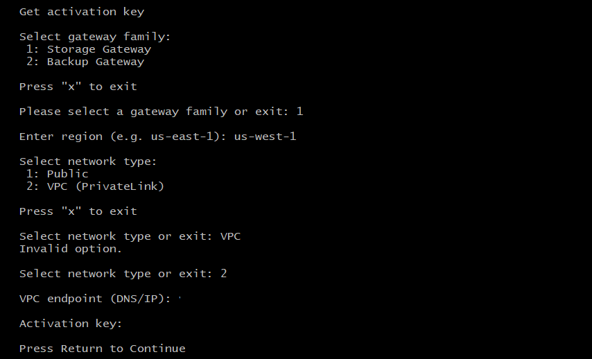

# Storage Gateway
* NFS(Network File System) 및 SMB(Server Message Block) 같은 업계 표준 파일 프로토콜을 사용하여 Amazon S3에서 객체를 저장하고 검색할 수 있다.
* 


## Storage Gateway

* 기본적으로 Storage Gateway는 해당 서비스가 설치된 EC2 Instance이다(DMS의 복제 인스턴스와 같은 개념)
* 그렇기 때문에 기본적으로 __Storage Gateway에 적용할 IAM__ 과 __Instance에 적용할 SG__ 가 필요하다.
    * SG : TCP/2049 - Inbound
* 서


## Amazon S3 File Gateway
* 

* 

### 동작 과정

* 
</br>


### Required prerequisites
1. S3 Bucket 생성
2. S3 Endpoint Gateway 생성
3. Routing Table 생성
4. S3 KMS에 대한 Policy 생성
</br>


### Step 1. Gateway 생성
1. Storage Gateway Instance 생성
    * 기본적으로 다음과 같은 포트 요구
        * NFS : 2049
        * Gateway 정품 Key를 얻기 위한 Port : 80
        * SSH : 22
    * Cahe or Upload Buffer로 사용할 EBS를 추가로 붙인다.
        * 비동기식으로 작업당 Buffer를 나눠놓은거 같다!
2. Storage Interface Endpoint 생성
    * Storage Gateway 활성화에 필요한 Port : 443, 1026, 1027, 1028, 1031, 2222
3. Gateway 정품 인증 키 받기
    * curl 명령어
        * https://docs.aws.amazon.com/ko_kr/storagegateway/latest/userguide/get-activation-key.html
        ```$ curl "http://VM IP ADDRESS/?gatewayType=FILE_S3&activationRegion=REGION&vpcEndpoint=VPCEndpointDNSname&no_redirect"```
    * EC2 Instance에 접속
        
        * ```$ su admin```
        * "0" 선택
4. Gateway Activation
    * 인증 키 입력
5. Logging 구성
</br>
</br>

### Step 2. 파일 공유 생성
1. 
2. 
 


