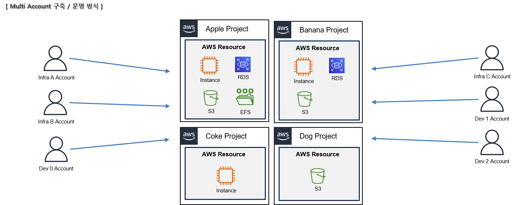

# AWS Service Catalog

* 협업을 위한 서비스로 중앙에서 관리함으로써 협업을 편리하게 해준다.
    * 협업은 계정과 계정뿐만 아니라 계정과 서비스, 서비스와 서비스 등 다양한 관계를 의미.
* 그러면 협업(연동)을 해야 되는 이유는 보통 서비스(인프라)가 분리되어 있기 때문이다. 인프라가 서로 분리되어야 하는 이유는 각 프로젝트(인프라)의 특성이 서로 다르고, 보안 이슈 등등으로 분리되어야 한다.

> 하지만 이렇게 분리가 되면 문제는 각 프로젝트마다 보안이나 구축/운영 방식이 달라질 수 있고, 결과적으로 관리가 힘들어질 수 있기 때문에 통일성이 필요하다 (Middleware/Server/OS Version Update, Resource 증가/감소, 인수인계, Human Error 등이 있다).

 
 

## Service Catalog 요소

### Portfolio
* 버전관리 중인 Products 모임.
* Portfolio에서 사용할 Products 관리와 PortFolio를 관리할 수 있는 권한 설정.
> 현재 AWS Landing Zone Account Vending Machine Product를 사용 중.

 

### Product
* AWS Resource에 대한 Template (AWS CloudFormation Template으로 구성).
* CloudFomation에 대한 Versioning, 세부 정보 등의 관리 가능.
> Landing Zone 기준으로 AWS Resource는 AWS Account에 해당함.

 

### Constraint
* Portfolio에서 관리하는 Products에 대한 제약 사항.
* 제약 사항 설정을 통해 Resource에 대한 관리 가능.

 

### Provisioning Product
* Portfolio에 따라 Product 생성.
* 필요한 내용을 설정하면 생성이 된다. 여기에서는 Product Template에 필요한 값이나, Product를 사용할 사용자 등을 설정한다.
> Landing Zone Product Template 기준으로 SSO 계정을 설정 값에 넣으면, 해당 SSO 계정이 해당 Product를 사용할 수 있는 것으로 보인다. 그리고 SSO 계정에 Email을 추가하여 연동.

 

### Portal
* 사용자가 접속할 입구
* 사용자는 Portal를 통해 Portfolio들과 사용할 수 있는 Product를 볼 수 있다.
 

### 구성하는데 사용되는 AWS 서비스
* CloudFormation
    * Product 생성을 위한 Template 작성 및 생성
* s3
    * CloudFormation Template 저장
* IAM
    * Product 사용 및 Provisioning에 대한 권한 관리
* SNS
    * Product Provisioning 시에 알림
 

### Landing Zone 기준 사용되는 AWS 서비스
* Account : SSO
* Permission : IAM
 
 

## Service Catalog 사용방법
1. Portfolio 생성 (Admin)
    * 포트폴리오 이름 입력
    * 포트폴리오 설명 입력 (선택 사항)
    * 소유자 입력
2. Product 생성 및 Portfolio에 추가 (Admin)
    * 제품 세부 정보 : 제품 이름 / 소유자 / 설명
    * 버전 세부 정보 : 버전 소스 / 버전 이름(v1.1 등) / 버전 설명
    * 지원 세부 정보 : 이메일 / 링크 / 설명
    * 생성 완료 후, Portfolio에 제품 추가
3. Constraints 설정
    * Product에 대한 제한 설정.
    * Launch : Product 시작 시, 위임할 권한 Role을 설정
    * Template : Product 생성 시, Resource에 대한 제한
    * StackSet : 다른 Account에 배포 설정
    * Alarm : Product 시작 시 알림이 오도록 설정
4. Groups, Roles and Users 설정
    * Product를 Provisioning 할 수 있는 __"그룹, 역할 및 사용자"__ 설정
    * Provisioning 시 Template에 대한 SNS 알람, IAM 등 설정
5. Shared 설정
    * qwer
    * asdf
    * zxcv
6. Provisioning Product 생성 (User)
    * 제품 선택 -> 제품 시작 -> 버전 선택 -> 입력 값 설정 -> 이벤트 알림 활성화 -> 제품 시작
 
 

## Hub and Spoke Model
* 많은 조직에는 수만~수백 개의 계정과 AWS에서 서비스가 필요한 수천 명의 사용자가 있을 수 있다.
* Organizational Governance 제어를 적용하려면 필수적인 Guardrails, Security Control and Auditing이 구축되어야 하며 시간과 리소스가 필요하다.
* AWS Service Catalog Hub and Spoke Model과 Constraints(제약 사항)을 이용하여 Master/Child Account 관계에서의 Service Catalog 배포를 중앙에서 관리할 수 있다.

> 물류 또는 항공 노선을 구성하는 한 형태. 출발지(Spoke)에서 발생하는 물량을 중심 거점(Hub)으로 모으고, 중심 거점에서 물류를 분류하여 다시 각각의 도착지(Spoke)로 배송하는 형태.

> Resource 요청(Spoke)에 대하여 Hub Account에서 권한 제어, Template 생성을 하고 이를 다시 각각의 Spoke Account에 전달 

 

## Architecture

 

### Hub Account (Master Account)
* Master Account, 사용할 AWS Resource, 제약 사항, 권한 등을 설정한 Portfolio, Product를 Spoke Account에 배포
 

### Spoke Account (Child Account)
* Child Account, Hub Account로부터 받은 Portfolio, Product를 사용하여 Resource를 구축/운영
 
 

## 장단점
### __장점__
* 중앙에서 모든 Resource에 대한 관리 가능
* 미리 작성한 Template을 통해 요청이 있을 때 바로 적용함으로써 생산성 증가
* 동일한 특성을 가진 프로젝트에 대해 동일한 Guardrail을 적용함으로써 관리가 용이해짐
 

### __단점__
* Guardrail 정하고, 필요한 Template을 구축하는데 시간과 리소스가 필요
 
 

## Portfolio 공유 방법
1. Imported portfolio - Leverage the imported portfolio
    * Protfolio를 자신의 Service Catalog에 import한다.
2. Local portfolio - Create a local portfolio and import products from the shared portfolio
    * 공유 Portfolio로부터 Local Portfolio에 Product를 import 한다.

