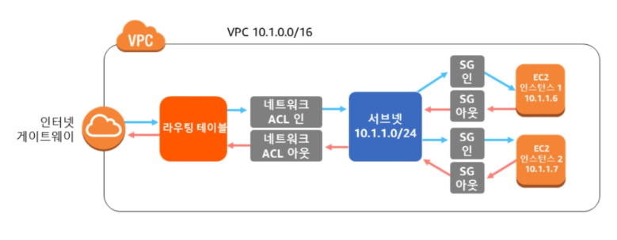
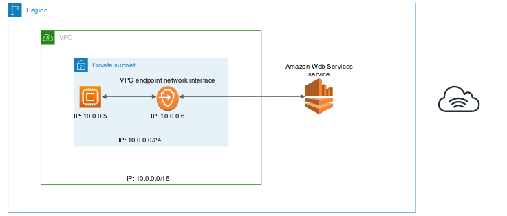
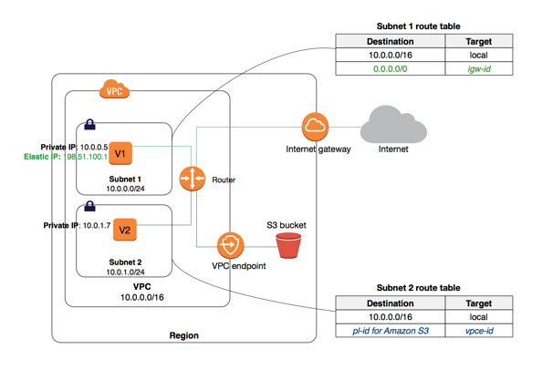

# VPC
* Cloud Network
* 서비스 제한: 리전 당 5개 생성 가능
 

## Subnet
* 한 번 설정된 Subnet은 변경할 수 없다. 
* 첫 IP 4개와 마지막 IP 주소는 AWS에 의해 예약되어 있다.
    * 0~255 = 256개
    * 10.0.0.0 : 네트워크 ID
    * 10.0.0.1 : 라우터, 게이트웨이 주소
    * 10.0.0.2 : DNS 주소
    * 10.0.0.3 : 차후 사용을 위해 AWS에서 예약
    * 10.0.0.255 : Broadcast

### Private Subnet
* 기본적으로 Inbound가 제한되어 있다.
* 외부와 연결하기 위해서는 NAT Gateway 또는 NAT Instance를 통해서 작업해야 한다.
 

### Public Subnet
* Internet Gateway에 대한 Routing Table 항목이 포함되어 있어야 한다.
  

## NAT Gateway
* 5Gbps의 대역폭, 최대 45Gbps 까지 자동 확장한다 (Gbps = Gigabit per second, 초당 전송속도 )
* 하나의 EIP만 열결할 수 있고, 연결된 후에는 연결을 끊을 수 없다.
* 네트워크 ACL(Access Control List) 만을 사용하여 트래픽 제어
* 포트는 1024 - 65535
* 서브넷의 IP 주소 범위에 속하는 Private IP 주소가 자동으로 할당된 네트워크 인터페이스를 받는다.
 

## NAT Instance
* Instance 유형에 따라 대역폭이 달라지며, 인스턴스기 때문에 확장 및 장애 조치가 필요
* EIP or Public IP를 사용할 수 있고, Public IP의 경우 변경 가능하다.
* 보안 그룹과 네트워크 ACL(Access Control List)을 사용하여 트래픽 제어
 

## Internet Gateway
* 2가지 기능이 있다.
    1) 인터넷 라우팅 기능
    2) Public IPv4 Address가 할당된 인스턴스에 대해 NAT를 수행
* 네트워크 트래픽에 가용성 위험이나 대역폭 제약이 발생하지 않는다.
 

## Elastic IP (EIP)
* EIP는 동적 클라우드 컴퓨팅을 위해 설계된 고정 퍼블리 IPv4 이다.
* EIP는 VPC의 IGW를 통해서만 액세스할 수 있다.
* AWS Region 당 5개가 허용되며, 절약을 위해서 NAT Gateway를 사용할 수 있다.
* 1개는 무료이고, 2개부터 Attach가 되면 요금이 발생.
 

## Elastic Network Interface (ENI)
* 가상 네트워크 인터페이스이다.
* ENI의 Private IP Address, Public IP Address, MAC Address를 유지한다.
* 사용하는 경우
    1) 기본 네트워크 인터페이스(eth0)가 퍼블릭 트래픽을 처리하고, 보조 네트워크 인터페이스(eth1)는 백엔드 관리 트래픽을 처리. __이렇게 되면, 서비스 IP와 관리자 IP가 나뉘므로 Log 등을 관리하기 편해진다.__ 이때 Server에 라우팅 설정이 필요하다.
    2) VPC에서 네트워크 및 보안 어플라이언스 사용. LB, NAT, Proxy Server와 같은 네트워크 및 보안 어플라이언스는 여러 네트워크 인터페이스로 구성하는 것이 좋다. __사용해야되는 영역을 분리해야 되니 필요하다__
 

## Security Group vs Network ACL
* Security Group: 가상 방화벽
* Network ACL: 방화벽
1. Operation
    * SG: Instance Level
    * ACL: Subnet Level
2. Allow/Deny
    * SG: allow rules only
    * ACL: allow and deny rules
3. State
    * SG: Stateful
        * Inbound를 허용하면 자동적으로 Outbound 허용 
        * 기본적으로 모든 Inbound는 차단이며, 모든 Outbound는 허용되어 있다.
    * ACL: Stateless
        * Inbound, Outbound 모두 명시적으로 적용해야 됨
        * 기본적으로 모든 Inbound, Outbound Traffic은 허용되어 있다.
4. Process Order
    * SG: Traffic을 허용하는지 모든 rule을 비교한다.
    * ACL: 기본적으로 선언한 순서대로 우선순위를 가지며, 그 후에는 Number Order에 의해 우선순위가 결정된다.
5. When to use?
    * ACL: 모든 트래픽에 대해 동일한 규칙을 정할 때 사용
    * SG: 해당 인스턴스에만 해당하는 규칙 및 보안 강화를 위해 사용
     

## VPC Traffic Flow

## VPC Flow Log
* VPC Flow Log는 VPC, Subnet, Network Interface 등을 통해 VPC 내 Flow를 Log로 남긴다.
1. CloudWatch Logs에 게시
    * 

2. S3에 게시
    * 

> 결론적으로 비용은 S3가 더 싸며, insight는 CloudWatch가 더 효율적이다.

## Virtual Gateway (VGW)
* 가상 프라이빗 게이트웨이
* VPC와 다른 네트워크 사이에 Private 연결 설정을 위한 방법
* VGW는 VPN 연결의 Amazon 측 집선장치이다.
* VPN 터널당 최대 대역폭은 1.25Gbps
* VGW를 생성할 때 Private ASN(자율 시스템 번호)을 지정할 수 있다. 지정하지 않은 경우, VGW는 기본 ASN(64512)으로 생성된다. 생성한 후에는 ASN은 변경할 수 없다.
> VPN + 다중 VPC를 사용할 경우에는 TGW를 사용하는 것이 더 효율적이며, VPN + 단일 VPC인 경우는 VGW를 사용하는 것이 좋다.
 

## AWS Direct Connect(DX)
* 1 또는 10 Gbps의 전용 Private Network 연결을 제공. 최대 50Gbps
* VPN의 경우, 결국에는 Public 네트워크 망을 사용하는 것이기 때문에 지속적인 대용량 데이터를 전송하거나, 보안 및 규정상 사용하기 힘든 경우가 있다.
* 서비스 이점
    1) 네트워크 전송 시 인터넷 대역폭을 두고 경쟁할 필요가 없다.
    2) 애플리케이션이 사용하는 인터넷 대역폭을 제한함으로써 네트워크 전송 비용 절감
    3) 대역폭을 두고 경쟁할 필요가 없으므로 오디오 또는 동영상 스트림과 같은 실시간 데이터 피드에서 운영되는 애플리케이션의 성능 향상에 도움
    4) 해당 Private Network 회로로만 액세스 함으로써 일반적인 보안 및 규정을 준수
    5) 하이브리드 클라우드 아키텍처 가능
 

## VPC Connection
### VPC Peering
* VPC 간의 연결할 때 사용.
* 하지만 VPC 피어링은 두 VPC 간의 일대일 관계이기 때문에, 전이적 관계를 지원하지 않는다.
* 내부 및 리전 간도 지원하며, 서로 다른 AWS 계정 간에 설정도 가능
* VPC 당 최대 125개 가능
* 대역폭의 제한은 없다.
* VPC 피어링 연결을 통한 모든 데이터 전송은 무료이며, AZ를 가로지르는 VPC 피어링 연경을 통한 모든 데이터 전송은 계속 리전 내 표준 데이터 전송 요금이 청구된다.
> 무료가 되었지만, VPC가 적은 경우에 쓰일거 같다. 1:1로만 Routing이 되기 때문이다. 예로 DMZ VPC <-> Service VPC 끼리 연결
 

### VPC Transit Gateway
* 많은 VPC 간의 통신을 위해 VPC 피어링을 하게되면 복잡해진다.
* TGW 당 VPC 연결 5000개
* VPC 당 최대 대역폭은 50 Gpbs
* VGW 대신 사용할 수 있으며, TGW 끼리도 Peering이 가능하다.
* __Association__ 은 Routing Table과 Attachement를 연결하기 위해 사용 (Attachment는 하나의 Routing Table에만 연결 가능)
* __Propagation__ 은 Routing 정보를 전파하기 위해 사용 (Attachment는 다수의 Tating Table 연결 가능)

> 기본적으로 작은 단위의 구성인 경우, VPC Peering이 더 비용적으로 효율적이다.
 

## VPC Endpoint

* AWS를 벗어나지 않고 EC2 인스턴스를 VPC 외부 서비스와 Private하게 연결한다.
* AWS PrivateLink 사용
* IGW, VPN, NAT or Proxy를 사용할 필요가 없다.
* 대신 동일한 리전에 있어야 한다.
* VPC Endpoint 유형
    1) Interface Endpoint: EC2에 네트워크 카드를 추가해서 사설의 네트워크 사용. ENI가 추가가 된다.
    2) Gateway Endpoint: EC2와 S3 or DynamoDB를 연결할 때 전용의 게이트웨이를 둔다. ENI가 추가되지 않는다.
        
    3) Gateway Load Balancer Endpoint
 

## VPC Traffic Mirroring
* 네트워크 트래픽 캡처 및 검사 기능
* ENI를 통해서 캡처를 하는 것이기 때문에, ENI 사용이 필요하며
 
 

## DHCP Option Set

## Cost
* __VPC Reachability Analyzer__
    * 분석당 요금: 0.10 USD
* __AWS PrivateLink__
    * AZ별 VPC Endpoint 요금: 0.013 USD per hour
    * Region에서 월별로 처리된 데이터 : >= 0.01 USD
* __NAT Gateway__
    * NAT Gateway 당 요금: 0.059 USD per hour
    * 처리된 데이터 요금: 0.059 USD per hour
* __EIP__
    * 실행 중인 인스턴스와 연결된 각 추가 IP 주소: 0.05 USD per hour
    * 사용하지 않는 IP: 0.05 USD per hour
    * 안 쓰면 그냥 지우자!
* __ENI__
    * EC2 데이터 송수신 비용
* __VPC Mirroring__
    * ENI 별 요금: 0.015 per hour

### Private Virutual Gateway vs Transit Gateway
| Service | Site-to-Site VPN 연결당                      | VPC 연결당          |
| ------- | -------------------------------------------- | ------------------- |
| VGW     | 0.05 USD (per hour) + EC2 데이터 송수신 비용 | 무료                |
| TGW     | 0.05 USD (per hour) + EC2 데이터 송수신 비용 | 0.07 (per hour) + 0.02 (per GB) |
* 기본적으로 연결만 보면 VGW가 싸다.
* 하지만 VGW에서 연결된 VPC에서 다른 VPC와의 Routing이 필요한 경우, Routing을 처리해줄 Server가 필요하기 때문에 Architecture에 따라 TGW가 비용이 더 저렴할 수 있다.

### VPC Peering vs Transit Gateway
| Service | VPC 연결당 | 데이터 송수신 비용 | 비고 |
|---------|------------|-------------------|------|
| Peering | 무료 | 무료 |  |
| TGW | 0.07 USD | 0.02 USD (GB 당) |  |
* 무조건 VPC Peering이 저렴하다.
* Reference: https://dev.classmethod.jp/articles/different-from-vpc-peering-and-transit-gateway/

