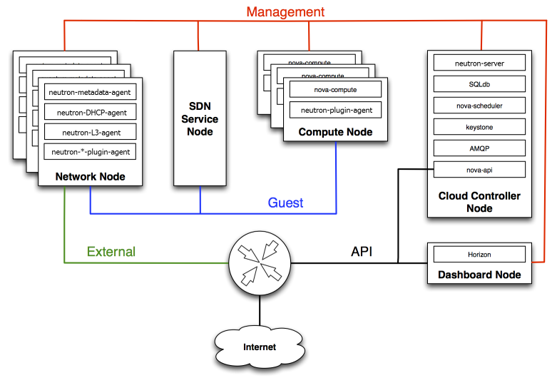
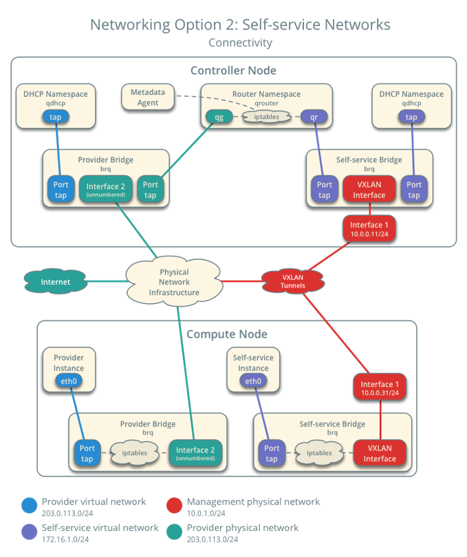

# Architecture

## Network

## 1. Network Architecture (Basic)

* OpenStack의 Netowrk는 기본 구조는 최대 4개의 고유한 __물리적 데이터 센터 네트워크__ 가 있다.
 

### __API Network__
* OpenStack Service API를 노출시켜 모든 사용자가 연결할 수 있어야 한다.
 

### __Management Network_
* OpenStack 구성 요소 간의 내부 통신에 사용된다. 해당 Network는 데이터 센터 내에서만 연결할 수 있어야 한다.
 

### __Guest Network__
* 배포된 Cloud 내에서 VM 데이터 통신에 사용된다(내부적으로는 VXLAN 기술을 사용하여 Overlay Network 구성)
* External Network : VM에 인터넷 액세스를 제공하는데 사용된다.
 

## 2. Provider/Self-service Network Architecture

* 각 Service들은 크게 Provider Network와 Self-Service Network를 구축해야 한다.
 

### __Provider Network__
* Provider가 Services(Self-service Network)를 제공하기 위해 구축하는 네트워크
* Physical Network 사용
* Guest Network, External Network가 이에 해당
 

### __Self-service Network__
* User가 생성한 Resources 간의 네트워크 (Ex> VM 간의 네트워크)
* Virtual Network 사용(VXLAN/GRE)
* Guest Network가 이에 해당
 
 

## 3. Network Architecture (Detail)

* 

### Reference
* OpenStack
    * https://docs.openstack.org/ocata/networking-guide/intro-os-networking.html
    * https://docs.openstack.org/security-guide/networking/architecture.html
    * https://docs.openstack.org/mitaka/ko_KR/install-guide-obs/launch-instance-networks-selfservice.html
* Redhat : https://access.redhat.com/documentation/en-us/red_hat_openstack_platform/11/html/architecture_guide/components#sec-networking
* Oracle : https://docs.oracle.com/cd/E65465_01/html/E61044/archover.html
* https://ssup2.github.io/theory_analysis/OpenStack_Network_Neutron/
* https://printf.kr/3