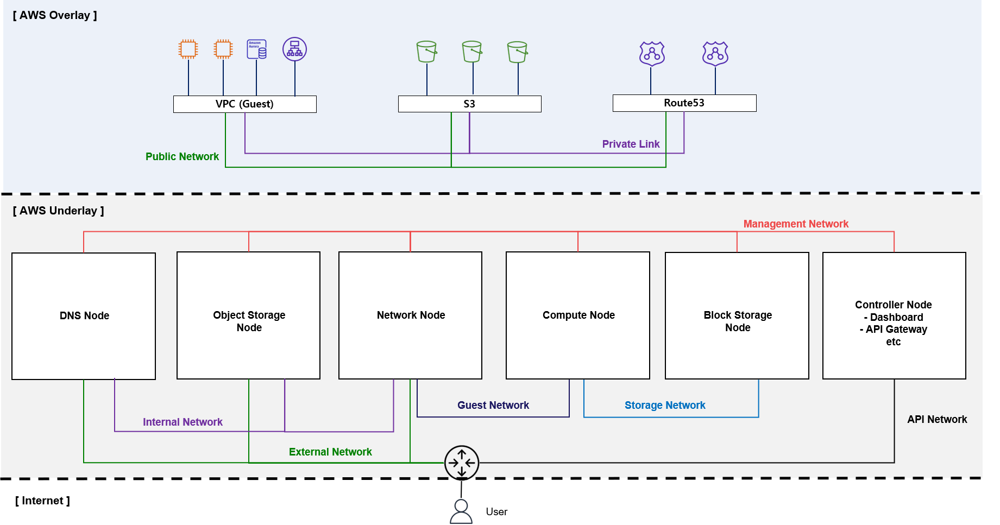

# Architecture

## Network

## 1. Network Architecture (Basic)

* OpenStack의 Netowrk는 기본 구조는 최대 4개의 고유한 __물리적 데이터 센터 네트워크__ 가 있다.
 

### __API Network__
* OpenStack Service API를 노출시켜 모든 사용자가 연결할 수 있어야 한다.
 

### __Management Network__
* OpenStack 구성 요소 간의 내부 통신에 사용된다. 해당 Network는 데이터 센터 내에서만 연결할 수 있어야 한다.
 

### __Guest Network__
* 배포된 Cloud 내에서 VM 데이터 통신에 사용된다(내부적으로는 VXLAN 기술을 사용하여 Overlay Network 구성)
 

### __External Network__
* VM에 인터넷 액세스를 제공하는데 사용된다.
 

## 2. Provider/Self-service Network Architecture (2-Node)

* 위 그림은 2-Node Self-service Network Architecture 이다. 여기서는 네트워크 3계층 VXLAN을 사용하여 Instance 내부 통신이 이뤄진다. 
* 추가적으로 Provider Network Architecture에서는 기존에 구축되어 있는 네트워크 2계층을 사용하여 (일반적으로 물리 네트워크 사용) Instance 내부 통신이 이뤄진다.
> Self- Service Network 구축 시, Provider/Self-service Network 모두 구축되어야한다.
* Provider Network
    * Provider가 Network를 제공하기 위해 구축하는 네트워크
    * 여기서는 Self-service Network가 구축됨으로써 Provider Network는 External Network와 같아진다고 생각하면 될거 같다.
* Self-service Network
    * User가 생성한 Resources 간의 네트워크
    * Guest Network와 같아진다고 생각하면 될거 같다.
 

### __Self-service Network__
* User가 생성한 Resources 간의 네트워크 (Ex> VM 간의 네트워크)
* Virtual Network 사용(VXLAN/GRE)
* Guest Network가 이에 해당
 
 

## 3. Self-service Network Architecture (3-Node)

* 2번과 구조가 달라진것을 확인할 수 있다.
* Provider Network는 Network Node 에만 연결되어 있으며, 이를 통해 외부로 나간다고 생각하면 될거 같다.
> 해당 그림에는 Controller가 빠졌지만 실제로는 구축된다.
 

## 4. Network Architecture (AWS)

* OpenStack으로 AWS를 구축한다고 하면 다음과 같은거라 생각해서 비교하기 위해 그렸다.
* Network 비교 표
    | Underlay               | Overlay                                                     |
    | ---------------------- | ----------------------------------------------------------- |
    | External Network       | Public Network (Internet Gateway or Global Service)         |
    | Internal Network       | Private Link                                                |
    | Guest Network          | VPC and Subnet, 서비스 내부 네트워크                        |
    | Storage Network        | 안 보임 / 각 서비스들끼리만 연결하는 네트워크 (EC2 <-> EBS) |
    | Management/API Network | 안 보임                                                     |
* VPC Enpoint 생성 == Internal Network에 Domain + Routing 작업
 
 

### Reference
* OpenStack
    * https://docs.openstack.org/ocata/networking-guide/intro-os-networking.html
    * https://docs.openstack.org/secur*ity-guide/networking/architecture.html
    * https://docs.openstack.org/neutron/xena/admin/deploy-lb-selfservice.html
    * https://docs.openstack.org/mitaka/ko_KR/install-guide-obs/launch-instance-networks-selfservice.html
* Redhat
    * https://www.intel.com/content/dam/www/public/us/en/documents/reference-architectures/redhat-cloud-blocks-reference-architecture.pdf
    * https://access.redhat.com/documentation/en-us/red_hat_openstack_platform/11/html/architecture_guide/components#sec-networking
* Oracle : https://docs.oracle.com/cd/E65465_01/html/E61044/archover.html
* https://ssup2.github.io/theory_analysis/OpenStack_Network_Neutron/
* https://printf.kr/3