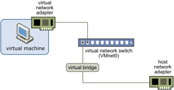
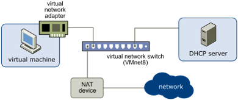
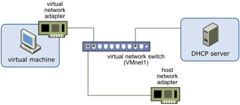

# VMware Network

## Network 구성
* Ref : https://docs.vmware.com/en/VMware-Workstation-Pro/16.0/com.vmware.ws.using.doc/GUID-D9B0A52D-38A2-45D7-A9EB-987ACE77F93C.html
* Windows 용 VMware에서는 총 10개의 Switch를 제공한다.
* 원하는 Switch를 설정하여 Network를 구성할 수 있다.
 

### Bridged Networking (VMnet0)

* https://docs.vmware.com/en/VMware-Workstation-Pro/16.0/com.vmware.ws.using.doc/GUID-BAFA66C3-81F0-4FCA-84C4-D9F7D258A60A.html#GUID-BAFA66C3-81F0-4FCA-84C4-D9F7D258A60A
* Host의 Network adapter와 연결되어 있는 Switch이다.
* Bridged Networking을 통해 Virtual Machine은 물리적인 시스템으로 인식되고, 공유기는 개별적으로 Host Network 대역 IP를 할당한다. 이를 통해 VM은 외부 통신이 가능해진다.
* 해당 Switch를 통해 Host 뿐만 아니라 동일한 Switch에 연결된 System와 통신이 가능하다.
 

### NAT Networking (VMnet8)

* https://docs.vmware.com/en/VMware-Workstation-Pro/16.0/com.vmware.ws.using.doc/GUID-89311E3D-CCA9-4ECC-AF5C-C52BE6A89A95.html#GUID-89311E3D-CCA9-4ECC-AF5C-C52BE6A89A95
* Host가 아닌 NAT Device에 연결되어 있는 Switch이다.
* Virtual Machine은 NAT Device를 통해 다른 네트워크와 통신하고, 가상 DHCP Server로부터 내부 Network 대역 IP를 할당받는다.
* NAT Device를 통해 Host와 통신한다. 그리고 Host가 Gateway 역할을 하게 되어 외부와 통신도 가능하다.
* NAT에 대한 설정이 필요하다(Port Forwaring).
 

### Host-Only Networking (VMnet1)

* https://docs.vmware.com/en/VMware-Workstation-Pro/16.0/com.vmware.ws.using.doc/GUID-93BDF7F1-D2E4-42CE-80EA-4E305337D2FC.html#GUID-93BDF7F1-D2E4-42CE-80EA-4E305337D2FC
* NAT Networking과 같이 Host와 다른 Network 대역을 사용한다.
* NAT Device가 따로 존재하지 않기 때문에 Host 및 외부와는 통신이 불가능하다.
 

### Cunstom Networking
* https://docs.vmware.com/en/VMware-Workstation-Pro/16.0/com.vmware.ws.using.doc/GUID-AB5295E7-7EFC-4B3A-81E7-7FC444D81F07.html#GUID-AB5295E7-7EFC-4B3A-81E7-7FC444D81F07
 

