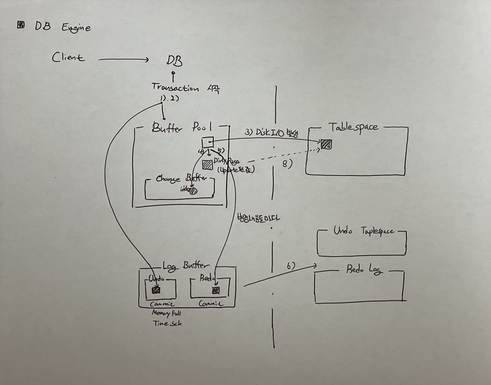

# Structure

## Basic
- DB Server는 크게 Memory/Disk 로 구분할 수 있다. Memory/Disk로 분리함으로써, Disk에 저장 시 에러가 발생해도 Log를 통해 Rollback이 가능해진다.
- WAL(Write Ahead Logging) : 가장 중요한 원칙 중 하나로, 트랜잭션이 발생하기 전에 데이터 파일에 대한 모든 변경 사항은 WAL(InnoDB에서는 redo 로그를 의미)에 의해 기록된다(Query가 기록됨). 트랜잭션이 발생하기 전에 로그를 미리 저장하기 때문에 Rollback이 가능해진다.
- Vacuum : 
- Data Buffer Cache : DB 의 최소 입출력 단위인 Block 이 상주하는 곳으로, 쿼리 수행시에 필요한 Data block 이 위치하는 메모리 영역.
- Log Buffer : 쿼리 수행시 변경사항 (DML) 에 의해 Data 의 변경이 발생한 내역을 Log 로 남겨 저장하는 메모리의 영역.
- Checkpoint : Buffer Cache에서만 변경되었다가, Disk에 기록될 때 발생. Buffer Cache에 저장된 모든 데이터는 Disk에 반영한다. 
    - 주기적인 스케줄링
    - Log File이 다 차서 다른 Log File로 변경되는 경우 (redo log나 transaction log가 특정 크기 이상으로 커지면)
    - 메모리 부족 시
    - 수동 체크포인트
- Commit : Checkpoint 이전에 발생할 수 있는 에러에 대비하여 Recovery 를 제공하는것. 즉, Data 변경사항에 대하여 redo log 를 남기는 행위이며, checkpoint는 Data buffer cache 의 변경된 dirty buffer block을 data file 에 기록하는 것.

- InnoDB : 독보적인 스토리지 엔진. MVCC를 지원하여 높은 동시성 처리가 가능함.
- MVCC : Multi Version Concurrency Control. 버퍼 풀, 언두 로그를 이용해 격리 수준에 따른 읽기 기능 제공. 이에 따라 No-Locking Consistent Read가 가능.
- Dirty Page : 리눅스에서 Read/Write 작업에 대해 무조건 Disk에 접근하는 것이 아닌 메모리에 있는 pagecache 영역에 접근하여 작업을 진행한다. Read 작업인 경우, pagecahce 작업 후 데이터가 없으면 Disk 접근. Write 작업인 경우, pagecache 접근하여 Disk에서 읽어들였던 값을 변경하게 된다. 하지만 이렇게 되면 해당 page는 변경이 되어서 실제 Disk와 내용이 달라지게 된다. 이 page를 Dirty Page라고 한다(https://brunch.co.kr/@alden/32). 즉, 데이터가 변경되었지만 아직 디스크(Tablespace)에 동기화되지 않은 page를 의미한다.
- Undo : Transaction 시작 시 기존 값을 저장함으로써, Transaction 실패 시 기존 값으로 변경하기 위해 변경 전 값을 저장하는 로그. Transaction 실패 시, 원래 값으로 복원하기 위해 사용
- Redo : Transaction 완료 후(== Commit), 이상이 없던 상태 그대로의 값을 남기기 위해 값을 저장하는 로그. 그래서 시스템 장애에 대하여 데이터를 복구하기 위해 사용됨

 

### Reference
* https://stackoverflow.com/questions/56823591/mysql-innodb-differences-between-wal-double-write-buffer-log-buffer-redo-log
* https://m.blog.naver.com/PostView.naver?isHttpsRedirect=true&blogId=parkjy76&logNo=220918956412
* https://qiita.com/yoheiW@github/items/8a5326a516ec4452e774#%E6%9B%B4%E6%96%B0%E5%87%A6%E7%90%86
* https://blog.ex-em.com/1700
 
 

## Transaction / REDO / UNDO
* Database Transaction: ACID
    * 한꺼번에 수행되어야 하는 일련의 연산들. 한꺼번에 완료가 되지 않으면 한꺼번에 취소되어야하는 원자성을 가지고 있다. 독립성, 지속성, 일관성
    * 완료가 되면 __COMMIT__ 호출.
    * 취소가 되거나 문제가 발생하면 __ROLLBACK__ 호출.
* 어떤 작업을 하든지 모두 REDO, UNDO에 기록되며 복구에 사용. 복구 시 차이가 나는데 __REDO는 사용자가 작업한 순서대로 다시 복구__ 하지만, __UNDO는 사용자가 작업한 순서 반대로 복구 진행__ 된다.
* Undo 복구 : 트랜잭션이 진행되기 전 상태의 데이터로 되돌리는 것
    - 트랜잭션이 비정상 종료가 되어 중간까지의 내용만 Disk에 Write되었을 때
* Redo 복구 : 트랜잭션이 진행된 후 상태의 데이터로 되돌리는 것 (이미 Commit된 내용을 재반영하는 작업)
    - Memory에만 Write되고, Disk에는 Write되지 않았을 때
* __ROLLBACK__ 시, __UNDO__ 를 이용하여 ROllBACK 진행.
* __UNDO Log__ 는 __REDO Log__ 를 통해 복구 가능 (트랜잭션 이후 데이터를 가지고 있기 때문에 복구 가능한거 같다, Last -1 데이터로 복구 같은 방식으로(추측)).
 
 

## Log
Database의 모든 작업을 기록한다.
* "로그 레코드 식별자" : LSN(Log Sequence Number) or LSA(Log Sequence Address) 라고 한다.
* 로그 방식
    1. 물리적 상태 로깅 (Physical state logging) : 트랜잭션 실행 이전 데이터(Undo log)와 이후 데이터(Redo log) 모두 로그에 기록
    2. 물리적 전이 로깅 (Physical transition logging) : 트랜잭션 실행 이전 데이터와 이후 데이터의 XOR 차이점을 로그에 기록하다 ((추측) 차이가 나는 부분은 표시가 되어 있지 않을까 싶고, 하나의 파일로 저장할거 같다)
    3. 논리적 전이 로깅 (Logical transition logging) : 트랜잭션이 어떤 일을 했는지 기록하는 방식 (논리적 : a = 0; a = a + 1; / 물리적 : 이전값 - a = 0, 이후 값 - a = 1). 한마디로 Query 문을 저장한다.

## 저장 방식
SGA : 공유 메모리
LRU(Least Recently Used) : 캐싱 방식은 LRU(Least Recently Used) 알고리즘 형태로 적재. 가장 오랫동안 참조되지 않은 페이지를 교체하는 방식
* File : 

## Binary Log vs Redo Log
|        | Redo Log | BinLog |
|--------|------------|----------|
| 출력원 | Engine Level | Server Level |
| 구분 | 물리적 로그 | SQL 문을 기록하는 논리적인 로그 |
| 용도 | Engine의 갱신 정보의 일시적 보존. ACID를 보장. Recovery | DB의 데이터 복원. Replication |
* 각 Log는 CREATE, DROP, ALTER 등과 같은 변경사항이 발생할 때마다 변화된 이벤트를 기록한다.
> 찾아본 결과 전체적이 생성 위치나 특징이 다를 수 있지만, 결국 Rollback과 Replication, Recovery에 사용되는 Log 들이다.
 
 

## Character Set & Collation
### Character Set
* 문자 저장시, 인코딩 방식
* 일반적으로 다음과 같은 방식 사용
    1) UTF-8
    2) UTF-16
    3) ASCII
    4) EUC-KR
* 데이터를 저장하는 관점
    1) Server-Level
    2) Database-Level
    3) Table-Level
    4) Column-Level
* Server와 Client 간의 관점
    1) character_set_client: Client -> Server로 넘어올 때, Client가 넘겨줄 때의 방식
    2) character_set_connection: Client -> Server로 넘어올 때, Server가 해석하는 방식
    3) character_set_results: Server -> Client로 응답을 넘겨줄 때의 방식

> 인코딩 방식에 대해서 확인할 때, 데이터를 저장하는 관점 4개와 Server-Client 간의 관점 3개 모두 확인해봐야 한다.

### Collation
* 데이터베이스에 저장된 값들을 검색하거나 정렬 등의 작업을 위해 문자들간에 서로 비교할 때 사용하는 규칙들의 집합
* CHAR, VARCHAR, TEXT와 같은 데이터 타입을 가지는 Column에 대해서만 적용된다 (주로 대소문자 구별)

* https://m.blog.naver.com/PostView.naver?isHttpsRedirect=true&blogId=cambo95&logNo=100106067950

---
## Structure

기본 엔진 구성은 Process, Memory, Disk로 구성되어 있다.
* Select문 순서
    1) Transaction 시작
    2) Select query 실행
    3) User Thread(Query 처리하는 쓰레드)에서 Buffer Pool에 원하는 Data Page를 검색. 없는 경우 디스크의 Tablespace에 액세스하여 원하는 Page를 Buffer Pool에 로드한다 (== Disk I/O 발생하는 과정)
    4) 캐싱한 이후 정보를 반환한다.
* 데이터 업데이트 순서는 다음과 같다.
    
    1) Transaction 시작
    2) Update query 실행. 변경 전 값(Undo Log)과 PK값을 Log Buffer에 저장한다.
    3) User Thread(Query 처리하는 쓰레드)에서 Buffer Pool에 원하는 Data Page를 검색. 없을 경우 Disk의 Tablespace에 액세스하여 원하는 Page를 Data Lock을 걸고(== pinned), Buffer Pool에 캐싱한다. 그리고 인덱스가 있으면 인덱스 값을 Change Buffer에 가지고 온다.
    4) Buffer Pool(memory)에 있는 값을 가지고 Update 진행 → 값 변경으로 인한 Dirty Page 생성
    5) Buffer Pool에 업데이트된 트랜잭션 내용들을 Redo Log로써 Log Buffer(memory)에 저장.
    6) Undo Log는 Commit 동작 시 or Log Buffer가 Full일 경우 or 일정 주기마다 Log Buffer에 있는 내용을 Log File(disk)에 저장한다. Redo Log는 Commit 시에만!
    7) 그리고 일정 주기마다 또는 Log File이 Full인 경우 Checkpoint가 발생한다.
        > CDC는 이를 기준으로 Squence를 확인하여 실행한다(정확하지 않다!!!)
    8) Checkpoint가 발생하면, 안에 들어있던 내용들을 기준으로 Buffer Pool에 있는 Dirty Page를 Tablespace와 동기화시킨다(Disk I/O 발생). 디스크로 flush하는 순간(테이블에 저장할 때) partial page writes(시스템 장애 등으로 덮씌워지는 경우)로 인한 충돌을 방지하기 위해 Background로 Dubblewrite_buffer에 저장하고, Tablespace에 저장한다.
    9) Flush 후, Buffer Pool에 있는 내용은 삭제된다.
> RW와 다르게 RO는 Redo Log 작업이 필요가 없기 때문에 같은 성능인 경우 Read에 대해 더 빠를 수 있다.

## Process
* Foreground Thread: 클라이언트가 요청한 Query를 처리하는 Thread
* Background Thread: 데이터베이스의 유지 관리 작업을 처리하는 Thread
 

## Memory
Storage Engine Memory의 가장 큰 이유는 Disk I/O를 최소화하기 위해서이다!!
* Buffer Pool (Shared Buffers) : 가장 먼저 데이터를 확인하는 위치로, 데이터를 캐싱하고 있는 버퍼. 데이터를 확인하기 위해 디스크에 먼저 접근하지 않고, 버퍼에 데이터가 있는지 먼저 확인한다(Disk I/O 최소화)
* Change Buffer/Insert Buffer : 보조 인덱스를 위한 버퍼. 보조 Index는 일반적으로 유니크하지 않고 정렬도 되지 않은 경은 상태이다. 그렇다보니 보조 인덱스 Update 작업은 랜덤 디스크 읽는 작업이 필요하기 때문에 큰 I/O가 발생한다(클러스터형 인덱스는 정렬된 순서로 들어가기 때문에 괜찮다). 이를 해결하기 위해 즉시 변경하는 것이 아닌 해당 버퍼에 임시로 저장해놓고 추후 디스크에 변경사항을 flush 한다.
* Log Buffer (WAL Buffers) : Update 시에 변경되는 내용을 버퍼에 저장한다. 이후에 버퍼를 비우면서 디스크에 있는 로그 파일에 저장한다.
 

## Disk
* Undo Tablespaces (WAL File) : 
* Redo Log (WAL File) : 
* System Tablespace
* File-Per-Table Tablespace : 테이블 당 
* General Tablespace
* Undo Tablespace
* Temporary Tablespace

https://omty.tistory.com/59
https://ssup2.github.io/theory_analysis/MySQL_Buffer_Pool_Redo_Log_Log_Buffer/
https://blog.naver.com/lyh1620/220794460510
http://www.cs.emory.edu/~cheung/Courses/377/Syllabus/10-Transactions/undo-log.html
https://creampuffy.tistory.com/168
https://jeong-pro.tistory.com/239
https://overcome-the-limits.tistory.com/664?category=1006727

https://velog.io/@pk3669/Mysql-Redo-Undo-Log
https://peterica.tistory.com/389

### Postgresql
- https://en.wikibooks.org/wiki/PostgreSQL/Architecture
- https://www.geeksforgeeks.org/postgresql-system-architecture/
- https://www.youtube.com/watch?v=cWyVfATZ7H4

