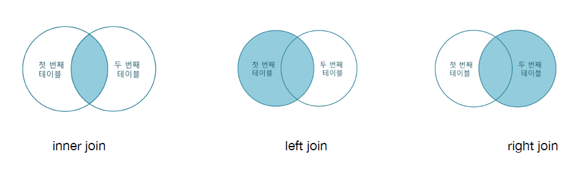

# JOIN * Sub Query

## JOIN
* 여러 개의 테이블에서 데이터를 모아서 보여줄 때 사용
* ON 에서 설정한 값을 키 값 설정하여 JOIN을 한다.

1. INNER JOIN
    * 두 테이블 사이에 공통된 값이 없는 row는 출력하지 않는다.
2. LEFT JOIN 
    * 왼쪽 테이블을 기준으로 왼쪽 테이블의 모든 데이터가 출력되고 매핑되는 키 값이 없으면 NULL로 출력
3. RIGHT JOIN
    * 오른쪽 테이블을 기준으로 오른쪽 테이블의 모든 데이터가 출력되고 매핑되는 키 값이 없으면 NULL로 출력

```
# Table Example
# money Table
| name |  income  |
|   A  |   100    |
|   B  |   200    |
|   B  |   300    |
|   D  |   100    | 

# user Table
| name |   addr   |
|   A  |  seoul   |
|   B  |  pusan   |
|   C  |  incheon | 
```

## UNION
* SELECT 문의 결과 데이터를 하나로 합쳐서 출력.
* Column의 개수와 타입, 순서가 같아야 한다.
* UNION은 자동으로 distinct를 하여 중복을 제거한다.
    ```
    SELECT name
    	FROM user
        UNION
    		SELECT name
    			FROM money;
    ```

* 중복 데이터를 제거하지 않으려면, **UNION ALL**을 사용하면 된다.
    ```
    SELECT name
    	FROM user
        UNION ALL
    		SELECT name
    			FROM money;
    ```

* **FULL OUTER JOIN**
    * UNION을 이용하여 FULL OUTER JOIN 구현
    * UNION을 사용함으로 LEFT, RIGHT JOIN의 중복을 제거
    ```
    SELECT user.name, user.addr, money.income
    	FROM user
        LEFT JOIN money
        ON user.name = money.name
    UNION
    SELECT money.name, user.addr, money.income
    	FROM user
        RIGHT JOIN money
        ON user.name = money.name;
    ```

## Sub Query
* Query 문 안에 있는 query를 의미.
* SELECT 절, FROM 절, WHERE 절 등에 사용 가능

1. SELECT 절
    ```
    SELECT
        (SELECT count(name) FROM city) AS total_city,
        (SELECT count(name) FROM country) AS total_country,
        (SELECT count(DISTINCT(Language)) FROM countrylanguage) AS total_language
    FROM DUAL;
    ```
2. FROM 절
    ```
    SELECT *
    FROM
        (SELECT countrycode, name, population
        FROM city
        WHERE population > 8000000) AS city
    JOIN
        (SELECT code, name
        FROM country) AS country
    ON city.countrycode = country.code;
    ```
3. WHERE 절
    ```
    SELECT code, name, HeadOfState
    FROM country
    WHERE code IN (
        SELECT DISTINCT(countrycode) FROM city WHERE population > 8000000
    );
    ```
