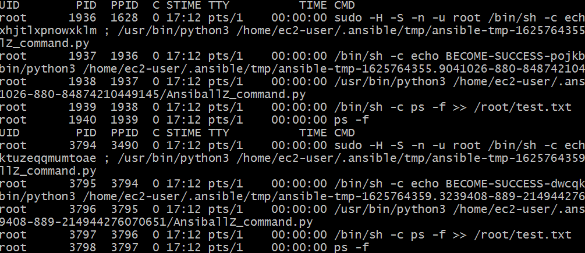

# Ansible Start

## Install
* 공식문서 : https://docs.ansible.com/ansible-core/devel/installation_guide/intro_installation.html#control-node-requirements
* 설치시, 필요한 ```ansible```, ```ansible-core```와 ```Python``` version을 체크해야 한다.
* Ansible은 community package ```ansible```과 ```ansible-core```을 포함하고 있다(2.10 version에서는 ```ansible-base```로 사용된다)

1. Install Ansible
   * Python ```pip```를 이용하여 설치
   * 명령어: ```$ python -m pip install --user ansible```

2. Install paramiko module
    * connection plugin or module들에서 사용되어진다.
    * 명령어: ```$ python -m pip install --user paramiko```

---
## Basic
* Anible의 기본 언어는 YAML 언어이다.
* Ansible은 크게 2개의 Component를 가진다.
	- Controller Node: Ansible 설치된 모든 시스템. Windows machine은 Control Node가 될 수 없다.
    - Managed Node: Ansible로 관리되는 장치. "hosts"라고도 한다.
* 구성 요소
    - Ansible Config: Ansible 환경변수 정의 파일.
	- Inventory: Managed node들의 IP address 목록을 정의하는 파일, "hostfile"이라고 말한다. Managed node들의 IP address나 그룹화 등의 정보가 저장된다.
	- Module: Ansible에서 정의해둔 실행 단위로 실행할 수 있는 라이브러리를 의미.
	- Role: 핵심 구성 요소로 Service 전반적인 코드를 Playbook에서 충분히 재사용하도록 모듈화할 수 있다. 즉, 하나의 기능, 동작을 의미한다.
	- Playbook: Anisble 구성, 배포 및 오케스트레이션이 포함된 파일. 해당 파일을 작성함으로 OS 구성에서 응용 프로그램 배포와 모니터링까지 시스템의 상태를 순차적으로 정의할 수 있다. 즉, 어떤 Role을 사용하여 동작시킬지, 어떤 Inventory를 사용하여 대상을 선택할지 정한다!
</br>
</br>


---
## Ansible Task 처리 과정

* Ansible은 Task 실행 시, 하나의 Module을 처리할 때마다 독립된 Process를 실행시켜 처리한다!
* 동일한 command를 처리해도 PID가 다른 것을 볼 수 있다.
> 그렇기 때문에, 하나의 Terminal에서 처리해야 되는 경우 주의해야 한다.

### Ansible 명령어
* 


### Anisble 그 외 명령외
* ```ansible-doc <command>```: <command> 모듈에 대한 문서를 확인할 수 있다.

---
## Ansible Directory Structure
```
ansible.cfg				# Anible Config File

inventories/
   production/
      hosts               # inventory file for production servers
      group_vars/
         group1.yml       # here we assign variables to particular groups
         group2.yml
      host_vars/
         hostname1.yml    # here we assign variables to particular systems
         hostname2.yml

   staging/
      hosts               # inventory file for staging environment
      group_vars/
         group1.yml       # here we assign variables to particular groups
         group2.yml
      host_vars/
         stagehost1.yml   # here we assign variables to particular systems
         stagehost2.yml

library/                  # if any custom modules, put them here (optional)
module_utils/             # if any custom module_utils to support modules, put them here (optional)
filter_plugins/           # if any custom filter plugins, put them here (optional)

site.yml                  # master playbook
webservers.yml            # playbook for webserver tier
dbservers.yml             # playbook for dbserver tier

roles/
    common/               # this hierarchy represents a "role"
        tasks/            #
            main.yml      #  <-- tasks file can include smaller files if warranted
        handlers/         #
            main.yml      #  <-- handlers file
        templates/        #  <-- files for use with the template resource
            ntp.conf.j2   #  <------- templates end in .j2
        files/            #
            bar.txt       #  <-- files for use with the copy resource
            foo.sh        #  <-- script files for use with the script resource
        vars/             #
            main.yml      #  <-- variables associated with this role
        defaults/         #
            main.yml      #  <-- default lower priority variables for this role
        meta/             #
            main.yml      #  <-- role dependencies
        library/          # roles can also include custom modules
        module_utils/     # roles can also include custom module_utils
        lookup_plugins/   # or other types of plugins, like lookup in this case

    webtier/              # same kind of structure as "common" was above, done for the webtier role
    monitoring/           # ""
    fooapp/               # ""


```


---
## Use Ansible
## Ansible Config 파일 설정
* https://docs.ansible.com/ansible/latest/reference_appendices/config.html#default-roles-path
* Ansible 기본 설정 정의 파일. 우선순위는 다음과 같다.
    * ```ANSIBLE_CONFIG``` (environment varable if set)
    * ```ansible.cfg``` (in the current direcotry)
    * ```~/.ansible.cfg``` (in the home directory)
    * ```/etc/ansible/ansible.cfg```
* Example
    ```
    # $ ansible-config init --disabled > ansible.cfg
    # $ ansible-config init --disabled -t all > ansible.cfg
    # /etc/ansible/ansible.cfg

    [defaults]
    inventory = inventories
    host_key_checking = False
    retry_files_enabled = False
    remote_user = ec2-user
    private_key_file = ~/.ssh/id_rsa
    timeout = 30
    forks = 10
    log_path = /var/log/ansible.log
    become = True
    become_method = sudo
    become_user = root

    [privilege_escalation]
    become = True
    become_method = sudo
    become_user = root
    become_ask_pass = False

    [ssh_connection]
    ssh_args = -o ControlMaster=auto -o ControlPersist=60s
    control_path = %(directory)s/%%h-%%r
    pipelining = True

    [paramiko_connection]
    record_host_keys = False

    [persistent_connection]
    connect_timeout = 30
    connect_retries = 10
    connect_interval = 1

    [accelerate]
    accelerate_port = 5099
    accelerate_timeout = 30
    accelerate_connect_timeout = 5

    [selinux]
    warn = False

    [colors]
    highlight = white
    verbose = blue
    warn = bright purple
    error = red
    debug = dark gray
    deprecate = purple


    # ./ansible.cfg
    [defaults]
    roles_path = ./roles

    ```
- [defaults] : Ansible의 기본 설정을 정의합니다.
- [privilege_escalation] : 특권 상승 관련 설정을 정의합니다.
- [ssh_connection] : SSH 연결 관련 설정을 정의합니다. 예를 들어, ControlMaster와 ControlPersist 옵션을 사용하여 연결을 유지할 수 있습니다.
- [paramiko_connection] : Paramiko 연결 관련 설정을 정의합니다. Paramiko는 Python에서 SSH2를 사용하기 위한 모듈입니다.
- [persistent_connection] : Ansible의 지속적인 연결 설정을 정의합니다. Ansible의 연결이 끊어지지 않도록 유지하는 설정을 포함합니다.
- [accelerate] : Ansible의 가속화 모드 설정을 정의합니다. 가속화 모드는 작업 속도를 높이기 위해 사용됩니다.
- [selinux] : SELinux 관련 경고 및 설정을 정의합니다.
- [colors] : 터미널 컬러 출력을 정의합니다. Ansible 출력의 색상을 사용자 정의할 수 있습니다.
> 가장 많이 사용되는 Config 파일 위치는 현재 디렉토리에 있는 Config이다.

</br>

## 1. user 생성 및 sudo 권한 부여
* 기본적으로 root로 권한으로 모든걸 수행하는 것은 바람직하지 않다.
* Control Node의 User name이 Managed Node에도 동일하게 존재해야 한다.
* 그리고 기본적을 ssh 접속을 하기 때문에, key도 공유해야 한다.
* Example
    ```
    # Control, Managed node 모두 동일한 유저가 있어야 한다.
    $ useradd -c "user for ansible" -E -1 -s /bin/bash -u 5000 -p 0000000!! ansible
    $ echo "ansible ALL(ALL) NOPASSWD: ALL" >> /etc/sudoers
    
	```
	- c : Comment
	- E : 만료 활성화 (비활성화 : -1)
	- M : 만료기간 설정 (무제한: 99999)
<br>


## 2. Inventory 파일 생성
* 어떤 Managed Node를 관리할지 Inventory 파일에 작성한다.
* 기본적으로 ```/etc/ansible/hosts``` 파일에 정의한다.
* https://docs.ansible.com/ansible/latest/user_guide/intro_inventory.html
* Example
    ```
    # Inventory Structure (inventory/...)
    .
    ├── 01-openstack.yml          # configure inventory plugin to get hosts from OpenStack cloud
    ├── 02-dynamic-inventory.py   # add additional hosts with dynamic inventory script
    ├── 03-on-prem                # add static hosts and groups
    ├── 04-groups-of-groups       # add parent groups
    ├── group_vars
    │   └── all
    ├── hosts
    └── host_vars    
    ```
    * Ansible은 파일 이름에 따라 ASCII 순서로 병합한다. 파일에 접두사를 추가하여 로드 순서를 제어할 수 있다.

    ```
    # hosts file
    all:
      hosts:
        172.16.30.91
      children:
        webservers:
          hosts:
            dev:
              ansible_host: 172.16.30.92
              ansible_port: 40022
            prd:
              ansible_host: 172.16.30.93
              ansible_port: 40022
          vars:
            ntp_server: ntp.atlanta.example.com
            proxy: proxy.atlanta.example.com
        wasservers:
          hosts:
            172.16.30.94
            172.16.30.95
    ```
    * "all:"은 모든 Hosts를 의미한다.
    * "children:"은 부모/자식 그룹을 만들 수 있다.
    * 하위 그룹의 구성원인 모든 호스트는 자동으로 상위 그룹의 구성원이 됩니다.
    * 그룹은 여러 부모와 자식을 가질 수 있다.
    * 호스트는 여러 그룹에 있을 수도 있지만 런타임에는 호스트 인스턴스가 하나만 있게 된다(Ansible은 여러 그룹의 데이터를 병합하기 때문에)
    * 중복된 Host name을 가질 수 없다.


    ```
    # group_vars/<group_name>
    # group_vars/<group_name>/*
    # group_vars/webserver
    # group_vars/webserver/cluster_settings
    # group_vars/webserver/db_settings
    
    ansible_connection: local
    absible_become: True
    ansible_become_method: sudo
    ansible_python_interpreter: /usr/bin/python3
    ansible_user: ec2-user
    ```
    ```
    # host_vars/<host_name>
    # 
    ---
    ansible_host: 12.12.12.12
    ```
    * 기본적으로 all은 모든 그룹을 의미한다.
    * host_vars: host variables, 하나의 host에 대한 변수. 해당 Dir의 File들은 host 명으로 naming 한다.
    * group_vars: group variables, group에 대한 변수. 해당 Dir의 첫 File 또는 Dir는 group 명으로 naming을 한다. 
    > 하위 그룹의 변수는 상위 그룹의 변수보다 높은 우선 순위(재정의)를 갖는다.

## 3. Role 만들기
* 역할 스크립트는 https://galaxy.ansible.com/과 같은 커뮤티니 사이트에서 지원을 받을 수 있다.
* ```ansible-galaxy``` 명령어를 사용해 커뮤니티에서 지원하는 역할을 임포트할 수 있다.
* task는 각 프로세스가 생성되어 실행된다. 그렇기 때문에 ```source``` 명령어가 필요한 경우, 하나의 프로세스에서 실행시켜야 한다.
* Role 사용 방법 
    ```
    # Role Initialization
    # ansible-galaxy init [option] <role_name>
    $ ansible-galaxy init nodejs

    # Role Structure
    .
    ├── defaults
    │   └── main.yml
    ├── files
    │   └── test.sh
    │   └── y2.txt
    ├── handlers
    │   └── main.yml
    ├── meta
    │   └── main.yml
    ├── README.md
    ├── tasks
    │   └── main.yml
    ├── templates
    ├── tests
    │   ├── inventory
    │   └── test.yml
    └── vars
        └── main.yml


    $ cd nodejs

    # 전달할 파일을 files dir에 저장
    $ wget ... -O files/

    # task 작성
    $ vi task/main.yml

    - name: Copying the application file
      copy:
        src: helloworld.js
        dest: /home/ec2-user/
        owner: ec2-user
        group: ec2-user
        mode: 0644
      notify: restart helloworld


    # task에 작성한 notify에 대한 정의 작성
    $ vi handler/main.yml

    - name: restart helloworld
      service:
        name: helloworld
        state: restarted


    # Role의 종속석 등 메타데이저 작성
    $ vi meta/main.yml

    dependencies:
      - nodejs
    ```
    * defaults: Role의 기본 변수를 포함. 우선순위가 가장 낮다. ex> python_version: "3.9.0"
    * template: 해당 Role의 수정을 지원하는 file template을 포함한다.
    * vars: 해당 Role의 전역 변수 정의. defaults 디렉토리의 변수보다 우선순위가 높다.
    * files: 원격 호스트에 복사할 파일들이 저장되어 있다.
    * task: 해당 Role의 역할 정의. Ansible이 Playbook을 실행할 때 tasks/main.yml에 있는 코드를 실행한다.
    * handlers: "notify" 지시문에 의해 호출될 수 있고, 서비스와 연관된 Handler를 포함
    * meta: 저자, 지원 플랫폼, 종속성과 같은 Role의 메타 데이터를 포함
        * meta/main.yml은 두 가지 영역이 있다.
        1. galaxy_info: 빌드할 역할에 대한 정보
        2. dependencies: 종속정 정보 작성


## 4. Playbook 작성
* 실행할 명령 등이 포함된 Role과 Host 정보가 들어있는 Inventory를 이용하여 Playbook을 작성한다.
* Example
    ```
    ---
	- name: 전체 서버 설정
	  hosts: all
	  become: true
	  roles:
	    - common

	- name: 웹 서버 설정
	  hosts: webservers
	  become: true
	  roles:
		- role: webserver
		  tags: webserver
		- role: security
		  tags: security

	- name: 데이터베이스 서버 설정
	  hosts: dbservers
	  become: true
	  roles:
	    - dbserver
		- role: backup
		  tags: backup
    ```
    * Playbook Keyword는 다음과 같다.
    1. hosts: Target hosts List
    2. become: (sudo와 같이)상승된 권한 사용 여부. 값은 ```yes``` or ```no```
    3. roles: 실행된 Role List
    4. port: 연결에 사용될 기본 port
    5. timeout: task가 실해될 제한 시간
    6. vars: Dictionary/Map variables


## 5. Playbook 실행
* 명령어: ```ansible-playbook <playbook.yml> -i <inventory> --private-key <key>``
    * --check: 실행 시 어떤 것이 변경되는지 확인할 수 있다. 처음에는 해당 옵션을 통해 확인 후 적용하는 것이 좋다(dry-run mode라고 한다)

```sh
ansible-playbook site.yaml --limit all --tags hello
```
- limint : Host 제한
- tags : 태그 제한


### Reference
* Dir 구조: https://youngmind.tistory.com/entry/Ansible-%EA%B5%AC%EC%A1%B0%EC%9D%98-%EC%9D%B4%ED%95%B4


