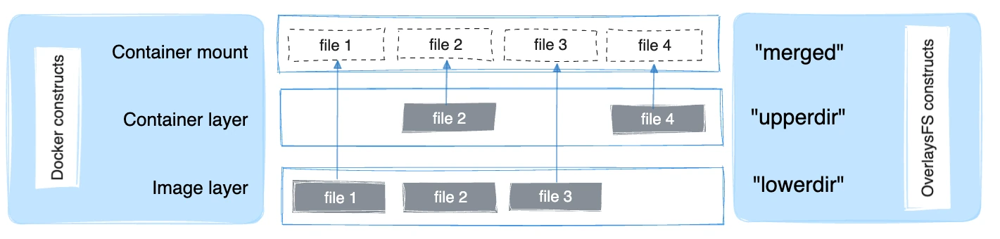

# Docker Image
Docker Image는 VM에서 사용하는 이미지와 비슷한 역할로, 어떤 애플리케이션 실행 환경을 컨테이너에 올리기 위해 정의해둔 것이다. 그리고 이 환경은 여러 파일들의 집합으로 구성되어 있다.
* Docker Image 구성
    - Image Layer
    - 
* Dockerfile 작성법
</br>
</br>


---
## Container Image Layer
컨테이너 이미지는 여러 개의 Layer와 메타데이터로 구성되며, 이 Layer들은 UFS를 사용하여 Merge하게 된다.

Image 구성 시, 이미지에 메타데이터를 저장하는 ENV, LABEL 등의 COMMAND는 Layer로 구분짓지 않고, RUN, ADD, COPY COMMAND에 대해서 Layer를 생성하게 된다 (파일 시스템에 영향을 주기 때문인거 같다!)
</br>

### UFS

UFS는 Union File System 악여로, 여러 개의 파일 시스템을 하나의 파일 시스템에 마운트하는 기능이다. UFS는 다음과 같은 구조와 특징을 가지고 있다.
* 특정
    - Read Oonly : Upper Layer를 제외하고, 모든 Layer는 읽기 전용 속성을 가진다.
    - CoW : copy-on-write. 변경에 대한 부분은 복사를 통해 이뤄진다. 그렇기 때문에 다른 레이어에 영향을 주지 않는다.
    - Copy overhead : Lower Layer의 큰 데이터의 변경이 일어나면 Uppder Layer에 복사해서 처리하므로 Overhead가 크게 발생한다 (최대한 피하는 것이 좋다)
        > 최대한 Lower Layer 파일의 변경은 최대한 피하는 것이 좋다
    - 휘발성 데이터 : 컨테이너 기준으로 CoW 동작을 하는 Container layer는 컨테이너가 생성될때 마다 각 각 생성된다. 그렇기 때문에 컨테이너 끼리 영향을 주지 않는다. 그리고 컨테이너를 Container layer는 삭제되기 때문에 컨테이너를 삭제하면 변경 분에 대해서 남지 않는다!!
        > 필요시 Persistent 볼륨 등 사용을 고려해야 한다.
* 구조
    - Overlay Layer (Container mount) : Lower, Upper Layer를 통합한 View 레이어
    - Upper Layer (Container layer) : 상위 레이어로 하위 레이어 데이터에 대한 생성, 변경, 삭제 등이 가능한 레이어 (마킹을 통해 삭제를 표시)
    - Lower Layer (Image layer) : 상위를 제외한 모든 레이어로, 읽기만 가능한 레이어
* 동작 과정
    1) 순차적으로 Lower Layer들이 쌓인다.
    2) Lower Layer 위에 Upper Layer가 올라간다. 컨테이너에서 생성, 변경, 삭제가 이루어지면 Upper Layer에 복사를 하고 처리한다. 이를 통해 원본(Lower Layer)에는 영향을 주지 않는다!
    3) Overlay Layer를 통해 Lower Layer, Upper Layer 병합한 결과를 확인할 수 있다.
> UFS를 통해 파일의 중복을 최소화하게 되었다. 하지만 휘발성 데이터, Copy overhead 등이 존재하므로 해당 아키텍처를 이해하며 이미지를 구성해야 한다!
</br>


---
## Image Layer Stack 구조
```sh
# Docker Image
$ docker pull nginx

Using default tag: latest
latest: Pulling from library/nginx
1f7ce2fa46ab: Pull complete 
9b16c94bb686: Pull complete 
9a59d19f9c5b: Pull complete 
9ea27b074f71: Pull complete 
c6edf33e2524: Pull complete 
84b1ff10387b: Pull complete 
517357831967: Pull complete 
Digest: sha256:10d1f5b58f74683ad34eb29287e07dab1e90f10af243f151bb50aa5dbb4d62ee
Status: Downloaded newer image for nginx:latest
docker.io/library/nginx:latest
```
```sh
$ docker images

REPOSITORY   TAG       IMAGE ID       CREATED       SIZE
nginx        latest    a6bd71f48f68   12 days ago   187M


$ docker history nginx:latest
IMAGE          CREATED       CREATED BY                                      SIZE      COMMENT
a6bd71f48f68   12 days ago   /bin/sh -c #(nop)  CMD ["nginx" "-g" "daemon…   0B        
<missing>      12 days ago   /bin/sh -c #(nop)  STOPSIGNAL SIGQUIT           0B        
<missing>      12 days ago   /bin/sh -c #(nop)  EXPOSE 80                    0B        
<missing>      12 days ago   /bin/sh -c #(nop)  ENTRYPOINT ["/docker-entr…   0B        
<missing>      12 days ago   /bin/sh -c #(nop) COPY file:9e3b2b63db9f8fc7…   4.62kB    
<missing>      12 days ago   /bin/sh -c #(nop) COPY file:57846632accc8975…   3.02kB    
<missing>      12 days ago   /bin/sh -c #(nop) COPY file:3b1b9915b7dd898a…   298B      
<missing>      12 days ago   /bin/sh -c #(nop) COPY file:caec368f5a54f70a…   2.12kB    
<missing>      12 days ago   /bin/sh -c #(nop) COPY file:01e75c6dd0ce317d…   1.62kB    
<missing>      12 days ago   /bin/sh -c set -x     && groupadd --system -…   112MB     
<missing>      12 days ago   /bin/sh -c #(nop)  ENV PKG_RELEASE=1~bookworm   0B        
<missing>      12 days ago   /bin/sh -c #(nop)  ENV NJS_VERSION=0.8.2        0B        
<missing>      12 days ago   /bin/sh -c #(nop)  ENV NGINX_VERSION=1.25.3     0B        
<missing>      12 days ago   /bin/sh -c #(nop)  LABEL maintainer=NGINX Do…   0B        
<missing>      13 days ago   /bin/sh -c #(nop)  CMD ["bash"]                 0B        
<missing>      13 days ago   /bin/sh -c #(nop) ADD file:d261a6f6921593f1e…   74.8MB


$ docker image inspect a6bd71f48f68 | jq '.[].RootFS'
{
  "Type": "layers",
  "Layers": [
    "sha256:92770f546e065c4942829b1f0d7d1f02c2eb1e6acf0d1bc08ef0bf6be4972839",
    "sha256:8ae474e0cc8f5a81405b04143604f78bfac4756c523e276a36921a8c4da36567",
    "sha256:f5525891d9e9b43a95b4aa1f79405087922489eb300864a2683262aae0fa5b3a",
    "sha256:66283570f41bca3619443d121a79e810b8a72849b5329319993e538d563b3e2f",
    "sha256:c2d3ab485d1b375fdd309458d69d93f8eb9aba8472e928efa32d9e5eda631440",
    "sha256:cddc309885a283a35ef142af78bc6f2e9c9db10e1981c4ea9cfb2c00b83e68ff",
    "sha256:0d0e9c83b6f775d68c7517aabf39ec9123ffca29672e3c3f83c5af7fc6aa242b"
  ]
}
```
* Image Download 시, 해시값은 이미지 저장소에서 제공하는 Distribution ID 이다. 1f7ce2fa46ab가 베이스 레이어(최하위)로 순차적으로 다운받게 된다. 여기서는 517357831967가 마지막 레이어(최상위)가 된다.
* 그리고 Distribution ID를 그대로 저장하는 것이 아닌 새로운 Layer ID를 가지게 되는데, inspect 명령어를 통해서 확인할 수 있다.
* * history 명령어로 보면, a6bd71f48f68, <missing> 등 여러 명령어로 구성되어 보이나, 실질적으로 ADD, COPY 명령어만 레이어를 생성한다.
</br>

```sh
$ tree -L 2 /var/lib/docker/image/overlay2/layerdb/sha256/
/var/lib/docker/image/overlay2/layerdb/sha256/
├── 253c039db964b57be02d9bb0f3d6916b7948687b4f6f4fc681644a419a47979d
│   ├── cache-id
│   ├── diff
│   ├── parent
│   ├── size
│   └── tar-split.json.gz
├── 2c235ef4cca1fbb74e3a7aa47e654fe943bc0c2becbdd4d6af7cbf9e375fe08a
│   ├── cache-id
│   ├── diff
│   ├── parent
│   ├── size
│   └── tar-split.json.gz
├── 32cfe66e62a5f36abf128703007285e1a3b9078f5b33a367df1534399065cc70
│   ├── cache-id
│   ├── diff
│   ├── parent
│   ├── size
│   └── tar-split.json.gz
├── 8713bfa322a66040e882b7822dc0c110a68cfafd3bb37332fdbb9426171d7ec9
│   ├── cache-id
│   ├── diff
│   ├── parent
│   ├── size
│   └── tar-split.json.gz
├── 92770f546e065c4942829b1f0d7d1f02c2eb1e6acf0d1bc08ef0bf6be4972839
│   ├── cache-id
│   ├── diff
│   ├── size
│   └── tar-split.json.gz
├── c0f3f17b019abbcfeb0c162054786ea8087ca792a2191a79f03040a8cd98f41d
│   ├── cache-id
│   ├── diff
│   ├── parent
│   ├── size
│   └── tar-split.json.gz
└── fe7723b2df19ccf75328cb1f39c90c2332679144231501f3d4d00f51b16c2867
    ├── cache-id
    ├── diff
    ├── parent
    ├── size
    └── tar-split.json.gz
```
* Download한 Image를 Local에서 관리하기 위해 Layer DB라는 것을 사용하고 메타데이터를 저장하고 있다(/var/lib/docker/image/overlay2/layerdb/sha256/). 그리고 여기서의 해시값은 Layer ID와 동일한 값이 아닌 Layer DB ID를 위한 새 해시값을 받아서 사용하게 된다.
* 해당 디렉터리 구조는 다음과 같다.
    - cache-id : 레이어가 저장되어 있는 로컬 저장 경로 ID (```/var/lib/docker/overlay12/``` 하위 경로에 위치)
    - diff : Layer ID
    - parent : 상위 레이어 DB ID 포인터 (최하위 레이어는 parent가 없고, 최상위 레이어는 layer id == layer db id)
</br>

```sh
## parent
$ cat c0f3f17b019abbcfeb0c162054786ea8087ca792a2191a79f03040a8cd98f41d/parent 
sha256:32cfe66e62a5f36abf128703007285e1a3b9078f5b33a367df1534399065cc70

$ cat fe7723b2df19ccf75328cb1f39c90c2332679144231501f3d4d00f51b16c2867/parent
sha256:c0f3f17b019abbcfeb0c162054786ea8087ca792a2191a79f03040a8cd98f41d

$ cat 32cfe66e62a5f36abf128703007285e1a3b9078f5b33a367df1534399065cc70/parent 
sha256:8713bfa322a66040e882b7822dc0c110a68cfafd3bb37332fdbb9426171d7ec9

$ cat 8713bfa322a66040e882b7822dc0c110a68cfafd3bb37332fdbb9426171d7ec9/parent 
sha256:253c039db964b57be02d9bb0f3d6916b7948687b4f6f4fc681644a419a47979d

$ cat 253c039db964b57be02d9bb0f3d6916b7948687b4f6f4fc681644a419a47979d/parent 
sha256:2c235ef4cca1fbb74e3a7aa47e654fe943bc0c2becbdd4d6af7cbf9e375fe08a

$ cat 2c235ef4cca1fbb74e3a7aa47e654fe943bc0c2becbdd4d6af7cbf9e375fe08a/parent 
sha256:92770f546e065c4942829b1f0d7d1f02c2eb1e6acf0d1bc08ef0bf6be4972839

# 최하위 레이어 : 92770f546e065c4942829b1f0d7d1f02c2eb1e6acf0d1bc08ef0bf6be4972839/diff
## diff
$ cat 92770f546e065c4942829b1f0d7d1f02c2eb1e6acf0d1bc08ef0bf6be4972839/diff 
sha256:92770f546e065c4942829b1f0d7d1f02c2eb1e6acf0d1bc08ef0bf6be497283

$ cat 2c235ef4cca1fbb74e3a7aa47e654fe943bc0c2becbdd4d6af7cbf9e375fe08a/diff 
sha256:8ae474e0cc8f5a81405b04143604f78bfac4756c523e276a36921a8c4da36567
```
* 베이스 레이어 : Layer DB ID = 92770f / Layer ID = 92770f546e
* 베이스 +1 레이어 : Layer DB ID = 2c235e / Layer ID = 8ae474e0 / Parent Layer DB ID = 92770f
</br>

---
## Image Layer 데이터 구조
```
$ docker inspect a6bd71f48f68 | jq '.[].GraphDriver'
{
  "Data": {
    "LowerDir": "/var/lib/docker/overlay2/75d8a53c8d52be16706a337c6adf963d960f97b76311beddcbb6b344e7d8b271/diff:
    /var/lib/docker/overlay2/f07c3ae1ff985a700e98cb235d4834fa1328828ae35be8c29949b4a5a14b4374/diff:
    /var/lib/docker/overlay2/2aea5322db315202d6743205e728d38585ed03021e86c94e7c4a96023a16f8ac/diff:
    /var/lib/docker/overlay2/8cf90ce906658a4a448a4d48116dda3e89b85579588a5da9ce3942078ae6afd4/diff:
    /var/lib/docker/overlay2/db16a344c8ed7a6bbd086f1455bf8e4a5db2e152292552d08746f0bcbd051581/diff:
    /var/lib/docker/overlay2/549e91df50c97e3c2d8dc4f8023dddb198668024bbb663a642216ce9ec6c431e/diff",
    "MergedDir": "/var/lib/docker/overlay2/c50c0d5dac7a2387fbe45df80b65f0d3618524da8ff9e906fc2226173906678e/merged",
    "UpperDir": "/var/lib/docker/overlay2/c50c0d5dac7a2387fbe45df80b65f0d3618524da8ff9e906fc2226173906678e/diff",
    "WorkDir": "/var/lib/docker/overlay2/c50c0d5dac7a2387fbe45df80b65f0d3618524da8ff9e906fc2226173906678e/work"
  },
  "Name": "overlay2"
}
```
* Stack 구조에서 각 레이어의 cache-id와 위의 해시값이 동일한 것을 볼 수 있다.
    - LowerDir : 이미지 레이어
    - UpperDir : 컨테이너 레이어
    - MergedDir : 컨테이너 마운트
    - WorkDir : 이미지 레이어 동작들이 실행되는 디렉토리
</br>


```sh
# Directory : link & lower
## 최하위 레이어 (최하위 레이어이기 때문에 lower 디렉터리가 없다!!)
$ ls /var/lib/docker/overlay2/549e91df50c97e3c2d8dc4f8023dddb198668024bbb663a642216ce9ec6c431e/
committed  diff  link


## Upper Layer
$ ls /var/lib/docker/overlay2/db16a344c8ed7a6bbd086f1455bf8e4a5db2e152292552d08746f0bcbd051581
committed  diff  link  lower  work

$ ls /var/lib/docker/overlay2/db16a344c8ed7a6bbd086f1455bf8e4a5db2e152292552d08746f0bcbd051581/diff/
docker-entrypoint.d  etc  tmp  usr  var

```
* 최하위 레이어는 lower 디렉터리가 없다!
* 구성 요소
    - diff : 해당 Layer의 콘텐츠 포함
    - work : OverlayFS에서 내부적으로 사용되는 작업 디렉터리
    - link : The name of the shortened identifier. 링크 이름 포함
    - lower : 자신보다 lower layer의 link 이름이 들어가 있다. 
    - merged : lower layer + upper layer 병합한 결과 파일 포함 (최종 결과) 
</br>


#### Reference
https://www.44bits.io/ko/post/how-docker-image-work#%EC%BB%A8%ED%85%8C%EC%9D%B4%EB%84%88%EC%9D%98-%EB%A0%88%EC%9D%B4%EC%96%B4-%EA%B3%84%EC%B8%B5-%EC%9D%B4%ED%95%B4%ED%95%98%EA%B8%B0

https://docs.docker.com/storage/storagedriver/overlayfs-driver/#how-the-overlay2-driver-works

https://tech.kakaoenterprise.com/171

https://kingdo.club/2022/02/21/understand-layerid-diffid-chainid-cache-id/
