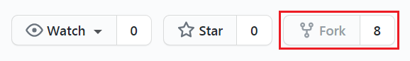

# Fork & Pull Request


## Fork
### Fork vs Clone
* Clone
    - 자신의 Remote Repository (Origin) ---> 자신의 Local Repository 복사
    - Push를 통해 Origin에 반영을 한다.
* Fork
    - 다른 사용자의 Remote Repository (Origin) ---> 자신의 Remote Repository 복사
    - Pull Request를 통해 Origin에 반영을 요청하게 된다.
> Fork는 Origin에 직접적인 영향을 끼치지 못하기 때문에 Pull Request라는 것을 작성해서 다른 사용자에게 승인을 받아야한다.

</br>
</br>


## Pull Request 과정
### 1. Project를 자신의 Repository로 Fork 한다.

- 원하는 Repository에 들어가 Fork를 클릭하면, 자신의 Repository에 복사가 된 것을 확인할 수 있다.
</br>

### 2. Fork 한 Repostiry를 자신의 Local Repository에 복사한다.

- Clone 명령어를 통해 자신의 Local Repository에 복사한다.
</br>

### 3. branch 생성, 이동
```
# git checkout -b <branch Name>
$ git checkout -b dev
$ git branch -a
```
- 기존 코드에 영향을 주지 않고, 독립적으로 개발을 진행하기 위해서는 branch가 필요하다.
</br>

### 4. 개발 진행 후
1) Add, Commit 작업을 통해 Local Repository에 저장한다.
    ```
    $ git add README.md
    $ git commit -m "docs: Initialization README.md"
    ```
2) 원하는 Remote Repository에 Push 작업을 한다.
    ```
    # 연결된 Repository list 출력
    $ git remote -v

    # git push [Remote Repository Name] [Branch Name]
    $ git push origin dev
    ```
    > 여기서는 먼저 자신의 Remote Repository로 Push

</br>

### 5. Pull request 보내기
- push 후에 자신의 github 저장소에 Compare & pull request 버튼이 활성화되어 있는 것을 확인할 수 있다.
- 버튼을 클릭하고, 변경 사항에 대한 설명과 작업한 내용을 포함하여 Pull request를 생성한다.
</br>


### 6. Code Review 및 Merge pull request
- Pull Request를 받은 Project 관리자가 Merge를 할지 말지 결정한다.
</br>


### 7. 동기화
Project는 여러 사람이 계속 업데이트를 하기 때문에 작업 후에 최신 버전으로 업데이트할 필요가 있다.

1) 최신 업데이트를 하기 위해 실제 Project Repository를 Remote Repository를 추가한다.
    ```
    $ git remote add upstream https://github.com/heyoon2j/maze-game.git

    $ git remote -v
    origin	https://github.com/theVebper/maze-game.git (fetch)
    origin	https://github.com/theVebper/maze-game.git (push)
    upstream	https://github.com/heyoon2j/maze-game.git (fetch)
    upstream	https://github.com/heyoon2j/maze-game.git (push)
    ```
    - $ git remote add [Repository Name] [Remote Repository Address] : 해당 주소의 Remote Repositoy를 Repository Name으로 추가한다.
    - 리스트를 확인하면 추가되어 있는 것을 확인할 수 있다.
2) upstream repository로부터 최신 데이터를 가지고 온다.
    ```
    $ git fetch upstream
    remote: Enumerating objects: 5, done.
    remote: Counting objects: 100% (5/5), done.
    remote: Compressing objects: 100% (2/2), done.
    remote: Total 3 (delta 1), reused 3 (delta 1), pack-reused 0
    오브젝트 묶음 푸는 중: 100% (3/3), 1.34 KiB | 686.00 KiB/s, 완료.
    https://github.com/heyoon2j/maze-game URL에서
    * [새로운 브랜치]   main       -> upstream/main
    ```
    > upstream을 가져와도 현재 Workspace는 업데이트되어 있지 않다. Workspace를 같은 상태로 만들기 위해 Merge하는 과정이 필요하다!


3) 업데이트한 최신 데이터와 자신의 branch와 병합한다.
    ```
    $ git checkout main
    $ git merge upstream/main
    업데이트 중 a7894a5..f53f3b7
    Fast-forward
    README.md | 76 ++++++++++++++++++++++++++++++++++++++++++---------------------
    1 file changed, 51 insertions(+), 25 deletions(-)
    ```
    - $ git merge [Branch Name] : 현재 Branch와 입력한 Branch와 병합한다.

> 물론 2)과 3)번을 Pull 명령어를 통해 한 번에 할 수 있지만, 충돌을 방지하기 위해 나눠서 하는 것이 좋다!