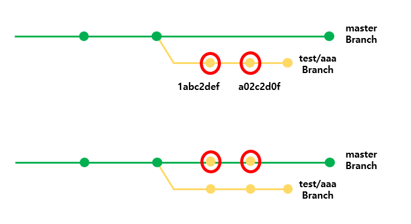

# Use Branch and Pull Request


## Merge


    

    ```sh
    $ git cherry-pick <Commit ID>           # 특정 Commit을 선택해서 합치기
    $ git cherry-pick -n <Commit ID>        # ommit하지 않고,  특정 Commit을 선택해서 합치기

    $ git merge <Branch Name>               # 현재 Branch가 입력한 Branch로 합쳐진다
    $ git merge --no-commit <Branch Name>   # commit하지 않고, 입력한 Branch를 현재 Branch로 합치기


    $ git diff: 현재 작업 트리와 인덱스의 차이점 확인
    ```
    - cherry-pick은 다른 branch는 그대로 두고, 변경한 내용만을 현재 branch에 적용하고 싶을때 사용한다!!


## Pull Request


## Git Configuration
* 명령어 : ```$ git config```


### Credential
* https://git-scm.com/book/ko/v2/Git-%EB%8F%84%EA%B5%AC-Credential-%EC%A0%80%EC%9E%A5%EC%86%8C
* Token 변경