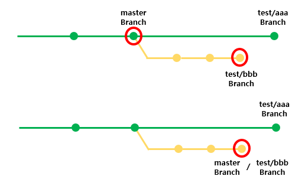
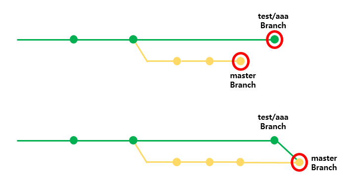
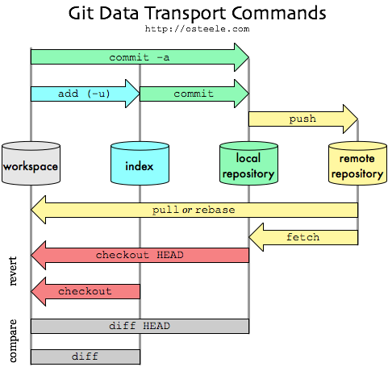

ull: 개발한 코드를 받아온다
* add: 변경 사항을 Index에 저장
* commit: Index에 있는 사항들을 Local Repository에 저장
* push: Commit을 원격 저장소에 Upload 한다.
* branch: 같이 곳에서 작업을 하게 되면 충돌이 날 수 있는 가능성이 있기 때문에 하나의 줄기에 여러개의 나무가지가 생기는 형태를 가지도록 만들어준다.
    
    > 녹색의 줄기에 A는 빨간색으로 분리가되고, B는 노란색으로 분리가 될 수 있다.
* merge : Branch에서 작업이 끝나고, 코드를 합칠 때 사용한다.
    1. Cherry-pick

        
        - cherry-pick은 다른 branch는 그대로 두고, 변경한 내용만을 현재 branch에 적용하고 싶을때 사용한다!!
        > 즉, Branch 자체에 대해서는 병합이 되지 않는다.
    2. Fast-Forward Merge

        
        - 단순히 Branch를 이동시켜 적용시킨다.
    3. Merge Commit

        
        - 양 쪽의 Branch를 통합한다.
        - Fast-Forward Merge가 가능한 경우라도 Non Fast-Forward 병합 옵션을 지정하여 위의 그림 같이 실행할 수 있다. 이 경우, Branch가 그대로 남기 때문에 그 Branch로 실행한 작업을 확인할 수 있기 때문에 관리 면에서 더 유용할 수 있다.
* pull request: 병합하기 전에 다른 개발자들에게 Confirm을 받기 위해 요청 메시지를 보낸다.
* fork: 다른 원격 저장소에 있는 History를 그대로 나의 GitHub 원격 저장소에 복사한다.
    > 다른 사람이 만든 OpenSource에 기여하고 싶을 때는, Fork로 저장소 전체를 내 계정에 복제 -> Commit -> Push 후 원본 저장소로 Pull Request를 보낸다.
* collaborators: GitHub 프로젝트를 생성하여 진행할 때


## Git Structure
### .git 구조
```shell script
$ git init
$ ls .git
HEAD
config
description
/branches
/hooks
/objects

├── COMMIT_EDITMSG
├── FETCH_HEAD
├── HEAD
├── ORIG_HEAD
├── config
├── description
├── hooks
│   ├── applypatch-msg.sample
│   ├── commit-msg.sample
│   ├── fsmonitor-watchman.sample
│   ├── post-update.sample
│   ├── pre-applypatch.sample
│   ├── pre-commit.sample
│   ├── pre-merge-commit.sample
│   ├── pre-push.sample
│   ├── pre-rebase.sample
│   ├── pre-receive.sample
│   ├── prepare-commit-msg.sample
│   ├── push-to-checkout.sample
│   └── update.sample
├── index
├── info
│   └── exclude
├── logs
│   ├── HEAD
│   └── refs
├── objects
│   ├── 00
│   ├── 01
└── refs
    ├── heads                           # 로컬 branch
    ├── remotes                         # 원격 저장소
    └── tags                            # 태그

```
- HEAD: 현재 체크아웃된 브랜치를 가리키는 포인터
- config: Git 저장소에 대한 구성 파일
- hooks: Git hook 스크립트. 커밋 전, 커밋 후, 푸시 전후 등 특정 Git 이벤트 시 자동으로 실행되는 스크립트들
- index : Staging 내의 파일 정보 저장
- info/exclude: .gitignore 파일 없이도 Git의 추적에서 제외할 수 있음
- logs: 모든 참조(ref)의 히스토리가 기록 (HEAD의 변경 이력 등)
- objects: Git 객체가 저장
- refs: 브랜치, 태그 및 기타 참조 정보


### Objects
1. __BLOB(Binary Large OBject)__
    - 소스 파일, 이미지 파일 등 데이터를 파일 명 같은 메타데이터 없이, 바이너리 데이터 자체만 저장
2. __Tree__
    - blob에 저장되지 않은 파일 이름, 속성, 디렉터리 위치 정보를 저장
    - tree object는 참조할 blob를 가리키는 해시값와 하위 tree object를 가리키는 객체들로 구성
        - 참조할 blob를 가리키는 해시값 (blob_hash)
        - 하위 tree object를 가리키는 해시값 (another_tree_hash)
    - 커밋 시점의 특정 디렉토리 상태를 나타내며, 각 트리 객체는 하위 트리와 블롭을 참조
3. __Commit__
    - Git의 버전 관리에서 하나의 "스냅샷"을 나타내는 객체
    - commit object는 특정 시점의 트리(디렉토리 상태)를 가리키는 해시값과 이전 commit object를 가리키는 객체들 그리고 작성자, 작성 시각, 커밋 메시지 등 메타데이터로 구성
        - 특정 시점의 트리(디렉토리 상태)를 가리키는 해시값 (tree_hash)
        - 이전 commit object를 가리키는 객체 (previous_commit_hash)
        - 작성자, 작성 시각, 커밋 메시지 등 메타데이터
    - tree object명과 Author, Date, Message 저장.
4. __Tag__
    - commit object를 가리키며 태그명과 태그를 만든 사람, 주석 저장

* Reference
    * [HappyProgrammer_김대현](https://medium.com/happyprogrammer-in-jeju/git-%EB%82%B4%EB%B6%80-%EA%B5%AC%EC%A1%B0%EB%A5%BC-%EC%95%8C%EC%95%84%EB%B3%B4%EC%9E%90-1-%EA%B8%B0%EB%B3%B8-%EC%98%A4%EB%B8%8C%EC%A0%9D%ED%8A%B8-81b34f85fe53)
    * [빨간색코딩_빨간색소년](https://sjh836.tistory.com/37)


### .gitignore
* git에서 추적하고 싶지 않은 파일을 설정하는 경우. 즉, 불필요한 파일에 대해 git 명령어가 사용되지 않도록 방지할 수 있다.
* https://www.toptal.com/developers/gitignore 에서 설정할 내용을 검색할 수 있다.

### License
* Apache License
* MIT Licese
* GNU General Public License 

</br>
</br>


---
## Git Process

* Git은 기본적으로 파일의 변경 이력 별로 구분하여 저장한다.
* 저장소 역할
    - __workspace__ : Working Directory, 현재 작업하고 있는 Directory 
    - __index__ : Stagin Area, Local Repository에 저장하기 위해서는 이곳에 등록을 해야된다.
    - __local repository__ : 내부 저장소, File의 생성/변경을 저장하는 공간
    - __remote repository__ : 원격 저장소, 여기서는 Github에 생성한 Repository
* 처리 과정
    - add : objects에 blob 타입으로 파일 내용이 추가하고, 파일이 수정되면 새로운 object(blob)를 생성한다.
    - commit : objects에 commit 객체와 tree 객체가 추가된다.
    - push : 로컬 저장소의 Blob, Tree, Commit 객체를 원격 저장소로 전송한다.
</br>
</br>


---
## Start Git
* Commit Message 작성 : Commit할 때는 동작하는 최소 단위로 (ex> 메소드 단위)
    - __feat:__ - features, 기능 구현시, 기능 설명
    - __docs:__ - documentations, README.md 등 문서화 작업
    - __fix:__ - bug-fix, 버그 수정시
    - __conf:__ - configurations, 환경 설정
    - __deploy:__ - deploy, 배포 작업
    - __refactor:__ - refactoring, Refactoring하는 경우


### 0. Configuration
* 전역 설정
    ```shell script
    $ git config --global user.name "yoon2ix"                       # 전역 사용자 설정
    $ git config --global user.email "email@gihub.com"              # 전역 이메일 설정
    $ git config --global core.editor "vim"                         # 전역 Editor 설정
    $ git config --global core.pager "cat"                          # Git은 log 또는 diff 같은 명령의 메시지를 출력할 때 페이지로 나누어 보여준다. 기본으로 사용하는 명령은 less 다. more 를 더 좋아하면 more 라고 설정한다. 페이지를 나누고 싶지 않으면 빈 문자열로 설정한다.
    $ git config --list                                             # 설정 리스트 확인
    $ git config --global --unset core.pager                        # --unset 옵션을 이용하여 설정 지우기 / core.pager 설정 지우기
    ```
* 저장소별 설정(해당 Directory)
    ```shell script
    $ git config user.name "yoon2ix"                                # 해당 저장소 사용자 설정
    $ git config user.email "email@github.com"                      # 해당 저장소 이메일 설정
    ```


### 1. Git init
* git init 이용하는 방법
    ```shell script
    $ git init                                                          # Git 저장소를 초기화, Local Repository로 역할을 시작
    $ git remote add origin https://github.com/yoon2ix/Yoon-TIL.git     # {URL}에 해당하는 Remote Repository를 {Name}으로 추가
    $ git remote -v                                                     # Remote Repository의 이름 목록 표시
    $ git add README.md
    $ git commit -m "docs: Create README.md"
    $ git push -u origin master                                         # 처음 연결시킬때 -u 옵션 사용
    $ git remote rm origin                                              # {Name} Remote Repository 삭제
    ```
* git clone 이용하는 방법
    ```shell script
    $ git clone https://github.com/yoon2ix/Yoon-TIL.git                   # Remote Repository를 복사
    ```


### 2. Branch
* Branch 생성/삭제
    ```sh
    $ git branch -a                     # Branch 리스트 확인
    $ git branch <Branch Name>          # 현재 Branch에서 새로운 Branch 생성하기


    $ git branch -d <Branch Name>       # 해당 Branch가 현재 Branch에 합쳐져 있을 경우 삭제
    $ git branch -D <Branch Name>       # 해당 Branch가 현재 Branch에 합쳐져 있을 경우와 상관없이 삭제
    ```
* Branch Checkout
    ```sh
    $ git checkout <Branch Name>        # 해당 Branch로 Checkout
    $ git checkout -b <Branch Name>     # 새로운 Branch를 생성하고, 새로운 Branch로 Checkout
    $ git checkout -m <기존 Branch Name> <새로운 Branch Name> : 새로운 Branch Name가 없는 경우 Branch 명으로 변경
    ```
* merge 
    ```sh
    $ git cherry-pick <Commit ID>           # 특정 Commit을 선택해서 합치기
    $ git cherry-pick -n <Commit ID>        # ommit하지 않고,  특정 Commit을 선택해서 합치기

    $ git merge <Branch Name>               # 현재 Branch가 입력한 Branch로 합쳐진다
    $ git merge --no-commit <Branch Name>   # commit하지 않고, 입력한 Branch를 현재 Branch로 합치기


    $ git diff: 현재 작업 트리와 인덱스의 차이점 확인
    ```
    - cherry-pick은 다른 branch는 그대로 두고, 변경한 내용만을 현재 branch에 적용하고 싶을때 사용한다!!


### 2. Add, Commit, Push
* Staging
    ```shell script
    $ git add {file}                                        # 생성/수정 File을 index로 staging
    ```
* Local Repository
    ```shell script
    $ git commit -m "{message}"                             # staging 되어있는 내용을 Local Repository에 저장 
    ```
* Remote Repository
    ```shell script
    $ git remote                                            # Remote Repository 리스트 확인
    $ git remote add origin www.test.com/abc                # Remote Repository 추가
    $ git remote rm origin                                  # Remote Repository 추가

    $ git push <Remote Repository Name> <Branch Name>       # 해당 브랜치를 Local Repository에 반를
    $ git push -u <Remote Repository Name> <Branch Name>    # -u 옵션, 업데이트 후, 해당 브랜치를 Local Repository에 반를

    ```
    - -u 옵션은 원격 저장소로부터 업데이트받은 후 push를 한다는 의미로, clone 한 사람이 여러 명인 경우 다른 사람이 push 한 상태에서 push를 하게 되면 에러가 발생하기 때문이다.
    - 만약 기존에 있던 Remote Repository를 복제한 것이 아니라면 Remote Server의 주소를 Git에게 알려줘야 한다(git remote add 명령어 사용)

### 3. Pull
```sh
$ git pull                      # Remote Repository에 있는 변경 내용이 Local Repository에 Fetch 후, 현재 Branch에 Merge

$ git pull <Remote Repository>  # 해당 Remote Repository에 있는 내용으로 갱신한다.

$ git pull <Remote Repository Name> <Branch>    # Remote Repository의 Branch를 가지고 와서 현재 Branch에 Merge
```


### 4. Rollback
```sh
$ git reset HEAD [File]                 # git add 취소하기

$ git reset --soft Head^                # Commit을 취소하고 해당 파일들은 Staged 상태(git add 유지) 및 파일 내용 유지

$ git reset Head^                       # Commit을 취소하고 해당 파일들은 Unstaged 상태 및 파일 내용 유지

$ git reset --hard Head^                # Commit을 취소하고 해당 파일들은 Unstaged 상태로 Working Directory에 삭제, 즉 모두 취소
```


### 5. 그 외
```sh
$ git status                                            # 현재 git 상태 확인

$ git log -n 10                                         # Repository의 Commit History를 탐색한다.

$ git grep "검색 단어"                                    # Repository의 파일 내용에서 검색한다.

$ git reset -soft HEAD^                                 # Commit을 취소하고 해당 파일들

$ git log --oneline --decorate --graph --all            # Commit History 모든 내용을 그래프 형식으로 출력.
```