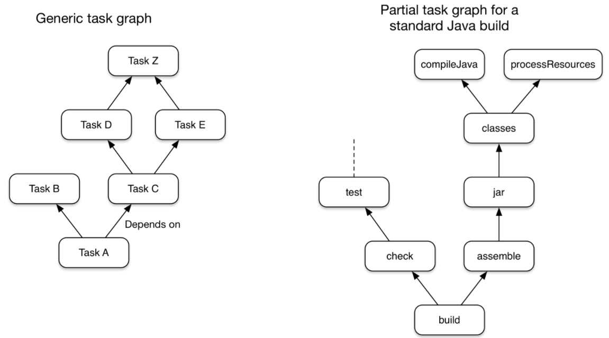

# Gradle
* Groovy를 이용한 오픈 소스 빌드 자동화 도구이다.
* Gradle은 JVM에서 실행되기 때문에 이를 사용하려면 JDK가 설치되어 있어야 한다.
* 빌드 자동화
    * 의존성 라이브러리 다운로드
    * 컴파일
    * 테스트 실행
    * 바이너리 코드 패키징
    * 운영시스템 배포

## Gradle Basic
1. Gradle의 모든 것은 Project와 Task라는 두 가지 기본 개념 위에 있다.
    * 모든 Gradle Build는 하나 이상의 Project로 구성되며, 각 Project는 하나 이상의 Task로 구성된다.
    * Project 예시로 Project는 Library 또는 Web Application 등을 나타낼 수 있다.
    * Task 예시로 일부 클래스를 컴파일하거나 JAR을 생성하는 것 일 수 있다.
2. Build는 Task 단위로 모델링한다.
    * Task Graph Example
        * task dependency mechanism(다른 작업에 의존하는 작업 선언 가능)을 통해 함께 연결된 작업과 함께 플러그인과 자체 빌드 스크립트로 정의할 수 있다.
        
    * Task는 다음으로 구성된다.
        * Actions - File copy, Source compile과 같은 작업을 수행하는 Task
        * Inputs - 작업하는데 사용되거나 필요한 value, file, directory
        * Outputs - 작업에 의해 수정되거나 생성되는 file 및 directory
3. Gradle 기본 빌드 단계
    1) Initialization
        * Build 환경 설정, Project 결정
    2) Configuration
        * 실행하려는 작업에 따라 실행해야하는 작업과 순서를 결정(Build에 대한 작업 그래프 구성)
    3) Execution
        * Configuration Phase가 끝난 뒤, 선택한 작업을 실행
4. Gradle은 여러 방법으로 확장 가능하다.
    * ```Task.doFirst()```와 ```Task.doLast()``` 등의 메서드를 이용
    * Plugin을 이용
    * https://docs.gradle.org/current/dsl/org.gradle.api.Task.html#org.gradle.api.Task:doFirst(org.gradle.api.Action)
    
    
## Gradle Wrapper
* Gradle Build 시 권장되는 방법은 Gradle Wrapper를 사용하는 것을 권장한다고 한다.
* Wrapper는 Gradle의 선언된 버전을 호출하여 필요한 경우 미리 다운로드하는 스크립트이다.

## Structure
```
   .
   ├── build.gradle
   ├── gradle
   │   └── wrapper
   │       ├── gradle-wrapper.jar
   │       └── gradle-wrapper.properties
   ├── gradlew
   ├── gradlew.bat
   └── settings.gradle
```
### build.gradle
* 빌드 구성 스크립트
* 프로젝트와 해당 작업을 정의한다.
* Example
    ```groovy
    plugins {
        id 'application' 
    }
    
    repositories {
        jcenter() 
    }
    
    dependencies {
        testImplementation 'junit:junit:4.13' 
        implementation 'com.google.guava:guava:29.0-jre' 
    }
    
    application {
        // Main Class는 demo의 App Class를 의미     
        mainClass = 'demo.App' 
    }
    ```
    * ```plugins {}```: Plugin을 추가
    * ```repositories {}```: dependencies {}에서 사용될 Repository 설정
    * ```dependencies {}```: 필요한 종속성을 추가
    * ```application {}```: application에 대한 내용 추가
    
    
### gradle (Wrapper)
* Wrapper에서 Gradle 버전 등을 설정하기 때문에 Local 환경에 영향을 받지 않는다.
1. gradle-wrapper.properties
    * gradle wrapper의 속성 파일
    * Wrapper를 다운로드하고 실행하는데 사용되는 Gradle 버전, Gradle 배포 ZIP 파일을 가리키는 URL 등이 저장되어 있다.
2. gradle-wrapper.jar
    * gradle 배포를 다운로드하기 위한 코드가 포함되어 있는 Wrapper JAR 파일
    * ```gradlew```나 ```gradlew.bat```를 이용해 실행된다.

### gradlew
* Unix용 실행 스크립트
* Wrapper를 이용해 빌드를 실행하기 위한 스크립트

### gradlew.bat
* Windows용 실행 배치 스크립트
* Windows에서 실행 가능하다는 점만 제외하면 gradlew와 동일

### settings.gradle 
* 프로젝트의 구성 정보를 기록하는 파일
* 멀티 모듈 관련된(Subprojects) 내용들 또한 여기서 설정한다.
    * https://docs.gradle.org/current/userguide/multi_project_builds.html#sec:cross_project_configuration
* Example
    ```groovy
    rootProject.name = 'demo'
    include ':app'
    ```
    * ```rootProject.name```: Build Name, 이름은 변경되지 않는 고정된 이름이 좋다(ex> Project 이름)
    * ```include()```: subproject build의 추가 시킴을 의미

## Lifecycle
1. Build를 위한 ```Settings``` 객체를 생성한다.
2. ```Settings``` 객체와 ```settings.gradle``` 스크립트와 비교한다.
3. ```Settings``` 객체를 구성한 뒤, ```Settings``` 객체를 이용하여 ```Project``` 객체의 계층을 만든다.
4. ```Project``` 객체와 실행될 ```build.gradle```와 비교한다.
5. Project는 상위 프로젝트부터 하위 프로젝트 순으로 평가된다.


## How to use
## Task
* https://docs.gradle.org/current/userguide/tutorial_using_tasks.html#sec:task_dependencies
```groovy
task hello {
    doLast {
        println 'Hello world!'
    }
}
task intro {
    dependsOn hello
    doLast {
        println "I'm Gradle"
    }
}
// gradle -q intro
// hello가 먼저 실행되고 intro가 실행된다.
```
* ```dependsOn```을 이용하여 의존성을 선언할 수 있다.


## Plugin
* https://docs.gradle.org/current/userguide/plugins.html#sec:binary_plugins
* Plugin에 캡슐화된 빌드 로직을 사용하려면 Gradle은 두 단계를 수행해야 한다.
    * resolve plugin: 주언진 Plugin을 포함하는 올바른 버전의 JAR 파일을 찾아 
    스크립트 클래스 경로에 추가하는 것을 의미.
    * apply plugin: 프로젝트에서 ```Plugin.apply(T)```를 실제로 실행하느 것을 의미.

* 전역적으로 고유한 식별자 또는 Plugin ID로 Plugin을 적용
* 플러그인 resolve 방법
    1) DSL Plugin을 사용하여 적용
    2) buildscript 종속성으로 정의된 외부 JAR의 Plugin 적용
        * 자신의 build script 파일에서 외부 Library를 사용해야 되는 경우 사용된다.
    3) Project의 buildSrc Directory 아래에 Plugin Source File을 정의하여 사용
        * 원하는 Build 방법을 buildSrc Directory에 만들어서 Plugin을 적용시킬 때 쓴다.
    4) 빌드 스크립트 내에서 인라인 클래스 선언으로 정의

### Plugin 작성 방법    
1. Plugin 적용 방법
    ```groovy
    plugins {
        id «plugin id»                                            
        id «plugin id» version «plugin version» [apply «false»]   
    }
    
    plugins {
       id 'java'
       id 'com.jfrog.bintray' version '0.4.1' apply false
    }

    ```
    * plugins block을 사용한다.
    * apply에 false를 쓰게 되면 적용시키지 않는다.
    * The default behavior of the plugins {} block is to immediately resolve and apply the plugins
        * plugins{}의 기본 동작은 즉시 resolve와 apply를 한다.

2. 자신의 build script 파일에서 외부 Library를 사용해야 되는 경우
    ```groovy
    buildscript {
        repositories {
            jcenter()
        }
        dependencies {
            classpath 'com.jfrog.bintray.gradle:gradle-bintray-plugin:0.4.1'
        }
    }
    
    apply plugin: 'com.jfrog.bintray'
    ```
    * buildscript block을 사용한다.

3. Plugin Management
    * 기본적으로 plugins block은 Public Gradle Plugin Portal에서 확인한다(```gradlePluginPortal()```).
    * 기존 Portal에서 찾는 것이 아닌 사용자가 정의한 저장소를 사용하기 위해서는 
    ```pluginManagement {}```를 사용해야 된다. 
    * ```settings.gradle``` file에 선언한다.
    ```
    pluginManagement {
        repositories {
            maven {
                url '../maven-repo'
            }
            gradlePluginPortal()
            ivy {
                url '../ivy-repo'
            }
        }
    }
    ```


## Build Environment
* https://docs.gradle.org/current/userguide/build_environment.html#sec:gradle_configuration_properties
* Gradle에서는 Gradle 자체 또는 특정 프로젝트의 동작을 설정하기 위한 여러 메커니즘을 제공한다.
* 메커니즘은 다음과 같다.
    1. Command-line flags, 플래그들은 속성과 환경 변수들보다 우선시 된다.
    2. System properties
    3. Gradle properties
    4. Environment variables

### Properties
* Gradle에서는 Java Process를 쉽게 설정할 수 있도록 Property에 대한 옵션을 제공한다.
* 옵션은 다음과 같으며, 여러 위치에 구성되어 있는 경우 가장 상위 위치의 옵션이 적용된다.
    1. system properties, Command Line에 ```-Dgradle.user.home```를 이용하여 설정
    2. ```GRADLE_USER_HOME``` directory 안의 ```gradle.properties``` file
    3. Project root directory 안의 ```gradle.properties``` file
    4. Gradle이 설치된 directory 안의 ```gradle.properties``` file
* 추가적으로 ```ext {}```을 이용해서 추가할 수 있다.

### Example
* gradle.properties
    ```groovy
    // Gradle Properties
    gradlePropertiesProp=gradlePropertiesValue
    sysProp=shouldBeOverWrittenBySysProp
    // System Properties
    systemProp.system=systemValue
    ```
* build.gradle
    ```groovy
    task printProps {
        doLast {
            println commandLineProjectProp
            println gradlePropertiesProp
            println systemProjectProp
            println System.properties['system']
        }
    }
    ```
* Result
    ```
    $ gradle -q -PcommandLineProjectProp=commandLineProjectPropValue -Dorg.gradle.project.systemProjectProp=systemPropertyValue printProps
    commandLineProjectPropValue
    gradlePropertiesValue
    systemPropertyValue
    systemValue
    ```


## Build Script 작성 방법 
* https://docs.gradle.org/current/userguide/writing_build_scripts.html
1. Project 속성
    | Name | Type | Default Value |
    |------|------|---------------|
    | project | Project | The Project instance |
    | name | String | The name of the project directory |
    | path | String | The absolute path of the project |
    | description | String | A description for the project |
    | projectDir | File | The directory containing the build script. |
    | buildDir | File | ProjectDir/build |
    | group | Object | unspecified |
    | version | Object | unspecified |
    | ant | AntBuilder | An AntBuilder instance |
    * ```group```, ```version```: 정해져 있는 스펙이 없기 때문에 


2. 


1. 종속성 적용
    * 요즘에는 comfile 대신 implementation 사용
2. 
    * plugin.id:plugin.id.gradle.plugin:plugin.version


dependencies block
| compileOnly() |  |
|  |  |
|  |  |


## Local Library(jar)를 Dependency에 추가하는 방법
* 사내 혹은 개인이 개발한 라이브러리의 경우 또는 Library 개발자가 jar 형태로만 배포하거나
 소스코드를 직접 빌드해서 사용해야하는 경우에 사용
1. Library를 저장할 Directory 생성 -> 원하는 Library 추가
2. 한 개의 jar 파일을 추가하는 경우
    ```gradle
    dependencies { 
        implementation files('libs/lombok.jar')
    }
    ```
3. 특정 Directory의 모든 Library를 추가하는 경우
    ```gradle
    dependencies { 
        compile fileTree(dir: 'libs', include: ['*.jar'])
    }
    ```
    * 프로젝트 root 밑에 있는 libs directory에 있는 jar 파일들을 컴파일하라는 의미이다.
   
   
### Reference
* 공식 문서: https://docs.gradle.org/current/userguide/gradle_wrapper.html
* https://effectivesquid.tistory.com/entry/Gradle-%EB%B9%8C%EB%93%9C%EC%8B%9C%EC%8A%A4%ED%85%9C-%EA%B8%B0%EC%B4%88