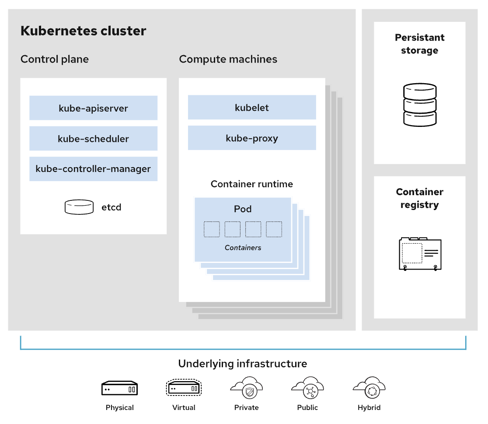

# Basic
* State Check
    - Kubernetes는 원하는 상태(desired state)를 선언(declarative)하면 현재 상태(current state)와 비교하여 원하는 상태를 유지하려한다.
    - 상태를 유지하기 위해 Kubernetes는 계속해서 상태를 관찰한다(Observing)
    > k8s는 상태를 선연하다보니 명령어도 run이 아닌 create를 사용한다
* Namespace
    * Cluster에서 사용되는 리소스들을 구분해서 관리하는 그룹
    * 환경을 분리할 수 있음
        1) 서비스 단위
        2) 환경 단위
        3) 팀 단위
        4) etc
    * default (기본), kube-system (k8s system), metallb-system 이 기본으로 등록되어 있음
    * 리소스 이름은 각 네임스페이스 내에서 고유해야 한다. 다른 네임스페이스에서는 사용 가능하다.
    * 네임스페이스는 서로 중첩될 수 없으며 각 Kubernetes 리소스는 하나의 네임스페이스에만 있을 수 있습니다.
* Object
    - k8s는 상태를 관리하기 위해 대상을 Object로 정의한다.
    - Pod Object : Pod 정보 - Container/CNI/CSI
    - Service : 서비스 네트워크에 관련된 정보 - Load balancer
    - ReplicaSet : Pod를 여러개 복제하여 관리하기 위한 정보 - 복제 개수/Selector label/Pod Template
    - Volume Object : 볼륨 정보 - 호스트 디렉토리/EBS 볼륨 등
    - 등등
* Node
    - 쿠버네티스 클러스터를 구성하는 최소 단위로, 최소 1개 이상의 컴퓨팅 노드가 필요
* Pod
    - Application이 동작하는 컨테이너들의 모음
    - Pod는 Cluster에 의해 관리되어지며, 설정에 따라 해당하는 Node에 추가된다 
> 원하는 상태에 대하여 명세서(yaml file)를 작성한다. 명세서에는 Object에 대한 정보들이 정의되어 있고 이를 Label로 관리
</br>
</br>


---
## Architecture
k8s는 구성 요소는 크게 Control plane(Master Node), Compute machines(Woker Node), Persistant storage, Container로 구성된다.


</br>


</br>


</br>
1) 관리자/사용자가 kubectl을 통해 API Server에 Pod 생성 요청 (API Server로 요청 전달)
2) API Server는 etcd에 전달된 내용을 기록하여 Cluster의 상태 값을 최신으로 유지 (모든 상태 값은 etcd에 저장)
3) Contoller Manager가 Pod 생성 요청을 인지하면, Node 할당 없이 Pod Object를 생성하고 상태 값 저장을 API Server에 전달 
4) Scheduler가 Pod Object 생성을 인지하면, 어떤 Worker Node(Compute machines)에 적용할지 결정하고, 해당 Node에 Pod를 Run하도록 요청
5) API Server는 이를 Worker Node's Kubelet에 전달하고, Node에 할당된 Pod 상태를 etcd에 저장
6) kubelet에서 Container runtime을 통해 Pod 생성. Pod에 대하여 "사용 가능 상태"를 API Server에 전달하여 etcd에 저장
</br>
</br>


---
### Control plane (Master Node)
클러스터를 제어하는 쿠버네티스 구성 요소와 클러스터의 상태 및 구성에 관한 데이터를 가지고 있다.
* etcd만이 Stateful Module이며 나머지는 Stateless Module이다 (Statefule은 이전 트랜잭션에 따라 현재 트랜잭션이 영향을 받는 Application을 의미한다.
1. kubectl
    - 쿠버네티스 클러스터에 명령을 내리는 역할
    - Kubernetes에 명령을 내리기 위한 Binary
    - Command Line Interface (CLI)
2. kube-apiserver
    - API Server. 외부 및 내부 요청(API)을 처리하는 통로
    - 인증, 권한 부여, 액세스 제어 등 제공
    - Etcd와 유일하게 통신
3. etcd
    - SSOT (Single Source of Truth) 역할을 하는 CoreOS의 Opensource 분산 키-값 데이터베이스
    - gRPC 저장
    - 구성 요소의 상태 값을 모두 저장
        - ReplicaSet Object
        - Pod Object
    - "/registry" Directory Key 아래에 모든 Key-Value 형
4. kube-conroller-manager
    - Controller Manager, Cluster 기능을 수행
    - 거의 모든 Object의 상태를 관리
    - Pod들을 관리하고, 스케줄러를 참고하여 Auto Scaling, Rolling Update 등을 수행하기 위해 kubelet에 전달
    - 여러 개의 컨트롤러 기능이 하나로 통합되어 있다
        1) ServiceAccount Controller : 새 NameSpace에 대하여 기본 ServiceAccount를 생성
        2) EndpointSlice Controller : EndpointSlice 개채 생성 (서비스와 포트 간의 링크 제공)
        3) 계정 및 API 액세스 토큰 생성을 위한 컨트롤러
        4) Deployment Controller
            * ReplicaSet을 생성
        5) ReplicaSet Controller
            * ReplicaSet 감시하고, 정의된 Label Selector 조건 체크 
            * 체크한 내용에 따라 필요시 Scheduler 쪽에 Pod 생성 요청
5. kube-scheduler
    - Scheduler
    - CPU, Memory 등 리소스 상태를 감시하여 Pod를 적절한 컴퓨팅 Node를 예약
</br>
</br>


---
## Compute machine (Worker Node)
Application Pod들이 동작하는 Node 
* kubelet
    * Controller Plane과 통신을 하는 Agent로 모든 Worker Node에 존재
    - Controller Plane에서 요청하면 Kubelet에서 노드에 대한 작업을 수행
    - CSI(Storage Interface), CNI(Network Interface) 관리
* kube-proxy                           
    - 쿠버네티스 네트워킹 서비스를 용이하게 하기 위한 네트워크 프록시
    - Pod의 외부 통신을 위한 프로시
    - 운영 체제의 패킷 필터링 계층에 의존하거나 트래픽 자체를 전달하여 클러스터 내부 또는 외부의 네트워크 통신을 처리
    - iptables, IPVS를 이용하여 방화벽 처리
* Container Runtime Engine
    - 컨테이너 실행을 위해 각 Computing Node에는 런타임 엔진이 있다 (ex> Docker)
</br>
</br>


---
### Pod
하나 이상의 Container를 담고 있는 리소스
* Container
    - Application을 의미
    - 일부 기능일 수도 있고, 완전 기능일 수도 있다. 그렇기 때문에 하나 이상의 Container가 모여 완전한 기능을 나타내는 Pod를 이룬다!
* Namespace & Label
    - 하나의 Cluster 안에 여러 개의 Application이 등록되기 때문에 Namespace를 사용하여 논리적으로 구분한다.
    - 더 세부적인 설정은 Label을 통해서 관리할 수 있다. 
* Static Pod
    - API Server 상관없이 특정 디렉토리 안에 있는 YAML 정의서를 보고 직접 생성된 Pod를 의미
    - 예시 : kube-apiserver, etcd
    - Default 디렉토리 : ```/etc/kubernetes/manifest```
    > 일반적으로 Core 컴포넌트가 이에 해당!
</br>


### Network Plugin
Kubernetes Cluster 통신을 위해서 Network Plugin을 선택하고 구성해야 한다. Network Plugin은 일반적으로 CNI(Container Network Interface)로 구성되는데, 주로 사용되는 CNI는 다음과 같다.
* CNI List
    * Calico (가장 많이 쓰임, L3 네트워크, BGP, VXLAN, ACL 등 지원)
    * Flannel (가볍게 사용하는 경우 사용, L2 네트워크)
    * Cilium
    * Kub-router
    * Romana
    * WeaveNet
    * Canal
    * Amazon VPC CNI plugin for Kubernetes (AWS용)
</br>


### CoreDNS
DNS Server로 Kubernetes Cluster에서 Domain을 이용해 통신하는데 사용한다.
</br>

## ETC
Kubernetes를 잘 활용하기 위해 필요한 기술들은 다음과 같다.
* Registry
* Helm
* Prometheus
* Grafana
</br>
</br>
