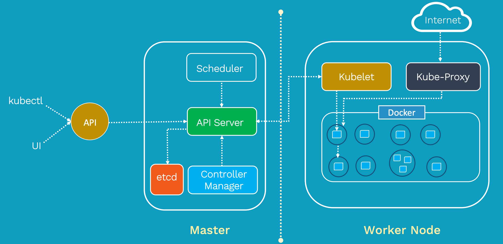

# Basic
* State Check
    - Kubernetes는 '원하는 상태'(desired state)를 '선언'(declarative)하면 '현재 상태'(current state)와 비교하여 원하는 상태를 유지하려한다.
    - 상태를 유지하기 위해 Kubernetes는 계속해서 Object 상태를 관찰한다(Observing)
    > k8s는 상태를 선연하다보니 명령어도 run이 아닌 create를 사용한다
* Namespace
    - Cluster에서 사용되는 리소스들을 구분해서 관리하는 그룹
    - 환경을 분리할 수 있음
        1) 서비스 단위 
        2) 환경 단위
        3) 팀 단위
        4) etc
    - default (기본), kube-system (k8s system), metallb-system 이 기본으로 등록되어 있음
    - 리소스 이름은 각 네임스페이스 내에서 고유해야 한다. 다른 네임스페이스에서는 사용 가능하다.
    - 네임스페이스는 서로 중첩될 수 없으며 각 Kubernetes 리소스는 하나의 네임스페이스에만 있을 수 있습니다.
* Object
    - k8s는 상태를 관리하기 위해 대상을 Object로 정의한다.
    - Pod Object : Pod 정보 - Container/CNI/CSI
    - Service : 서비스 네트워크에 관련된 정보 - Load balancer
    - ReplicaSet : Pod를 여러개 복제하여 관리하기 위한 정보 - 복제 개수/Selector label/Pod Template
    - Volume Object : 볼륨 정보 - 호스트 디렉토리/EBS 볼륨 등
    - 등등
* Node
    - 쿠버네티스 클러스터를 구성하는 최소 단위로, 최소 1개 이상의 컴퓨팅 노드가 필요
* Pod
    - Application이 동작하는 컨테이너들의 모음
    - Pod는 Cluster에 의해 관리되어지며, 설정에 따라 해당하는 Node에 추가된다 
> 원하는 상태에 대하여 명세서(yaml file)를 작성한다. 명세서에는 Object에 대한 정보들이 정의되어 있고 이를 Label로 관리

</br>
</br>


---
## 컨테이너 구성에 사용되는 리눅스 기술
Namespace는 프로세스, 시스템에 대한 격리 / Cgroups는 시스템 자원에 대한 제한 및 격리 / Union File System은 파일 시스템 계층에 대한 결합
- Namespace
- Control Group (Cgroups)
- Union File System

### Namespace
리눅스 커널에서 프로세스를 격리하는 기능으로, 컨테이너마다 독립된 실행 환경을 제공하는 핵심 기능
- Process ID Namespace : 프로세스 ID(PID) 격리 (호스트와 다른 컨테이너에서 실행 중인 프로세스와 독립적인 PID 공간을 가짐)
- Network Namespace : 네트워크 스택 격리 (라우팅 테이블, 네트워크 인터페이스 등)
- Mount Namespace : 파일 시스템 격리 (루트 파일 시스템)
- UTS Namespace : 호스트 이름과 도메인 이름 격리
- IPC Namespace : 컨테이너 간에 IPC(Inter-Process Communication) 리소스 격리
- User Namespace : 사용자 및 그룹 ID 격리 (컨테이너 내에서 루트 권한을 갖더라도 호스트 시스템에 영향을 미치지 않음)
</br>

### Cgroups (Control Groups)
프로세스들이 사용하는 시스템의 자원(CPU, Memory, Disk I/O, 네트워크 대역폭 등)의 사용 정보를 수집하고, 제한시키고, 격리시키는 리눅스 커널 기능
- CPU 제한
- Memory 제한
- Block I/O 제한
- Network Bandwidth 제한

* Cgroup 드라이버
    1) systemd (선호, 리눅스 배포판에서 systemd를 기본 init 시스템으로 채택하고 있기 대문에)
    2) cgroupfs
</br>

### Union File System
여러 파일 시스템 계층을 하나로 결합하여, 효율적인 파일 관리와 저장소 활용을 가능
* 컨테이너 이미지 (Container Image)

</br>
</br>


---
## Container Runtime Engine (Container Runtime)
CRI(Container Runtime Interface): 컨테이너 런타임과 통신할 수 있는 표준 인터페이스
* 구성
    1) Container Runtime Service: 컨테이너의 라이프사이클 관리. 생성, 삭제, 시작, 중지 등
    2) Image Service: 컨테이너 이미지를 관리
* Docker vs ContainerD
    - 기존에는 컨테이너 런타임이 Docker만 있었기 때문에 Docker를 지원했지만, K8S의 CRI를 따르는 형태가 아니었기 때문에 호환성에 많은 복잡성을 가졌다. 현재는 복잡성을 가진 Docker를 제거하고, CRI 표준을 따르는 ContainerD를 사용하고 있다.
    - 그렇다고 Docker가 이제 사용이 안되는 것은 아니다. Docker 자체 기능은 계속해서 쓰이고 있다.
* Container Runtime (High-level)
    - 컨테이너 런타임 엔진의 상위에서 동작하며, 컨테이너의 라이프 사이클 관리 등
    1) containerd
    2) CRI-O
    3) Docker Engine
    4) Podman
* Container Runtime (Low-level)
    - 컨테이너 런타임 엔진의 하위에서 동작하며, 실제로 컨테이너를 실행하는 역할
    1) runc (기본적으로 채택되어 있는 런타임)
    2) gVisor
    3) Kata Containers
* Container Network
    - 컨테이너의 네트워크 설정을 위해 CNI Plugin을 실행한다.
</br>

### ContainerD
Kubectl을 사용하지 못할때, crictl 명령어를 사용한다.
* CLI
    - ctr : ContainerD 디버깅용
    - nerdctl : ContainerD 일반적인 목적
    - crictl : K8S CRI - ContainerD에 대한 디버깅용
        ```
        crictl
        crictl pull busybox
        crictl images
        crictl logs 
        crictl posds
        ```

### Container 설정 시 필요한 것들
- cgroup driver : Control Groups. 프로세스 및 시스템 격리
- sandbox image : K8S의 기본 이미지
- CNI : Container Network Interface. 네트워크 플러그인
- Contaner runtime
    - runc : 리눅스 컨테이너를 시작하고 관리하기 위한 기본 런타임
    - runtime type : runc의 버전을 설정
- snapshotter = "overlayfs"

</br>
</br>


---
## Architecture
k8s는 구성 요소는 크게 Control plane(Master Node), Compute machines(Woker Node), Persistant storage, Container로 구성된다.


</br>


</br>


</br>
1) 관리자/사용자가 kubectl을 통해 API Server에 Pod 생성 요청 (API Server로 요청 전달)
2) API Server가 전달한 내용을 etcd에 기록하며 Cluster의 상태 값을 최신으로 유지 (모든 상태 값은 etcd에 저장)
3) Scheduler가 Pod Object 생성을 인지하면 어떤 Worker Node(Compute machines)에 적용할지 결정하고, 해당 Node에 Pod를 Run하도록 kubelet에 요청
4) kubelet은 API Server를 통해 생성/변경할 Pod를 확인
5) kubelet에서 Container runtime을 통해 Pod 생성. Pod에 대하여 "사용 가능 상태"를 API Server에 전달하여 etcd에 저장
6) Contoller Manager는 다양한 컨트롤러를 통해 클러스터 상태를 지속적으로 모니터링하고, 사용자가 정의한 원하는 상태로 유지
</br>
</br>


---
### Control plane (Master Node)
클러스터를 제어하는 쿠버네티스 구성 요소와 클러스터의 상태 및 구성에 관한 데이터를 가지고 있다.
* etcd만이 Stateful Module이며 나머지는 Stateless Module이다 (Statefule은 이전 트랜잭션에 따라 현재 트랜잭션이 영향을 받는 Application을 의미한다.
* kubeadm
    - 쿠버네티스 클러스터 구축을 위한 프로그램
* kubectl
    - 쿠버네티스 클러스터에 명령을 내리는 역할
    - Kubernetes에 명령을 내리기 위한 Binary
    - Command Line Interface (CLI)
1. kubelet
    * 컨테이너를 실제로 실행하는 하는 Agent로 모든 Node(Master, Worker)에 존재
    - Control Plane으로부터 요청을 받으면 Kubelet에서 파드에 대한 작업을 수행
        ```sh
        ExecStart=/usr/local/bin/kubelet \\
        --config=/var/lib/kubelet/kubelet-config.yaml \\
        --container-runtime=remote \\
        --container-runtime-endpoint=unix:///var/run/containerd/containerd.sock \\
        --image-pull-progress-deadline=2m \\
        --kubeconfig=/var/lib/kubelet/kubeconfig \\
        --network-plugin=cni \\
        --register-node=true \\
        --v=2
        ```
2. kube-apiserver
    - API Server. 외부 및 내부 요청(API)을 처리하는 통로
    - 인증, 권한 부여, 액세스 제어 등 제공 
    - Etcd와 유일하게 통신
    ```sh
    ExecStart=/usr/local/bin/kube-apiserver \\
    --advertise-address=${INTERNAL_IP} \\
    --allow-privileged=true \\
    --apiserver-count=3 \\
    --authorization-mode=Node,RBAC \\
    --bind-address=0.0.0.0 \\
    --enable-admission-plugins=Initializers,NamespaceLifecycle,NodeRestriction,LimitRanger,ServiceAccount,DefaultStorageClass,ResourceQuota \\
    --enable-swagger-ui=true \\
    --etcd-servers=https://127.0.0.1:2379 \\
    --event-ttl=1h \\
    --experimental-encryption-provider-config=/var/lib/kubernetes/encryption-config.yaml \\
    --runtime-config=api/all \\
    --service-account-key-file=/var/lib/kubernetes/service-account.pem \\
    --service-cluster-ip-range=10.32.0.0/24 \\
    --service-node-port-range=30000-32767 \\
    --v=2
    ```
3. etcd
    - SSOT (Single Source of Truth) 역할을 하는 CoreOS의 Opensource 분산 키-값 데이터베이스
    - gRPC 저장
    - 구성 요소의 상태 값을 모두 저장
        - ReplicaSet Object
        - Pod Object
    - "/registry" Directory Key 아래에 모든 Key-Value 형
    ```sh
    # HA 구성 시
    ExecStart=/usr/local/bin/etcd \\
    --name ${ETCD_NAME} \\
    --cert-file=/etc/etcd/kubernetes.pem \\
    --key-file=/etc/etcd/kubernetes-key.pem \\
    --peer-cert-file=/etc/etcd/kubernetes.pem \\
    --peer-key-file=/etc/etcd/kubernetes-key.pem \\
    --trusted-ca-file=/etc/etcd/ca.pem
    --peer-trusted-ca-file=/etc/etcd/ca.pem \\
    --client-cert-auth \\
    --initial-advertise-peer-urls https://${INTERNAL_IP}:2380 \\
    --listen-peer-urls https://${INTERNAL_IP}:2380 \\
    --listen-client-urls https://${INTERNAL_IP}:2379,https://127.0.0.1:2379 \\
    --advertise-client-urls https://${INTERNAL_IP}:2379 \\
    --initial-cluster-token etcd-cluster-0 \\
    --initial-cluster controller-0=https://${CONTROLLER0_IP}:2380,controller-1=https://${CONTROLLER1_IP}:2380 \\
    --initial-cluster-state new \\
    --data-dir=/var/lib/etcd

    # --cert-file : etcd 서버가 사용하는 서버 인증서 파일의 경로. 클러스터와 클라이언트 간의 통신을 암호화
    # --key-file : etcd 서버 인증서의 개인 키 파일 경로입니다. 인증서와 함께 사용하여 서버를 인증
    # --trusted-ca-file : etcd 서버와 클라이언트 간의 통신에서 신뢰할 수 있는 인증 기관(CA) 인증서 파일 경로. 클라이언트가 서버의 인증서를 신뢰하도록 함
    
    # --peer-cert-file : 다른 etcd 노드와의 통신에 사용되는 인증서 파일 경로. 피어(동료) 노드 간의 통신을 암호화
    # --peer-key-file : 피어 통신을 위한 인증서의 개인 키 파일 경로
    # --peer-trusted-ca-file : 피어 노드 간의 통신에서 신뢰할 수 있는 인증 기관(CA) 인증서 파일 경로. 피어 인증서의 유효성을 검사
    
    # --client-cert-auth : 클라이언트 인증을 활성화. 이 옵션이 설정되면 클라이언트가 서버에 연결할 때 클라이언트 인증서를 제출해야 함
    
    # --initial-advertise-peer-urls : 이 etcd 노드가 클러스터 내에서 다른 노드에게 자신을 알리기 위해 사용하는 URL. 이 URL은 피어 통신을 위해 사용됨
    # --listen-peer-urls : etcd 노드가 피어 노드와 통신하기 위해 수신 대기하는 URL

    # --advertise-client-urls : 클라이언트가 이 etcd 노드에 접근할 때 사용할 수 있는 URL
    # --listen-client-urls : etcd 노드가 클라이언트 요청을 수신 대기하는 URL. 외부와 로컬 클라이언트 요청을 수신
    
    # --initial-cluster-token : etcd 클러스터의 초기화 토큰으로, 클러스터의 식별자 역할
    # --initial-cluster-state new : 클러스터의 초기 상태를 지정. new는 새 클러스터를 시작할 때 사용하고, 기존 클러스터를 복원하려면 existing을 사용
    # --initial-cluster : 클러스터의 초기 노드 목록을 정의. 각 노드는 etcd 인스턴스의 URL을 지정
    # --data-dir=/var/lib/etcd : etcd 데이터 파일이 저장될 디렉토리 경로
    ```

4. kube-scheduler
    - 새로 생성하는 Pod를 요구사항과 노드 상태를 고려하여 최적의 노드 선택 (Filtering, Scoring)
        - CPU, Memory 등 리소스 상태
        - Taint
        - etc
    - Only Pod 생성 스케줄에만 관여
    > Scheduler가 없는 경우, 노드 선택을 못하기 때문에 Pod가 생성되지 않는다. 하지만 nodeName 같은 경우, 노드를 직접 선택하기 때문에 요구사항을 확인할 필요가 없기 때문에 Scheduler의 유무와 상관없이 동작한다.

5. kube-conroller-manager
    - 여러 클러스터를 통해 클러스터의 전반적인 상태를 관리
        - Pod들을 관리하고, 참고하여 Auto Scaling, Rolling Update 등을 수행하기 위해 kubelet에 전달
        - 클러스터의 현재 상태를 모니터링하고 원하는 상태로 조정
        - 리소스들의 생명 주기 관리 등
    - 여러 개의 컨트롤러 기능이 하나로 통합되어 있다
        1) ServiceAccount Controller : 새 NameSpace에 대하여 기본 ServiceAccount를 생성
        2) EndpointSlice Controller : EndpointSlice 개채 생성 (서비스와 포트 간의 링크 제공)
        3) 계정 및 API 액세스 토큰 생성을 위한 컨트롤러
        4) Deployment Controller
            * ReplicaSet을 생성
        5) ReplicaSet Controller
            * ReplicaSet 감시하고, 정의된 Label Selector 조건 체크 
            * 체크한 내용에 따라 필요시 Scheduler 쪽에 Pod 생성 요청
            - High Availability
            - LoadBalancing & Scaling
        6) Job Contoller

</br>
</br>


---
## Compute machine (Worker Node)
Application Pod들이 동작하는 Node 
* kubeadm
    - 쿠버네티스 클러스터 구축을 위한 프로그램
* kubectl
    - 쿠버네티스 클러스터에 명령을 내리는 역할
    - Kubernetes에 명령을 내리기 위한 Binary
    - Command Line Interface (CLI)
1. kubelet
    * Control Plane과 통신을 하는 Agent로 모든 Node에 존재 
    - Control Plane으로부터 요청을 받으면 Kubelet에서 파드에 대한 작업을 수행
    - CSI(Storage Interface), CNI(Network Interface) 설정
    ```sh
    ExecStart=/usr/local/bin/kubelet \\
    --config=/var/lib/kubelet/kubelet-config.yaml \\
    --container-runtime=remote \\
    --container-runtime-endpoint=unix:///var/run/containerd/containerd.sock \\
    --image-pull-progress-deadline=2m \\
    --kubeconfig=/var/lib/kubelet/kubeconfig \\
    --network-plugin=cni \\
    --register-node=true \\
    --v=2
    ```
    - Static Pod 관리
        ```sh
        $ ps -aux | grep -i kubelet         # Config 확인
        $ vi /var/lib/kublet/config         # staticPodPaths 값 확인
        ```
2. kube-proxy                           
    - 쿠버네티스 네트워킹 서비스를 용이하게 하기 위한 네트워크 프록시
    - Pod의 외부 통신을 위한 프로시
    - 운영 체제의 패킷 필터링 계층에 의존하거나 트래픽 자체를 전달하여 클러스터 내부 또는 외부의 네트워크 통신을 처리
    - iptables, IPVS를 이용하여 방화벽 처리
3. Container Runtime Engine
    - 컨테이너 실행을 위해 각 Computing Node에는 런타임 엔진이 있다 (ex> Docker)
</br>
</br>


---
## 그 외

### Image
- 형태: image: docker.io/library/nginx (image: <Registry>/<User/Account>/<Image/Repository>)
- imagePullSecrets 설정
    - Private 이미지를 기반으로 컨테이너를 실행하는 데 권장되는 접근 방식 (컨테이너 이미지 레지스트리 키 사용하여 접근)
    - 방식 : 컨테이너 이미지 레지스트리 키 Secret 생성 ---> Pod yaml 파일에 해당 키 추가
    - Ref : https://kubernetes.io/docs/tasks/configure-pod-container/configure-service-account/
    - https://www.ibm.com/docs/ko/cloud-private/3.2.x?topic=images-creating-imagepullsecrets-specific-namespace


### Security Context
Pod 실행 시, 실행 권한 등을 설정할 수 있다.


## Network Policy
네트워크 보안(방화벽)을 정의하는 객체이다. 특징은 다음과 같다.
- Stateful policy
- 


=================================================================================


---

### CoreDNS
DNS Server로 Kubernetes Cluster에서 Domain을 이용해 통신하는데 사용한다.
</br>

## ETC
Kubernetes를 잘 활용하기 위해 필요한 기술들은 다음과 같다.
* Registry
* Helm
* Prometheus
* Grafana
</br>
</br>

