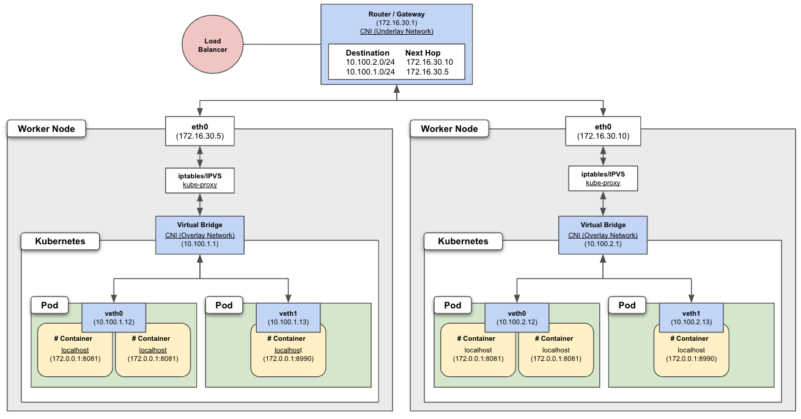

# Networking

* endpoint : Service가 패킷을 전달하고자 하는 Pod 집합의 진입점을 Endpoint라고 한다. 해당 Endpoint에는 단일 DNS가 부여된다.


## 

* CNI Plugin(Container Network Interface) : Overlay Network 관리 - Network routing
* kube-proxy : Firewall 관리 - Net filter, NAT
    - iptables Mode : Chain Rule을 찾아 트래픽 전달 / 시간 복잡도 : O(n)
    - IPVS Mode : Hashing 기반으로 Rule을 찾아 트래픽 전달 / 시간 복잡도 : O(1)
    > https://blog.naver.com/alice_k106/221606077410 / https://techblog.lotteon.com/%EB%A1%AF%EB%8D%B0on-eks-%EC%9A%B4%EC%98%81-tips-8a1cade6a0d5

## 통신 과정

통신은 크게 4가지로 분류된다 (즉, 네트워크 Layer가 크게 4개로 분류된다고 생각하면 된다)
1. Container 간의 통신
    - 자체 네트워크 사용
    1) 기본적으로 Pod 내의 Container들은 동일한 IP(veth) 가짐
    2) 같은 veth를 가지기 때문에 localhost를 사용하고 Port로 구분되어 통신
2. Pod 간의 통신
    - 컨테이너 서비스 환경(k8s, docker 등)에 따라 다르지만, Overlay Network 서비스(CNI, kubenet 등)를 이용해서 통신
    1) Pod 간에는 서로 다른 veth ip가 할당
    2) 네트워크 서비스(CNI, kubenet 등)가 Network,Routing을 관리 (```route -n```)
3. Pod - Service 간의 통신
    - Pod는 고유한 IP 주소를 부여받는다. 하지만 DaemonSet, ReplicaSet, 수동에 의해 관리되어지는 Pod는 언제든지 삭제/생성이 될 수 있으며, 그때마다 Pod의 IP는 보장되지 않는다. 그렇기때문에 Pod를 대표하는 IP가 필요하다. 이를 위해 사용되는 것이 Service이다.
    - Service가 패킷을 전달하고자 하는 Pod 집합의 진입점을 Endpoint라고 한다. 해당 Endpoint에는 단일 DNS가 부여된다.
    - iptables Rule
        1) PREROUTING rule : 서비스로 들어오는 모든 패킷은 KUBE-SERVICES 규칙을 따르도록 Chaining
        2) KUBE-SERVICES rule : Service에 따라 해당 Rule을 따르도록 Chaining (Service마다 Rule이 생성됨)
        3) KUBE-SERVICES SEP rule : Serivce Endpoint로 접근하고, 여러 Pod로 로드밸런싱 및 Destination NAT 처리
        4) Return 돌아왔던 순서대로 다시 돌아간다.
4. Service - External 간의 통신
    - 3번과 동일
* Ref
    - https://medium.com/finda-tech/kubernetes-%EB%84%A4%ED%8A%B8%EC%9B%8C%ED%81%AC-%EC%A0%95%EB%A6%AC-fccd4fd0ae6
    - https://sookocheff.com/post/kubernetes/understanding-kubernetes-networking-model/
    - https://malwareanalysis.tistory.com/265

---
## Basic
EKS는 AWS에서 제공하는 CNI(Container Network Interface) Plugin을 사용한다!!
* Amazon EKS는 Pod에게 예약된 Worker Node와 동일한 서브넷에서 IP를 할당해준다.
    > 필요시, 


* Pod 네트워크
    - 
    - 
    - 서비스는 이를 통해 통신한다.


---
## Firewall
kube-proxy Mode

https://velog.io/@squarebird/Kubernetes-Networking-2.-Service

iptables mode


---
## 


---
## 


---
## 


---
## 


---
All containers/Pods can communicate to one another without NAT
All nodes can communicate with all containers and vice-versa without NAT
- NAT 구성 없이도 쿠버네티스 내부의 리소스들은 통신이 되어야 한다

이를 위해 많은 네트워크 플랫폼이 구축되어 있다.
- Cisco
- Cilium
- Calico (가장 많이 쓰임)
- flnnel
- VMWare NSX