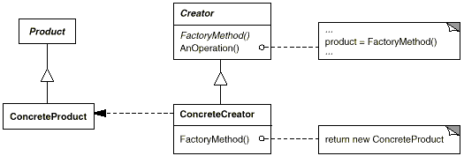

# Factory Method Pattern
* 객체를 생성하기 위한 인터페이스를 정의하고, 인스턴스 생성은 서브 클래스가 결정
* 객체 생성을 캡슐화하기 위한 패턴
* 생성에 대한 모든 코드는 Factory에서 가져가 관리하기 위한 패턴
    * 의존성을 줄여 독립성이 강해짐
* Factory Method 호출로 적절한 ConcreteProduct Instance 반환

## Pattern Structure


* Factory
```java
abstract public class Factory {
    // An Operation()
    public final Product create(String name){
        Product pd = createFactory(name);
        // Other Operation
        System.out.println("Other Operation");
        return pd;
    }

    // FactoryMethod()
    protected abstract Product createFactory(String name);
}

class ConcreteFactory extends Factory{

    // FactoryMethod();
    @Override
    protected ConcreteProduct createFactory(String name) {
        return new ConcreteProduct(name);
    }

    public static void main(String[] args) {
        Factory factory = new ConcreteFactory();
        Product product1 = factory.create("ABC");
        Product product2 = factory.create("EFG");
        product1.run();
        product2.run();
    }
}
```

* Product
```java
public class Product {
    private String name;

    public Product(String name){
        this.name = name;
    }

    public void run(){
        System.out.println(name+" Product");
    }

    public String getName() {
        return name;
    }
}

class ConcreteProduct extends Product {

    public ConcreteProduct(String name){
        super(name);
    }

    @Override
    public void run(){
        System.out.println(getName()+" ConcreteProduct");
    }
}
```