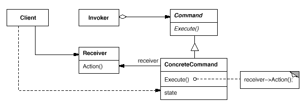

# Command Pattern
* 요청 사항 자체를 캡슐화하기 위한 패턴
* 요청을 관리하기 위한 Class를 정의하고, Receiver(관리 Class)를 통해 요청(객체)을 Queue에 저장, Log 기록, 실행, 실행 취소 등을 한다.
* 요청 객체는 Interface로 받아, Receiver는 해당 요청 객체가 어떤 일을 하는지는 모른다.
* Command Pattern의 예로는 Thread, Runnable을 보면 알 수 있다.
    * Thread(Receiver), Runnable(Command)

## Pattern Structure

### Reference
* https://johngrib.github.io/wiki/command-pattern/#fn:structure