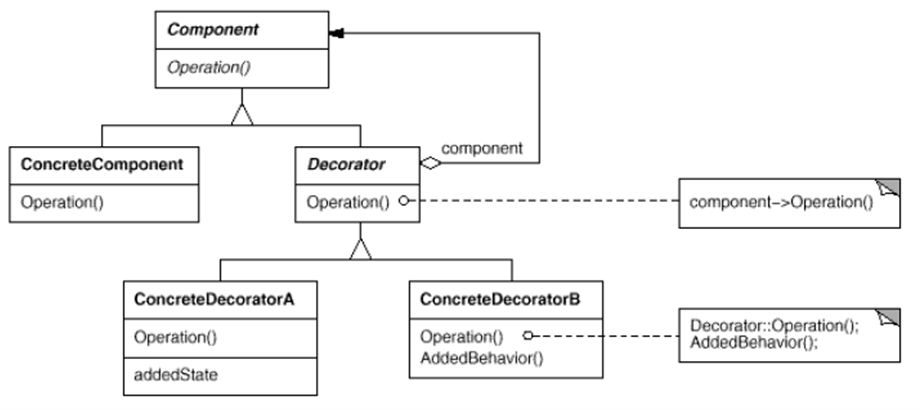

# Decorator Pattern
* 주어진 상황 및 용도에 따라 어떤 객체에 책임을 덧붙이는 패턴
* 기능 확장이 필요할 때, 서브클래스를 생성하는 대신 쓸 수 있는 유연한 대안이 될 수 있다.
* 탈부착이 가능하다.
* 패턴을 사용한 예는 InputStream, Reader 등이다.

### Pattern Structure


* **Component** : 최상위 클래스
* **ConcreteComponent** : Component 자식 클래스, 기반 Class(Component)
* **Decorator** : Component 자식 클래스, 보조 Class(Component)
* **ConcreteDecoratorA, B** : Decorator 자식 클래스.
 Operation의 경우, Decorator 클래스의 Operation을 실행하고, 다른 기능을 추가한다.
 
```java
abstract class Component{
    abstract void operation();
}
class ConcreateComponent extends Component{
    void operation(){
        // 실행 코드
    }
}
class Decorator extends Component{
    Component component;
    public Decorator(Component component){
        this.component = component;
    }
    
    public void operation(){
        this.component.operation();
    }
}

class ConcreateDecoratorA extends Decorator{
    public ConcreateDecoratorA(Component component){
        super(component);
    }
    public void operation(){
        super.operation();
        // 추가 실행 코드
    }
}
```
