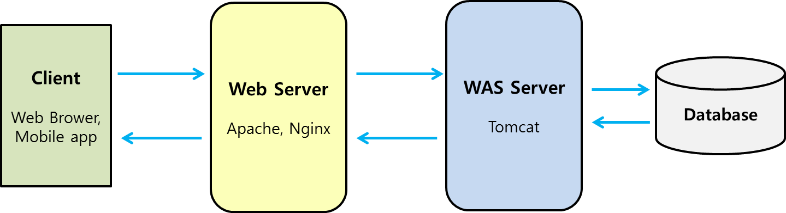

# Web PriorKnowledge
* Web에 대한 사전 지식

# Web Server
* 요즘에는 Web Server라고 하면, Web + WAS Server를 말한다.

## Web Server
* HTTP(HyperText Transfer Protocol)를 통해 Web browser에서 요청하는 HTML 문서나 오브젝트(이미지 파일 등)를 전송해주는 서버.
* HTTP : HyperText Transfer Protocol, W3 상에서 정보를 주고받을 수 있는 프로토콜로 80번 포트를 사용한다.

## CGI(Common Gateway Interface)
* 공용 게이트웨이 인터페이스, Web Server와 외부 프로그램 사이에서 정보를 주고받는 방법이나 규약
* Web Server가 동적으로 동작하기 위해 고안된 방법으로, 웹 서버가 동적 로직을 외부 프로그램을 호출하여 처리하고 결과를 반환한다.
* CGI 동작
    1) Request가 Web Server로 들어오면, Web Server는 Request URL에 대응하는 CGI를 찾는다.
    2) 대응하는 CGI가 있는 경우, 환경 변수와 표준 입력의 형태로 요청을 전달하고, 비즈니스 로직을 fork를 통해 새로운 프로세스를 생성하여 처리한다.
    3) 처리한 결과를 Web Server에게 반환한다.
* 문제점
    * 동일한 URL을 받아도, 새로운 프로세스를 생성하기 때문에 리소스 낭비 및 부하가 심하다(Multi-Process).
* 해결 방안
    * Servlet(Java) - Multi-Thread 방식
    * WSGI(Web Server Gateway Interface, Python)


## WAS Server
* Web Application Server, Servlet Container 라고도 한다.
* 동적 콘텐츠를 제공하기 위해 수행하는 서버. Servlet을 관리하는 서버.
* 기존 Web Server는 요청에 대한 문서나 오브젝트를 전송하기만 하는 정적인 동작만 할 수 있기 때문에, WAS Server와 연동하여 사용된다.


## Web Structure


## URI & URL
### URI
* Uniform Resource Identifier
* 통합 자원 식별자, 리소스에 대한 고유 식별자를 나타낸다.
* URI의 형태(표현 방식)로는 URL과 URN이 있다.
    * URL은 위치로, URN은 이름으로 교유 식별자를 표시한다.

### URL
* Uniform Resource Locator
* 통합 자원 지시자, 서버의 리소스에 대한 구체적인 위치를 나타낸다.
* 위치가 바뀌면 기존 위치로는 리소스에 접근이 불가능하다.
* Example
    ```
    http://news.naver.com:80/main/read.nhn?mode=LSD&mid=shm&sid1=105&oid=001&aid=0009847211#da_727145
    ```
    * http:// : Protocol
    * news : Sub Domain
    * naver.com : Domain
    * 80 : Port
    * /main/ : Path
    * read.nhn : Page
    * ?mode=LSD&mid=shm&sid1=105&oid=001&aid=0009847211 : Query
    * \#da_727145 : Fragment

### URN
* Uniform Resource Name
* 통합 자원 이름, 리소스의 위치에 영향을 받지 않는 유일 무이한 이름을 나타낸다.
* 이름이 변경되지 않는다면 위치, 프토토콜 등 상관없이 이름으로 접근 가능하다.

#### Reference
* https://mygumi.tistory.com/139


## Cookie & Session
* HTTP 특성은 Connectionless, Stateless이기 때문에 Client가 정보를 유지할 수 가 없다.
    * 로그인 유지, Session 유지 등
* 이를 해결하기 위해 Cookie와 Session Tracking이 나오게 됐다.


## Session
* Server에 저장하는 객체 데이터, Browser와 연결 시 Session ID 생성
    * 로그인 연결 정보, 원하는 객체 데이터
* Session ID를 Cookie에 저장함으로 로그인 연결을 유지
    * 같은 Browser로 같은 Server에 접속하면 Session ID가 같음
* Java는 JSession을 만든다.
* Session에 Cookie를 저장하고 Cookie 넘버를 데이터에 넣어 보낸다.

### Session Tracking
* User에 대한 Session을 유지시키기 위한 방법

## Cookie
* Client에 저장하는 문자열 데이터로 도메인 별로 따로 저장
    * 로그인 정보, 내가 봤던 상품 정보, 팝업 다시보지 않기 등
* 하나의 Client에 300개, Domain당 20개, Cookie 하나당 4KByte

## Cache
* Client나 Server의 메모리에 저장하여 빠르게 데이터를 가져오는 목적의 저장소


## 인증 방식
## Single Sign-On (SSO)
* 통합 인증

## OAuth2


## MIME Type


### Reference
* https://sehun-kim.github.io/sehun/spring-short-story/
* https://m.blog.naver.com/PostView.nhn?blogId=tothesky21&logNo=40038856386&proxyReferer=https:%2F%2Fwww.google.com%2F
* https://brownbears.tistory.com/350
