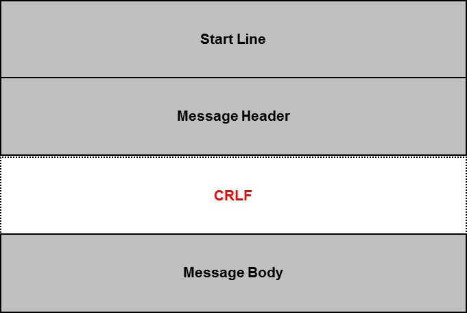
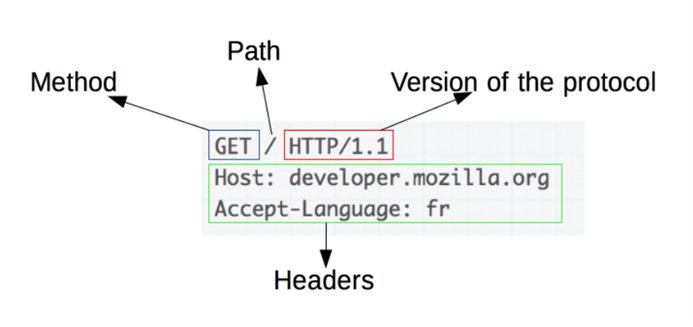
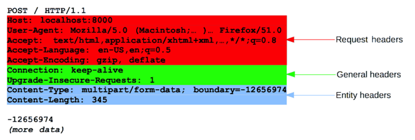
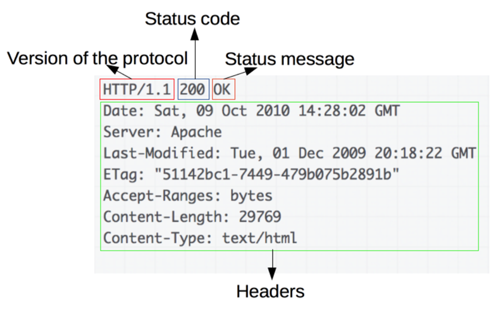
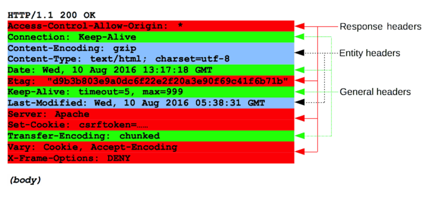

## HTTP
* HyperText Transfer Protocol
* Web Server와 Web Client 간에 통신하기 위한 프로토콜(규약)
* Version: HTTP/1.1(가장 많이 사용됨), HTTP/2
* https://developer.mozilla.org/ko/docs/Web/HTTP/Overview

### Structure

* HTTP는 Start line, Message header, Message body로 구성되어 있다.
* Header와 Body 사이에 CRLF(공백)로 구분

## Request 
### Basic Structure

* Method: Client가 수행하고자 하는 동작을 정의 (GET, POST, HEAD)
* Path: 가져오려는 Resource의 경로, 프로토콜, 도메인, 포트 요소를 제거한 URL
* Version: 사용하는 HTTP Protocol Version
* Header: Server에 전달한 추가 정보들
* Body: 보통 POST와 같은 Method를 제외하고는 Body가 없다.

### Header Structure

* Request Header: User-Agent, Accep-Type와 같은 헤더는 요청을 좀 더 상세하게 기술한 내용
* General Header: 메세지 전체에 적용되는 내용, Cache-Control, Connection, Transfer-Encoding 등
* Entity Header: Content-Length와 같은 헤더는 Request Body에 적용, Body가 없는 경우 Entity Header는 전송되지 않는다.

## Response
### Basic Structure

* Version: 사용하는 HTTP Protocol Version
* Status Code: 요청의 성공 여부와 그 이유를 나타내는 상태 코드
* Status Message: 상태 코드의 짧은 설명을 나타내는 상태 메시지
* Header: Server에 전달한 추가 정보들
* Body: 보통 POST와 같은 Method를 제외하고는 Body가 없다.

### Header Structure

* Response Header: 응답을 상세하게 기술한 내용
* General Header: 상태 줄에 미처 들어가지 못했던 Server에 대한 추가 정보를 제공
* Entity Header: Content-Length와 같은 헤더는 Response Body에 적용, Body가 없는 경우 Entity Header는 전송되지 않는다.

### Response Code
* developer.mozilla.org/ko/docs/Web/HTTP/Status
* 성공 응답, 200번

    | Status Code | Description |
    |-------------|-------------|
    | 200 | OK, Client의 요청을 정상적으로 수행 |
    | 201 | Created, Client가 어떠한 리소스 생성을 요청, 해당 리소스가 성공적으로 생성됨(POST를 통한 리소스 생성 작업 시) |

* Redirection Message, 300번

    | Status Code | Description |
    |-------------|-------------|
    | 301 | Moved Permanently, 요청한 Resource의 URI가 변경되었음을 의미. 응답 시 Location Header에 변경된 URI를 적어줘야 한다. |

* Client Error, 400번

    | Status Code | Description |
    |-------------|-------------|
    | 400 | Bad Request, 잘못된 문법으로 인하여 서버가 요청을 이해할 수 없음을 의미 |
    | 401 | Unauthorized, Client가 인증되지 않은 상태에서 보호된 Resource를 요청했을 때 사용 |
    | 403 | Forbidden, 유저 인증상태와 관계 없이 응답하고 싶지 않은 Resource를 요청했을 때 사용 |
    | 404 | Not Found, Server가 요청받은 Resource를 찾을 수 없는 경우 사용 |
    | 405 | Method Not Allowed, Client가 요청한 Resource에서는 사용 불가능한 Method를 이용했을 경우 사용 |

* Server Error, 500번

    | Status Code | Description |
    |-------------|-------------|
    | 500 | Internal Server Error, Server에 문제가 있을 경우 사용 |

## HTTP Method
### GET
* 기능: Resource를 조회한다.
* URL에 입력 데이터가 포함되므로 Body가 없으며, 데이터가 노출되어 보안에 취약하다.
* 길이의 제한이 있다.

### POST
* 기능: Resource를 생성한다.
* 입력 데이터를 Encoding하여 Body에 데이터를 포함시킨다. 즉, 데이터가 숨겨져 보안성이 우수하다.

### PUT
* 기능: Resource를 수정한다.

### DELETE
* 기능: Resource를 삭제한다.