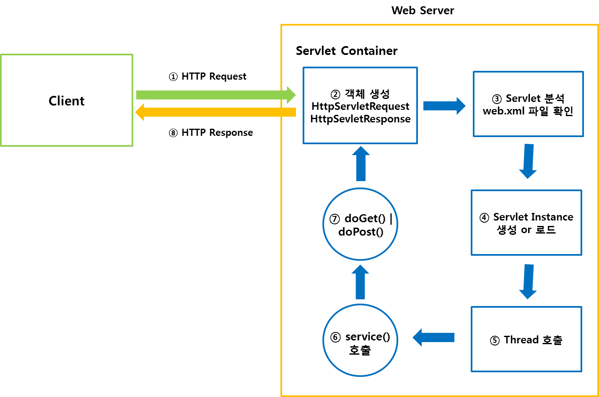

# Servlet
* Web Programming에서 Client의 요청을 처리하고 그 결과를 다시 Client에게 전송하는 역할을 하는 자바 프로그램
* Java Code 안에 HTML이 삽입되어 있다.

## Servlet Container
* Tomcat 등이 있다.
* 역활은 아래와 같다.
1) Web Server와 Servlet이 서로 통신할 수 있게 한다.
    * 원래는 socket을 생성하고, listen, accept, read등을 해야 되지만 API로 기능을 제공
2) Multi-Threading 지원
    * 다중 요청을 처리해준다.
3) Servlet Lifecycle 관리
4) 선언적인 보안 관리
    * XML을 통해 보안 관리 가능

## Servlet Container 동작 방식
* Tomcat 기준이다.
1. Tomcat 객체 생성 및 실행 -> Catalina 실행(Tomcat의 핵심 Core)
2. ServletEngine 객체 생성 및 실행, 입력 값으로 web.xml을 받는다(ex> new ServletEngine(web.xml) 이라 생각하면 될거 같다.)
    * 이러한 이유 때문에 web.xml이 변경되면 Server를 꼈다 켜야된다.

## Maven 연동
1) Move Maven Central (https://search.maven.org/)
2) Search javax.servlet (javax.servlet-api)
3) Copy Maven Code

## Maven War Plugin 연동
1) Move Maven War Plugin (https://maven.apache.org/plugins/maven-war-plugin/)
2) pom.xml에 packaging 추가
3) Project Structure도 맞춰줘야 된다.
4) web.xml에 Basic Example을 복사 (https://javaee.github.io/servlet-spec/downloads/servlet-4.0/servlet-4_0_FINAL.pdf)

## CGI(Common Gateway Interface)
* 공용 게이트웨이 인터페이스 
* CGI는 Web Server와 외부 프로그램 사이에서 정보를 주고받는 방법이나 규약
* 어떤 식으로 요청을 처리하고 응답할지를 정한다.

## Servlet 동작 방식

1) Client가 Web Server에 Request를 보낸다.                                                                                                                                                                                                                                                                                                                                                                                                                                                                                                                                                                                                                                                                                                                                                                                                                                                                                                                                                                                                                                                                                                                                                                                                                                                                                                                                                                                                                                                                                                                                                                                                                                                                                                                                                                                                                                                                                                                                                                                                                                                                                                                                                                                                                                                                                                                                                                                                                                                                                                                            
2) Servlet Container는 HttpServletRequest, HttpServletResponse 객체를 생성한다.
3) Client가 요청한 URL을 분석하여, web.xml에 해당 Sevlet이 있는지 확인
4) Servlet 객체를 생성 or 로드 (Servlet LifeCycle 참조)
5) 새로운 Thread에 작업 호출
6) Servlet의 service() 호출
7) GET인 경우 doGet(), POST인 경우 doPost() 호출하여 실행 결과를 HttpServletResponse에 저장
8) Client에 Response를 보내고, HttpServletRequest, HttpServletResponse 객체 소멸
 
## Servlet Lifecycle

*그림 - https://placeforjake.tistory.com/43*
1) Request가 들어오면 Container는 해당 Servlet의 Instance가 Memory에 있는지 확인하고, 없을 경우 Instance를 생성하고
init()를 호출한다(필요에 따라 init()를 Overriding하여 구현)
2) 생성(로드)된 Instance는 service()를 호출하고, Request에 따라 doGet, doPost()를 호출한다.
3) Container가 Sevlet의 종료 요청을 하게 되면, destroy()가 호출된다(필요에 따라 destroy()를 Overriding하여 구현)


## Servlet 구조
* 일반적인 Servlet 실행 순서
    * Servlet Engine 생성 -> Listener 생성 -> Filter 생성 -> 요청에 따라 Servlet 생성/삭제 
    -> Filter 삭제 -> Listener 삭제 -> Servlet Engine 삭제

## Servlet Class
```java
@WebServlet(name = "hello.HelloServlet")
public class HelloServlet extends HttpServlet {
    private String encoding;

    public HelloServlet() {
        System.out.println("====> HelloServlet 객체 생성");
    }

    @Override
    public void init(ServletConfig config) throws ServletException {
        encoding = config.getInitParameter("boardEncoding");
        System.out.println("----> init() 호출");
    }

   @Override
    protected void service(HttpServletRequest req, HttpServletResponse resp) throws ServletException, IOException {
        System.out.println("-----> service() 호출");
        String method = req.getMethod();
        if (method.equals("GET")) {
            doGet(req, resp);
        } else if (method.equals("POST")) {
            doPost(req, resp);
        }
    }

    @Override
    public void destroy() {
        System.out.println("-----> destroy() 호출");
    } 

    protected void doPost(HttpServletRequest request, HttpServletResponse response) throws ServletException, IOException {
        System.out.println("---> doPost() 호출");
    }

    protected void doGet(HttpServletRequest request, HttpServletResponse response) throws ServletException, IOException {
        System.out.println("---> doGet() 호출");
    }
}
```
* Servlet은 Lazy-Loading Class이다. 요청 전까지 생성하지 않는다.
1. HttpServlet 클래스를 상속해야 한다.
2. public 클래스로 만들어야 한다.
3. default 생성자가 있어야 한다.
    * 생성자는 default 생성자로만 초기화하기 때문에, init() 메서드를 통해 여러 설정을 처리한다.
4. 요청 방식(Method)에 따라 doGet이나 doPost를 재정의(Overriding) 한다.
5. 부모(HttpServlet) 클래스의 메서드를 재정의 하지 않으면 상속된다.

### HttpServletRequest
* Servlet Request 객체
    * ex> URL : http://www.example.com:8080/ctx/svl?name=abc
    
| Method | Description |
|--------|-------------|
|  getMethod() | HTTP 메서드 |
| StringBuffer getRequestURL() |  |
| String getRequestURI() |  |
| getProtocol() |  |
| getHeader("User-Agent") |                                                                                                                                                                                                                                                                                                                                                                                                                                                                                                                                                                                                                                                                                                                                                                                                                                                                                                                                                                                                                                                                                                                                                                                                                                                                                                                                                                                                                                                                                                                                                                                                                                                             |
| getParameter() | 사용자 입력 정보 추출 |
| HttpSession getSession() | Session 정보 추출 |
|  |  |
|  |  |
|  |  |

### HttpServletResponse
* Servlet Response 객체

| Method | Description |
|--------|-------------|
|  | send |
|  |  |
|  |  |
| sendRedirect() | 원하는 URI로 Redirection |
|  |  |
|  |  |
|  |  |
|  |  |
|  |  |
|  |  |

### ServletConfig, FilterConfig
* web.xml에 설정된 값들을 저장하고 있는 객체

| Method | Description |
|--------|-------------|
| String getInitParameter(String name) | init-param에서 설정한 name의 값을 가지고 온다. |
| ServletContext getServletContext() | ServletContext 객체를 가지고 온다. |
|  |  |

* 기본적으로 Config 객체에서 ```getInitParameter()```를 호출하면 해당 Servlet 또는 Filter에 설정된  ```<init-param>``` 값을 가지고 온다.
* ```<context-param>```의 값은 ```ServletContext``` 객체를 이용하여 ```getInitParameter()```를 호출해야 값을 가지고 온다.


### HttpSession
* Request 객체를 통해 가지고 올 수 있다.
* Browser 하나당 Session 하나가 생성된다. Browser를 종료하거나 Session의 기간이 종료되야 Session이 종료된다.

| Method | Description |
|--------|-------------|
| Object getAttribute(String name) | name에 해당하는 Object 객체를 리턴 | 
| void setAttribute(String name, Object value) | name 속성의 값을 value 객체로 초기화 | 
| void invalidate() | Session을 종료 | 
| boolean isNew() | Session이 처음 만들어진 것이면 true를 리턴 | 
| void removeAttribute(String name) | name 속성의 값을 삭제 | 
| void setMaxInactiveInterval(int seconds) | Session을 유지할 시간을 설정 | 

* Example
```java
@Slf4j
public class SimpleFilter implements Filter {
    @Override
    public void doFilter(ServletRequest request, ServletResponse response, FilterChain chain) throws IOException, ServletException {
        log.info("Filter-Hello World");
        HttpSession session = ((HttpServletRequest)request).getSession();
        String username = (String)session.getAttribute("username");
        if(username == null){
            log.info("new user");
            session.setAttribute("username", "yoon2");
        }else{
            log.info("user -> "+username);
        }
        chain.doFilter(request, response);
        var writer = response.getWriter();
        writer.println("filter - Hello World!!");
    }
}
```
* Session에는 id, 권한 등 접속 정보만 저장해야지, Session에 결과를 저장하면 안된다. 
* 결과는 Session이 아닌 Reponse에 저장해야 한다.


## Filter Class
```java

```
* Filter는 Servlet이 실행 전후로 Filtering 기능을 수행하는 클래스
    * Servlet을 실행하기 전에 요청 데이터를 원하는 형태로 사전처리(Pre Process), 또는 Servlet에서 나온 응답 데이터를 사후처리(Post Process)하는 목적으로 사용
* Pre-Loading Class이다. 처음부터 생성되는 클래스이다.
* init(), destroy(), doFilter() 메서드가 무조건 Overriding되어 있어야 한다.
* 


## Listener Class
```java

```
* Listener는 특정 이벤트가 발생할 때, 실행되는 클래스이다.
* 
* 

| Listener Class | Description |
|----------------|-------------|
| HttpSessionListener | Session 객체 생성이나 소멸 이벤트 리스너 |
| HttpSessionBindingListener | Session에 Binding된 객체를 알려주는 이벤트 리스너 |
| ContextLoaderListener | "contextClass" 와 "contextConfigLocation" Servlet context-param을 기준으로 Web Appplication context를 생성한다. |
|  |  |

* contextLoader


## web.xml
```xml

<!-- Global Parameter Setting -->
<context-param>
    <param-name>boardEncoding</param-name>
    <param-value>UTF-8</param-value>
</context-param>

<servlet>
    <servlet-name>catalog</servlet-name>
        <servlet-class>com.example.CatalogServlet
        </servlet-class>
    </servlet>
    <init-param>
        <param-name>boardEncoding</param-name>
        <param-value>UTF-8</param-value>
    </init-param>    
<servlet-mapping>
    <servlet-name>catalog</servlet-name>
    <url-pattern>/catalog/*</url-pattern>
</servlet-mapping>

<filter>
    <filter-name>simpleFilter</filter-name>
    <filter-class>kr.co.fastcampus.web.SimpleFilter</filter-class>
</filter>
<filter-mapping>
    <filter-name>simpleFilter</filter-name>
    <url-pattern>/simple</url-pattern>
</filter-mapping>

```
* servlet과 servlet-mapping은 서로 한 쌍을 이룬다.
* **<servlet-class>** : Servlet Class Name(extends HttpServlet)
* **<servlet-name>** : Servlet Name
* **<url-pattern>** : 해당 Servlet에 대한 URL Pattern
* **<filter-class>** : Filter Class Name(implements Filter)


## Servlet 3.0 이상부터 사용되는 Annotation
* web.xml이 필요없다.
```java
@WebServlet(
        name = "simple",
        urlPatterns = "/simple"
)

```


## Deployment Descriptor(DD, 배포 서술자)
* 보통 WEB-INF Directory 아래의 web.xml 파일을 가리킨다.
* Servlet Mapping 정보, Listener, Filter, Secure 등에 대한 설정이 저장된다.


### Reference
* https://mangkyu.tistory.com/14
* https://lee-mandu.tistory.com/12?category=633570
* https://sjh836.tistory.com/126