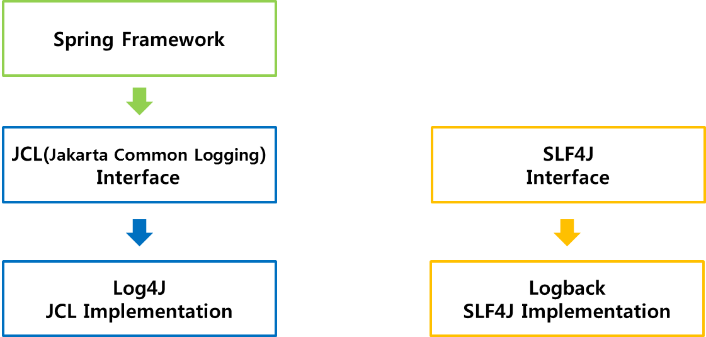
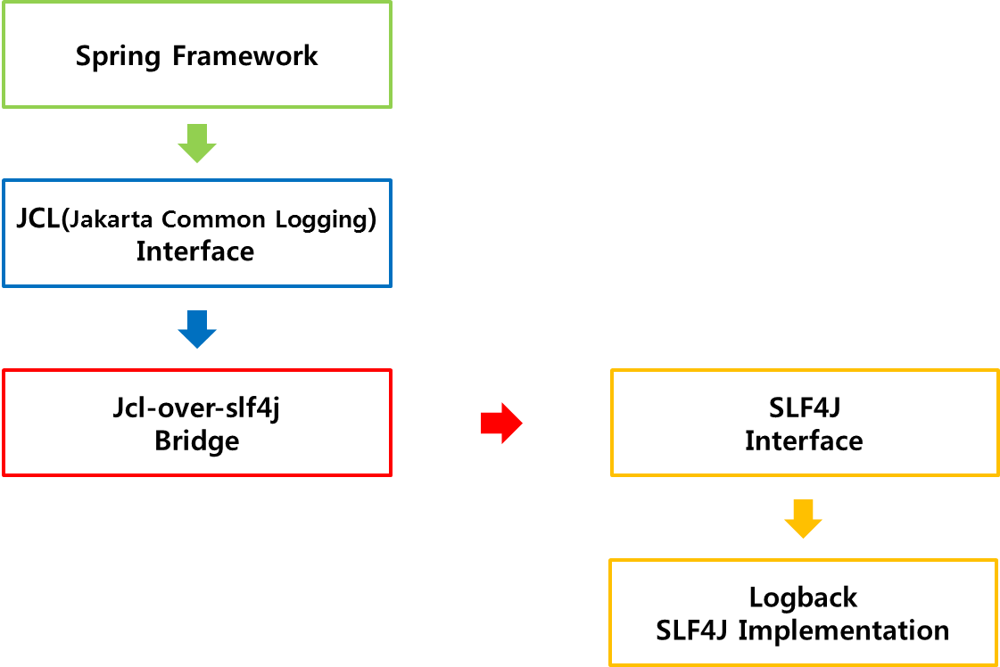

# Logback
* JAVA에서 가장 많이 사용되었던 Logging Library인 log4j의 후속 버전.
* logback-classic은 SLF4J를 구현한다. 그렇기 때문에 SLF4J를 이용하여 logback Class를 사용할 수 있다.

## Logging Structure
* Spring Common Logging
    
    * 기본적으로 Spring은 JCL을 사용한다.
    * Logback의 경우, SLF4J의 구현체이기 때문에 JCL을 이용하여 사용할 수 없다.
    
* Using SLF4J
    
    * Logback을 사용하기 위해서 JCL과 SLF4J 중간 Bridge 역할이 필요하다.
    * Bridge(Adapter) 역할로는 jsl-over-slf4j가 있다.


## Download logback
1. Download logback (http://logback.qos.ch/)
    * logback-classic 
    * logback-core
2. Download slf4j (http://www.slf4j.org/) 
    * slf4j-api

## Example
  ```java
    package kr.co.fastcampus;
    import org.slf4j.Logger;
    import org.slf4j.LoggerFactory;
    
    public class Main {
        private static Logger logger = LoggerFactory.getLogger(Main.class);
    
        public static void main(String[] args){
            logger.info("Hello world!"); 
        }
    }
  ```
   * LoggerFactory.getLogger(Main.class) - Return: Logger Object, Parameter: {Class Name}.class / "{Package Path/ClassName}" 

## Log Level
* trace -> debug -> info -> warn -> error 순으로 높다
* 설정 Level 이상의 로그 출력, info로 호출 시, trace, debug는 보여지지 않는다.
```java
  public void trace(String message);
  public void debug(String message);
  public void info(String message); 
  public void warn(String message); 
  public void error(String message); 
```

## Logback Setting
* 설정파일 및 우선순위는 다음과 같다.
1. logback.groovy 
2. logback-test.xml
3. logback.xml

## logback.xml
* Setting Example
```xml
<configuration>
  <appender name="STDOUT" class="ch.qos.logback.core.ConsoleAppender">
    <!-- encoders are assigned the type
         ch.qos.logback.classic.encoder.PatternLayoutEncoder by default -->
    <encoder>
      <pattern>%d{HH:mm:ss.SSS} [%thread] %-5level %logger{36} - %msg%n</pattern>
    </encoder>
  </appender>

  <root level="debug">
    <appender-ref ref="STDOUT" />
  </root>
</configuration>
```

## Using Build Tool for Logback
1. Maven


2. Gradle


#### Reference
* https://dololak.tistory.com/635?category=636500
* Fastcampus