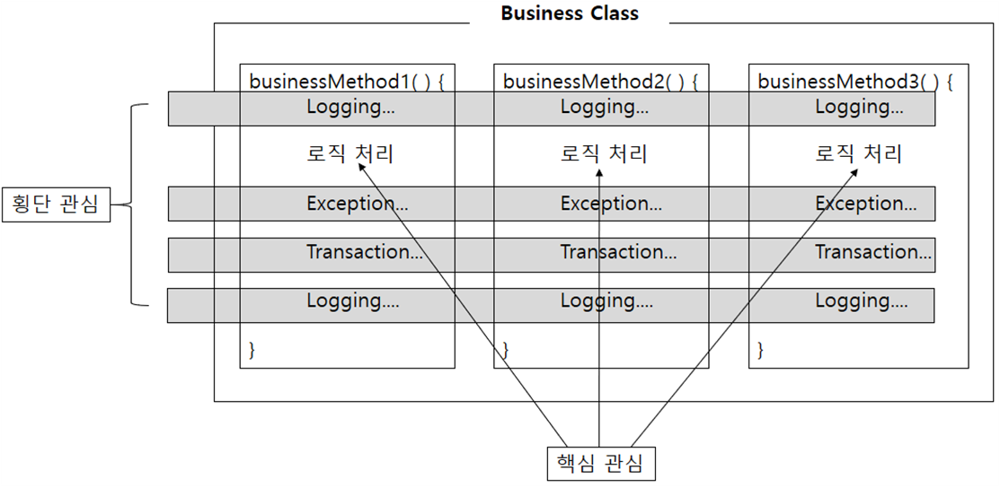
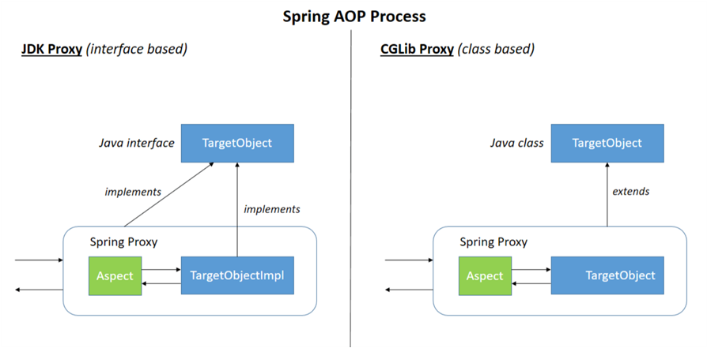
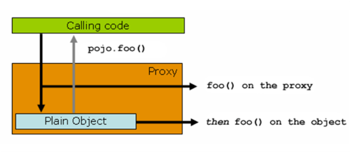

# AOP (Aspect Oriented Programming)

* AOP는 관점 지향 프로그래밍으로, OOP에서 모듈화의 핵심 단위는 클래스이고 AOP에서는 모듈화 단위가 aspect이다.
 Aspect는 핵심적인 관심(핵심 로직)과 부가적인 관심(횡단 관심 / 트랜잭션 관리, 로깅, 예외처리 등)으로 분리해 모듈화를 가능하게 한다.
 모듈화하는 이유는 핵심 로직과 따로 분리함으로써 핵심 로직에 집중할 수 있고, 
    * Core Concerns: 핵심 관심
    * Crosscutting Concerns: 횡단 관심
    * Separation of Concerns: 관심 분리

## 어떤 기능을 Aspect로 분리해야될까?
* 일반적으로 공용으로 사용되는 것들. 즉, 주요 Logic을 제외한 것들
* Logging
* Exception Handle
* Transaction Handle
* Security


## AOP 용어 정리
* Aspect: 여러 클래스에 걸쳐있는 관심사의 모듈화. Java에서는 <aop>, @Aspect를 사용하여 구현된다.
* Join point: 메서드 실행 또는 예외 처리와 같은 프로그램 실행 중 지점. Advice가 적용될 위치
* Advice: 특정 결합 지점에서 Aspect가 취하는 조치. 즉, 어떤 일을 해야하는 지해 대한 기능을 담은 구현체, 공통 기능 코드
* Pointcut: Joint point의 상세한 스펙을 정의. Pointcut expression으로 표현
* Introduction: 추가적인 메서드 또는 필드를 선언한다.
* Target object: Aspect를 적용하는 곳 (Class, Method etc..)
* AOP proxy: Aspect 규약을 구현하기 위해 AOP Framework에 의해 생성된 객체 (advise method executions 등). Spring Framework에서 AOP Proxy는 JDK dynamic proxy 또는 CGLIB proxy이다.
* Weaving: Advised Object를 생성하기 위해 다른 Application type 또는 object와 Aspect를 Linking하는 것. Spring AOP는 Runtime 시 Weaving을 수행한다.

* 내가 정리 한 것
    * Target Object와 Advice를 Weaving 하여 AOP proxy 객체(Aspect)를 생성
    * Aspect 객체를 위해서는 2개를 설정해야 한다.
        1. Pointcut 설정: Target Object와 해당 Object의 어떤 기능(Method)에 AOP를 적용할지 정한다.
        2. Aspect 설정: 어떤 Pointcut을 사용할지 정하고, 어떤 Advice를 어느 Join point에 적용시킬지 정한다.
    * Example
        ```xml
        
        ```
        
### Advise 동작 시점
* Before advice: 비즈니스 메서드가 실행되기 전 동작
    * 
* After returning advice: 비즈니스 메서드가 성공적으로 반환되면 동작
    * Return 값을 이용할 수 있다.
    ```java
    // XML
    <aop:after-returning pointcut-ref="afterLog" returning="returnObj" />
    // Java Class
    public class AfterReturningAdvice {
      public void afterLog(Object returnObj) {
          system.out.println("메서드 반환값: " + returnObj.toString());
      }   
    }
    ```
    * returning 할 시에는 return이 NUll로 올 수 있기 때문에 void가 아닌 것만 사용하게 하든가 
    * 
* After throwing advice: 비즈니스 메서드가 실행 중 예외가 발생하면 동작
* After (finally) advice: 비즈니스 메서드가 실행된 후, 무조건 실행
* Around advice: 메서드 호출 전후에 사용자 지정 동작을 수행, 또한 Join point를 진행할지 아니면 자체 반환 값을 반환하거나 예외를 throw하여 권장되는 메서드 실행을 바로 가리로 할지 여부를 선택한다.


## Spring AOP Proxy

* Proxy Class가 Target과 Aspect를 감싸게 된다(Wrapper 형태로)
* https://stackoverflow.com/questions/21759684/interfaces-or-target-class-which-proxymode-should-i-choose/43013315
1. JDK dynamic proxy
    * 인터페이스를 구현하여 Proxy를 생성
    * 그렇기 때문에 인터페이스가 구현되어 있어야 한다.
    
2. CGLIB proxy
    * Target Object를 상속받아 Proxy를 생성
    * 그렇기 때문에 인터페이스가 없어도 생성이 가능하다.
    * 하지만 상속을 이용하기 때문에 final이나 private와 같은 Override를 지원하지 않는 경우 Proxy에서 해당 메서드에 대한 Aspect를 적용할 수 없다.


## Self-invocation

* Spring AOP에는 Self-invocation 문제를 조심해야 한다.
    * Target Object가 AOP를 적용한 Method를 호출할 시에는 Proxy 기능이 작동하지 않는다.
* Private Method에 AOP를 적용한 경우에도 마찬가지로 Proxy 기능이 작동되지 않는다. 왜냐하면 상속이나 구현을 하지 못하기 때문이다.
* http://madpro84.blogspot.com/2019/08/transactional-caching.html?m=1

### 해결 방법
1. AspectJ (AOP Opensource Project)를 사용
2. 직접 Method 호출이 아닌 자신의 Bean을 사용하여 Method 호출


## Spring AOP 사용방법
1. XML 이용 방법
    ```xml
    
    ```


2. Annotation 이용 방법
    ```java
    ```


## AspectJ


## 
<aop:aspect>
<aop:advisor>
사용할 메서드를 알고 있을 때 aspect를 사용하고, 사용할 메서드를 알지 못할 때 advisor를 사용한다.

