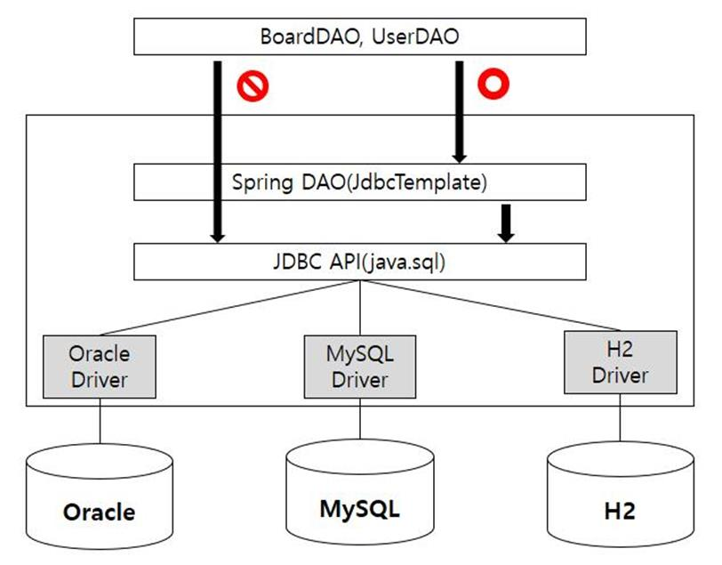

# Spring JDBC
* JDBC에서는 DataSource 객체를 이용하여 Connection을 관리한다.
* JdbcTemplate의 상위 클래스인 JdbcAccessor 클래스를 보게 되면 ```public void setDataSource(@Nullable DataSource dataSource)```가 있는 것을 확인할 수 있다.

## Spring JDBC Structure

* 기존 구조는 DAO Class에서 JDBC API(Connection, ResultSet, Statement)를 이용하여 


## DataSource vs DriverManager
1. DataSource
    * javax.sql.DataSource, Interface Type
    * https://docs.oracle.com/javase/7/docs/api/javax/sql/DataSource.html
    * Connection을 위한 Properties 정보와 Connection Object를 관리
    * Connection Pool을 이용하여 Connection을 관리한다.
    * Transaction 처리
    * JNDI(DriverManager와 가장 큰 차이점)
    * 절차
        1) JNDI Server는 lookup() 메서드를 통해 DataSource 객체를 획득
        2) DataSource 객체에서 getConnection() 메서드를 통해 Connection Pool에서 Free 상태의 Connection 객체를 획득
        3) Connection 객체를 이용하여 DB 작업 수행
        4) 모든 작업이 끝나면 DataSource 객체를 통해서 Connection Pool에 Connection 반납
        
2. DriverManager
    * java.sql.DriverManager, Class Type
    * https://docs.oracle.com/javase/8/docs/api/java/sql/DriverManager.html
    * 기본적으로 연결이 필요할 때마다 getConnection() 메서드를 이용해 Connection을 생성하고, close() 메서드를 통해 연결을 끊는다.
        * Connection을 생성/종료하는데는 많은 오버헤드가 발생한다. 필요시 Connection Pool을 직접 구현해서 사용해야 한다.
    * JDBC Driver의 설정을 직접관리
        * Web Server에 DB Server 관련 정보를 작성해야 한다.
        * DirverManager는 사용 가능한 JDBC dirver를 load한다. Driver Load 방법은 두가지가 있다.
        1) 기존에는 ```Class.forName()```으로 Load
        2) JDBC 4.0 Driver는 ```META-INF/services/java.sql.Driver``` 파일에 JDBC Driver 정보가 포함되어 있어야 한다.

## JNDI
* Java Naming and Directory Interface
* Java Software Client가 Name을 이용하여 데이터 및 객체를 발견(discover)할 수 있도록 도와주는 Directory Service에 대한 Java API
    * Directory Service: 네트워크 여러 자원(사용자 계정, 그룹 계정, 프린터 정보, 컴퓨터 정보 등)을 편리하게 관리할 수 있도록 하는 서비스.
* Java Application을 외부 Directory Service에 연결시킨다.
* Reference: https://heowc.tistory.com/27

### JNDI 사용방법
* https://tomcat.apache.org/tomcat-7.0-doc/jndi-resources-howto.html
* https://tomcat.apache.org/tomcat-9.0-doc/jndi-datasource-examples-howto.html
* https://atoz-develop.tistory.com/entry/Tomcat-%EC%84%9C%EB%B2%84-DataSource-%EC%84%A4%EC%A0%95-%EB%B0%A9%EB%B2%95-JNDI

### web.xml 구성
* /WEB-INF/web.xml 에서 다음 요소를 사용하여 리소스를 정의
* ```<env-entry>```: Application 작동 방식을 구성하는데 사용할 수 있는 환경 매개 변수
* ```<resource-ref>```: 일반적으로 JDBC DataSource, JavaMail Session 또는 Tomcat에 구성된 사용자 정의 Object Factory 같은 자원에 대한 참조
* Tomcat은 web.xml에서 지정할 수 없는 여러 JNDI 자원들에 대해 특정 옵션을 제공한다.
    * 이 옵션을 사용하기 위해서는 Web application의 ```<context>``` 또는 ```$CATALINA_BASE/conf/server.xml```의 ```<GlobalNamingResource>```에 추가해야 한다.

### context.xml 구성
* ```<context>``` 요소에 들어가는 구성 요소
    * ```<Environment>```: JNDI를 통해 Web application에 노출될 Config name과 value
    * ```<Resource>```: Application에 사용할 수 있는 Resource의 name과 data type을 구성 ( ```<resource-ref>``` 와 동일)
    * ```<ResourceLink>```: Global JNDI Context에 정의된 Resource에 대한 Link 추가. ResourceLink를 사용하여 <server> 요소의 <GlobalNamingResources> 자식 요소에 
정의된 Resource에 대한 Web application 액세스 권한을 부여한다.
    * ```<Transaction>```: UserTransaction object instance를 인스턴스화하기 위해 Resource factory 추가
* Resource가 ```<context>```에 정의된 경우, ```/WEB-INF/web.xml```에 정의할 필요없다. 하지만 
Web application 요구사항에 대한 문서화를 위해서는 ```/WEB-INF/web.xml```에 적어주는 것이 좋다.

### Global configuration
* Tomcat은 서버의 모든 Context에서의 상호 작용을 위해서는 Global resources에 대한 별도의 namespace를 유지해야 한다.
* 해당 설정은 ```$CATALINA_BASE/conf/server.xml의 <GlobalNamingResources>``` 요소에서 ```<ResourceLink>```를 사용하여 설정할 수 있다.
* Resource가 ```<ResourceLink>```를 사용하여 정의된 경우, 해당 리소스를 ```/WEB-INF/web.xml```에 정의할 필요없다. 하지만 
Web application 요구사항에 대한 문서화를 위해서는 ```/WEB-INF/web.xml```에 적어주는 것이 좋다.

### 태그 사용방법
1. 기본 JDNI Name 작성방법

    | JNDI Name | Description |
    |-----------|-------------|
    | java:comp/env | 응용 프로그램 env entry |
    | java:comp/env/jdbc | JDBC DataSource |
    | java:comp/ejb | EJB 컴포넌트 |
    | java:comp/UserTransaction | UserTransaction 객체 |
    | java:comp/env/mail | JavaMail 연결 객체 |
    | java:comp/env/url | URL 정보 |
    | java:comp/env/jms | JMS 연결 객체 |
    * 이름 작성의 기본 방법은 Directory 형식이다 ("a/b/c")
    

1. ```<Environment>``` or ```<env-entry>```
    ```xml
    <Context>
      ...
      <Environment name="maxExemptions" value="10"
             type="java.lang.Integer" override="false"/>
      ...
    </Context>
   
    <env-entry>
      <env-entry-name>maxExemptions</env-entry-name>
      <env-entry-value>10</env-entry-value>
      <env-entry-type>java.lang.Integer</env-entry-type>
    </env-entry>
    ```
    * description: env entry에 대한 설명
    * **name**: env entry 이름, ```java:comp/env``` 기준으로 설정된다.
    * override: 동일한 env entry 이름에 대해 override를 원하지 않는다면 false로 설정. 기본은 override를 허용한다.
    * **type**: 전체 java class 이름이 필요하다. 
    * **value**: param value. type에 맞는 값이어야 한다.
   
2. ```<Resource>``` or ```<resource-ref>```
    ```xml
    <Context>
      ...
      <Resource name="jdbc/EmployeeDB" auth="Container"
                type="javax.sql.DataSource"
         description="Employees Database for HR Applications"/>
      ...
    </Context>
   
    <resource-ref>
      <description>Employees Database for HR Applications</description>
      <res-ref-name>jdbc/EmployeeDB</res-ref-name>
      <res-ref-type>javax.sql.DataSource</res-ref-type>
      <res-auth>Container</res-auth>
    </resource-ref>
    ```
    * auth: Application code가 프로그래밍 방식으로 Resource manager에 접근할지 또는 Container가 Application을 대신해서 접근할지 정한다.
     속성으로 ```Application``` 또는 ```Container```만 사용 가능하다. Spring 등 Container를 쓰게 되면 Container로 지정하면 된다.
    * closeMethod: 싱글톤 리소스가 더 이상 필요하지 않을 때 호출할 메서드 이름. Garbage Collection의 리소스 정리 속도를 높이기 위한 것이다. 
    singleton 속성이 false인 경우 무시된다.
    * description: Resource에 대한 설명
    * **name**: java:comp/env를 기준으로 생성할 Resource name
    * scope: Resource manager를 통해 얻은 연결을 공유할 수 있는지 여부를 지정. 속성으로 ```Shareable``` 또는 ```Unshareable```이어야 한다.
     기본적으로 연결은 공유할 수 있는 것으로 간주한다.
    * singleton: 해당 Resource를 Singleton으로 정의할지 여부. 속성이 true인 경우, 멀티 JNDI lookup에 대해 항상 같은 객체를 반환. false인 경우, 다른 객체들을 반환한다. 
    속성은 true 또는 false이며, 기본은 true이다. javax.sql.DataSource Resource인 경우, 항상 true여야 한다.
    * **type**: Resource에 대해 lookup을 수행할 때 사용될 전체 Java class type

3. ```<ResourceLink>```
    ```xml
    <Context>
      ...
      <ResourceLink name="linkToGlobalResource"
                global="simpleValue"
                type="java.lang.Integer"
      ...
    </Context>
    ```
    * global: Global JNDI context에 포함되어 있는 것들 중 링크될 Global Resource의 이름
    * name: java:comp/env를 기준으로 생성할 Resource Link 
    * type: Resource에 대해 lookup을 수행할 때 사용될 전체 Java class type
    * factory: 해당 객체를 만들 class 전체 이름
        * Context 별로 username, password를 변경하고 싶다면 속성으로 ```factory="org.apache.naming.factory.DataSourceLinkFactory"```를 사용하면 된다.
        ```xml
        <GlobalNamingResources>
          ...
          <Resource name="sharedDataSource"
                    global="sharedDataSource"
                    type="javax.sql.DataSource"
                    factory="org.apache.tomcat.jdbc.pool.DataSourceFactory"
                    alternateUsernameAllowed="true"
                    username="bar"
                    password="barpass"
                    ...
          ...
        </GlobalNamingResources>
        
        <Context path="/foo"...>
          ...
          <ResourceLink
                    name="appDataSource"
                    global="sharedDataSource"
                    type="javax.sql.DataSource"
                    factory="org.apache.naming.factory.DataSourceLinkFactory"
                    username="foo"
                    password="foopass"
          ...
        </Context>
        <Context path="/bar"...>
          ...
          <ResourceLink
                    name="appDataSource"
                    global="sharedDataSource"
                    type="javax.sql.DataSource"
          ...
        </Context>
        ```

### JNDI 적용 방법
* web.xml에는 문서화하기 위해 설정
* Resource에 대한 global namespace를 유지하기 위해 $CATALINA_BASE/conf/server.xml에 Resource 설정
* server.xml에서 설정한 Resource를 Web Server에서 사용하기 위해서 context.xml에 대한 링크 추가
* Resource를 이용하는 DataSource Bean 객체를 appicationContext.xml에 설정
1. ```$CATALINA_BASE/conf/server.xml```
    ```xml
    <Global>
       ...
       <Resource name="jdbc/mySqlDB"
           auth="Container"
           type="javax.sql.DataSource"
           username="dbusername"
           password="dbpassword"
           driverClassName="org.hsql.jdbcDriver"
           url="jdbc:HypersonicSQL:database"
           maxTotal="100"
           maxIdle="30"
           maxWaitMillis="10000" />
       ...
    </Global>
    ```
    * driverClassName: 드라이버 클래스 이름
    * url: JDBC connection url
    * maxTotal: Pool에 대한 DB connection의 최대 개수
    * maxIdle: Pool에서 유지하고 있을 connection 개수
    * maxWaitMillis: DB connection 사용가능해질 때까지 기다릴 수 있는 최대 시간(단위: ms)


2. ```context.xml```
    ```xml
    <Context>
         <ResourceLink name="jdbc/mySqlDB"
                   global="jdbc/mySqlDB"
                   type="javax.sql.DataSource" />
    </Context>
    ```


3. ```appicationContext.xml```
    1) jee:jndi-lookup 사용
        ```xml
        <beans xmlns="http://www.springframework.org/schema/beans"
              xmlns:xsi="http://www.w3.org/2001/XMLSchema-instance"
              xmlns:jee="http://www.springframework.org/schema/jee"
              xsi:schemaLocation=" http://www.springframework.org/schema/beans http://www.springframework.org/schema/beans/spring-beans.xsd
                http://www.springframework.org/schema/jee http://www.springframework.org/schema/jee/spring-jee.xsd">
        
        <jee:jndi-lookup id="dbDataSource"
               jndi-name="jdbc/mySqlDB"
               expected-type="javax.sql.DataSource" />
        ```
        * id: xml에서 사용되는 bean 객체 id
        * jndi-name: JNDI name, JNDI Resource 설정한 이름
        * expected-type: JNDI로 부터 받을 객체 Class type
        * cache: 한 번 찾은 JNDI 객체에 대한 cache 여부. 기본값은 true
        * lookup-on-startup: 시작시에 lookup을 수행할지 여부. 기본값은 true
        * https://www.egovframe.go.kr/wiki/doku.php?id=egovframework:rte2:itl:naming_service
   
    2) JndiObjectFactoryBean Class 사용
        ```xml
        <bean id="dbDataSource" class="org.springframework.jndi.JndiObjectFactoryBean">
            <property name="jndiName" value="java:comp/env/jdbc/mySqlDB"/>
            <property name="expectedType" value="javax.sql.DataSource" />
        </bean>
        ```
        * id: xml에서 사용되는 bean 객체 id
        * jndiName: jndiName에 대한 Setter DI 
        * <jee:jndi-lookup> 태그는 내부적으로 JndiObjectFactoryBean 클래스를 사용한다.

## JDBC를 위한 필요 클래스
1. DAO Interface와 구현한 클래스(여러 Vendor를 위한)
2. VO Class
3. RowMapper Class
    * Query 반환객체(ResultSet)를 VO 형태로 변환하기 위한 Mapper CLass
4. DataSource Class
    * DAO의 JdbcTemplate를 초기화하기 위한 객체