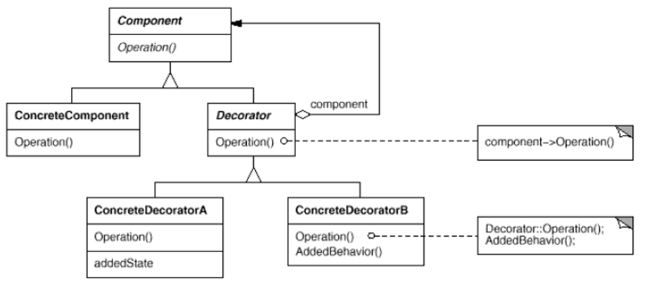

# IO(InputOutput) Stream
* Decorator Pattern으로 구현되어 있음
* Java의 I/O 방식은 Node - Stream
* Node : 데이터의 소스 또는 데이터의 목적지
    * Node는 키보드(입력), 모니터(출력), 파일(입출력) 등을 말한다.    
* Stream : Node로부터 데이터를 주고 받는 통로
    * 입력으로 사용되는 스트림과 출력으로 사용되는 스트림은 별개
    * 입출력을 함께하는 것을 채널(Channel) - NIO(New Input/Output)

## IO Stream 구분
* IO 대상 기준 : Input Stream, Output Stream
* 자료의 종류 : Byte 단위 Stream, 문자 단위 Stream
* Stream 기능 : 기반 Stream, 보조 Stream

## Stream 종류
1. Byte 단위 Stream
    * **InputStream**
    * **OutputStream**

2. 문자 단위 Stream
    * **Reader**
    * **Writer**

## 표준 입출력
* System 클래스의 표준 입출력 멤버
```java
public class System{
    public static PrintStream out;
    public static InputStream in;
    public static PrintStream err;
}
```

## Byte 단위 Stream
* Byte 단위로 자료를 읽고 씀(동영상, 음악파일 등)
* Method(Input)
    * **int read()** : 입력 스트림으로부터 1byte 읽고 Byte 리턴, 읽을게 없다면 -1 Return
    * **int read(byte[] b)** : 읽은 Byte들을 배열 b에 저장하고, 실제로 읽은 Byte 수를 리턴
    * **void close()** : 스트림을 종료하고 자원을 반납
    * **int available()** : 읽을 수 있는 데이터의 크기를 반환
    * **long skip(long n)** : 스트림에서 n 만큼 건너 뛴다.
    * **void mark(int readLimit)** : reset()으로 돌아갈 위치를 표시한다, readLimit은 돌릴 수 있는 최대 바이트 수
    * **void reset()** : mark()가 호출된 지점으로 돌아간다.
    * **boolean markSupported()** : mark, reset 메소드의 지원 여부를 반환
* Method(Output)
    * **void write(int b)** : b의 끝 1byte를 출력 버퍼에 보낸다.
    * **void wirte(byte[] b)** : 배열 b의 모든 Byte를 보낸다.
    * **void flush()** : 출력 버퍼를 비운다.
    * **void close()** : 스트림 종료. 내부적으로 flush() 호출한다.

### File Stream
* **FileInputStream** : File이 없는 경우 예외 발생
* **FileOutputStream** : File이 없는 경우 파일 생성하여 출력, boolena append를
true로 하면 기존 파일에 이어서 쓴다.
* File Constructor & Method

| 생성자 및 메소드 | 설명 |
|----------------|-----------|
| File(String pathname) | pathname에 해당하는 파일 생성. 기본 경로는 애플리케이션의 시작 경로 |
| File(String parent, String child) | parent 경로 아래 child 파일 생성 |
| File(URI uri) | file로 시작하는 URI 객체를 이용해 파일 생성 |
| boolean createNewFile() | 새로운 파일 생성 |
| boolean mkdir() | 새로운 디렉토리를 생성 |
| boolean mkdirs() | 경로상의 모든 디렉토리를 생성 |
| boolean delete() | 파일/디렉토리 삭제 |
| void deleteOnExit() | 애플리케이션 종료 시, 자동으로 삭제(Temp 파일 만들 때 유용) | 
| boolean exist() | 해당 파일이 존재하는지 여부 |

* RandomAccessFile Class
    * 입출력 클래스 중 유일하게 파일 입출력을 동시에 할 수 있는 클래스
    * 파일 포인터가 있어서 읽고 쓰는 위치의 이동이 가능함
    * Method
        * **seek()** : 해당 위치로 이동
```java
// File.separator를 이용하여 "\" 표현할 수 있다.
String filePath = "D:" + File.separator + "Temp" + File.separator + "MyTemp";

File fileOne = new File(filePath);
fileOne.mkdir();

File fileTwo = new File(filePath, "file2.txt");
fileTwo.createNewFile();

File fileThree = new File(fileOne, "file3.txt");
fileThree.createNewFile();

File fileFour = new File(new URI("file:///d:/Temp/MyTemp/file4.txt"));
fileFour.createNewFile();
fileFour.deleteOnExit();
``` 

* 그 외 File 클래스의 주요 메소드

| 메소드 | 설명 |
|----------------|-----------|
| getName() | 파일 이름 반환 |
| getPath() | 입력된 경로 반환 |
| isAbsolute() | 절대 경로를 사용하는지? 여부 확인 |
| getAbsolutePath() | 절대 경로 반환 |
| getCanonicalPath() | 상위 경로 기호("..")가 없어진 절대 경로 반환 |
| isDirectory() | 해당 File이 Directory인지? 여부 확인 |
| isFile() | 해당 File이 File인지? 여부 확인 |
| list() | 해당 Path의 리스트 반환, String Array로 출력 |
| listFiles() | 해당 Path의 리스트 반환, File 객체 Array로 출력 |

* Example
```java
public class InputOutputStream {
    public static void main(String[] args) {

        System.out.println("입력 ");
        try {
            int i;
            InputStreamReader isr = new InputStreamReader(System.in);
            while((i = isr.read()) != '끝') {
                System.out.print((char) i);
            }
        } catch (IOException e) {
            e.printStackTrace();
        }
    }
} 
```    

## 문자 기반 Stream
* 2 Byte씩 처리해야 함

### File Stream
* **FileReader**
* **FileWriter** : boolena append를 true로 하면 기존 파일에 이어서 쓴다.
```java
public class ReaderWriterStream {
    public static void main(String[] args) throws IOException {
        FileReader fis = new FileReader("src/reader.txt");
//        FileInputStream fis = new FileInputStream("src/reader.txt");
//        InputStreamReader isr = new InputStreamReader(fis);
        int i;
        while((i = fis.read())!= -1){
            System.out.println((char)i);
        }
        fis.close();
    }
}
```

## 보조 Stream
* 실제로 읽고 쓰는 Stream이 아닌 보조적인 기능을 추가하는 Stream
* FilterInputStream과 FilterOutputStream이 보조 Stream의 상위 클래스
    * **pretected FilterInputStream(InputStream in)**
    * **public FilterOutputStream(OutputStream out)**

### 종류
* **Byte -> char Stream** : Byte를 문자 기반으로 변환시킨다.
    * **InputStreamReader(InputStream is)**
    * **OutputStreamWriter(OutputStream os)**
    * 스트림 자료형 변경
        * Character Set : utf-8, ms949, euc-kr
        ```java
      InputStreamReader readerOne = new InputStreamReader(System.in);
      InputStreamReader readerTwo = new InputStreamReader(System.in, "utf-8");
      
      OutputStreamWriter writerOne = new OutputStreamWriter(System.out);
      OutputStreamWriter writerTwo = new OutputStreamWriter(System.out, "ms949");
        ```
          
* **Buffered Stream** : 내부에 8192byte 배열을 가지고 있어, 읽거나 쓸 때 속도를 향상(Throughput 향상)
    * throughput : 평균 전송량 / 파일의 입출력 등에 쓰임. 자주 파일을 읽고 쓰는 경우에는 큰 오버헤드가 발생할 수 있다.
    * delay : 지연 시간 / 게임, 반응성이 중요한 경우. 버퍼링을 쓸 경우 오히려 안 좋아짐
    * **BufferedInputStream(InputStream is)**
    * **BufferedOutputStream(OutputStream os)**
    * **BufferedReader**
    * **BufferedWriter**
    * **String readLine()** : Line Feed('\n')와 Carriage Return('\r')을 제거해주고 한 줄을 읽어 들인다.
    ```java
  File src = new File("./src.txt");
  try (BufferedReader buffReader = new BufferedReader(new FileReader(src));) {
    String line = null;
    while ((line = br.readLine()) != null) {
      System.out.println(line);
    }
  } catch (IOException e) {
    e.printStackTrace();
  }
    ```
    
* **Data Stream** : 자료가 저장된 상태 그대로 자료형을 유지하며 읽기, 쓰기 기능을 제공하는 Stream
    * **DataInputStream**
    * **DataOutputStream**
    * readByte(), readShort(), writeInt(), writeUTF() 등 메소드가 있다.
    ```java
  File src = new File("c:/Temp/data.dat");
  try (DataOutputStream out = new DataOutputStream(new FileOutputStream(src))) {
    out.writeUTF("UTF-8");
    out.writeInt(15);
    out.writeFloat(14.23);
  }
  
  try (DataInputStream in = new DataInputStream(new FileInputStream(src))) {
    String string = in.readUTF();
    int integer = in.readInt();
    float floatNum = in.readFloat();
    System.out.println(string + " " + integer + " " + floatNum);
  }
    ```

    ```java
    public static void main(String[] args){
        try(FileOutputStream fos = new FileOutputStream("data.txt");
                DataOutputStream dos = new DataOutputStream(fos);
                FileInputStream fis = new FileInputStream("data.txt");
                DataInputStream dis = new DataInputStream(fis)){

            dos.writeByte(100);
            dos.write(100);
            dos.writeChar('A');
            dos.writeUTF("안녕하세요");

            System.out.println(dis.readByte());
            System.out.println(dis.read());
            System.out.println(dis.readChar());
            System.out.println(dis.readUTF);

        }catch(Exception e){
            e.printStackTrace();            
        }
    }
    ```
 
* **Print Stream** : 문자열 표현 Stream
    * **PrintWriter**
    * **PrintReader**


## 직렬화(Serialization)
* 인스턴스의 상태를 그대로 저장하거나 Network로 전송하고 
이를 다시 복원(Deserialization) 하는 방식
* 보조 Stream으로 Object Stream 사용
    * **ObjectInputStream**
    * **ObjectOutputStream**
    * **readObject(), writeObject()** 메소드 이용
* 직렬화를 위해서는 해당 클래스에 **Serializable Interface**를 사용하여 명시해야 된다.
* HAS-A 관계인 경우, 관계 Class들 모두 Serialization 해야 한다.
```java
class Foo implements Serializable { // has-a 관계의 모든 클래스가 Serializable이어야 함
  static final long serialVersionUID = 1L; // 객체의 버전 관리
  // 클래스 버전을 따로 관리하는 이유는 클래스 내용 자체가 바뀔 수 있기 때문에
  // 객체를 저장할 때와 불러올 때 같은지 체크하여
  // serialVersionUID가 일치하지 않으면 실패

  String userName;
  int id;

  transient String passWord; // transient 키워드, 해당 코드는 직렬화하지 말라는 의미
  // Password는 중요 정보이기 때문에 포함시키지 않기 위해서

  @Override
  public String toString() {
    return userName + " " + id + " " + passWord;
  }
}

class FooTest {
  public static void main (String [] args) {
    File dst = new File("C:/Temp/obj.data");
    Foo foo = new Foo();
    foo.userName = "yoon";
    foo.id = 142;
    foo.passWord = "qwer1234";

    try (ObjectOutputStream out = new ObjectOutputStream(new FileOutputStream(dst));
        ObjectInputStream in = new ObjectInputStream(new FileInputStream(dst));) {
      out.writeObject(foo);
      Object read = in.readobject();
      if (read != null && read instanceof Foo) {
        Foo readFoo = (Foo)read;
        System.out.println(readFoo);
      }
    } catch (IOException | ClassNotFoundException e) {
      e.printStackTrace();
    }
  }
}
```

* 부모 클래스가 Serializable이 아닌 경우 자식 클래스에서 직접 처리해야 한다.
    * writeObject(), readObject()를 자식 클래스에서 직접 구현
    ```java
  class ParentFoo {
    int memVarOne;
    double memVarTwo;
  }
  
  class ChildFoo extends ParentFoo implements Serializable {
    @Override
    private void writeObject(ObjectOutputStream out) throws IOException {
      out.writeInt(memVarOne);
      out.writeDouble(memVarTwo);
      out.defaultWriteObject();
    }
    @Override
    private void readObject(ObjectInputStream in) throws IOException, ClassNotFoundException {
      memVarOne = in.readInt();
      memVarTwo = in.readDouble();
      in.defaultReadObject();
    }
  }
    ```

* **External** Interface를 이용하여 읽기, 쓰기에 대해 정의할 수 있다. 
    * **writeExternal, readExternal** 함수 Override
    
### Decorator Pattern

*Fastcampus_박은종*
* **Component** : 최상위 클래스
* **ConcreteComponent** : Component 자식 클래스, 기반 Class(Component)
* **Decorator** : Component 자식 클래스, 보조 Class(Component)
* **ConcreteDecoratorA, B** : Decorator 자식 클래스.
 Operation의 경우, Decorator 클래스의 Operation을 실행하고, 다른 기능을 추가한다.
```java
abstract class Component{
    abstract void operation();
}
class ConcreateComponent extends Component{
    void operation(){
        // 실행 코드
    }
}
class Decorator extends Component{
    Component component;
    public Decorator(Component component){
        this.component = component;
    }
    
    public void operation(){
        this.component.operation();
    }
}

class ConcreateDecoratorA extends Decorator{
    public ConcreateDecoratorA(Component component){
        super(component);
    }
    public void operation(){
        super.operation();
        // 추가 실행 코드
    }
}

```
