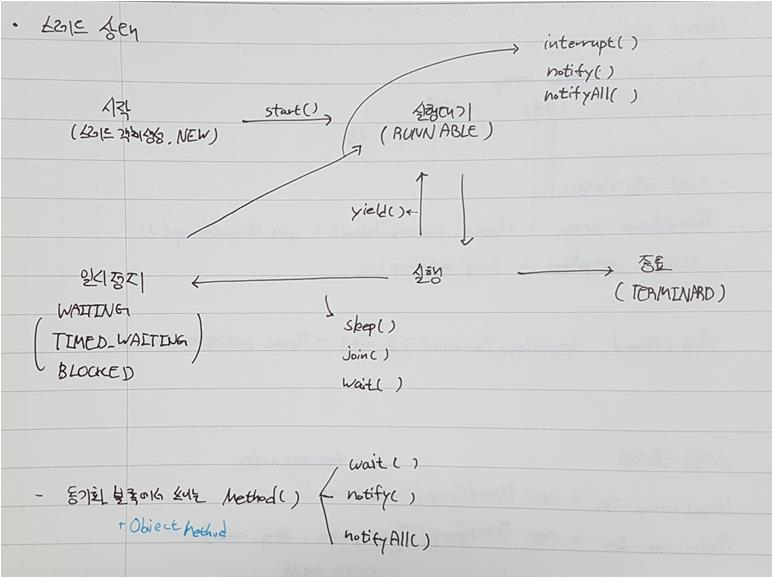
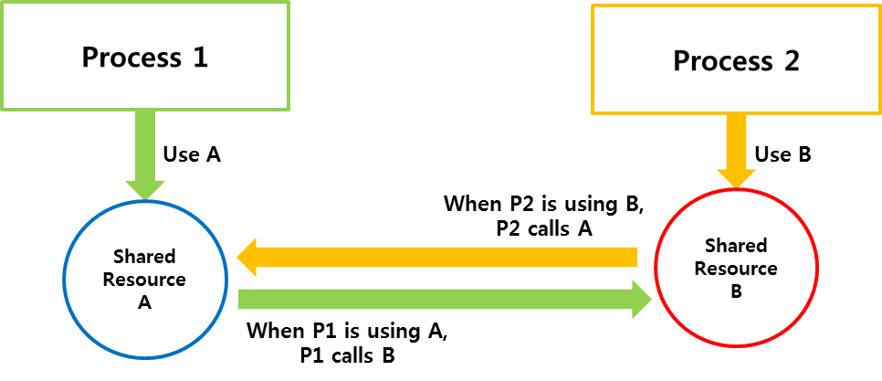

# Thread
1. 프로세스(Process)
    * 운영체제(OS)로 부터 시스템 자원을 할당받는 작업의 단위
    * 실행되고 있는 프로그램(프로그램과 프로세스의 차이)
      * 프로그램은 코드와 정적인 데이터의 묶음
    * Code, Data, Stack, Heap 할당

2. 스레드(Thread)
    * 프로세스 내에서 실행되는 작업의 최소 단위
    * Code, Data, Heap 영역은 공유 / Stack은 각 각 할당


## Thread 구현 
1. **extends Thread**
    * Thread Class를 상속받아 하위 Thread 클래스를 생성
    ```java
    class myThread extends Thread{
       public void run(){
           // 실행 코드
       }
    }
    class Test{
       public static void main(String[] args){
           Thread thread = new myThread();
           thread.start();
       }     
    }
    ``` 

2. **implements Runnable**
    * Runnable Interface를 구현하는 방법
    ```java
      class myThread implements Runnable{
        public void run(){
         // 실행 코드
        }
    }
    class Test{
       public static void main(String[] args){
           Thread thread = new Thread(new myThread());
           thread.start();
       }     
    }   
    ```

3. 데몬 스레드 구현
    * 다른 스레드가 종료될 경우, 함께 종료되는 보조 스레드
    * 보통 대기하면 동작하는 무한 루프로 구현
    * ```setDeamon()``` 메소드로 데몬 스레드로 설정
    ```
    class DaemonThread extends Thread {
        public DaemonThread() {
            this.setDaemon(true);
        }
    
        @Override
        public void run() {
            while (true) {
                try {
                    Thread.sleep(1000);
                } catch (InterruptedException e) {
                    e.printStackTrace();
                }
                System.out.println("Daemon Thread Run");
            }
        }
    }
    ```

## Multi-Thread 프로그래밍
* 동시에 여러 개의 Thread가 수행되는 프로그래밍
    * **동시성(Concurrency)**: 멀티 작업을 위해서 하나의 코어에서 Multi Thread가 번갈아가며 실행하는 성질
    * **병렬성(Parallelism)**: 멀티 작업을 위해 멀티 코어에서 개별 Thread를 동시에 실행하는 성질
* Thread는 각각의 작업공간(Context)을 가짐
    * Thread가 Switching이 되면, Context Switching이 발생
* 공유 자원이 있는 경우, Race Condition이 발생
* Critical Section에 대한 동기화(Synchronization)의 구현이 필요

### Multi-Thread 장단점
* 장점
    * 여러 동작을 병렬적으로 처리하여 CPU의 사용률 향상
    * 시간이 걸리는 동작을 분리하여 프로그램의 응답성 향상
* 단점
    * Context Switching Overhead 발생
    * Thread Control이 어려움

## Thread 상태

* **NEW** : 쓰레드 객체 생성
* **RUNNABLE** : 실행 대기
* **RUN** : 실행
* **WAITING** : 일시 정지
* **TIMED_WAITING** : 주어진 시간 동안 일시정지
* **BLOCKED** : 동기화 블록에서 Lock이 된 상태
* **TERMINATED** : 종료

### Thread Method
* **start()** : Thread 실행(정확히는 실행 대기 상태로 만든다)
* **yield()** : 실행 중에 우선순위가 동일한 다른 Thread에게 양보하고 실행 대기 상태로 전환
* **sleep()** : 주어진 시간 동안 Thread는 일시 정지가 되고, 주어진 시간 후 실행 대기 상태로 전환
* **join()** : join() 메소드를 호출한 Thread는 일시 정지되며, join()이 가리킨 Thread가 종료되거나, 주어진 시간이 끝나야 실행되기 상태가 된다.
* **wait()** : 동기화 블록 내에서 실행되며 가지고 있던 **Lock을 반환하고**, 스레드를 일시 정지 상태로 만든다.
    * 주어진 시간이 지나면 실행대기 상태로 전환
    * 시간이 주어지지 않는 경우, notify(), notifyAll()에 의해 일시 정지 상태에 있는 Thread를 실행대기 상태로 전환
* **notify(), notifyAll()** : 동기화 블록 내에서 wait()에 의해 일시 정지 상태에 있는 Thread를 실행대기 상태로 전환
    * notify() 보다는 nofityAll()을 사용하는 것이 scheduler에 CPU를 점유하는 것이 좀 더 공평하다고 본다.
* **interrupt()** : 일시 정지 상태의 Thread에서 InterruptedException 예외를 발생시켜, 예외처리 코드(catch)에서
실행 대기 상태로 가거나 종료 상태로 갈 수 있도록 한다.
> Thread가 RUN 또는 RUNNABLE 상태일 때, interrupt를 발생시키면 미래에 Thread가 일시 정지 상태가 되면 InterruptedException 예외 발생
>> 그렇기 때문에 일시 정지가 아닐 때는 다른 방법을 사용해야 되는데, STOP 플래그 or isInterrupted() or interrupted()를 이용하는 방법이 있다.

## Critical Section & Synchronization
* Critical Section : 두 개 이상의 Thread가 동시에 접근하게 되는 리소스 영역
* Synchronization : Critical Section에 여러 Thread가 접근하는 경우, 하나의 Thread가 수행하는 동안 공유 자원을 Lock을 걸어
 다른 Thraed의 접근을 막을 수 있다.
> Synchronization을 잘못 구현하면 Deadlock에 빠질 수 있다.

### Synchronization 구현 방법
* synchronized 수행문과 synchronized 메소드를 이용하는 방법이 있다.
    * synchronized 수행문 : object에 해당되는 객체에 locak을 건다.
    ```java
    class SynchronizedTest{
      public static void main(String[] args){ 
          Object object = new Object();
          synchronized (object){  // object에는 공유할 자원을 넣는다.
            // 실행 코드
        }
      } 
    }
    ``` 
    * synchronized 메소드 : 현재 이 메소드가 속해 있는 객체에 Lock을 건다.
    ```java
    public synchronized void method(){
      // Critical Section
      // synchronized 메소드 내에서 다른 synchronized 메소드를 호출하지 않는다(Deadlock 방지)
    }
    ```

## DeadLock
* 교착 상태란 하나 또는 둘 이상의 프로세스가 자원을 할당 및 해제할 수 없는 자원을 계속 기다리는 상태. 
* 교착 상태 발생의 필요조건은 아래와 같다. 교착 상태가 발생하는 경우, 해당 조건은 항상 만족한다는 의미지, 조건이 만족한다고 해서 항상 발생하는 것이 아니다. 

### Deadlock Necessary Condition(교착 상태 발생의 필요조건)
1. **Mutual Exclusion(상호 배제)**
    * At least one resource must be held in a non-sharable way.
    * 하나의 공유 자원을 다른 프로세스들과 공유하지 않고, 자기만 사용하는 경우
    
2. **Hold and Wait(점유와 대기)**
    * A process must be holding a resource and waiting for another.
    * 하나의 프로세스가 하나의 공유 자원을 사용하는 도중 다른 공유 자원을 사용을 대기하는 경우
    
3. **No Preemption(비선점)**
    * Resource cannot be preempted.
    * Resource를 프로세스로부터 도중에 해체가 되지 않는 경우
    
4. **Circular Wait(환형 대기)**
    * A waits for B, B waits for C, C waits for A
    * 영어 그래도 생각하면 된다. A가 B를 기다리고, B는 C를, C는 A를 기다리는 경우

* Example

    
### Deadlock을 피하는 방법
1. **Prevention**
    * Ensure that the system will never enter a deadlock state
    * Deadlocks can be prevented by preventing at least one of the four required conditions
    * 교착 상태의 필요조건을 부정함으로써 교착 상태가 발생하지 않도록 미리 예방
    > 우선순위, All or Nothing 등을 이용, 하지만 복잡함 등으로 사용하지 않는다. 

2. **Avoidance**
    * Ensure that the system will never enter an unsafe state
    * 교착 상태 가능성을 배제하지 않고, 적절히 피해나가는 방법
    > Safe sequence가 있는 경우, Resource를 할당한다. Safe sequence를 찾는 방법은 아래와 같다.
    * Resource-Allocation Graph(자원 할당 그래프)
    * Banker's Algorithm(은행가의 알고리즘)
       1) Safety Algorithm(Banker's Algorithm)
       2) Resource Request Algorithm(Banker's Algorithm)

3. **Detection and Recovery**
    * Allow the system to enter a deadlock state and then recover
    * 교착 상태를 허용하고, 교착 상태가 감지되면 프로세스를 중단하거나 일부 리소스를 선점하여 회복하는 방법
    > Deadlock이 발생했는지 검사하려고 하는 검사 알고리즘이 필요하며, 최소 비용으로 중지시키거나 빼앗는 방법을 찾아야 한다(희생자 선택의 원칙)
    * Deadlock Detection Algorithm(Safety Algorithm과 비슷)
    * Recovery
        1) Abort one or more Processes
        2) Preempt some resources
 
4. **Do Nothing**
    * Ignore the problem and let the user or system administrator respond to the problem; used by most
    operating systems, including Windows and UNIX
    * 교착 상태가 1년에 한 번 정도만 발생하는 경우, 다른 방법들을 통한 Overhead 및 시스템 성능 저하를 발생시키는 것보다
    교착 상태가 발생하도록 하고 필요에 따라 재부팅하는 것이 더 나을 수 있다는 방식


### reference
* https://jhnyang.tistory.com/3
* https://jhnyang.tistory.com/4?category=815411
* https://www.cs.uic.edu/~jbell/CourseNotes/OperatingSystems/7_Deadlocks.html
* http://blog.naver.com/PostView.nhn?blogId=and_lamyland&logNo=221198568729