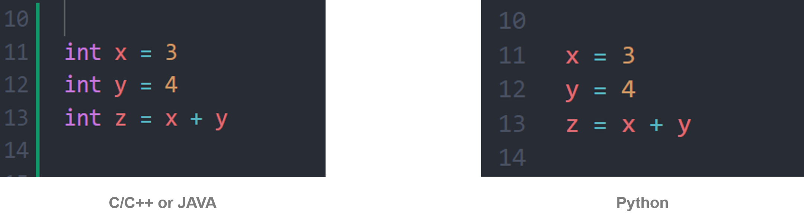

# 1. Variable

* 값을 저장하는 메모리 공간을 크게 __변수, 상수__ 라고 얘기를 한다.
* __L value__(l-value) : 메모리 위치를 가지는 표현식 (메모리 위치를 가지고 있어야 한다)
* __R value__(r-value) : 해당 Language에서 허용하는 모든 것 (리터럴 상수, 메모리 위치 및 Temporary 등 포함 / 왠만한거 다 되는 듯하다)
</br>


## 1.1. 변수

* 변수는 변할 수 있는 데이터
* 변수를 선언할 때는 자료형과 변수명을 입력한다. 원하는 경우, 초기값을 적용할 수 있다.
* 초기화되지 않은 변수는 쓰레기 값으로 초기화된다.
* 유효범위(Varialbe Scope)에 따라 크게 1) 지역 변수, 2) 전역 변수, 3) Static 변수, 4)멤버 변수로 구분된다.
> 파이썬은 자료형을 선언하지 않아도 된다. 인터프리터가 자동으로 R value를 가지고 자료형을 판단한다.
</br>

### 지역 변수 (Local Variable)
* 중괄호 내에 선언되는 변수는 모두 지역 변수이다.
* Stack Area에 할당된다.
* 선언된 함수 내에서만 접근이 가능하며, 함수 종료 시 소멸된다.
> 파이썬에서는 중괄호가 없고 함수 내에서 선언된 변수를 의미한다. 그렇기 때문에 for, if 문에 선언된 변수의 경우 새로 생성되는 것이 아닌 같은 지역 변수로 취급된다.
</br>

### 전역 변수 (Global Variable)
* 어디서든 접근이 가능한 변수
* 지역 변수와 이름이 같을 시, 지역 변수에 가려진다.
  *  함수 내의 지역변수를 전역 변수로 사용하려면 ```global``` 명령어를 사용해야 한다.
> 파이썬에서는 함수 외부에서 선언된 변수를 의미한다.
</br>

### static Variable (== Class Variable)
* 시작과 동시에 할당되어 프로그램이 종료될 떄까지 남아있다.
* 그렇기 때문에 외부에서 클래스 이름으로 접근이 가능하다.
* static 변수를 사용하는 이유는 __접근 범위를 지역 변수는 해당 함수로, 전역 변수는 해당 파일로, 멤버 변수는 클래스로 제한하기 위해서__ 이다.
> Static 변수의 경우, 클래스를 위해 메모리 공간에 딱 하나만 할당된다.
</br>

### 멤버 변수 (Memeber Variable)
* 클래스 내에 선언된 변수이다.
* 각 객체마다 변수가 생성된다.
> 파이썬에서는 init method에서 self 명령어를 사용하여 선언할 수 있다.
</br>
</br>


## 1.2. 상수
* 변하지 않는 데이터
* 상수는 크게 1) 리터럴 상수, 2) 심볼릭 상수가 있다.
</br>

### 리터럴 상수 (Literal)
* 변수와 달리 이름이 없는 상수를 가리켜 '리터럴 상수' 또는 '리터럴'이라고 한다.
* Example
```
num = 30 + 40
=> num에 70 이란 값이 저장되는 순서는 다음과 같다.
=> 먼저 정수 30, 40이 메모리 공간에 상수 형태로 저장되고, 두 상수를 기반으로 덧셈이 진행된다. 그리고 결과는 num에 저장시킨다.
```

### 심볼릭 상수 (Symbolic)
* 심볼릭 상수는 변수와 마찬가지로 이름을 지니는 상수이다.
> 파이썬에는 const, final 명령어가 없다. 대문자로 Naming하고 변경이 가능하며, Editor를 이용해 경고 문자를 알릴 수 있도록 할 수 있다.
</br>
</br>


## 1.3. Naming Rule
1. 변수의 이름은 알파벳, 숫자로 구성된다.
2. 대소문자를 구분한다.
3. 변수의 이름은 숫자로 시작할 수 없고, 예약어는 사용할 수 없다.
    * 숫자를 사용하고 싶다면 ```_8value```
4. 특수 문자는 ```_```와 ```$```만 가능
5. 다음은 변수에 대한 Naming Rule이다.
* 변수나 함수의 경우, __Camel Case__ 사용. 소문자부터 시작 (ex> ```strValue, intValue```)
* Class, Interface, Enum, Annotation 등인 경우, PascalCase 사용 (ex> ```Car, Persion```)
* 상수인 경우, 대문자 사용 (ex> ```CONST_VALUE```)
* Table
    | 대상 | 내용 |
    |------|------|
    | Variable, Method | camelCase |
    | Class, Interface, Enum, Annotation | PascalCase |
    | 상수 | 대문자 |
