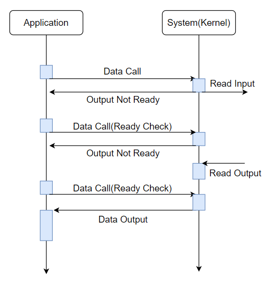

# Blocking & Non-Blocking
* 프로세스의 유휴 상태에 대한 개념
    * Running, Waiting...

## Blocking
* 프로세스가 시스템을 호출하고나서 결과가 반환되기까지 다음으로 넘어가지 않는다.
* Ex> synchronized 키워드, join() 등등...
 
## Non-Blocking
* 시스템을 호출한 직후에 기존 시스템으로 제어가 돌아와서 호출한 시스템과 상관없이 다음으로 넘어간다.
* Ex> Multi-Threading 등...

# Synchronous & Asynchronous
* Synchronous는 시간을 맞춘다는 의미다.
* 프로세스의 수행 순서 보장에 대한 매커니즘

## Synchronous
* 작업의 순서를 보장한다.
* 작업의 순서를 보장하기 위해 순서를 확인하게 된다.

## Asynchronous
* 작업의 순서를 보장하지 않는다.
* 작업의 순서를 보장하지 않기 때문에, 순서를 일일히 확인하지 않는다.

## Example
* Read Input은 입력으로 생각하면 되고, Read Output은 입력에 대한 값이 버퍼에 저장된 후 그 버퍼를 읽는 것을 의미한다.
* 동작 순서: Data Call -> Read Input/Read Output -> Data Output

### 1. Synchronous Blocking

1) I/O를 호출하게 되면, Application은 대기 상태가 된다.
    * Bloking으로 인해 입출력이 끝날 때까지 대기하게 된다.
2) System(입출력)의 I/O 동작이 완료될 때까지 기다린다.
    * Synchronous이기 때문에 Application은 동작 순서를 지키기 위해 Blocking되어 있으며,
     System에서는 모든 동작이 끝난 뒤 결과를 반환하고 Blocking을 해제한다.
* 이 경우, Thread가 멈추기 때문에 Client(입출력) 수만큼 Thread가 필요하다.

### 2. Synchronous Non-Blocking

* Polling 방식
1) System(입출력)에 I/O 호출 후에 대기하지 않고 계속 동작하게 된다.
    * Non-Blocking이기 때문에 대기하지 않고 다른 동작을 할 수 있다. 
2) Data Outpu이 가능한지 계속 확인하게 된다.
    * Synchronous이기 때문에 동작 순서를 지키기 위해서 순서를 확인하게 된다.
    * 그렇기 때문에 Non-Blocking이지만 Data Output 가능 여부를 계속 확인하게 된다.
* Block이 없기 때문에 추가적인 Thread가 필요없지만, 시스템 호출이 반복적으로 일어나기 때문에 CPU 자원이 낭비된다.

### 3. Asynchronous Blocking

1) I/O를 호출하게 되면, Application은 대기 상태가 된다.
    * Bloking으로 인해 호출한 동작이 끝날 때까지는 대기하게 된다.
2) System이 Data Output이 가능하다는 신호를 Application에게 알린다.
    * Asynchronous이기 때문에 Application에서 순서를 신경쓰지 않는다.
    * 하지만 사실상 Blocking이 되어 있어 거의 바로 Data Output을 실행함으로써 Synchronous처럼 동작하게 된다.
* 굳이 필요에 의해서는 사용되지 방식은 아닌 거 같다.
* 찾아보니 데이터 동기화를 편하게 하기위해서 사용된다고 하는데, 대규모 프로젝트에서는 성능 상 쓰지 않는다고 한다.

### 4. Asynchronous Non-Blocking

1) System(입출력)에 I/O 호출 후에 대기하지 않고 계속 동작하게 된다.
    * Non-Blocking이기 때문에 대기하지 않고 다른 동작을 할 수 있다. 
2) System이 Data Output이 가능하다는 신호를 Application에게 알린다.
    * Asynchronous이기 때문에 Application에서 순서를 신경쓰지 않는다.

#### Reference
* http://wiki.sys4u.co.kr/pages/viewpage.action?pageId=7767390
* https://evan-moon.github.io/2019/09/19/sync-async-blocking-non-blocking/
