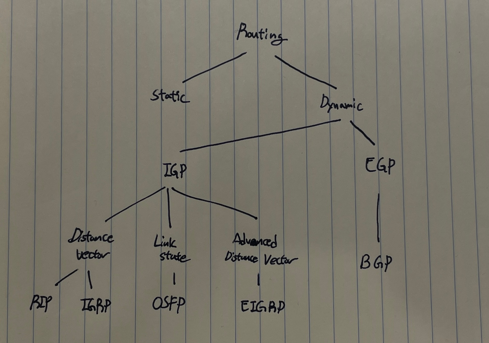

# Routing
최적의 경로를 선택하는 과정. Packet에 대한 Destination IP Address와 일치하는 경로를 Routing Table에서 검색하여 Packet을 전달.
* 최적의 경로를 선택하기 위해서 Router는 다음과 같은 작업을 한다.
    1) __경로 수집(Path Discovery)__ : 네트워크에 할당된 Subnet에 도달할 수 있는 모든 경로 정보를 검색 및 수집
    2) __경로 선출(Path Selection)__ : 수집된 경로 정보들을 기반으로 각 목적지까지의 최적 경로를 선출하는 과정(Matrix 상수 계산)
    3) __경로 관리(Path Management)__ : 수집된 경로 정보와 그 안에서 선출된 최적 경로들의 변화를 지속적으로 감지하는 과정
</br>


---
## __Routing Algorithm__
* ref : https://m.blog.naver.com/PostView.naver?isHttpsRedirect=true&blogId=twers&logNo=50118111297
1. Distance Vector Algorithm
    * Router와 Router 간의 최적 경로만 교환 (거리: Hop 수, 방향: 어떤 Router)
    * 목적지까지 가기 위한 최적 경로만 관리
    * 인접 라우터들과 주기적으로 라우팅 테이블을 교환하여 변화 체크(업데이트)
    * Destination Subnet, Metric, Hop
    * 장점
        * 모든 라우팅을 가질 필요가 없어 메모리 절약 가능
        * 구성이 간단
    * 단점
        * 전체적인 네트워크 토폴로지 확인 불가
        * 라우팅 변화가 없어도 주기적인 업데이트 체크로 인한 트래픽 낭비
        * Convergence Time이 느림 (Convergence Time : 라우팅 테이블에 생겨난 변화를 다른 모든 라우터가 알 때까지 걸리는 시간)
2. Link State Algorithm
    * Router와 Router 간의 모든 경로 정보 교환 (Packet을 전달할 준비가 된 노드에 대해서)
    * SPF Algorithm 사용 (Short Path First)
    * 장점
        * 전체적인 네트워크 토폴로지 확인이 가능
        * 테이블에 변화에 대한 정보만 교환함으로써 트래픽 절약
        * Convergence Time이 빠름 (Convergence Time : 라우팅 테이블에 생겨난 변화를 다른 모든 라우터가 알 때까지 걸리는 시간)
    * 단점
        * 모든 라우팅을 가져야 되기 때문에 메모리 소모가 큼
        * SPF 계산 등으로 인한 CPU 부하가 큼
3. Advanced Distance Vector Algorithm
    * Distance Vector + Link State
    * Neighbor 관계 및 토폴로지 정보(Link, Node 등의 정보)를 Distance Vector에 추가
</br>
</br>


---
## __Routing Protocol__

크게 Routing을 하는데 Static Routing과 Dynamic Routing 방식이 존재하며, Dynamic Routing 방식을 위한 여러가지 Protocol이 있다. 
</br>

### __Static Routing (정적 라우팅)__
수동으로 직접 목적지를 지정한다. 설정이 번거롭지만, Connected 다음으로 가장 신뢰있는 경로로 소규모 네트워크 환경에서 주로 사용한다.
</br>

### __Dynamic Routing (동적 라우팅)__
Routing Protocol에 의해서 자동으로 설정되고 관리된다. 해당하는 Protocol은 다음과 같다.
1. IGP(Interior Gateway Protocol)
    * 동일 조직 내에서 사용
    * Distance Vector :
        * RIPv2
        * RIP (표준, 방향성만 가지고 있어서 최대 15개 ROuter 까지만)
        * IGRP (Cisco 전용)
    * Link State :
        * OSPF (업계 표준, 한 Area에 50대 이상은 묶지 않는다)
        * IS-IS
    * Advanced Distance Vector : 
        * EIGRP (요즘 많이 사용되고, 성능이 가장 좋다)
2. EGP(Exterior Gateway Protocol)
    * 다른 조직 간에 사용. 대규모 Routing할 때 사용
    * Path Vector : BGPv4
3. BGP(Border Gateway Protocol)
    - I-BGP와 E-BGP로 나뉜다.
    * I-BGP : 같은 AS에 대해서만 BGP 통신을 주고 받는다.
    * E-BGP : 다른 AS에 대해서만 BGP 통신을 주고 받는다.
</br>

### __Connected 경로__
Router의 Interface에 연결된 Local Network
* Laycer 2계층 동작이 가능한 상태이고, IP Address 또는 Subnet이 할당되었다면 Router는 자신의 Interface와 연결된 Subnet을 Routing Table에 Connected로 등록한다.
</br>

### __Classfull Routing Protocol__
Routing Update 정보에 Subnet Mask를 포함하지 않는 Protocol
* CIDR 및 VLSM 사용 불가
* RIPv1, IGRP
</br>

### __Classless Routing Protocol__
Routing Update 정보에 Subnet Mask를 포함하는 Protocol
* RIPv2, OSPF, EIGRP, BGPv4
</br>


---
## ASN
Autonomous System Number: 일관된 라우팅 정책을 가지고 있는 IP 접두사 그룹(AS)을 나타내는 번호 (172.16.30.0/24 == 100번, 172.16.20.0/24 == 90번)

네트워크가 방대해짐에 따라 전체 네트워크를 가지기도, 관리하기도 불가능해졌다. 그에 따라 네트워크 관리 범위를 계층적으로 분리하고 단위 별로 라우팅 정보를 관리하기 위해 AS가 도입되었다.

> 같은 ASN인 경우, 같은 네트워크라고 인식하고 충돌을 방지하기 위해 해당 라우팅 정보를 받더라도 수락하지 않는다!!

Public IP 대역이 있는 것 처럼 Public AS가 있으며, 이는 이미 공객적으로 사용하고 있는 번호들이기 때문에, 기본적으로 Private AS 번호를 사용해야 한다.

* 보통 보면 서로 다른 네트워크끼리 연결할 때(VPN 등) 정보가 필요하다.

* 다른 네트워크는 ASN으로 해당 네트워크의 IP 목록과 라우팅 정책을 식별한다.
* AS Range
    - 0 : 예약
    - 1 ~ 64,495 : Public, 공인
    - 64,496 ~ 64,511 : 예약
    - 64,512 ~ 65,534 : Private, 사설
    - 65,535 : 예약
* 통신 과정
    * AS가 도입됨에 따라 라우터는 기본적으로 AS 내에 있는 라우터 도달 정보만 가지고 있는다.
    * 외부 AS와 통신이 필요한 경우 ASBR(Autonomous System Boundary Router)을 이용하여 자신과 인접한 다른 AS에 대한 정보를 가진다.
    > (추측이지만) 이 말은 즉, 원하지 않으면 인접해 있어도 안가질 수 있다는 의미일 것으로 보인다. 자세하게 설명하면 물리적으로 연결은 되어 있을 수 있으나, 연결 설정을 하지 않으면 라우팅 정보를 가져오는 것은 아니다로 해석할 수 있다.
    
    > 필요시에 연결 설정을 통해서 원하는 AS만 BGP를 통해 라우팅 정보를 받게 되는데, BGP를 설정할 때 ASN 설정이 들어간다. 
    
    >  (정리) 라우팅 프로토콜을 통해 라우팅 정보를 전달 받으려면 기본적으로 같은 ASN을 가진 라우터들만 가능하다. 인접하지만 다른 ASN을 가지고 있는 라우터는 라우팅 정보를 가지고 올 수 없는데, 라우팅 정보를 가지고 오기 위해서는 VPN 장비와 같은 특정 장치가 필요하다!! 

    > https://xn--3e0bx5euxnjje69i70af08bea817g.xn--3e0b707e/jsp/resources/asInfo.jsp

</br>
</br>

---
## Routing Path 결정 순서
* 물리적 장치 (Routing Rule) / Longest Match Rule -> AD -> Metric
</br>

### 물리적 장치(Routing Rule)
* 물리적 장치에서 Virual 등 설정으로 우선순위를 결정할 수 있다.
</br>

### Longest Match Rule
* IP 패킷의 목적지 IP 주소가 라우팅 테이블에 있는 수많은 목적지 IP 주소 중 일치하는 부분이 가장 긴 곳으로 라우팅하는 규칙
* Example
    ```
    # IP Route
    10.0.0.0/8 s0/0
    10.20.0.0/16 s0/1
    10.20.192.0/24 s0/2
    ```
    * Destination IP가 10.20.192.12 일때, 일치하는 부분이 가장 긴 곳인 s0/2를 선택
  > 가장 길다는 의미는 가장 자세하게 설정된 위치를 의미한다.
</br>

### AD (Administrative Distance)
* Router 간의 약속된 거리 값을 의미한다. 라우팅 정보 소스의 신뢰성에 대하여 정해 놓은 비율이다.
* 여러 개의 라우팅 프로토콜을 운영할 경우 동일 목적지에 대하여 여러 개의 경로 중 어떤 프로토콜을 우선 순위로 둘 것인지 AD를 기준으로 판단한다.
* __값이 낮을 수록 우선 순위가 높아지고, 전송 속도도 빠르다. 값은 변경이 가능하다.__
* Table

    | Route Source | Default Distance Values |
    |--------------|-------------------------| 
    | Connected interface | 0 |
    | Static route | 1 |
    | Enhanced Interior Gateway Routing Protocol (EIGRP) summary route | 5 |
    | External Border Gateway Protocol (BGP) | 20 |
    | Internal EIGRP | 90 |
    | IGRP | 100 |
    | OSPF | 110 |
    | Intermediate System-to-Intermediate System (IS-IS) | 115 |
    | Routing Information Protocol (RIP) | 120 |
    | Exterior Gateway Protocol (EGP) | 140 |
    | On Demand Routing (ODR) | 160 |
    | External EIGRP | 170 |
    | Internal BGP | 200 |
    | Unknown* | 255 |
* Example
    ```
    R   10.20.192.0/24 [120/5]  via ...
    ```
</br>


### Metric 값
* AD값 옆에 있는 값이 Metric 값으로, AD 값을 몇 번 측정했는가를 나타낸다.
* 즉 Source에 Target까지 가기 위한 거리 비용이라고 생각하면 되고, 이는 프로토콜마다 달라진다.
* 동일 라우팅 프로토콜 내에서 경로가 여러 개인 경우, __값이 작을수록 우선 순위가 높다.__
</br>
</br>


